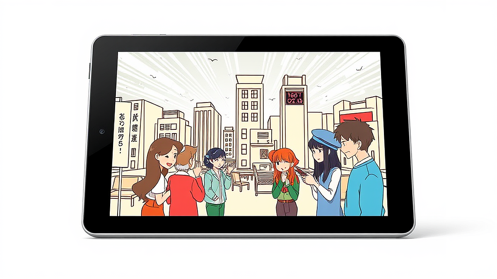

2024년 드라마화 확정된 인기 웹툰 추천 및 방영 예정 정보는 단순히 어떤 작품이 나온다는 소식을 넘어, 우리가 사랑했던 평면의 캐릭터들이 어떻게 입체적인 숨결을 얻게 될지 기대하게 만드는 설레는 뉴스입니다. 안녕하세요, 여러분의 일상을 덕질로 풍요롭게 채워드리는 취미 큐레이터입니다. 저 역시 학창 시절부터 밤을 새워가며 웹툰을 탐독하던 독자로서, 좋아하는 작품이 드라마화된다는 소식을 들으면 반가움과 동시에 걱정이 앞서곤 합니다. 혹시 내가 상상했던 목소리와 다르면 어쩌지, 혹은 원작의 그 절묘한 연출이 실사 영상에서 사라지면 어쩌나 하는 마음 말이죠. 하지만 2024년은 그 어느 때보다 화려한 라인업과 탄탄한 제작진이 포진해 있어 이런 걱정보다는 기대감이 훨씬 큽니다. 특히 올해는 단순한 로맨스를 넘어 시대극, 스릴러, 사회 비판적 메시지를 담은 묵직한 작품들이 대거 포진해 있어 드라마 팬들의 눈높이를 충분히 만족시킬 것으로 보입니다.

## 원작 파괴인가 재해석인가? 2024년 웹툰 원작 드라마 선택의 기준점

웹툰이 드라마로 옮겨질 때 가장 먼저 보게 되는 것은 역시 캐스팅의 싱크로율입니다. 하지만 제가 오랫동안 수많은 적응작을 지켜본 결과, 외형적인 닮음보다 훨씬 중요한 것은 원작의 핵심 정서를 얼마나 잘 이해했느냐는 점이었습니다. 예를 들어 2024년 초반을 뜨겁게 달구었던 내 남편과 결혼해줘 같은 작품은 원작의 통쾌한 복수극이라는 본질에 충실하면서도, 드라마만의 속도감 있는 전개를 더해 큰 성공을 거두었습니다. 반면 실패 케이스를 떠올려보면, 원작의 독특한 분위기를 무시하고 억지스러운 코미디나 로맨스를 집어넣었을 때 팬들은 등을 돌리게 됩니다. 과거 어떤 작품은 원작의 건조하고 차가운 스릴러 분위기를 한국식 신파로 풀어내려다 원작 팬과 일반 시청자 모두를 놓치기도 했죠.

따라서 제가 제안하는 첫 번째 선택 기준은 제작진의 전작 필모그래피와 원작 작가의 참여도입니다. 원작자가 각색 과정에 어느 정도 목소리를 냈는지, 혹은 감독이 평소 원작의 장르를 얼마나 깊이 있게 다뤄왔는지를 확인하면 실패 확률을 줄일 수 있습니다. 만약 여러분이 시간적 여유가 부족해 딱 한 작품만 골라야 한다면, 화려한 출연진보다는 예고편에서 느껴지는 미장센이 원작의 채도와 얼마나 닮았는지를 먼저 살펴보시길 권합니다. 단순히 예산이 많이 들어간 대작이라고 해서 반드시 원작의 감동을 재현하는 것은 아니기 때문입니다.

## 여성 국극이라는 생소하지만 뜨거운 소재, 드라마 정년이 기대 포인트

올해 하반기 가장 큰 기대를 모으고 있는 작품은 단연 정년이입니다. 1950년대 한국전쟁 직후를 배경으로, 여성 국극단에 들어간 천재 소리꾼 소녀 정년이의 성장기를 그린 이 웹툰은 연재 당시에도 엄청난 팬덤을 형성했습니다. 이 작품의 성공 여부는 사실 주인공 정년이 역을 누가 맡느냐에 달려 있었다고 해도 과언이 아닙니다. 다행히도 배우 김태리가 캐스팅되었다는 소식에 많은 팬이 안도의 한숨을 내쉬었죠. 저 또한 김태리 배우의 전작들을 보며 그 특유의 생명력 넘치는 에너지가 정년이와 딱 맞아떨어진다고 생각했습니다. 이 드라마의 핵심은 소리라는 청각적 요소와 국극이라는 시각적 무대 연출을 얼마나 압도적으로 구현하느냐에 있습니다.

하지만 여기서 우려되는 실패 케이스도 분명 존재합니다. 국극은 판소리를 기반으로 한 연극이기 때문에, 배우들의 소리 실력이 어설프면 몰입도가 순식간에 깨질 수 있습니다. 과거 음악을 소재로 한 드라마들이 대역의 목소리와 배우의 입 모양이 맞지 않아 비판받았던 사례를 우리는 기억해야 합니다. 따라서 시청자로서 이 드라마를 선택할 때의 기준은 첫 회에서 보여주는 공연 장면의 퀄리티가 되어야 합니다. 만약 공연 장면이 단순히 보여주기식 연출에 그치지 않고 시청자의 귀를 사로잡는다면, 이 작품은 2024년 최고의 명작이 될 가능성이 높습니다. 굿즈를 수집하는 팬의 입장에서는 당시의 국극 포스터나 소품을 활용한 빈티지한 굿즈들이 출시될지도 중요한 관전 포인트가 될 것입니다.

## 심리전의 묘미를 살린 더 에이트 쇼와 원작 머니게임의 차이점 분석

넷플릭스를 통해 공개된 더 에이트 쇼는 배진수 작가의 웹툰 머니게임과 파이게임을 원작으로 합니다. 이 작품은 8명의 인물이 8층으로 나뉜 비밀스러운 공간에서 시간이 흐를수록 돈이 쌓이는 구조 속에 갇히며 벌어지는 인간 군상의 본성을 적나라하게 드러냅니다. 제가 이 작품을 주목하는 이유는 원작의 냉소적이고 날카로운 사회 비판을 영상 언어로 어떻게 치환했느냐는 점입니다. 원작 웹툰이 극도의 효율성과 생존을 위한 심리 싸움에 집중했다면, 드라마는 좀 더 연극적이고 화려한 연출을 가미해 시각적인 즐거움을 더했습니다. 

여기서 한 가지 주의할 점은 원작의 하드코어한 설정을 기대한 팬들에게는 드라마의 각색이 다소 낯설게 느껴질 수 있다는 것입니다. 실패 케이스라고 단정할 수는 없지만, 원작의 치밀한 게임 규칙보다 캐릭터 간의 감정 과잉에 집중할 경우 극의 긴장감이 떨어질 위험이 있습니다. 실제로 일부 시청자들 사이에서는 원작의 서늘한 맛이 사라졌다는 의견도 있었죠. 따라서 이 드라마를 즐기기 위한 판단 기준은 원작과의 비교보다는 드라마 자체의 독자적인 서사 구조로 받아들일 준비가 되었는가입니다. 만약 여러분이 넷플릭스 특유의 감각적인 연출과 배우들의 광기 어린 연기를 선호한다면 더 에이트 쇼는 최고의 선택이 되겠지만, 원작의 정교한 게임 논리를 그대로 따지려 든다면 실망할 수도 있습니다. 저는 개인적으로 드라마 버전의 독특한 색감과 층별로 차등 지급되는 자원의 불평등을 묘사한 방식이 매우 인상적이었습니다.

## 실전 체크리스트: 드라마 정주행 전 원작 팬이 반드시 확인해야 할 요소

좋아하는 웹툰이 드라마화될 때, 우리는 과연 어떤 마음가짐으로 임해야 상처받지 않고 즐겁게 시청할 수 있을까요? 제가 수년간의 덕질을 통해 얻은 노하우를 바탕으로 몇 가지 체크리스트를 정리해 보았습니다. 이 기준들을 미리 염두에 두시면 드라마를 보는 내내 스트레스를 받기보다 새로운 매력을 발견하는 재미를 느끼실 수 있을 것입니다.

*   **캐스팅 싱크로율 확인:** 단순히 외모가 닮았는가보다, 배우의 이전 연기 톤이 원작 캐릭터의 성격과 부합하는지 살펴봅니다. (예: 정년이의 김태리, 유미의 세포들의 김고은 등)
*   **제작사의 성향 파악:** 스튜디오 드래곤, 크로스픽쳐스 등 웹툰 원작 드라마를 많이 제작해 본 경험이 있는 제작사인지 확인하세요. 제작 경험은 원작의 매력을 살리는 노하우와 직결됩니다.
*   **플랫폼의 특성 고려:** 지상파인지, 케이블인지, 혹은 OTT(넷플릭스, 티빙 등)인지에 따라 표현의 수위와 전개 방식이 완전히 달라집니다. 잔혹하거나 심오한 원작이라면 OTT 플랫폼이 유리할 수 있습니다.
*   **원작의 완결 여부:** 원작이 아직 연재 중인 상태에서 드라마화가 되면 결말이 흐지부지되거나 오리지널 전개로 빠질 확률이 높습니다. 완결된 작품의 드라마화를 우선적으로 추천합니다.
*   **음악 및 미술 감독 확인:** 특히 시대극이나 판타지 장르라면 미술과 음악이 몰입도의 80퍼센트 이상을 결정합니다.

드라마를 보기 전, 웹툰의 무료 공개 회차를 다시 한번 훑어보며 내가 가장 좋아했던 명대사나 명장면이 무엇이었는지 상기해 보세요. 그리고 드라마에서 그 장면이 어떻게 재현되었는지, 혹은 왜 생략되었는지를 추론해보는 과정 자체가 아주 즐거운 취미 활동이 됩니다. 만약 드라마가 원작과 너무 달라 실망스럽다면, 그것을 실패로 규정하기보다 또 다른 평행 세계의 이야기로 치부해버리는 쿨한 자세도 필요합니다. 우리의 소중한 팬심은 드라마 한 편에 무너질 만큼 가볍지 않으니까요.

2024년은 웹툰 팬들에게 풍성한 성찬과도 같은 해입니다. 정년이처럼 고전적인 아름다움을 담은 작품부터 더 에이트 쇼처럼 현대 사회의 모순을 찌르는 작품까지, 선택지는 넓고 즐거움은 깊습니다. 여러분이 오랫동안 스마트폰 화면으로만 만났던 그 주인공들이 TV 화면 속에서 살아 움직일 때, 그 감동을 온전히 누리시길 바랍니다. 다만 과도한 몰입으로 인해 일상생활에 지장이 생기거나, 관련 굿즈를 충동적으로 모두 구매하는 과열 소비는 조금 경계해야겠죠? 실용적인 팬심은 드라마가 끝난 뒤에도 남는 여운을 소중히 간직하는 것에서 시작됩니다. 이제 리모컨을 들고, 혹은 태블릿을 켜고 여러분이 찜해두었던 그 작품의 첫 회를 감상해 보시는 건 어떨까요? 여러분의 즐거운 드라마 시청을 큐레이터로서 진심으로 응원합니다. 마음에 드는 작품을 발견하신다면 댓글로 여러분의 감상을 공유해 주세요. 저도 함께 설레는 마음으로 기다리고 있겠습니다.

## 마치며

2024년은 웹툰 애호가들에게 그 어느 때보다 가슴 벅찬 한 해가 될 전망입니다. 시대극의 고전적인 매력을 담은 '정년이'부터 현대 사회의 이면을 날카롭게 파고드는 '더 에이트 쇼'까지, 다채로운 장르의 인기 웹툰들이 드라마라는 새로운 옷을 입고 우리를 찾아옵니다. 원작 웹툰의 탄탄한 서사와 매력적인 캐릭터들이 실사화되어 브라운관에서 살아 움직이는 과정은 팬들에게는 놓칠 수 없는 최고의 관전 포인트이자 특별한 선물이 될 것입니다.

이제 여러분의 즐거움을 실천으로 옮길 차례입니다. 오늘 소개해 드린 작품들 중 여러분의 취향을 저격한 드라마는 무엇인가요? 지금 바로 스마트폰 달력에 방영일을 꼼꼼히 기록하거나 OTT 플랫폼의 알림 설정을 해두시는 것을 추천합니다. 또한 혼자 보기 아까운 기대작이 있다면 주변 친구나 가족에게 이 정보를 공유하며 함께 설렘을 나누는 것도 드라마를 즐기는 또 다른 방법이 될 것입니다.

드라마를 기다리는 설레는 시간조차 우리에겐 일상의 활력이 되는 소중한 즐거움입니다. 원작의 깊은 감동과 드라마만의 새로운 연출력을 동시에 만끽하시길 바라며, 여러분의 풍성한 시청 생활을 진심으로 응원하겠습니다. 혹시 제가 이번 포스팅에서 놓친 기대작이나 여러분만 알고 있는 숨은 명작 웹툰의 드라마화 소식이 있다면 언제든 댓글로 자유롭게 남겨주세요. 여러분의 소중한 의견과 생생한 감상을 기다리며, 저는 조만간 더 알차고 흥미로운 콘텐츠로 다시 돌아오겠습니다. 모두가 기다려온 그 작품과 함께 행복한 드라마 정주행 되시길 바랍니다!
