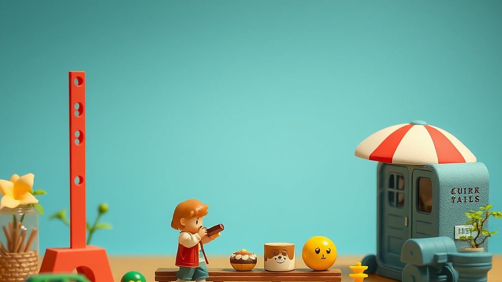

## 2026년 하반기, 가장 주목받는 키덜트 아이템 5선

키덜트 트렌드는 이제 단순한 장난감 수집을 넘어, 2026년 하반기에는 개개인의 라이프스타일을 투영하는 정밀한 취향 공동체로 진화했습니다. 20대 후반부터 40대까지의 우리 세대는 더 이상 남들이 좋다는 것을 무작정 사지 않습니다. 퇴근 후 온전히 나에게 집중할 수 있는 시간, 좁은 주거 공간에서도 최대의 심미적 만족을 줄 수 있는 효율성, 그리고 시간이 지나도 가치가 유지되는 지속 가능성이 구매의 핵심 척도가 되었습니다. 이번 글에서는 아무거나 샀다가 후회하고 싶지 않은 당신을 위해, 지금 당장 시작해도 실패 확률이 낮은 키덜트 아이템 5가지와 그 선택 기준을 정리했습니다.

## 1. 커스텀 기계식 키보드: 데스크테리어의 완성형

기계식 키보드는 더 이상 단순한 입력 장치가 아닙니다. 이제는 매일 8시간 이상 손끝으로 닿는 '촉각적 수집품'이 되었습니다. 2026년 하반기에는 완성품을 사는 것보다 하우징, 스위치, 키캡을 직접 조합하는 커스텀 방식이 주류입니다.

*   **실제 사례:** 평소 재택근무가 잦은 30대 직장인 A씨는 타건감의 깊이를 더하기 위해 알루미늄 하우징에 저소음 택타일 스위치를 조합했습니다. 단순히 예쁜 것을 넘어, 업무 스트레스를 타건음으로 해소하는 용도로 활용합니다.
*   **실패 케이스:** 소위 '가성비'만 보고 이름 없는 브랜드의 핫스왑 기판을 샀다가, 3개월 만에 특정 키가 인식되지 않거나 소프트웨어가 지원되지 않아 중고 장터에 헐값에 내놓는 경우입니다. 기판의 호환성과 펌웨어 업데이트 지원 여부를 확인하지 않은 것이 패착입니다.
*   **선택 기준:** 
    *   **핫스왑 지원 여부:** 납땜 없이 스위치를 교체할 수 있어야 취향 변화에 대응 가능합니다.
    *   **커뮤니티 활성도:** 검색했을 때 분해 조립 영상이나 문제 해결 글이 많은 모델을 고르세요.
    *   **가격대:** 입문용은 15만 원에서 25만 원 사이가 적당합니다. 이 미만은 내구성이 불안하고, 이상은 매니아 영역입니다.

## 2. 정밀 다이캐스트 모형: 공간의 효율성을 고려한 수집

과거에는 크고 화려한 피규어를 선호했다면, 지금은 1/64 스케일의 다이캐스트 자동차나 초정밀 건축 모형이 대세입니다. 좁은 책장 한 칸에 수십 대를 진열해도 조잡해 보이지 않고, 세련된 느낌을 주기 때문입니다.

*   **실제 사례:** 40대 취미가인 B씨는 1/64 스케일의 클래식카 모형을 수집합니다. 퇴근 후 위스키 한 잔과 함께 진열장의 위치를 바꾸는 것만으로도 공간의 분위기가 완전히 달라짐을 느낍니다.
*   **실패 케이스:** 저가형 플라스틱 도색 모형을 샀다가 1년 만에 도색이 갈라지거나 변색되어 버리는 경우입니다. 다이캐스트는 금속 합금(아연 합금) 소재인지 반드시 확인해야 합니다.
*   **선택 기준:** 
    *   **소재 확인:** 플라스틱인지 금속인지 구분하십시오. 금속 모델은 무게감에서 오는 만족도가 다릅니다.
    *   **수납 공간:** 30cm x 30cm 공간에 몇 개가 들어가는지 미리 계산하세요. 지나치게 큰 스케일은 나중에 처분하기 어렵습니다.
    *   **유지비:** 먼지 관리를 위한 아크릴 케이스 비용을 예산에 포함해야 합니다.

## 3. 모듈형 레고 테크닉 및 아키텍처: 성취감과 인테리어의 결합

레고는 이제 아이들의 장난감이 아닌, 성인의 '몰입형 명상 도구'입니다. 특히 테크닉 시리즈나 건축물 시리즈는 완성 후 책상이나 거실 선반에 두었을 때 인테리어 오브제로 손색이 없습니다.

*   **실제 사례:** 20대 후반 C씨는 복잡한 기어 작동 원리를 공부하며 레고 테크닉 모델을 조립합니다. 퍼즐을 맞추듯 구조를 이해하는 과정에서 디지털 기기에서 느낄 수 없는 아날로그적 쾌감을 얻습니다.
*   **실패 케이스:** 공간을 고려하지 않고 거대한 모델을 덜컥 구매했다가, 완성 후 둘 곳이 없어 박스째로 방치하는 경우입니다.
*   **선택 기준:**
    *   **공간 실측:** 제품의 가로, 세로, 높이를 확인하고 현재 진열할 공간과 비교하세요.
    *   **시간 투자:** 주당 3시간씩, 2주 안에 끝낼 수 있는 난이도를 선택하세요. 너무 길어지면 흥미가 떨어집니다.

## 4. 실전 체크리스트 및 주의사항

키덜트 취미를 시작할 때 가장 흔히 저지르는 실수는 '한정판'이라는 단어에 현혹되는 것입니다. 모든 취미 아이템은 내가 그것을 보는 순간 기분이 좋아지는지가 1순위여야 합니다.

*   **실수하기 쉬운 부분:** 
    *   **중고 거래:** 검증되지 않은 판매자로부터 박스 없는 모델을 사는 것은 부품 누락의 위험이 큽니다.
    *   **충동구매:** 신제품 출시 당일, 커뮤니티의 분위기에 휩쓸려 구매 버튼을 누르지 마세요. 3일만 기다려도 리뷰가 올라옵니다.
*   **체크리스트:**
    *   [ ] 해당 제품의 부품을 잃어버렸을 때 AS가 가능한가?
    *   [ ] 1년 뒤에도 이 제품을 보고 질리지 않을 것인가?
    *   [ ] 청소나 관리가 간편한가? (먼지가 잘 쌓이는 구조는 피하세요.)
    *   [ ] 친구에게 당당하게 보여줄 수 있는 퀄리티인가?

## 5. 아날로그 필름 카메라와 현상 작업

디지털 사진이 넘쳐나는 시대에, 셔터를 누르고 현상을 기다리는 과정은 그 자체로 하나의 의식이 되었습니다. 사진 결과물보다 '기다림'이라는 과정을 즐기는 것이 핵심입니다.

*   **실제 사례:** 30대 중반 D씨는 주말마다 필름 카메라를 들고 산책합니다. 현상소에 맡기고 며칠 뒤 스캔 파일을 받을 때의 설렘은 디지털 카메라가 줄 수 없는 독특한 경험입니다.
*   **실패 케이스:** 수리비가 기기값보다 더 나오는 오래된 골동품 카메라를 덜컥 샀다가, 필름 한 롤도 찍어보지 못하고 고장 내는 경우입니다.
*   **선택 기준:**
    *   **입문 난이도:** 자동 노출 기능이 있는 모델로 시작하세요. 수동은 사진을 배우는 과정이 길어 쉽게 지칩니다.
    *   **유지비:** 현상비와 필름 가격을 계산하세요. 한 달에 촬영할 양을 정해두는 것이 좋습니다.

## 결론: 취향은 소유가 아닌 경험입니다

2026년 하반기, 우리가 키덜트 아이템에 반응하는 이유는 단순히 과거를 회상하기 위해서가 아닙니다. 너무나 빠른 속도로 변화하는 세상 속에서, 나의 취향을 직접 선택하고 그 결과를 눈앞에 두는 '통제 가능한 즐거움'을 찾고 싶기 때문입니다. 

오늘 소개한 5가지 아이템은 단순히 물건을 사는 행위가 아니라, 나의 데스크를, 나의 거실을, 그리고 나의 시간을 어떻게 채울지 결정하는 과정입니다. 이제 막 취미를 시작하려는 분들이라면, 가장 먼저 '내가 이 물건을 관리할 여유가 있는가'를 스스로에게 물어보세요. 물건이 나를 소유하게 두지 말고, 내가 물건을 통해 나의 일상을 더 풍요롭게 만드는 것. 그것이 바로 현명한 키덜트의 소비 방식입니다. 지금 바로 여러분의 공간에 어울릴 작은 것 하나부터 시작해 보시길 권합니다. 취향은 쌓여갈 때 비로소 내 것이 됩니다.

결국 2026년 하반기, 우리가 키덜트 아이템에 열광하는 이유는 단순히 과거를 추억하기 위해서가 아닙니다. 너무나 빠르게 변화하는 세상 속에서, 나의 취향을 직접 선택하고 그 결과를 눈앞에 두는 ‘통제 가능한 즐거움’을 찾고 싶기 때문이죠.

오늘 소개해 드린 5가지 아이템은 단순히 물건을 사는 행위를 넘어, 여러분의 데스크와 거실, 그리고 소중한 일상을 어떻게 채워나갈지 결정하는 과정입니다. 물건이 여러분을 소유하게 두지 마세요. 오히려 물건을 통해 일상을 더 풍요롭게 만드는 것이야말로 가장 현명한 키덜트의 소비 방식입니다.

이제 막 새로운 취미를 시작하려는 분들이라면, 너무 거창한 것부터 고민하지 마세요. 오늘 당장 여러분의 공간에 작은 활기를 불어넣어 줄 아이템 하나부터 시작해보는 건 어떨까요? 취향은 물건을 쌓아두는 것이 아니라, 그 물건과 함께하는 경험이 쌓일 때 비로소 내 것이 됩니다. 여러분만의 즐거운 취향 찾기를 진심으로 응원합니다!
