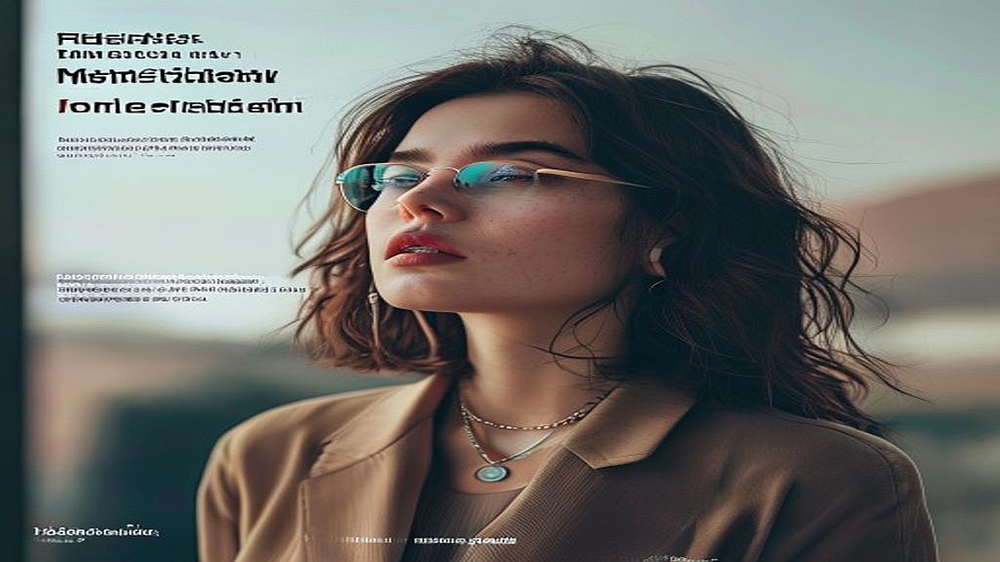

## 2026년형 SNS 챌린지 마케팅, 유행을 선도하는 브랜드의 공통점

챌린지 마케팅과 바이럴 마케팅을 기획하는 실무자라면 누구나 한 번쯤 고민합니다. 왜 어떤 챌린지는 수십만 명의 참여를 끌어내고, 어떤 챌린지는 브랜드 로고만 덩그러니 남은 채 조용히 잊히는 걸까요? 2026년 현재, SNS 트렌드는 단순히 유명인을 섭외해 춤을 추게 하는 방식에서 완전히 벗어났습니다. 이제 사용자는 브랜드가 정해준 정답을 따라 하는 것을 지루해합니다. 대신 자신의 일상에 브랜드의 요소를 자연스럽게 녹여내어 '나만의 콘텐츠'로 변주할 수 있는 놀이터를 원하죠. 우리가 주목해야 할 지점은 브랜드가 주도권을 쥐는 것이 아니라, 사용자가 스스로 주인공이 될 수 있는 '창의적 빈틈'을 얼마나 설계했느냐입니다. 예산이 부족하다고, 혹은 브랜드 인지도가 낮다고 포기할 단계가 아닙니다. 오히려 명확한 참여 가이드와 사용자가 얻을 수 있는 확실한 재미가 있다면, 소규모 예산으로도 충분히 바이럴 효과를 극대화할 수 있습니다. 지금부터 실무 현장에서 바로 적용할 수 있는 챌린지 설계의 핵심 원칙을 짚어보겠습니다.

## 첫 번째 원칙: 참여 난이도는 낮추고 창의성은 높여라

많은 마케터가 범하는 가장 큰 실수는 챌린지의 난이도를 높게 설정하는 것입니다. 복잡한 안무를 외워야 하거나, 고가의 장비가 필요한 챌린지는 참여의 장벽을 높여 초기 확산을 방해합니다. 2026년의 성공적인 챌린지는 '손가락 하나로 참여 가능하지만, 결과물은 제각각인' 구조를 가집니다. 

예를 들어, 특정 필터를 활용해 일상의 사물을 브랜드 로고 모양으로 배치하는 챌린지가 있다면 어떨까요? 참여자는 단순히 사물을 옮기기만 하면 되지만, 각자의 공간과 취향에 따라 결과물은 모두 달라집니다. 이것이 바로 사용자가 브랜드의 메시지를 자신의 개성으로 치환하는 과정입니다.

실패하는 케이스는 명확합니다. 브랜드가 원하는 '정답'이 너무 구체적인 경우입니다. 예를 들어 특정 노래에 맞춰 똑같은 동작을 15초간 수행해야 하는 챌린지는 사용자의 창의성을 억압합니다. 사용자는 브랜드를 홍보하는 모델이 되고 싶어 하지, 브랜드의 꼭두각시가 되고 싶어 하지는 않기 때문입니다.

선택 기준은 간단합니다. 챌린지 기획안을 보고 "이걸 우리 팀 인턴이 5분 안에 따라 할 수 있는가?"를 자문해 보세요. 불가능하다면 즉시 난이도를 낮춰야 합니다. 준비물은 최소화하고, 스마트폰 기본 기능이나 간단한 앱 하나로 해결할 수 있어야 참여율이 보장됩니다. 시간은 5초 내외, 준비물은 주변에서 흔히 볼 수 있는 물건으로 한정하는 것이 좋습니다.

## 두 번째 원칙: 실전 체크리스트, 바이럴의 골든타임을 잡아라

챌린지 마케팅을 시작하기 전, 반드시 검토해야 할 실전 체크리스트가 있습니다. 많은 브랜드가 광고 집행 비용에만 집중하지만, 정작 중요한 것은 '첫 10명의 참여자'를 어떻게 확보하느냐입니다. 

1. 참여 보상은 브랜드 중심인가, 사용자 만족 중심인가? (경품이 아니라, 참여자가 자신의 피드에 올렸을 때 얻는 사회적 평판을 고민했는가?)
2. 브랜드 로고가 콘텐츠의 중심인가, 배경인가? (브랜드가 너무 크게 노출되면 사용자는 이를 '광고'로 인식하고 참여를 꺼립니다.)
3. 2차 창작이 가능한가? (원본을 그대로 복사하는 것이 아니라, 다른 사용자가 이를 보고 다시 변형할 수 있는 여지가 있는가?)

실제 성공 사례를 보면, 유명 인플루언서에게 대가를 지불하고 올리는 영상보다 일반 사용자가 자발적으로 올린 변주 영상이 훨씬 높은 도달률을 기록합니다. 실패하는 케이스는 보상에만 매몰된 경우입니다. 아이패드나 최신 기기를 내걸면 참여자는 늘어나지만, 이는 브랜드에 대한 애정 없는 '체리피커'들만 양산할 뿐입니다. 

선택 기준은 '보상'이 아닌 '놀이의 재미'입니다. 참여했을 때 사용자의 팔로워들이 댓글로 "이거 뭐야? 나도 해보고 싶다"라고 반응할 수 있는 콘텐츠인가를 확인하세요. 인원수는 1명이라도 좋으니, 그 1명이 얼마나 즐겁게 놀 수 있는지가 바이럴의 핵심입니다. 비용은 광고비보다는 콘텐츠를 재미있게 변주해 줄 소규모 크리에이터 섭외와 초기 모니터링에 집중하는 것이 효율적입니다.

## 세 번째 원칙: 실패를 두려워하지 않는 데이터 측정 방식

챌린지를 시작한 뒤, 우리는 무엇을 측정해야 할까요? 단순히 '조회수'만 보는 것은 2026년의 마케팅 방식이 아닙니다. 진짜 중요한 지표는 '참여율'과 '변주율'입니다. 

참여율은 광고 도달 대비 실제 참여자의 비율을 의미합니다. 변주율은 원본 챌린지 가이드를 얼마나 다르게 재해석했는지를 보여주는 지표입니다. 변주율이 높다는 것은 사용자가 브랜드의 챌린지를 자신의 놀이로 완전히 흡수했다는 강력한 신호입니다.

실패하는 사례는 데이터 측정 기간을 너무 짧게 잡는 것입니다. 챌린지는 보통 2주 차부터 본격적인 바이럴이 시작됩니다. 3일 만에 성과가 없다고 광고를 중단하는 것은 마케팅 예산을 버리는 행위입니다. 

선택 기준은 '로그 데이터'가 아닌 '댓글의 결'입니다. 댓글에 "브랜드 제품 어디 거예요?"라는 질문이 달린다면 성공입니다. 반대로 "광고 지겹다"는 반응이 많다면 챌린지의 톤앤매너가 브랜드의 색깔과 맞지 않거나, 너무 광고 냄새가 짙다는 증거입니다.

실패했을 때의 점검 순서는 다음과 같습니다. 첫째, 챌린지 가이드가 너무 어렵지 않았는가? 둘째, 참여 보상이 너무 비현실적이라 진정성이 떨어졌는가? 셋째, 우리가 타겟팅한 커뮤니티가 즐길 만한 언어와 문법을 사용했는가? 이 세 가지를 순차적으로 점검하고, 챌린지의 방식을 조금씩 수정하여 다시 테스트(A/B 테스트)를 진행하세요.

## 결론: 브랜드의 정체성을 놀이로 환원하라

2026년의 챌린지 마케팅은 브랜드가 말하고 싶은 것을 사용자가 대신 말하게 만드는 예술입니다. 성공적인 브랜드는 사용자의 창의성을 억누르지 않습니다. 오히려 브랜드는 판을 깔아주고, 사용자는 그 위에서 마음껏 뛰어놀게 함으로써 자연스러운 바이럴을 생성합니다. 

지금 바로 기획 중인 챌린지가 있다면, 브랜드의 로고를 지워보세요. 그래도 여전히 재미있고 참여하고 싶은 콘텐츠인가요? 그렇다면 성공할 가능성이 높습니다. 반대로 로고를 지우면 아무것도 남지 않는 콘텐츠라면, 지금 당장 기획을 수정해야 합니다. 

사용자가 챌린지에 참여하는 이유는 브랜드에 대한 충성심 때문이 아니라, 그 행위 자체가 자신의 계정을 더 매력적으로 만들어주기 때문입니다. 이 본질을 이해하는 마케터만이 2026년의 치열한 SNS 환경에서 생존할 수 있습니다. 오늘 공유한 체크리스트를 바탕으로, 여러분의 브랜드가 사용자의 일상 속에 자연스럽게 스며들 수 있는 가장 작은 '놀이'부터 시작해 보시길 권합니다. 단순히 숫자를 늘리는 마케팅이 아닌, 사람들의 기억에 남는 경험을 설계하는 것이 바로 챌린지 마케팅의 본질임을 잊지 마세요. 지금 바로 작은 것부터 실행하고, 데이터의 흐름을 읽으며 유연하게 대응하는 것만이 유일한 정답입니다.

2026년의 챌린지 마케팅은 단순히 브랜드의 이름을 알리는 단계를 넘어, 사용자가 스스로 참여하고 싶게 만드는 '매력적인 놀이'를 설계하는 것이 핵심입니다. 브랜드의 로고를 떼어내도 여전히 재미있는 콘텐츠인지 끊임없이 자문해보세요. 사용자는 자신의 계정을 돋보이게 할 가치가 있을 때 비로소 움직이기 때문입니다.

이제 여러분의 차례입니다. 거창한 기획보다는 우리 브랜드만의 색깔을 담은 아주 작은 '놀이'부터 시작해 보세요. 사용자의 일상 속에 자연스럽게 스며드는 경험을 설계하고, 그들이 남기는 데이터의 흐름을 읽으며 유연하게 수정해 나가는 과정이 쌓일 때 비로소 팬덤은 만들어집니다. 

지금 바로 머릿속에 떠오른 아이디어를 가볍게 다듬어 SNS에 던져보는 건 어떨까요? 여러분의 브랜드가 만들어갈 즐거운 파급력을 진심으로 응원합니다. 오늘 공유해 드린 체크리스트를 곁에 두고, 더 많은 사람이 함께 웃고 즐길 수 있는 특별한 캠페인을 준비해 보시길 바랍니다!
