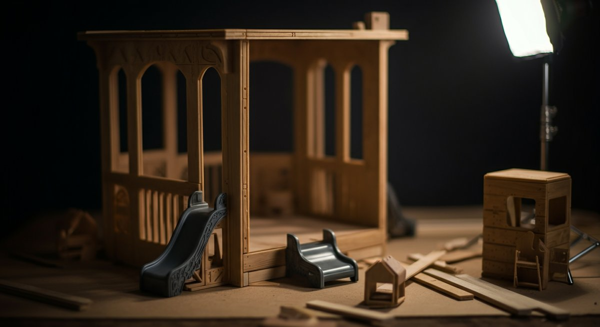

덱빌딩, 아, 이거 진짜 갖고 싶었던 건데! 어릴 때 조그만 용돈 모아 카드 한 장 한 장 사 모으던 기억이 새록새록 떠오르네요. 요즘도 새로운 덱빌딩 게임 출시 소식만 들리면 가슴이 콩닥거리고, 밤잠 설치며 발매일만 기다리는 건 여전합니다. 제 방 한구석에는 수많은 피규어와 레고 박스가 쌓여있지만, 이 덱빌딩 카드와 게임들만큼은 늘 손이 닿는 곳에 두죠. 40대 중반이 된 지금도, 저는 이 작은 카드 뭉치에서 세상을 움직이는 전략을 발견하며 짜릿함을 느낍니다. 처음 덱빌딩 게임을 접했을 때 그 느낌, 아시죠? 수십, 수백 장의 카드 속에서 나만의 조합을 찾아내고, 그걸로 상대를 압도하는 그 희열! 잊을 수가 없습니다.

요즘 같은 정보의 홍수 속에서 어떤 덱빌딩 게임을 시작해야 할지, 어떻게 하면 덱을 잘 만들 수 있을지 막막해하는 분들이 많으시더라고요. 저도 처음엔 그랬습니다. "좋은 카드 다 때려 넣으면 되겠지!" 하고 덤볐다가 보기 좋게 망한 적이 한두 번이 아니죠. 하지만 수십 년간 수많은 게임을 플레이하고, 직접 카드들을 만져보고, 밤낮없이 덱을 굴려본 경험을 바탕으로 여러분께 실질적인 가치를 제공해 드리려 합니다. 단순히 '좋다/나쁘다'를 넘어 '왜, 어떻게, 얼마나' 좋은지, 그리고 여러분이 당장 따라 할 수 있는 구체적인 가이드까지 담아보았습니다. 2025년 기준으로 최신 트렌드와 함께, 초보자부터 숙련자까지 모두에게 도움이 될 만한 덱빌딩 노하우를 아낌없이 풀어놓을 테니, 자, 이제 저와 함께 전략의 세계로 떠나볼까요?

이 글에서는 덱빌딩의 기본 개념부터 시작해서, 성공적인 덱을 만들기 위한 실전 전략, 그리고 2025년 현재 가장 뜨거운 덱빌딩 트렌드까지 모두 다룰 예정입니다. 특히, 제가 직접 겪었던 시행착오들과 커뮤니티에서 자주 논의되는 문제점들, 그리고 이를 해결할 수 있는 노하우까지 꼼꼼히 짚어 드릴게요. 단순한 정보 나열이 아니라, 저의 경험과 애정이 듬뿍 담긴 이야기들을 통해 여러분도 최고의 덱빌더로 거듭날 수 있도록 최선을 다하겠습니다. 저 역시 지금 이 순간에도 새로운 덱빌딩 전략을 궁리하고 있으니, 우리 함께 멋진 덱을 완성해 나갑시다!

여러분도 혹시 '이 덱빌딩 게임은 왜 이렇게 어렵지?', '어떤 카드를 넣어야 할지 모르겠어!' 같은 고민을 해보셨다면, 이 글이 여러분의 답답함을 시원하게 긁어줄 겁니다. 덱빌딩의 세계는 무궁무진하지만, 몇 가지 핵심 원칙만 이해하면 누구나 자신만의 강력한 덱을 만들 수 있어요. 개인적으로 [매직 더 개더링](https://ko.wikipedia.org/wiki/%EB%A7%88%EB%B2%95_%EC%9E%85%EB%AC%B8) 같은 TCG부터 [도미니언](https://ko.wikipedia.org/wiki/%EB%8F%84%EB%AF%B8%EB%8B%88%EC%96%B8_\(%EA%B2%8C%EC%9E%84\)) 같은 순수 덱빌딩 보드게임까지 수많은 게임을 거쳤지만, 결국 통하는 원리는 같더라고요. 그 원리를 여러분의 것으로 만드는 방법을 지금부터 자세히 알려드리겠습니다.

흔히들 덱빌딩은 운이 많이 작용한다고 생각하기 쉽지만, 사실은 철저한 전략과 분석이 뒷받침되어야 합니다. 저도 처음에는 운빨 게임이라고 생각했던 적도 많아요. 하지만 덱빌딩 고수들의 플레이를 보면서 얼마나 깊이 있는 사고와 계산이 필요한지 깨달았죠. 단순히 좋은 카드를 모으는 것을 넘어, 카드의 시너지 효과, 드로우 확률, 상대방의 전략 예측까지 모든 것을 고려해야 진정한 덱빌딩의 재미를 느낄 수 있습니다. 제가 직접 경험한 구체적인 사례들을 통해 이러한 점들을 하나하나 설명해 드릴 테니, 끝까지 집중해주세요. 여러분의 덱빌딩 실력이 한 단계 더 도약하는 계기가 될 것입니다.

특히 2025년 현재, 덱빌딩 게임 시장은 정말 뜨겁습니다. 새로운 게임들이 쏟아져 나오고, 기존 게임들은 계속해서 확장팩을 출시하며 새로운 메타를 만들어내고 있죠. 이런 변화의 흐름을 읽는 것도 덱빌딩의 중요한 부분입니다. 예전에 잘 먹히던 전략이 지금은 전혀 통하지 않을 수도 있거든요. 커뮤니티에서는 늘 새로운 덱 레시피와 전략들이 공유되고, 논쟁이 벌어지기도 합니다. 저는 이런 최신 정보들을 누구보다 빠르게 접하고 직접 테스트해보는 것을 즐기는데, 여러분께도 제가 얻은 귀중한 정보들을 공유하여 시간과 노력을 아낄 수 있도록 돕겠습니다. 새로운 덱빌딩 게임을 시작하려는 분들이나, 이미 즐기고 있지만 더 높은 경지에 오르고 싶은 분들 모두에게 유익한 시간이 될 것이라고 확신합니다.

### 목차

- [덱빌딩, 왜 우리는 여기에 빠져들까? (기본 이해와 매력)](#toc-1)
- [덱빌딩의 핵심 원리와 나만의 경험](#toc-2)
- [덱빌딩 게임의 다양한 장르 분석](#toc-3)
- [성공적인 덱빌딩을 위한 실전 전략 (초보 탈출 가이드)](#toc-4)
- [효율적인 덱빌딩 카드 선택 노하우와 데이터 분석](#toc-5)
- [덱빌딩 시 흔히 하는 실수와 고수들의 팁](#toc-6)
- [2025년 최신 덱빌딩 트렌드와 미래 전망](#toc-7)
- [인기 덱빌딩 게임별 사례 분석 (명작부터 신작까지)](#toc-8)
- [덱빌딩 커뮤니티 활용법과 리세일 가치 극대화](#toc-9)

## 덱빌딩, 왜 우리는 여기에 빠져들까? (기본 이해와 매력)

여러분은 덱빌딩이라는 단어를 들으면 어떤 게임이 가장 먼저 떠오르시나요? 아마 [매직: 더 개더링](https://www.mtg.com/ko) 같은 트레이딩 카드 게임(TCG)이나 하스스톤, 레전드 오브 룬테라 같은 디지털 카드 게임(CCG)을 떠올리는 분들이 많을 겁니다. 하지만 덱빌딩의 개념은 훨씬 더 넓어요. 단순히 정해진 카드를 모으는 것을 넘어, 게임 중에 카드를 구매하고 덱에 추가하며 자신만의 전략을 실시간으로 구축해 나가는 도미니언이나 슬레이 더 스파이어 같은 보드게임/디지털 게임도 훌륭한 덱빌딩 장르에 속합니다. 제가 처음 덱빌딩의 매력에 빠진 건 중학생 때 친구들과 매직: 더 개더링을 할 때였어요. 그때는 카드 한 장 한 장이 그렇게 소중할 수가 없었죠. 그 감성, 아시는 분들 많으실 겁니다.

덱빌딩의 가장 큰 매력은 바로 '나만의 전략'을 세우고 그것이 성공했을 때의 쾌감입니다. 정해진 답이 없다는 점이 오히려 우리를 더욱 몰입하게 만들죠. 수많은 카드 조합을 시도하고, 실패를 통해 배우고, 결국 자신만의 필승 전략을 찾아냈을 때의 성취감은 그 어떤 것과도 바꿀 수 없습니다. 저도 어릴 때는 친구들에게 지기 싫어서 밤새도록 덱을 새로 짜고, 다음 날 학교에서 다시 대결하곤 했습니다. 그런 과정 속에서 논리적인 사고력과 문제 해결 능력이 자연스럽게 길러지더라고요. 이게 단순히 게임을 넘어 인생을 배우는 과정이 아니었나 싶습니다. 2025년 지금도, 수많은 덱빌딩 게임들이 이 본질적인 재미를 추구하며 끊임없이 진화하고 있습니다.

또 다른 매력은 바로 끝없는 '발견'의 재미입니다. 같은 게임이라도 어떤 덱을 만들고 어떤 카드를 언제 사용하느냐에 따라 매번 다른 경험을 할 수 있거든요. 저는 이 점 때문에 수십 년 동안 덱빌딩 게임을 질리지 않고 즐길 수 있었던 것 같아요. 예를 들어, 슬레이 더 스파이어 같은 게임에서는 매번 새로운 유물과 카드가 등장해서 플레이할 때마다 신선한 충격을 줍니다. "아, 이런 조합도 가능하다고?" 같은 감탄사가 절로 나오죠. 이런 끊임없는 새로움과 깊이가 덱빌딩 게임을 단순한 취미를 넘어 하나의 예술의 경지로 끌어올린다고 생각합니다. 많은 분들이 이 덱빌딩의 진정한 가치를 발견하고 함께 즐겼으면 좋겠습니다.

### 덱빌딩의 핵심 원리와 나만의 경험

덱빌딩의 핵심 원리는 간단합니다. **자신이 가진 카드 뭉치(덱)를 게임의 목표에 맞게 효율적으로 구성하는 것**이죠. 이 과정에서 카드를 추가하거나 제거하며 덱의 성능을 최적화해 나갑니다. 예를 들어, 공격적인 플레이를 선호한다면 피해를 많이 줄 수 있는 카드를 위주로 덱을 짜고, 방어적인 플레이를 선호한다면 생존력을 높이는 카드를 더 많이 넣는 식이죠. 저도 처음에는 무조건 강한 카드만 잔뜩 넣으면 이기는 줄 알았는데, 그렇게 하면 코스트가 너무 높아서 정작 게임 초반에 아무것도 못하고 지는 경우가 많았습니다. 덱의 균형을 맞추는 것이 얼마나 중요한지 깨달았죠.

제가 덱빌딩에서 가장 중요하게 생각하는 원칙은 바로 '일관성'입니다. 아무리 좋은 카드라도 덱의 전체적인 전략과 어울리지 않으면 오히려 방해가 될 수 있어요. 예를 들어, 빠른 공격을 목표로 하는 어그로 덱에 느리고 무거운 컨트롤 카드를 넣는 건 자충수죠. 매직: 더 개더링에서 제가 즐겨 사용했던 '빨강-파랑 번(Red-Blue Burn) 덱'은 오로지 상대방의 생명점을 빠르게 깎는 것에만 집중했어요. 모든 카드가 직간접적으로 피해를 주는 데 초점을 맞춰서 덱의 일관성을 극대화했죠. 덕분에 승률이 훨씬 높아졌던 기억이 납니다. 이런 일관성 있는 덱빌딩은 게임의 승패를 좌우하는 핵심 요소입니다.

또 하나 중요한 건 '카드 시너지'입니다. 개별 카드 한 장 한 장의 성능도 중요하지만, 여러 카드가 모여서 예상치 못한 강력한 효과를 낼 때 덱의 진정한 힘이 발휘되죠. 하스스톤에서 특정 카드 조합이 '콤보'로 불리며 강력한 위력을 발휘하는 것처럼요. 저도 이런 시너지 조합을 찾아내기 위해 수많은 밤을 새웠습니다. 예를 들어, 특정 카드 한 장이 다른 카드의 비용을 줄여주고, 그 줄어든 비용으로 또 다른 카드를 연달아 사용하는 식의 연쇄 반응을 만들어내는 덱은 정말 짜릿해요. 이런 시너지 덱빌딩이야말로 덱빌딩의 묘미이자 고수와 초보를 가르는 기준이 됩니다. 여러분도 자신만의 시너지 조합을 찾아보세요.

### 덱빌딩 게임의 다양한 장르 분석

덱빌딩 게임은 크게 두 가지 큰 흐름으로 나눌 수 있습니다. 첫 번째는 매직: 더 개더링이나 유희왕처럼 미리 카드를 수집해서 덱을 구성하는 '트레이딩 카드 게임(TCG)' 또는 '수집형 카드 게임(CCG)' 장르입니다. 이 장르는 어떤 카드를 수집할 것인지부터가 전략의 시작이죠. 희귀하고 강력한 카드를 얻기 위해 팩을 뜯거나 다른 플레이어와 교환하는 과정 자체가 하나의 즐거움입니다. 저도 한때 희귀 카드 한 장을 위해 며칠 밤낮을 애태우던 기억이 생생하네요. 2025년에도 이 시장은 여전히 건재하며, 디지털 버전인 하스스톤, 레전드 오브 룬테라 등이 큰 인기를 누리고 있습니다.

두 번째 흐름은 도미니언이나 슬레이 더 스파이어처럼 게임 플레이 중에 카드를 구매하거나 획득하여 덱을 실시간으로 구축해 나가는 '덱빌딩 보드게임' 또는 '로그라이크 덱빌딩 게임' 장르입니다. 이 장르는 미리 덱을 짜는 것이 아니라, 매 게임 새로운 상황에 맞춰 즉흥적으로 덱을 만들어 나가는 재미가 큽니다. 매 게임 시작할 때마다 주어지는 제한된 자원과 무작위적인 카드 풀 속에서 최적의 선택을 해야 하죠. 저도 도미니언을 처음 했을 때, "아니, 게임 중에 덱을 만든다고?" 하며 신선한 충격을 받았던 기억이 납니다. 이런 덱빌딩 게임은 매번 다른 경험을 선사하며, 전략적인 사고력을 극대화시킵니다.

이 두 가지 장르 외에도, 최근에는 아크노바처럼 보드게임의 한 부분으로 덱빌딩 메커니즘이 녹아들어가 있는 경우도 많습니다. 카드 한 장 한 장이 중요한 역할을 하는 게임에서는 덱빌딩 요소가 자연스럽게 포함될 수밖에 없죠. 개인적으로는 이 두 가지 메인 장르 모두 각자의 매력이 있다고 생각합니다. TCG/CCG는 수집의 즐거움과 끊임없는 메타 분석의 깊이가 있고, 실시간 덱빌딩 게임은 즉흥적인 전략과 매번 달라지는 게임 플레이의 신선함이 있죠. 어떤 장르를 선택하든, 덱빌딩의 본질적인 재미는 변하지 않는다고 확신합니다. 중요한 건 자신에게 맞는 장르를 찾아 몰입하는 겁니다. 저에게는 둘 다 매력적이지만요!

* * *

## 성공적인 덱빌딩을 위한 실전 전략 (초보 탈출 가이드)

자, 이제 덱빌딩의 기본 개념을 알았으니, 실제 게임에서 어떻게 하면 승률 높은 덱을 만들 수 있는지 실전 전략을 좀 풀어볼까요? 저도 처음엔 수많은 시행착오를 겪었어요. 좋은 카드라고 해서 무조건 넣고 봤더니, 막상 게임에서는 손에 잡히지도 않고 비용만 잡아먹는 애물단지가 되곤 했죠. "왜 내 덱은 이 모양이지?" 하고 좌절했던 기억, 분명 여러분 중에도 있으실 겁니다. 하지만 걱정 마세요. 몇 가지 핵심 원칙만 이해하고 꾸준히 연습하면 누구나 멋진 덱빌더가 될 수 있습니다. 저도 이 원칙들을 몸으로 체득하면서 승률이 확 올랐으니, 여러분도 분명히 해낼 수 있습니다.

가장 먼저 강조하고 싶은 건 '명확한 덱의 컨셉 설정'입니다. 내 덱이 어떤 방식으로 이길 것인가를 게임 시작 전에 명확히 정해야 합니다. 공격적으로 상대를 몰아붙일 것인지, 아니면 굳건히 버티다 한방을 노릴 것인지, 아니면 특정한 콤보를 발동시켜 게임을 끝낼 것인지 등 명확한 목표가 있어야 해요. 마치 [페인팅 실전 활용법과 노하우: 똥손도 금손 만드는 2025년 완전판!](https://키덜트-stage.com/?p=537)에서 색 조합을 미리 구상하는 것처럼 말이죠. 컨셉이 명확해야 덱에 어떤 카드를 넣고 뺄지 기준이 생깁니다. 저는 항상 새로운 덱을 짤 때마다 종이에 이 덱의 '승리 조건'을 먼저 적어두곤 합니다. 이것만으로도 불필요한 카드들을 걸러내는 데 큰 도움이 됩니다.

다음으로 중요한 것은 '마나(혹은 자원) 커브 관리'입니다. 이건 덱빌딩에서 정말 기본 중의 기본인데, 의외로 많은 초보자들이 간과하는 부분이에요. 덱에 고비용 카드만 잔뜩 있으면 초반에 아무것도 못하고 상대에게 끌려다니게 됩니다. 반대로 저비용 카드만 너무 많으면 후반에 힘이 빠져버리죠. 적절한 비용의 카드들을 균형 있게 배치해서 게임의 모든 단계에서 효율적으로 카드를 사용할 수 있도록 해야 합니다. 제 경험상, TCG/CCG에서는 2~3코스트 카드의 비율을 30~40% 정도로 유지하고, 4코스트 이상 카드들은 덱의 컨셉에 맞는 핵심 카드들 위주로 20% 내외로 넣는 것이 안정적이었습니다. 물론 게임의 특성마다 다르니, 여러분이 플레이하는 게임에 맞춰 조절하는 유연함이 필요합니다. 덱빌딩은 숫자의 싸움이기도 해요.

### 효율적인 덱빌딩 카드 선택 노하우와 데이터 분석

덱에 어떤 카드를 넣을지 결정하는 건 덱빌딩의 꽃이자 가장 어려운 부분 중 하나입니다. "이 카드 진짜 멋있는데…", "이 카드 좋다고 소문났던데…" 같은 이유로 덱에 넣는 건 초보자들이 흔히 하는 실수예요. 저도 예전엔 그랬습니다. 하지만 중요한 건 덱의 전체적인 전략과 시너지에 얼마나 잘 맞느냐입니다. 카드 한 장의 개별적인 성능보다는, 그 카드가 다른 카드들과 만나 어떤 효과를 낼 수 있는지를 봐야 해요. 예를 들어, 하스스톤에서 '불의 땅 차원문' 같은 카드는 그 자체로 강력하지만, 덱에 정령 시너지가 없다면 효율이 떨어질 수 있습니다.

효율적인 카드 선택을 위해서는 '데이터 분석'이 필수적입니다. 요즘 덱빌딩 게임 커뮤니티나 통계 사이트에 가면 특정 카드의 승률, 사용률, 그리고 다른 카드들과의 시너지 통계 같은 자료들이 잘 정리되어 있어요. 이런 자료들을 적극적으로 활용해야 합니다. 예를 들어, 매직: 더 개더링의 주요 토너먼트 우승 덱 통계를 보면, 특정 메타에서 어떤 카드들이 주류를 이루고 있는지 한눈에 파악할 수 있죠. 저도 새로운 덱을 짤 때마다 이런 통계를 꼼꼼히 찾아봅니다. 물론 무조건 통계만 따를 필요는 없지만, 검증된 데이터는 덱빌딩의 훌륭한 가이드라인이 됩니다.

카드 선택 시에는 '드로우 엔진'과 '유연성'을 고려하는 것도 중요합니다. 덱에 아무리 좋은 카드가 많아도 손에 잡히지 않으면 무용지물이니까요. 그래서 덱에 카드를 뽑을 수 있게 해주는 '드로우 카드'들을 적절히 넣어주는 것이 중요합니다. 보통 덱의 10~15% 정도를 드로우 카드에 할애하는 것이 좋습니다. 또한, 어떤 상황에서도 유용하게 쓸 수 있는 '유연한 카드'들을 소수 포함하는 것도 좋아요. 예를 들어, 상대방의 위협적인 카드를 제거할 수 있는 '제거 주문'이나, 공격과 방어를 동시에 할 수 있는 '양면적인 효과'를 가진 카드들이 그렇습니다. 이런 카드들은 덱의 안정성을 높여주고, 예측 불가능한 상황에 대처할 수 있는 힘을 실어줍니다. 덱빌딩은 결국 다양한 상황에 대한 대비입니다.

* * *

### 덱빌딩 시 흔히 하는 실수와 고수들의 팁

저도 덱빌딩 초보 시절에 정말 많이 했던 실수가 바로 '욕심 부리기'였습니다. "이 카드도 좋고, 저 카드도 좋으니까 다 넣어야지!" 하고 덱에 온갖 좋은 카드들을 때려 넣었죠. 결과는 처참했습니다. 덱의 마나 커브는 엉망이 되고, 특정 콤보는 손에 잡히지도 않고, 결국 이도 저도 아닌 덱이 되어버렸죠. 덱은 최소한의 카드로 최고의 효율을 내야 합니다. 덱의 컨셉에 맞지 않거나, 너무 비싸거나, 다른 카드와 시너지가 없는 카드는 과감하게 쳐내는 연습을 해야 합니다. 일명 '덱 압축'이라고 하는데, 필요한 카드들이 손에 더 잘 잡히도록 하는 중요한 과정입니다.

또 다른 흔한 실수는 '특정 카드에 대한 맹신'입니다. 커뮤니티에서 "이 카드 OP(Over Powered)다!"라는 소문이 돌면 앞뒤 안 보고 덱에 넣는 경우가 많죠. 저도 과거에 그랬습니다. 하지만 모든 OP 카드가 내 덱에 OP일 수는 없습니다. 특정 카드 하나만 보고 덱 전체를 바꾸는 것보다는, 내 덱의 컨셉과 시너지에 맞는 카드를 찾아야 합니다. 고수들은 맹목적으로 특정 카드를 따라 하기보다는, 해당 카드가 왜 강한지, 그리고 내 덱에 넣었을 때 어떤 시너지를 낼 수 있을지를 먼저 분석합니다. 그리고 자기 덱에 맞게 변형해서 사용하죠. 덱빌딩은 창의성의 영역입니다.

고수들이 주는 최고의 팁 중 하나는 바로 '수많은 테스트 플레이'입니다. 덱을 완성했다고 해서 끝이 아닙니다. 실제로 덱을 돌려보면서 어떤 점이 부족한지, 어떤 카드가 생각보다 좋거나 나쁜지 직접 경험해야 합니다. 저도 새로운 덱을 짤 때마다 최소 20번 이상은 혼자 혹은 친구들과 테스트 플레이를 해봅니다. 게임을 진행하면서 카드가 손에 잡히는 느낌, 특정 콤보가 발동될 확률, 상대방의 공격을 막아내는 능력 등을 면밀히 관찰하는 거죠. [원피스 피규어 가성비 추천 순위 이것만 보면 끝! 후회 없는 선택법](https://키덜트-stage.com/?p=531)을 찾아보는 것처럼, 덱의 성능을 검증하는 과정은 필수적입니다. 이 과정에서 덱의 승률이 5% 이상 높아지는 경우도 흔합니다. 커뮤니티에서도 "덱 좀 돌려봤냐?"는 말이 괜히 나오는 게 아닙니다. 덱빌딩은 경험의 축적입니다.

* * *

## 2025년 최신 덱빌딩 트렌드와 미래 전망

2025년 현재, 덱빌딩 시장은 정말 빠르게 변화하고 있습니다. 제가 어릴 때 즐기던 매직: 더 개더링 같은 전통 TCG는 여전히 건재하지만, 디지털 환경에 최적화된 CCG들이 폭발적인 인기를 끌고 있죠. 특히 모바일 플랫폼의 발달과 함께 언제 어디서든 즐길 수 있는 간편한 덱빌딩 게임들이 많이 등장했습니다. 예전에는 보드게임 카페나 친구 집에서 만나야만 즐길 수 있었던 덱빌딩의 재미를 이제는 지하철에서도, 회사 쉬는 시간에도 맛볼 수 있게 된 거죠. 이런 접근성의 향상은 새로운 유저들을 대거 유입시키며 덱빌딩의 저변을 넓히는 데 큰 역할을 하고 있습니다.

최신 덱빌딩 트렌드를 한마디로 요약하자면 '메타의 초고속 변화'라고 할 수 있습니다. 게임 개발사들이 정기적으로 새로운 카드들을 출시하고 밸런스 패치를 진행하면서, 특정 덱이 오랫동안 패권을 잡기 어렵게 만들고 있어요. 이는 플레이어들로 하여금 끊임없이 새로운 덱을 연구하고 기존 덱을 수정하게 만듭니다. 저도 한때 '이 덱이면 천하무적!'이라고 생각했던 덱이 다음 확장팩이 나오자마자 고철 덩어리가 된 경험이 있습니다. 하지만 이런 변화가 오히려 덱빌딩의 재미를 더하는 요소라고 생각해요. 항상 새로운 전략을 시도하고, 변화에 적응하는 능력을 기를 수 있으니까요.

또 다른 중요한 트렌드는 바로 '로그라이크 덱빌딩' 장르의 강세입니다. 슬레이 더 스파이어를 필두로 한 이 장르는 매번 다른 던전, 다른 카드 선택지를 제공하여 플레이할 때마다 신선한 경험을 선사합니다. 저는 이 게임들을 "질리지 않는 덱빌딩"이라고 부르고 싶어요. 죽으면 모든 것을 잃고 처음부터 다시 시작해야 하지만, 그 과정에서 얻는 경험과 지식은 다음 플레이의 자산이 됩니다. 이런 게임들은 미리 덱을 짜는 것 이상의 즉흥적인 판단력과 빠른 상황 판단 능력을 요구합니다. 2025년에도 이 로그라이크 덱빌딩 장르는 계속해서 진화하며 새로운 재미를 선사할 것으로 보입니다.

### 인기 덱빌딩 게임별 사례 분석 (명작부터 신작까지)

2025년 현재, 덱빌딩 시장에서 가장 큰 영향력을 발휘하고 있는 명작들을 몇 가지 짚어볼까요? 매직: 더 개더링은 여전히 TCG의 왕좌를 굳건히 지키고 있습니다. 30년이 넘는 역사 동안 수많은 카드와 메타를 만들어내며 덱빌딩의 깊이를 보여주고 있죠. 통계에 따르면 매직: 더 개더링은 2024년 기준 약 5000만 명 이상의 플레이어를 보유하고 있으며, 한 해에 약 1조 원 이상의 시장 규모를 형성하고 있습니다. 이 게임의 덱빌딩은 단순히 카드를 모으는 것을 넘어, 경제적인 투자와 전략적인 분석이 복합적으로 이루어지는 예술의 경지에 이르렀다고 볼 수 있습니다.

하스스톤과 레전드 오브 룬테라 같은 디지털 CCG는 간편한 접근성과 깔끔한 UI/UX로 대중적인 인기를 얻고 있습니다. 하스스톤은 2024년 기준 누적 플레이어 수 1억 3천만 명을 돌파하며 디지털 덱빌딩 게임의 대명사가 되었죠. 이 게임들은 특정 컨셉의 덱을 중심으로 메타가 형성되고, 개발사에서 주기적으로 진행하는 밸런스 패치와 신규 카드 출시로 끊임없이 변화합니다. 저도 새로운 확장팩이 나올 때마다 밤새워 신규 카드들을 분석하고, 어떤 덱에 넣으면 좋을지 친구들과 토론하곤 합니다. 이런 게임들은 메타를 읽고 빠르게 덱을 수정하는 능력이 중요합니다.

보드게임 쪽에서는 도미니언이 여전히 덱빌딩 보드게임의 교과서로 불리며 사랑받고 있습니다. 2008년 출시 이후 수많은 확장팩을 내면서도 그 본질적인 재미를 잃지 않고 있죠. 이 게임은 게임 시작 시 무작위로 공개되는 10가지 카드 종류에 따라 매번 다른 전략을 요구합니다. 약 500여 종에 달하는 카드 중 매 게임 10가지 카드만으로 덱을 만들어야 하니, 매번 새로운 덱빌딩 경험을 할 수밖에 없습니다. 그리고 슬레이 더 스파이어는 로그라이크 덱빌딩의 정점을 보여주며, 디지털 게임 시장에서 큰 성공을 거두었습니다. 출시 이후 500만 장 이상 판매되었으며, 평균 플레이 시간도 100시간을 훌쩍 넘길 정도로 중독성이 강합니다. 이 게임은 플레이할 때마다 주어지는 유물과 카드 선택에 따라 덱의 방향이 완전히 달라지므로, 즉흥적인 판단력과 전략적 사고를 동시에 요구합니다.

* * *

### 덱빌딩 커뮤니티 활용법과 리세일 가치 극대화

여러분, 덱빌딩을 혼자 즐기는 것도 좋지만, 같은 취미를 가진 사람들과 소통하는 것만큼 즐거운 일도 없습니다. 네이버 카페나 디스코드 채널 같은 온라인 커뮤니티는 덱빌딩 정보의 보고이자, 함께 게임을 즐길 수 있는 좋은 장소죠. 저는 '보드게임긱'이나 '인벤' 같은 커뮤니티에서 늘 새로운 덱 레시피나 카드 평가를 찾아보고, 직접 제가 만든 덱에 대한 피드백을 받기도 합니다. 초보자분들이 흔히 하는 실수 중 하나가 혼자서 끙끙 앓는 건데, 커뮤니티에 질문을 올리면 친절하게 답변해주는 분들이 많으니 주저하지 말고 참여해보세요. 저도 처음엔 그랬지만, 지금은 커뮤니티에서 활발하게 활동하며 많은 도움을 주고받고 있습니다.

커뮤니티를 활용하면 리세일 가치를 극대화하는 데도 도움이 됩니다. 덱빌딩 카드나 게임은 희소성이나 특정 메타의 강세에 따라 가격이 천차만별로 변합니다. 예를 들어, 매직: 더 개더링의 특정 카드는 출시 초에는 몇 천 원이었지만, 나중에 강력한 콤보가 발견되거나 재판되지 않으면서 몇 십만 원까지 오르는 경우도 있습니다. 이런 정보는 커뮤니티에서 가장 빠르게 공유됩니다. '이 카드는 곧 오를 것이다', '지금 이 카드는 거품이다' 같은 정보들을 미리 파악하면, 필요한 카드를 저렴할 때 구매하고, 더 이상 사용하지 않는 카드는 적정 가격에 팔 수 있죠. 개인적으로 저는 커뮤니티에서 얻은 정보 덕분에 몇 번의 좋은 거래를 성사시킨 경험이 있습니다. 하지만 너무 투기적인 목적보다는, 자신이 즐기는 게임의 덱빌딩 문화를 이해하고 참여한다는 마음으로 접근하는 것이 중요합니다.

또한, 커뮤니티에서는 특정 카드의 '내구성'이나 '품질'에 대한 실제 후기도 많이 올라옵니다. 어떤 카드는 인쇄 불량이 많다든지, 재질이 약해서 쉽게 휘어진다든지 하는 정보들이죠. 저도 신제품이 나오면 바로 구매해서 테스트해보는 편이지만, 미처 발견하지 못했던 부분들을 커뮤니티 후기를 통해 알게 되는 경우가 많습니다. 특히 가격대가 높은 레어 카드나 확장팩을 구매하기 전에 이런 후기들을 꼼꼼히 살펴보는 것이 좋습니다. 카드 보호를 위한 슬리브나 바인더 추천 같은 실용적인 정보도 넘쳐나니, 적극적으로 활용해보세요. 덱빌딩은 결국 카드를 소유하고 즐기는 취미니까, 소중한 카드들을 잘 관리하는 것도 중요합니다.

* * *

자, 여기까지 덱빌딩의 매력부터 시작해서 실전 전략, 그리고 2025년 최신 트렌드까지 저의 경험과 노하우를 아낌없이 풀어보았습니다. 어떠셨나요? 여러분의 덱빌딩 라이프에 조금이나마 도움이 되었기를 바랍니다. 저에게 덱빌딩은 단순히 게임을 넘어, 어릴 적 추억을 소환하고, 끊임없이 새로운 도전을 하게 만드는 삶의 활력소와 같습니다. 카드를 한 장 한 장 모으고, 덱을 완성하며 전략을 고민하는 모든 과정이 저에게는 소중한 경험이죠. 여러분도 이 글을 통해 덱빌딩의 깊고 넓은 매력에 푹 빠져들 수 있다면 더할 나위 없이 기쁠 것 같습니다.

결국 덱빌딩은 자신만의 이야기를 만들어가는 과정과 같아요. 남들이 좋다고 하는 덱을 그대로 따라 하는 것도 한 방법이지만, 자신만의 독창적인 아이디어로 덱을 만들고 그걸로 승리했을 때의 쾌감은 정말 상상 이상입니다. 물론 그 과정에서 수많은 실패와 좌절을 맛보게 될 거예요. 저도 그랬으니까요. 하지만 그 실패들이 쌓여 결국에는 더욱 강력하고 완성도 높은 덱을 만드는 밑거름이 될 겁니다. 포기하지 않고 꾸준히 연구하고, 테스트하고, 또 다시 도전하는 것이 중요해요. 그리고 무엇보다 이 과정을 즐기는 마음이 가장 중요하다고 생각합니다.

기억하세요, 덱빌딩의 정답은 하나가 아닙니다. 어떤 게임이든, 어떤 메타든 끊임없이 변화하고 발전하거든요. 여러분의 창의적인 시도와 끝없는 탐구가 바로 최고의 덱을 만드는 열쇠입니다. 저도 이 글을 마무리하면서 또 새로운 덱 아이디어가 떠올라 손이 근질거리네요. 우리 모두 각자의 자리에서 멋진 덱을 만들고, 그 덱으로 세상을 깜짝 놀라게 해봅시다! 혹시 좋은 덱 레시피나 덱빌딩 팁이 있다면 언제든지 저에게도 공유해주세요. 언제나 새로운 덱빌딩 전략을 환영합니다. 다음에는 더 재미있고 유익한 내용으로 찾아오겠습니다. 다들 즐거운 덱빌딩 하시길! 덱빌딩 파이팅!
