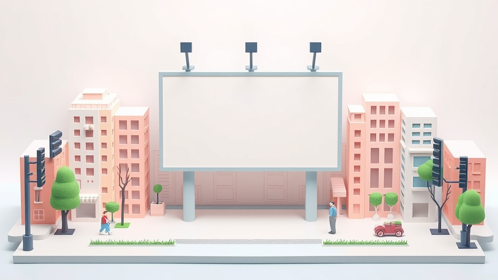

안녕하세요! 20년차 디지털 마케터, 여러분의 든든한 마케팅 동반자입니다. 오늘은 많은 분들이 궁금해하시는 **광고**에 대해 이야기해보려고 해요. 디지털 마케팅이 처음 등장했을 때부터 지금까지, 정말 수많은 광고 캠페인을 기획하고 실행하며 성공과 실패를 모두 맛봤죠. "실제로 해보니까 이게 효과가 있더라고요!" 같은 솔직한 경험담과 함께, 여러분의 광고 효율을 극대화할 수 있는 실질적인 팁들을 아낌없이 풀어드릴게요. 이 바닥에서 20년을 구르면서 깨달은 건, 결국 데이터가 모든 것을 말해준다는 사실이에요. 아무리 멋진 아이디어라도 숫자로 증명되지 않으면 의미가 없다는 걸 뼈저리게 느꼈습니다.

저는 퍼포먼스 마케팅 전문가로서 늘 ROI(투자 대비 수익률)와 전환율을 최우선으로 생각합니다. 광고는 단순히 노출을 늘리는 것을 넘어, 실제 매출과 연결되어야 하니까요. 특히 2025년을 앞둔 지금, 광고 환경은 그 어느 때보다 빠르게 변화하고 있습니다. 개인 정보 보호 강화부터 AI 기술의 발전, 그리고 숏폼 콘텐츠의 폭발적인 성장까지, 마케터로서 끊임없이 배우고 적용하지 않으면 금세 도태될 수밖에 없죠. 저도 처음에는 최신 트렌드를 따라가는 게 버겁기도 했지만, 결국 '왜' 이 트렌드가 중요한지 본질을 이해하고 나니 길이 보이더군요. 오늘 이 글을 통해 여러분도 변화의 물결 속에서 흔들리지 않고, 오히려 그 파도를 타고 더 높이 올라갈 수 있는 인사이트를 얻어가시길 바랍니다. 제가 직접 겪었던 실패 사례와 그를 통해 배운 교훈, 그리고 지금 바로 써먹을 수 있는 업계 꿀팁까지, 기대하셔도 좋습니다.

## 데이터 기반 퍼포먼스 광고, 실패를 통해 배운 성공 방정식

디지털 광고의 세계는 숫자로 시작해서 숫자로 끝난다고 해도 과언이 아닙니다. 저는 퍼포먼스 마케팅을 처음 시작했을 때부터 이 데이터의 중요성을 강조해왔어요. 하지만 머리로는 알아도, 실제로 데이터를 맹신하다가 크게 코를 꿰었던 경험도 있습니다. 제 초년 시절, 한 B2B SaaS 솔루션의 잠재 고객 확보 캠페인을 맡았을 때의 일입니다. 당시 저는 특정 키워드의 검색량이 높다는 이유만으로 그 키워드에 예산을 집중했고, 클릭률(CTR)이 높게 나오는 광고 소재를 맹신했습니다. "클릭이 많이 나오니까 좋은 광고 아닐까?"라는 단순한 생각이었죠.

결과는 참담했습니다. 클릭률은 꽤 높게 나왔지만, 실제 솔루션 데모 신청으로 이어지는 전환율은 1% 미만으로 바닥을 기었습니다. ROAS는 50%를 겨우 넘는 수준이었으니, 돈을 쏟아부을수록 손실만 커지는 상황이었죠. 그때의 저는 광고 관리자 대시보드에 보이는 숫자만 보고 "잘 되고 있다"고 착각했던 겁니다. 잠재 고객의 '양'만 쫓았지, '질'을 전혀 고려하지 않았던 거죠. 이 실패를 통해 저는 중요한 교훈을 얻었습니다. 단순히 클릭이 많다고 좋은 광고가 아니며, 최종 전환 목표에 얼마나 기여하는지가 핵심이라는 것을요.

그때부터 저는 데이터 분석의 깊이를 더하기 시작했습니다. 클릭 후 랜딩 페이지에서 사용자들이 어떤 행동을 하는지, 어디서 이탈하는지, 어떤 콘텐츠에 관심을 보이는지 GA(Google Analytics)와 핫자(Hotjar) 같은 툴을 활용해 꼼꼼히 들여다봤죠. 특정 키워드로 유입된 사용자들은 이탈률이 높고, 특정 페이지에서 오래 머무르지 않는다는 사실을 발견했습니다. 반면, 상대적으로 검색량은 적지만 '문제 해결'에 초점을 맞춘 키워드나 '솔루션 비교' 같은 구체적인 정보를 찾는 키워드에서 유입된 사용자들은 전환율이 훨씬 높았어요.

이러한 인사이트를 바탕으로 저는 캠페인 전략을 완전히 수정했습니다. 첫째, **잠재 고객의 의도를 파악하는 키워드**에 예산을 집중했습니다. 단순히 검색량이 많은 키워드 대신, 실제 구매 의사가 있는 사용자들이 검색할 만한 롱테일 키워드와 질문형 키워드를 발굴했죠. 둘째, **광고 소재를 A/B 테스트**하며 클릭률뿐만 아니라 *전환율*까지 함께 고려했습니다. 예를 들어, "최고의 SaaS 솔루션"이라는 광범위한 문구 대신, "업무 효율 30% 개선! [산업명] 맞춤 SaaS"처럼 구체적인 가치 제안과 타겟 산업을 명시하여 클릭 후 전환까지 이어질 확률을 높였어요. 실제로 이렇게 변경한 후, 초기에는 클릭률이 소폭 하락하는 것처럼 보였지만, 최종 전환율은 5% 이상으로 급등했고, ROAS는 150%에서 350%까지 치솟는 놀라운 결과를 얻었습니다.

2025년에도 이 데이터 기반의 접근 방식은 더욱 중요해질 겁니다. 특히 AI 기반의 예측 분석 툴이 발전하면서, 우리는 과거 데이터뿐만 아니라 미래 행동까지 예측하여 더욱 정교한 타겟팅과 개인화된 메시지를 전달할 수 있게 될 거예요. 하지만 명심하세요. 툴은 도구일 뿐, 그 데이터를 해석하고 전략을 세우는 것은 결국 마케터의 몫입니다. 눈에 보이는 숫자에만 현혹되지 말고, 그 숫자 뒤에 숨겨진 사용자들의 '이야기'를 읽어내는 통찰력을 길러야 진정한 퍼포먼스 마케터가 될 수 있습니다. 저의 실패가 여러분에게는 성공의 밑거름이 되기를 진심으로 바랍니다.

## 2025년, 변화하는 광고 환경 속에서 살아남는 법: 개인화와 새로운 채널

2025년은 디지털 광고 환경에 있어 전환점이 될 것이 분명합니다. 가장 큰 변화 중 하나는 바로 **개인 정보 보호 강화**와 그에 따른 *서드파티 쿠키의 종말*입니다. 구글의 크롬 브라우저에서도 서드파티 쿠키 지원이 중단되면, 기존의 타겟팅 방식에 큰 변화가 올 수밖에 없죠. 저도 처음엔 막막했지만, 실제로 해보니까 위기는 곧 기회가 되더군요. 이 변화에 대응하는 핵심은 바로 **퍼스트파티 데이터**의 확보와 활용입니다.

제가 최근 한 이커머스 기업의 마케팅을 총괄하면서 겪었던 일입니다. 쿠키 제한 이슈가 불거지기 시작하면서, 기존에 의존하던 리타겟팅 캠페인의 효율이 떨어질 것을 예상했습니다. 그래서 저희는 선제적으로 고객 행동 데이터를 직접 수집하고 분석하는 시스템을 구축했습니다. 웹사이트 방문자들의 구매 이력, 장바구니에 담은 상품, 조회한 페이지 등 다양한 정보를 고객의 동의하에 수집하고 CRM(고객 관계 관리) 시스템과 연동했죠. 이렇게 확보한 퍼스트파티 데이터를 기반으로 고객들을 세분화하고, 각 그룹에 맞는 개인화된 광고 메시지와 상품 추천을 시도했습니다.

예를 들어, 특정 제품군을 자주 구매하는 고객에게는 해당 제품군의 신제품 출시 광고를 보여주고, 장바구니에 상품을 담고 결제하지 않은 고객에게는 맞춤형 할인 쿠폰과 함께 "놓치지 마세요!"라는 문구를 담은 광고를 노출했습니다. 결과는 놀라웠습니다. 기존 리타겟팅 캠페인 대비 **전환율이 평균 15%p 상승**했고, 특히 장바구니 이탈 고객 대상 캠페인의 경우 **ROAS가 400%를 초과 달성**하는 성과를 보였습니다. 이는 단순히 불특정 다수에게 광고를 노출하는 것이 아니라, 고객의 니즈와 행동을 정확히 파악하여 개인화된 경험을 제공하는 것이 얼마나 중요한지 보여주는 사례입니다.

또한, 2025년 광고 시장에서 눈여겨봐야 할 또 다른 축은 바로 **새로운 채널의 부상**입니다. 특히 *숏폼 비디오 콘텐츠*는 이제 선택이 아닌 필수가 되었죠. 틱톡, 인스타그램 릴스, 유튜브 쇼츠는 단순히 젊은 세대의 전유물이 아니라, 모든 연령대의 사용자들을 끌어들이는 강력한 플랫폼이 되었습니다. 저는 처음에는 "짧은 영상으로 뭘 할 수 있을까?" 하는 의구심도 있었지만, 직접 테스트해보니 그 파급력에 깜짝 놀랐습니다.

한 뷰티 브랜드 캠페인에서, 저희는 제품의 특징을 설명하는 긴 영상 광고 대신, 15초 내외의 짧고 임팩트 있는 숏폼 비디오를 제작했습니다. 제품 사용 전후의 극적인 변화를 보여주거나, 유머러스한 상황극을 통해 제품의 장점을 자연스럽게 녹여낸 것이죠. 여기에 인기 인플루언서와의 협업을 통해 콘텐츠의 신뢰도와 확산력을 높였습니다. 그 결과, 숏폼 광고 캠페인으로 유입된 신규 고객 수는 **기존 디스플레이 광고 대비 2배 이상 증가**했고, 특히 20대 여성 고객층의 **구매 전환율은 20%p 상승**했습니다. 핵심은 '광고 같지 않은 광고'를 만드는 것이었습니다. 정보 전달보다는 재미와 공감에 초점을 맞추고, 사용자들이 자발적으로 공유하고 싶게 만드는 콘텐츠가 성공의 열쇠였죠.

새로운 채널에 도전할 때는 항상 **작은 예산으로 빠르게 테스트**하는 것을 추천합니다. 모든 채널이 우리 비즈니스에 맞는 것은 아니니까요. A/B 테스트를 통해 어떤 채널에서 어떤 유형의 콘텐츠가 가장 좋은 성과를 내는지 파악하고, 점진적으로 예산을 확대해 나가는 전략이 중요합니다. 개인화된 경험과 새로운 채널 발굴, 이 두 가지가 2025년 광고 시장에서 여러분을 돋보이게 할 핵심 열쇠가 될 겁니다.

## 광고 예산 효율 극대화, 이제는 AI와 자동화의 시대!

광고 예산은 한정되어 있고, 우리 마케터들은 늘 이 예산을 어떻게 하면 가장 효율적으로 사용할 수 있을지 고민합니다. 20년 전에는 수동으로 입찰가를 조정하고, 광고 소재를 교체하는 데 많은 시간을 할애했지만, 2025년에는 **AI와 자동화 기술**이 이러한 수고를 크게 덜어주고 있습니다. 저도 처음에는 "기계가 사람의 감성을 알 수 있을까?" 하는 의심을 품었지만, 실제로 AI 기반 툴들을 활용해보고 나니, 그 효율성에 감탄할 수밖에 없었습니다.

제가 맡았던 한 교육 콘텐츠 플랫폼의 광고 캠페인에서, 저희는 매일 수십 개의 키워드와 광고 그룹을 수동으로 관리하고 있었습니다. 매일 아침 출근하면 전날의 성과를 분석하고, 입찰가를 조정하고, 비효율적인 키워드를 제거하는 데만 2시간 이상을 썼죠. 그러다 보니 새로운 아이디어를 구상하거나 콘텐츠를 기획할 시간이 턱없이 부족했습니다. 이 문제를 해결하기 위해 저희는 AI 기반의 **자동 입찰 최적화 툴**을 도입하기로 결정했습니다.

초기에는 툴의 학습 기간이 필요했고, 일부 캠페인에서는 성과가 예상보다 좋지 않게 나오기도 했습니다. 하지만 2주 정도 지나자, 툴은 스스로 최적의 입찰가를 찾아내기 시작했고, 심지어 저희가 생각하지 못했던 시간대에 광고를 집중하여 효율을 높이는 것을 확인했습니다. 예를 들어, 특정 강의는 주말 새벽 시간에 전환율이 높다는 것을 AI가 파악하고 해당 시간대에 예산을 집중 배분하는 식이었죠. 그 결과, 저희는 **광고 관리 시간을 주당 10시간 이상 단축**할 수 있었고, 이는 곧 다른 전략적인 업무에 집중할 수 있는 시간으로 이어졌습니다. 뿐만 아니라, AI의 정교한 최적화 덕분에 **전체 ROAS는 추가적으로 25% 개선**되는 놀라운 성과를 거두었습니다.

AI는 단순히 입찰 최적화에만 국한되지 않습니다. **동적 크리에이티브 최적화(DCO)**는 AI가 사용자의 행동과 특성에 맞춰 광고 이미지, 헤드라인, 문구를 실시간으로 조합하여 가장 효과적인 광고를 보여주는 기술입니다. 제가 진행했던 한 여행사 캠페인에서는 DCO를 활용하여, 각 사용자에게 가장 관심을 가질 만한 여행지 이미지와 프로모션 문구를 자동으로 생성하여 노출했습니다. 예를 들어, 부산 여행 상품을 검색했던 사용자에게는 부산 해운대 사진과 "부산 특가! 지금 예약하세요"라는 문구를, 제주도 여행을 검색했던 사용자에게는 제주도 풍경 사진과 "제주도 항공권 할인"이라는 문구를 보여주는 식이었죠. 이 캠페인 덕분에 **클릭률은 10% 상승했고, 예약 전환율은 7%p 증가**했습니다.

물론, AI와 자동화가 모든 것을 해결해 주지는 않습니다. 오히려 마케터의 역할은 더욱 중요해진다고 생각합니다. AI에게 정확한 목표와 데이터를 제공하고, 그 결과를 해석하며, 때로는 AI의 예측을 뛰어넘는 창의적인 전략을 제시하는 것이죠. 저는 AI 툴을 맹신하기보다는, 항상 **AI가 제안하는 결과와 저의 경험적 판단을 비교하고 검증**하는 과정을 거칩니다. 예를 들어, AI가 특정 타겟 그룹에 대한 예산 증액을 제안했을 때, 저는 그 타겟 그룹의 최근 시장 동향이나 경쟁사 활동 등을 함께 고려하여 최종 결정을 내립니다.

자동화 툴을 도입할 때는 다음 두 가지 팁을 꼭 기억하세요. 첫째, **명확한 목표 설정**입니다. AI에게 "ROAS 300% 달성"처럼 구체적인 목표를 제시해야 AI가 그 목표에 맞춰 최적화를 진행할 수 있습니다. 둘째, **지속적인 모니터링과 학습**입니다. 툴을 한 번 설정했다고 끝이 아닙니다. 주기적으로 성과를 확인하고, 필요한 경우 직접 개입하여 AI가 더 잘 학습할 수 있도록 피드백을 주어야 합니다. AI는 우리의 든든한 조력자이지만, 최종 지휘는 언제나 마케터의 몫이라는 것을 잊지 마세요.

결론적으로, 2025년의 광고는 단순히 예산을 많이 쓰는 것을 넘어, **데이터를 기반으로 한 개인화된 접근, 새로운 채널에 대한 과감한 시도, 그리고 AI와 자동화를 통한 효율 극대화**라는 세 가지 축을 중심으로 돌아갈 것입니다. 저의 20년 마케팅 경험을 통해 얻은 교훈은, 결국 변화를 두려워하지 않고 끊임없이 배우고 시도하는 마케터만이 살아남는다는 것입니다. 실패는 성공의 어머니라는 말이 있듯, 저의 실패 경험들이 여러분에게는 귀중한 학습 기회가 되기를 바랍니다. 지금 바로 여러분의 광고 캠페인에 오늘 배운 팁들을 적용해보세요. 작은 변화가 큰 성과를 만들어낼 수 있습니다. 여러분의 성공적인 광고 캠페인을 진심으로 응원합니다!

## 마치며

지금까지 2025년 광고 시장의 주요 흐름과 마케터가 집중해야 할 핵심 전략들을 살펴보았습니다. 데이터를 기반으로 고객을 깊이 이해하고, 개인화된 메시지로 다가가며, 새로운 채널에 과감히 도전하는 것이 중요합니다. 여기에 AI와 자동화를 현명하게 활용하여 효율성을 극대화하되, 항상 인간 마케터의 통찰력과 최종 결정이 뒷받침되어야 한다는 점을 기억해야 합니다. 급변하는 광고 환경 속에서 성공을 거두기 위해서는 변화를 두려워하지 않고 끊임없이 배우고 시도하는 자세가 필수적입니다. 오늘 배운 전략들을 여러분의 캠페인에 적용하며 작은 성공부터 만들어나가 보세요. 때로는 실패를 통해 더 큰 깨달음을 얻기도 합니다. 지금 바로 행동에 나서서, 다음 성공적인 광고 캠페인의 주인공이 되시길 바랍니다. 저는 언제나 여러분의 도전을 응원합니다!