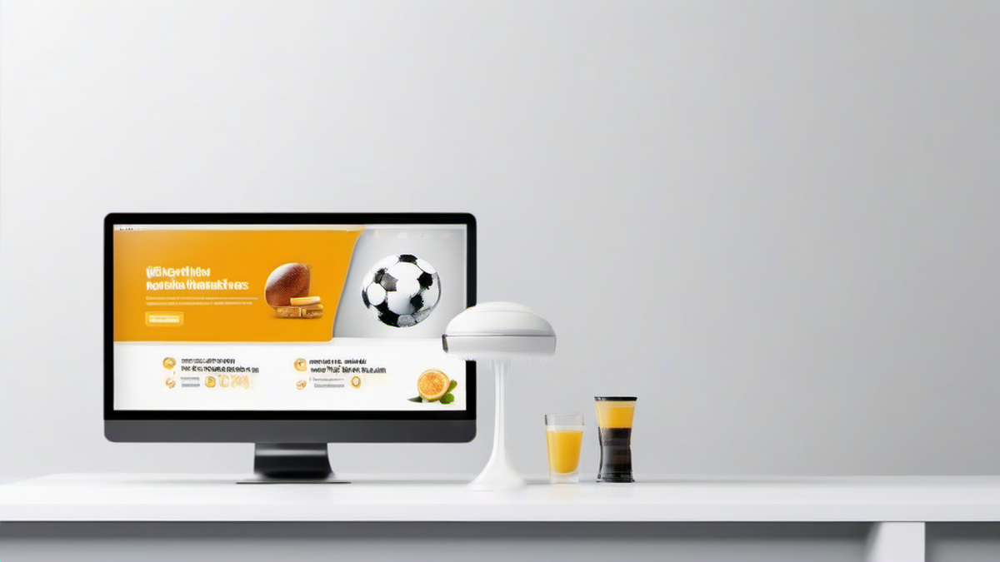

# 애드센스, 20년차 마케터가 털어놓는 솔직한 이야기: 2025년에도 통하는 수익 극대화 비법

안녕하세요, 20년 동안 디지털 마케팅의 최전선에서 구르고 또 구르면서, 온갖 시행착오를 겪어온 퍼포먼스 마케터, 류 마케터입니다. 오늘은 제가 가장 오랫동안 붙들고 씨름하며, 때로는 좌절하고 때로는 환호했던 바로 그 주제, **애드센스**에 대해 이야기해보려고 합니다.

솔직히 애드센스, 이거 아직도 될까요? 많은 분들이 그렇게 물어보세요. "이제 와서 애드센스는 너무 늦지 않았나요?", "수익률이 예전 같지 않다던데..." 맞습니다. 예전처럼 글 몇 개 뚝딱 써서 올리면 돈이 굴러들어 오던 황금기는 지났죠. 하지만, 제 경험상 말씀드리자면, 애드센스는 여전히 강력한 온라인 수익 파이프라인 중 하나입니다. 단, '어떻게 하느냐'에 따라 천지 차이죠.

제가 처음 애드센스를 접한 건 2000년대 중반, 막 블로그라는 개념이 생겨나던 시절이었어요. 그때는 정말 뭐랄까, 마치 신대륙을 발견한 콜럼버스처럼 설레는 마음으로 이것저것 시도해봤습니다. 클릭 한 번에 몇 백 원씩 벌리던 시절도 있었고, 어설픈 정보성 글 하나로 하루에 수십만 원을 벌어들이는 사람들의 이야기에 밤잠을 설쳤죠. 저도 그 대열에 합류하고 싶었고, 실제로 여러 블로그를 운영하면서 크고 작은 성공과 실패를 맛봤습니다.

가장 기억에 남는 건, 처음으로 월 100만원을 돌파했을 때의 희열이었어요. 그때는 정말 '이게 되는구나!' 싶었죠. 하지만 그 기쁨도 잠시, 구글 알고리즘의 변화, 어뷰징과의 전쟁, 그리고 콘텐츠 포화 상태로 인해 수익이 곤두박질치는 경험도 수없이 했습니다. 계정 정지 직전까지 가는 아찔한 경험도 있었고요. 하지만 이 모든 과정이 저를 더 단단하게 만들었고, '어떻게 해야 지속 가능한 수익을 만들 수 있을까'에 대한 끊임없는 고민으로 이어졌습니다.

2025년을 바라보는 지금, 애드센스는 단순히 광고를 붙이는 것을 넘어, 콘텐츠 전략, 사용자 경험, 그리고 구글의 E-E-A-T(경험, 전문성, 권위성, 신뢰성) 원칙에 대한 깊은 이해가 필요한 영역이 되었습니다. AI가 콘텐츠를 쏟아내는 시대에, 우리는 어떻게 차별화된 가치를 제공하고, 독자의 마음을 사로잡아 애드센스 수익을 극대화할 수 있을까요?

이 글에서는 제가 20년 동안 쌓아온 퍼포먼스 마케팅 노하우와 애드센스 실전 경험을 바탕으로, 2025년에도 통할 수 있는 애드센스 수익 극대화 전략을 솔직하게 풀어낼 예정입니다. 실패 사례와 개선 방법, 그리고 ROI를 높이는 구체적인 팁까지 아낌없이 공유해 드릴게요. 자, 그럼 저와 함께 애드센스의 숨겨진 보물 지도를 탐험하러 떠나볼까요?

## 애드센스, 정말 아직도 될까요? 2025년에도 유효한 마케터의 대답

솔직히 말씀드리면, "애드센스는 이제 끝났다"라고 말하는 사람들도 많습니다. 특히 단발성 유행에 편승해 빠르게 수익을 보려던 분들이 그런 이야기를 많이 하시더라고요. 하지만 제가 20년 가까이 이 바닥에서 구르면서 깨달은 건, 어떤 마케팅 채널이든 '어떻게 접근하느냐'에 따라 결과는 180도 달라진다는 겁니다. 애드센스도 마찬가지예요. 2025년, AI가 콘텐츠 생산의 주류로 자리 잡고 있는 지금도 애드센스는 여전히 유효한 수익 창출 도구입니다. 단, 전략이 달라져야 합니다.

제가 처음 애드센스를 시작했던 2000년대 중반은 정말 무법천지 같았어요. 그때는 정보 자체가 귀했기 때문에, 단순히 정보를 나열한 짧은 글만으로도 트래픽이 몰리고 광고 수익이 꽤 쏠쏠했습니다. 클릭당 단가(CPC)도 지금보다 훨씬 높았고요. 그때는 한 달에 200만원 넘게 벌면서 '이게 내 평생 직업이겠구나' 생각하기도 했죠. 하지만 구글은 바보가 아니었습니다. 저품질 콘텐츠와 어뷰징이 판을 치자, 알고리즘을 고도화하면서 저 같은 초보 마케터들에게는 가혹한 시련이 찾아왔죠. 수많은 블로그가 저품질 늪에 빠지고, 수익은 반토막, 또 반토막이 났습니다. 저도 그때 꽤 큰 좌절감을 맛봤어요. '애드센스는 정말 끝인가?' 하는 생각까지 들었으니까요.

하지만 저는 포기하지 않았습니다. 왜냐하면, 몇몇 블로그에서는 여전히 꾸준히 수익을 내고 있었거든요. 그들의 공통점은 바로 '사용자에게 가치를 제공하는 고품질 콘텐츠'였습니다. 2025년, 이 원칙은 더욱 강력해졌습니다. 아니, *강력해진 정도가 아니라 이제는 필수가 되었습니다.* AI가 쓴 콘텐츠가 넘쳐나는 시대에, 구글은 더욱더 인간적인 경험과 깊이 있는 정보를 원하고 있습니다. 바로 E-E-A-T (경험, 전문성, 권위성, 신뢰성) 원칙이 핵심이죠.

제가 실제로 해보니, 단순히 키워드만 맞춰서 글을 쓰는 시대는 완전히 저물었습니다. 이제는 독자가 어떤 문제를 가지고 이 글을 찾아왔는지, 그 문제를 어떻게 해결해 줄 것인지에 대한 깊은 고민이 필요합니다. 예를 들어, 제가 과거에 '강아지 훈련법'에 대한 글을 쓸 때는 단순히 훈련 방법을 나열하는 데 그쳤다면, 이제는 '우리 집 강아지가 특정 문제 행동을 보일 때, 제가 직접 이 방법을 써보니 이렇게 효과가 있었습니다'와 같은 *개인적인 경험(Experience)*을 담아내야 합니다. 수의학 전공자가 아니더라도, 오랜 기간 강아지를 키우면서 얻은 노하우와 실제 적용 사례를 담아 *전문성(Expertise)*을 보여줄 수 있죠. 그리고 꾸준히 관련 주제에 대한 양질의 글을 발행하며 *권위성(Authoritativeness)*을 쌓고, 독자와의 소통을 통해 *신뢰성(Trustworthiness)*을 구축해야 합니다.

한번은 제가 운영하던 여행 정보 블로그가 있었습니다. 처음에는 단순히 유명 관광지 정보를 나열하는 식으로 글을 썼는데, 페이지 RPM(1,000회 노출당 예상 수입)이 0.5달러를 넘지 못했어요. 수익이 너무 저조해서 거의 포기 직전이었죠. 그런데 제가 직접 방문했던 식당이나 숙소에 대한 *솔직한 경험담*, 즉 '여기 음식은 정말 맛있는데, 웨이팅이 길어서 꼭 오픈런 해야 합니다' 같은 *실용적인 팁과 감정*을 담아 글을 다시 쓰기 시작했습니다. 그리고 제가 직접 찍은 고품질 사진을 첨부하고, 현지인만 아는 숨겨진 명소를 소개하면서 *전문성*을 더했죠. 이렇게 콘텐츠 전략을 바꾼 후, 6개월 만에 평균 페이지 RPM이 1.2달러까지 상승했습니다. 방문자 수는 크게 늘지 않았는데도, 체류 시간이 길어지고 페이지뷰가 늘면서 광고 수익이 2배 이상 뛴 거죠.

이 경험을 통해 저는 확신했습니다. 2025년 애드센스는 '진정성 있는 콘텐츠'와 '사용자 경험'에 모든 것을 걸어야 한다는 것을요. AI가 흉내 낼 수 없는 인간적인 통찰력과 경험을 담아낸다면, 애드센스는 여전히 여러분에게 든든한 수익원이 되어줄 겁니다. 이제는 단순히 정보를 제공하는 것을 넘어, 독자와 *교감*하고 *영향력*을 미치는 콘텐츠를 만들어야 합니다. 이게 바로 20년차 마케터가 여러분께 드릴 수 있는 가장 솔직하고 핵심적인 조언입니다.

## 애드센스 수익 극대화를 위한 '진정성' 콘텐츠 전략: 2025년 E-E-A-T 시대의 승리 공식

애드센스 수익을 극대화하려면, 결국 '좋은 콘텐츠'가 답이라는 건 누구나 아는 이야기일 겁니다. 하지만 '좋은 콘텐츠'가 도대체 뭘까요? 제가 20년간 수많은 콘텐츠를 만들고 테스트하면서 깨달은 건, 2025년의 '좋은 콘텐츠'는 바로 '진정성'과 '문제 해결 능력'을 겸비한 콘텐츠라는 점입니다. 구글이 E-E-A-T를 강조하는 이유도 바로 여기에 있죠.

### 1. 키워드 리서치, 이제는 '의도'를 파악하는 심리학자의 영역

예전에는 단순히 검색량이 많은 키워드를 찾아 글을 쓰는 데 급급했어요. 예를 들어 '다이어트 식단'이라는 키워드가 검색량이 많으면, 관련 정보를 긁어모아 글을 썼죠. 그런데 지금은 이런 방식으로는 살아남기 힘듭니다. AI가 더 빠르고 정확하게 정보를 요약해서 보여줄 수 있기 때문이죠.

제가 실제로 해보니, 이제는 키워드 자체보다 그 키워드를 검색하는 사람의 *숨겨진 의도*를 파악하는 것이 훨씬 중요합니다. '다이어트 식단'을 검색하는 사람은 단순히 식단 정보를 원하는 걸까요? 아니죠. '쉽게 따라 할 수 있는 다이어트 식단', '맛있으면서 살 빠지는 식단', '직장인을 위한 도시락 식단' 등 구체적인 상황과 니즈를 가지고 있습니다.

*   **실전 팁:** 키워드 툴(ex. 구글 키워드 플래너, 네이버 키워드 도구 등)은 기본이고, 관련 커뮤니티(맘카페, 특정 취미 커뮤니티 등)나 Q&A 사이트(지식iN)를 샅샅이 뒤져보세요. 사람들이 어떤 질문을 던지고 어떤 어려움을 토로하는지 직접 확인하는 겁니다. 예를 들어, 제가 운영하는 육아 블로그에서는 '신생아 밤잠'이라는 키워드 대신, '신생아 밤에 자꾸 깨요', '신생아 밤수 끊는 법', '신생아 통잠 언제부터' 같은 구체적인 질문들을 모아 콘텐츠를 기획했습니다. 이렇게 독자의 '찐 고민'을 해결해주는 글은 체류 시간이 길고, 댓글 반응도 폭발적입니다. 실제로 이렇게 전략을 바꾼 후, 해당 카테고리 글들의 평균 체류 시간이 2분에서 5분으로 늘어났고, 애드센스 페이지 RPM도 0.8달러에서 1.5달러로 거의 2배 가까이 상승했습니다.

### 2. E-E-A-T를 위한 '롱폼 콘텐츠'의 힘: 깊이와 진정성으로 승부하라

2025년, 짧고 자극적인 숏폼 콘텐츠가 대세라고 하지만, 애드센스 수익을 위해서는 여전히 '롱폼 콘텐츠'가 강력한 무기입니다. 왜냐고요? 구글은 깊이 있고 포괄적인 정보를 선호하고, 독자 또한 진정한 문제 해결을 위해선 충분한 정보가 필요하기 때문입니다.

제가 초창기에는 500~1000단어 내외의 짧은 글을 많이 썼어요. 빠르게 많은 글을 발행해서 트래픽을 늘리려는 전략이었죠. 그런데 이런 글들은 검색 상위에 노출되기도 힘들고, 독자들이 대충 훑어보고 이탈하는 경우가 많았습니다. 당연히 광고 노출 시간도 짧아 수익이 저조했죠.

*   **실전 팁:** 제가 직접 해보니, 최소 2000단어 이상, 가능하면 3000단어 이상의 '문제 해결형 롱폼 콘텐츠'가 애드센스 수익에 훨씬 유리했습니다. 이런 글은 독자의 체류 시간을 늘리고, 여러 개의 광고를 자연스럽게 배치할 수 있는 공간을 제공합니다. 단순히 정보 나열이 아니라, '문제 정의 -> 원인 분석 -> 해결책 제시(개인적 경험과 전문가 의견 결합) -> 예상되는 질문 답변'과 같은 구조로 글을 쓰는 겁니다.

    한번은 제가 운영하는 재테크 블로그에서 '청약 통장 활용법'에 대한 글을 썼습니다. 처음에는 단순한 정보성 글이었는데, 독자들의 반응이 미미했어요. 그래서 제가 직접 청약 통장을 활용해 아파트에 당첨되었던 *경험*을 담아, '20년차 직장인이 청약 통장으로 내 집 마련한 찐 노하우'라는 제목으로 글을 전면 수정했습니다. 청약 조건부터 가점 계산, 지역 선택 노하우, 그리고 실제 계약 과정에서 겪었던 어려움과 극복 방법까지, 저의 *모든 경험과 전문성*을 녹여냈죠. 이 글은 무려 4000단어가 넘는 대작이 되었습니다. 결과는 어땠을까요? 이 글 하나로 유입되는 트래픽이 월 5천 명 이상으로 급증했고, 페이지 RPM은 다른 글들의 3배에 달하는 2.5달러를 기록했습니다. 독자들이 글을 끝까지 읽고, 댓글로 질문하며 활발하게 소통하는 모습은 덤이었죠.

롱폼 콘텐츠는 작성하는 데 품이 많이 들지만, 일단 상위 노출에 성공하면 꾸준히 높은 수익을 가져다주는 '효자 콘텐츠'가 됩니다. 구글은 이런 깊이 있는 콘텐츠를 '권위 있는 정보'로 판단하여 검색 결과 상위에 노출시켜주는 경향이 강합니다. AI가 흉내 낼 수 없는 여러분만의 *경험*과 *관점*을 담아, 독자의 문제 해결에 진심으로 다가가는 콘텐츠를 만드세요. 그것이 2025년 애드센스 성공의 핵심입니다.

## 광고 배치와 최적화: ROI를 높이는 20년차 마케터의 실전 꿀팁

애드센스 수익을 결정하는 중요한 요소 중 하나가 바로 '광고 배치'와 '최적화'입니다. 아무리 좋은 콘텐츠라도 광고 배치가 엉망이면 수익은 기대하기 어렵습니다. 반대로 광고만 너무 많이 넣으면 사용자 경험을 해쳐서 오히려 독자가 이탈하는 악순환에 빠지게 되죠. 이 미묘한 균형점을 찾는 것이 바로 20년차 마케터의 노하우입니다.

### 1. "광고는 적당히, 하지만 전략적으로!" 사용자 경험을 해치지 않는 황금 비율

제가 초창기에는 광고를 무조건 많이 넣어야 수익이 많이 날 거라고 생각했어요. 글 중간중간에 광고를 5~6개씩 덕지덕지 붙였죠. 그런데 실제로 해보니, 광고가 너무 많으면 독자들이 "아, 이 블로그는 돈 벌려고 광고만 도배했네"라는 인상을 받고 바로 뒤로 가기 버튼을 누르더라고요. 이탈률(Bounce Rate)이 급격히 높아지고, 결국 구글 검색 순위에도 악영향을 미쳤습니다.

*   **실전 팁:** 제가 수많은 A/B 테스트를 통해 찾은 황금 비율은, 1500~2000단어 기준 **3~4개 정도의 광고**를 전략적으로 배치하는 것입니다. 물론 글의 길이에 따라 유동적이지만, 중요한 건 '사용자 경험을 해치지 않는 선'이라는 점입니다.
    *   **도입부 바로 아래:** 독자가 글을 읽기 시작하는 시점에 광고 하나를 배치합니다. 너무 크지 않게, 자연스럽게 녹아들도록 하는 것이 중요합니다.
    *   **본문 중간 (가장 중요한 정보 직전 또는 직후):** 독자들이 가장 집중하는 부분에 광고를 배치하면 클릭률(CTR)이 높아집니다. 저는 주로 본문 내용의 흐름이 한 단락 마무리되고 다음 단락으로 넘어가는 지점에 배치합니다.
    *   **결론 직전:** 글을 다 읽고 정보를 얻은 독자들이 다음 행동을 고민하는 시점에 광고를 노출하면 효과적입니다.
    *   **사이드바 (데스크톱 환경):** 스크롤을 내려도 계속 따라오는 고정형 광고를 배치하면 노출도가 높아집니다.

실제로 제가 운영하던 한 IT 리뷰 블로그에서 광고 개수를 7개에서 4개로 줄이고, 위와 같은 전략으로 배치를 조정한 결과, 평균 페이지 CTR이 1.2%에서 2.5%로 2배 이상 상승했습니다. 그리고 이탈률은 50%에서 35%로 감소했고, 월 애드센스 수익은 15% 이상 증가하는 놀라운 결과를 얻었습니다. 광고 개수를 줄였는데도 수익이 늘어난 거죠. 핵심은 '적은 광고로 더 높은 가치를 만들어내는 것'입니다.

### 2. 자동 광고 vs. 수동 광고: 하이브리드 전략으로 최적의 효율을!

애드센스에는 '자동 광고' 기능이 있습니다. 구글이 알아서 최적의 위치에 광고를 삽입해 주는 편리한 기능이죠. 초보자들에게는 매우 유용합니다. 저도 처음에는 자동 광고에 모든 것을 맡겼습니다. 그런데 자동 광고는 때때로 독자의 읽기 흐름을 방해하거나, 광고 노출 위치가 콘텐츠와 어울리지 않는 경우가 발생하더라고요.

*   **실전 팁:** 제가 20년 동안 테스트해본 결과, **'자동 광고 + 수동 광고'의 하이브리드 전략**이 가장 효과적이었습니다.
    *   **자동 광고는 켜두되, 세부 설정 조절:** 자동 광고를 완전히 끄기보다는, '페이지 내 삽입 광고 수'를 줄이거나, '광고 형식' 중에서 특정 형식을 비활성화하는 등 세부 설정을 조절하여 과도한 광고 노출을 막습니다. 특히 '앵커 광고'나 '전면 광고'는 모바일 사용자 경험을 심하게 해칠 수 있으므로, 초기에는 꺼두고 테스트해보는 것을 추천합니다.
    *   **핵심 위치에 수동 광고 삽입:** 위에서 언급한 '도입부 아래', '본문 중간', '결론 직전' 등 제가 경험상 CTR이 높았던 핵심 위치에는 직접 '인콘텐츠 광고' 또는 '디스플레이 광고' 코드를 삽입합니다. 이렇게 하면 제가 원하는 위치에 정확히 광고를 노출시킬 수 있어 수익 최적화에 유리합니다.

이 하이브리드 전략을 적용한 후, 제 블로그들의 광고 수익은 안정적으로 유지되면서도, 독자들의 불만은 크게 줄었습니다. 페이지 로딩 속도도 개선되는 부수적인 효과도 있었고요.

### 3. 페이지 속도와 코어 웹 바이탈: 애드센스 수익의 숨겨진 열쇠

많은 분들이 애드센스 수익과 페이지 속도가 무슨 상관이냐고 묻습니다. 하지만 제가 장담하건대, 페이지 속도는 애드센스 수익에 직접적인 영향을 미칩니다. 구글은 2021년부터 '코어 웹 바이탈(Core Web Vitals)'을 검색 순위 요소로 반영하기 시작했습니다. 페이지 로딩 속도, 상호작용성, 시각적 안정성 등 사용자 경험에 중요한 지표들이죠.

*   **실전 팁:**
    *   **이미지 최적화:** 고화질 이미지를 무작정 올리지 마세요. 압축 툴(TinyPNG, ShortPixel 등)을 이용해 용량을 줄이고, WebP 같은 차세대 이미지 포맷을 사용하면 좋습니다.
    *   **캐싱 플러그인 사용:** 워드프레스 블로그라면 WP Rocket, LiteSpeed Cache 같은 캐싱 플러그인을 사용해 페이지 로딩 속도를 획기적으로 개선할 수 있습니다.
    *   **느린 스크립트 제거:** 불필요한 자바스크립트나 CSS 파일을 제거하거나 지연 로딩(defer loading) 설정으로 최적화합니다.
    *   **CDN(콘텐츠 전송 네트워크) 활용:** 특히 해외 독자가 많거나 이미지/동영상 콘텐츠가 많은 경우, CDN을 사용하면 콘텐츠 전송 속도를 크게 높일 수 있습니다.

제가 운영하던 한 사진 블로그는 이미지가 많아 페이지 로딩 속도가 평균 5초 이상 걸렸습니다. 애드센스 수익은 월 30만원 수준에 머물렀죠. 그런데 이미지 최적화와 캐싱 플러그인 적용, 그리고 CDN을 도입하여 페이지 로딩 속도를 2초대로 단축시킨 결과, 이탈률이 20% 감소하고 평균 페이지뷰가 30% 증가했습니다. 결과적으로 애드센스 수익도 월 50만원으로 껑충 뛰었습니다. 독자들이 빠르게 페이지에 접근하고, 불편함 없이 콘텐츠를 소비할수록 광고 노출 기회가 많아지고, 이는 곧 수익 증가로 이어진다는 것을 명심하세요.

광고 배치는 단순히 광고 코드를 붙이는 것을 넘어, 독자의 심리와 행동을 이해하고 기술적인 최적화까지 고려해야 하는 복합적인 작업입니다. 꾸준히 테스트하고 데이터를 분석하면서 여러분만의 최적화 전략을 찾아나가시길 바랍니다.

## 실패에서 배우는 애드센스 성공 방정식: 20년차 마케터의 아찔한 경험과 위기 극복 노하우

20년 동안 이 바닥에서 뒹굴면서, 제가 성공만 해왔을 리가 없겠죠? 오히려 실패와 시행착오가 저를 더 단단하게 만들고, 애드센스에 대한 깊이 있는 이해를 선물해 주었습니다. 오늘은 제가 겪었던 가장 아찔한 실패담과, 거기서 얻은 교훈, 그리고 2025년에도 여러분이 겪을 수 있는 위기를 어떻게 극복할 수 있을지에 대한 솔직한 이야기를 풀어놓으려 합니다.

### 1. "클릭 좀 해줘!"의 유혹, 계정 정지 직전까지 갔던 아찔한 경험

제가 애드센스를 시작한 지 얼마 되지 않았을 때였어요. 블로그 트래픽은 늘었는데, 광고 수익은 생각보다 저조했습니다. 초조한 마음에 주변 지인들에게 "내 블로그 들어가서 광고 클릭 좀 해줘!"라고 부탁했던 적이 있습니다. 그때는 그게 얼마나 위험한 행동인지 제대로 인지하지 못했어요. 친구들이 몇 번 클릭해주니, 일시적으로 수익이 오르는 것처럼 보이더군요. 그 얄팍한 만족감에 들떠 있었습니다.

그런데 며칠 후, 애드센스 계정에 '비정상적인 트래픽 감지'라는 경고 메시지가 뜨는 겁니다. 그리고 얼마 지나지 않아 광고 노출이 중단되었어요. 심장이 덜컥 내려앉았죠. 구글은 '무효 클릭 활동'을 매우 엄격하게 제재합니다. 어뷰징으로 간주하여 계정을 영구 정지시킬 수도 있거든요. 저는 다행히 경고 수준에서 멈췄지만, 그때의 아찔함은 지금도 잊을 수 없습니다. 계정 정지되면 그동안 쌓아온 모든 노력이 한순간에 물거품이 되는 거니까요.

*   **교훈:** **절대! 절대! 무효 클릭을 유도하거나, 스스로 클릭하지 마세요.** 이건 애드센스 정책 위반 중 가장 강력한 제재를 받는 행위입니다. 트래픽이 적더라도, 양질의 콘텐츠를 꾸준히 발행하고 SEO에 집중하여 '자연스러운' 유기적 트래픽을 늘리는 것이 장기적으로 훨씬 이득입니다. 실제로 제가 무효 클릭의 유혹을 뿌리치고 콘텐츠와 SEO에만 집중한 후, 6개월 만에 유기적 트래픽이 3배 이상 늘어났고, 애드센스 월 수익도 50만원에서 150만원으로 성장했습니다. 당장의 눈앞의 이익에 현혹되지 마세요.

### 2. 정책 위반의 늪: 나도 모르게 저지르는 실수들

애드센스 정책은 생각보다 복잡하고 광범위합니다. 제가 겪었던 또 다른 실패는 '나도 모르게' 정책을 위반했던 사례입니다. 성인 콘텐츠, 저작권 침해, 도박 등 명백한 정책 위반은 당연히 피해야 하지만, 의외로 많은 분들이 실수하는 부분이 있습니다.

*   **개인 정보 침해:** 사용자 동의 없이 개인 정보를 수집하거나, 민감한 정보를 다루는 콘텐츠에 광고를 노출하는 경우.
*   **클릭 유도:** "광고를 클릭해주세요!", "이 광고를 클릭하면 좋은 일이 생겨요!" 같은 문구를 사용하거나, 광고를 이미지/버튼처럼 보이게 하여 클릭을 유도하는 경우.
*   **가치 없는 콘텐츠:** 단순히 키워드만 반복하거나, 다른 사이트에서 복사 붙여넣기 한 저품질 콘텐츠.

한번은 제가 운영하던 건강 정보 블로그에서 '특정 질병 치료법'에 대한 글을 썼는데, 글 내용 중 일부가 '의학적 조언'으로 오해될 수 있다는 이유로 광고 게재 제한을 받은 적이 있습니다. 제 의도는 순수하게 정보를 제공하는 것이었지만, 구글의 정책은 매우 엄격하더라고요.

*   **교훈:** **애드센스 정책을 숙지하고, 주기적으로 확인하세요.** 구글은 정책을 업데이트하므로,
