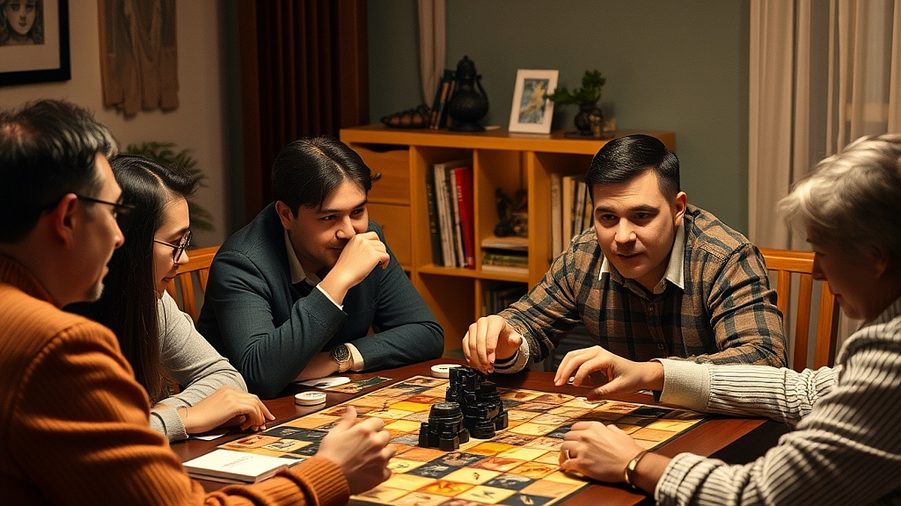

# 성인용 보드게임 모임, 낯선 사람과 '전략적 대화' 나누는 법

성인용 보드게임 모임은 단순히 주사위를 굴리고 카드를 뽑는 놀이 공간을 넘어, 퇴근 후 낯선 이들과 '전략적 대화'를 나누는 일종의 사회적 실험실이 되고 있습니다. 20대 후반부터 40대까지의 직장인들이 이 취미에 열광하는 이유는 명확합니다. 회사라는 수직적 구조나 오래된 친구들과의 고착화된 관계에서 벗어나, 오직 '게임의 승리'라는 공통의 목적 아래에서만 작동하는 투명한 인간관계를 원하기 때문입니다. 업무 성과나 배경지식 없이도 오직 논리와 협상력만으로 상대와 깊숙이 교감할 수 있다는 점이 이 취미의 핵심 매력입니다. 매일 반복되는 단조로운 일상에서 벗어나, 예측 불가능한 변수들을 관리하고 타인의 심리를 읽어내는 과정은 뇌를 깨우는 가장 세련된 방식의 휴식이기도 합니다. 이제는 카페에서 하는 가벼운 파티 게임을 넘어, 3시간 이상 머리를 맞대야 하는 전략 게임 모임에 사람들이 몰리는 이유를 실질적인 관점에서 짚어보려 합니다.

## 전략 게임 모임 선택의 기준: 분위기와 밀도

전략 보드게임 모임은 소모임 앱이나 커뮤니티 게시판을 통해 쉽게 찾을 수 있지만, 첫 모임에서 실패하지 않으려면 '분위기'와 '게임의 밀도'를 기준으로 삼아야 합니다. 가장 먼저 확인해야 할 것은 해당 모임이 '친목 위주'인지, 아니면 '게임의 승리 그 자체'에 집중하는지 여부입니다. 

전략 게임은 최소 2시간에서 길게는 5시간까지 한 테이블에 앉아 있어야 합니다. 따라서 대화의 주제가 게임의 맥락을 벗어나 지나치게 사적인 질문으로 흐르는 모임은 피하는 것이 좋습니다. 이런 곳은 전략적 대화보다는 관계 중심의 커뮤니티 성격이 강해, 게임을 하러 갔다가 의도치 않은 감정 노동을 해야 할 수도 있습니다. 반면, 게임의 효율과 수 싸움을 즐기는 모임은 대화가 건조할지라도 게임 내에서의 협상과 배신이 명확하여 스트레스가 적습니다.

선택 기준은 간단합니다. 모임 공지글에 '초보 환영'만 적혀 있는지, 아니면 '특정 난이도 이상의 게임(예: 유로 게임, 4X 장르)을 선호하는지'가 구체적으로 명시되어 있는지 확인하세요. 만약 본인이 게임을 배우는 과정 자체를 즐기고 싶다면 교육 중심의 모임을, 이미 규칙을 숙지하고 치열하게 수 싸움을 하고 싶다면 숙련자 위주의 모임을 선택해야 합니다. 

실패 사례로는 '무조건적인 친목'을 강조하며 게임 중간중간 대화가 끊기는 모임에 나가는 경우입니다. 게임의 흐름이 끊기면 전략적 사고가 무너지고, 결국 게임이 끝난 뒤 피로감만 남게 됩니다. 3시간 이상 집중할 수 있는 환경인지, 모임장의 규칙 운영 방식이 명확한지를 먼저 메시지로 물어보고 결정하세요.

## 실전 체크리스트: 낯선 이와 대화하는 전략적 매너

낯선 사람과 전략적 대화를 나눈다는 것은 감정을 배제하고 논리로 상대의 수를 읽는 법을 배우는 과정입니다. 보드게임 테이블 위에서는 직함도, 나이도 중요하지 않습니다. 오직 지금 내 앞에 놓인 자원과 상대의 행동 패턴만이 존재합니다. 성공적인 커뮤니티 경험을 위해 다음 세 가지 체크리스트를 실행해 보세요.

첫째, '왜 그 수를 두었는지'를 묻되, 공격적인 어조를 피하세요. "왜 그렇게 하셨어요?"라는 질문은 상대에게 방어적인 태도를 유발합니다. 대신 "지금 그 자원을 선점하신 게 이후의 어떤 전략을 염두에 두신 건가요?"라고 질문해 보세요. 이는 게임의 흐름을 이해하려는 의지를 보여주며, 상대방도 자신의 전략을 설명하며 대화가 깊어지게 만듭니다.

둘째, 게임 내에서의 협상과 사적인 친분을 철저히 분리하세요. 전략 게임에서 잠시 동맹을 맺고 뒤통수를 치는 것은 게임의 일환입니다. 이를 현실의 인간관계로 가져오지 않는 것이 이 커뮤니티의 불문율입니다. 게임이 끝나면 즉시 '방금 그 수 정말 날카로웠어요'와 같은 게임적 피드백으로 대화를 마무리하세요. 

셋째, 자신의 실수를 인정하고 공유하세요. 전략 게임은 완벽한 사람이 이기는 것이 아니라, 실수를 적게 하는 사람이 이기는 것입니다. "아, 제가 여기서 자원 관리를 잘못했네요"라고 자신의 패착을 먼저 말하는 사람은 상대에게 훨씬 매력적인 대화 상대로 다가갑니다. 

실수하기 쉬운 부분은 게임 도중 스마트폰을 확인하거나, 상대의 턴에 지나치게 딴생각을 하는 것입니다. 전략 게임은 상대의 턴이 곧 나의 준비 시간입니다. 온전히 게임에 집중하는 태도 자체가 상대에 대한 최고의 예의이자 전략적 대화의 시작입니다.

## 커뮤니티 지속 가능성을 위한 개인별 운영 팁

보드게임 모임을 단순히 일회성 이벤트가 아니라 지속 가능한 취미로 만들려면, 본인의 성향과 맞는 '적정 인원'과 '비용'을 파악해야 합니다. 전략 게임은 보통 4인 기준일 때 가장 완벽한 밸런스를 보여줍니다. 인원이 너무 적으면 상호작용이 부족하고, 5인 이상이 넘어가면 대기 시간이 길어져 집중력이 떨어집니다.

비용 측면에서는 보통 대관료와 음료비를 포함하여 회당 1만 원에서 2만 원 사이가 일반적입니다. 이를 유지비로 책정하고, 본인이 직접 게임을 구매할지 아니면 모임의 게임을 활용할지 결정해야 합니다. 처음 시작할 때는 모임의 게임을 활용하는 것을 추천합니다. 전략 게임은 가격대가 높고(보통 6만 원에서 15만 원 사이), 취향에 맞지 않으면 처분하기 어렵기 때문입니다. 

어느 정도 숙련도가 쌓였다면, 본인의 취향을 저격하는 게임 한두 개를 구매해 모임에 가져가 보세요. 자신이 좋아하는 게임을 남들에게 설명하고 함께 플레이하는 과정은 커뮤니티 내에서 자신의 입지를 다지는 가장 빠른 방법입니다. 단, 초보자에게 너무 어려운 난이도의 게임을 강요하는 것은 금물입니다. 

성공적인 모임 정착을 위해서는 '게임이 재미없었을 때'를 대비한 마음가짐이 필요합니다. 아무리 좋은 모임이라도 게임이 내 취향이 아닐 수 있습니다. 그럴 때는 게임의 승패에 연연하기보다, 함께 플레이하는 사람들의 논리 구조를 파악하는 데 집중하세요. 그것만으로도 충분히 의미 있는 사교 활동이 됩니다.

## 결론: 전략적 대화가 주는 삶의 여유

성인용 보드게임 모임은 우리가 잊고 있던 '건조하지만 명확한 소통'의 즐거움을 알려줍니다. 퇴근 후 매일 같은 사람들과 똑같은 이야기를 나누는 것에서 벗어나, 새로운 사람들과 전략을 공유하고 수 싸움을 벌이는 경험은 생각보다 큰 해방감을 줍니다. 오늘 말씀드린 것처럼 모임의 성격과 본인의 전략적 태도를 점검한다면, 보드게임은 단순한 유희를 넘어 삶의 활력을 채우는 강력한 도구가 될 것입니다. 

지금 바로 소모임 플랫폼이나 커뮤니티에서 '전략 게임' 혹은 '유로 게임'을 검색해 보세요. 그리고 첫 모임에서는 승패보다는 '함께 고민하는 즐거움'을 우선순위에 두시길 바랍니다. 그 낯선 테이블 위에서 나누는 전략적 대화가 당신의 일상에 새로운 활력을 불어넣어 줄 것입니다. 이제는 주말을 기다리는 즐거움을 넘어, 사람과 논리로 연결되는 새로운 취미의 세계로 한 걸음 내디뎌 보세요.

성인용 보드게임 모임은 단순한 게임 그 이상의 의미를 지닙니다. 일상의 굴레에서 벗어나 낯선 이들과 논리적인 대화를 나누고, 함께 전략을 고민하는 과정은 우리에게 신선한 해방감을 선사하죠. 게임의 승패를 떠나, 서로의 생각을 공유하는 과정에서 얻는 지적인 즐거움은 그 어떤 사교 활동보다 깊은 만족감을 줍니다.

오늘 바로 소모임 플랫폼이나 커뮤니티에서 '전략 게임' 혹은 '유로 게임' 모임을 찾아보세요. 첫 모임에서는 승리에 집착하기보다, 새로운 사람들과 머리를 맞대고 고민하는 그 순간 자체를 즐겨보시길 바랍니다. 

낯선 테이블 위에서 오가는 전략적인 대화가 여러분의 일상에 생각보다 큰 활력을 불어넣어 줄 것입니다. 주말을 기다리는 설렘을 넘어, 논리와 사람이 연결되는 특별한 취미의 세계로 지금 바로 첫발을 내디뎌 보세요. 당신의 평범했던 일상이 보드게임 한 판으로 더욱 다채로워질 것입니다.
