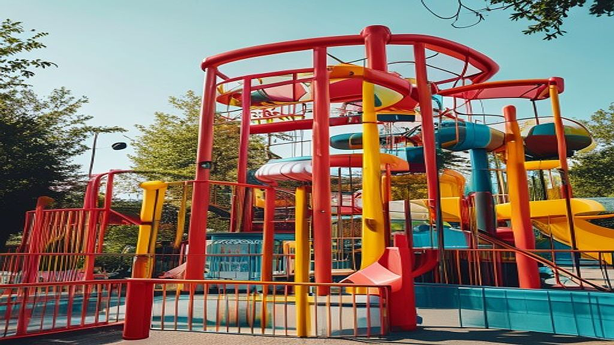

## 어른들의 놀이터, 테마파크와 음악 페스티벌의 결합

페스티벌과 테마파크가 결합된 공간 경험은 단순한 관람을 넘어, 우리가 일상에서 잃어버린 '능동적인 놀이'를 되찾아주는 결정적인 장치가 됩니다. 퇴근 후 스마트폰 화면 속 숏폼 영상에 갇혀 지내는 당신에게, 이 공간들은 단순히 음악을 듣는 곳이 아니라 나의 취향을 물리적인 공간에서 직접 증명하는 놀이터가 됩니다. 하지만 막상 티켓을 예매하고 현장에 도착하면, 쏟아지는 자극 속에서 무엇을 먼저 경험해야 할지 몰라 우왕좌왕하다 체력만 소진하고 돌아오는 경우가 많습니다. 특히 매년 늘어나는 복합 문화 공간들은 저마다 '인생샷'과 '몰입형 콘텐츠'를 내세우며 소비자를 유혹하지만, 정작 자신의 취향과 체력에 맞지 않는 공간을 선택하면 즐거움은커녕 고비용 저효율의 경험이 될 뿐입니다. 이제는 단순히 유명한 라인업만 쫓는 시대는 지났습니다. 공간이 제공하는 서사와 나의 소비 성향을 어떻게 맞물릴지 고민해야 할 때입니다. 이 글에서는 음악과 놀이기구, 그리고 브랜드가 뒤섞인 복합 공간에서 당신의 취향을 온전히 지키며 능동적인 경험을 설계하는 방법을 구체적으로 다룹니다.

## 공간의 서사를 읽는 법: 브랜드가 메시지를 심는 방식

브랜드가 페스티벌이나 테마파크에 팝업 부스나 체험 존을 설치할 때, 그들이 가장 공을 들이는 지점은 '음악과 놀이의 연결고리'입니다. 단순히 로고를 크게 박아두는 시대는 끝났습니다. 이제 브랜드는 관객이 놀이기구를 타거나 음악을 듣는 행위 자체에 자신들의 브랜드 철학을 녹여냅니다. 예를 들어, 특정 음료 브랜드가 페스티벌에서 운영하는 '뮤직 큐레이션 라운지'는 단순히 휴식을 제공하는 곳이 아닙니다. 관객이 직접 자신의 취향을 선택하면 그에 맞는 음료와 음악을 매칭해주는 방식으로, '나를 알아주는 브랜드'라는 메시지를 심습니다.

여기서 우리가 주목해야 할 점은, 브랜드가 설계한 '경험의 흐름'을 얼마나 능동적으로 이용할 것인가입니다. 실패하는 케이스는 대개 브랜드가 제공하는 굿즈를 얻기 위해 줄을 서거나, 남들이 찍는 포토존에서 똑같은 사진을 찍는 데 급급한 경우입니다. 이는 놀러 간 것이 아니라 브랜드의 마케팅 데이터를 위한 노동을 하고 오는 셈입니다. 반면, 성공적인 경험을 하는 사람은 '내가 이 공간에서 무엇을 얻고 싶은가'를 명확히 합니다. 음악을 깊이 즐기고 싶은지, 아니면 새로운 공간의 시각적 자극을 경험하고 싶은지 기준을 세워야 합니다.

선택 기준은 간단합니다. 브랜드 체험 존에 줄을 서기 전, '이 경험이 나의 음악적 취향을 확장해주거나, 나라는 사람을 표현하는 데 도움이 되는가'를 스스로 물어보세요. 만약 단순히 사은품을 받기 위한 줄이라면 과감히 포기하고 무대 앞의 밀도를 높이는 것이 훨씬 생산적인 선택입니다. 브랜드는 당신의 시간을 돈으로 바꾸려 하지만, 당신은 그 시간을 통해 자신의 취향을 정교하게 다듬어야 합니다.

## 실전 체크리스트: 체력과 예산을 지키는 공간 활용법

복합 문화 공간에 갈 때 가장 흔히 하는 실수는 모든 것을 다 하려다 아무것도 제대로 즐기지 못하는 것입니다. 특히 페스티벌과 테마파크가 결합된 경우, 이동 동선이 길어지기 때문에 체력 안배가 핵심입니다. 다음은 현장에서 후회 없는 선택을 하기 위한 실전 체크리스트입니다.

첫째, '골든 타임'을 설정하세요. 자신이 가장 보고 싶은 아티스트의 공연 시간 전후 2시간은 다른 체험을 완전히 배제해야 합니다. 페스티벌의 핵심은 음악이며, 브랜드 부스는 음악을 즐기기 전후의 에피타이저일 뿐입니다. 둘째, '브랜드의 진정성'을 확인하세요. 단순히 예쁜 부스보다는, 페스티벌의 테마와 브랜드가 얼마나 유기적으로 연결되어 있는지 파악해야 합니다. 예를 들어, 친환경을 강조하는 페스티벌에서 다회용기를 활용한 굿즈를 제공하는 브랜드와, 무분별한 플라스틱 굿즈를 뿌리는 브랜드 중 어디에 시간을 쓸지 결정하는 것만으로도 경험의 질이 달라집니다.

실수하기 쉬운 부분은 '동행자의 취향에 맞추는 것'입니다. 4인 기준의 그룹이라면, 이동 동선과 체험 우선순위를 미리 조율하지 않을 경우 현장에서 반드시 갈등이 발생합니다. 서로의 취향이 다르다면, 공연장 내에서 2시간 단위로 흩어졌다 다시 모이는 '개별 경험'을 적극 권장합니다. 억지로 함께 다니며 서로의 흥미를 저해하는 것보다, 각자의 경험을 공유할 때 만족도가 훨씬 높습니다.

체크리스트는 다음과 같습니다:
- 이번 방문의 주 목적은 무엇인가? (음악 감상 vs 공간 경험 vs 사교)
- 가장 보고 싶은 아티스트의 공연 시간은 언제인가?
- 브랜드 체험 부스 중, 나의 평소 취향과 일치하는 곳은 어디인가? (사은품 여부보다 브랜드 철학 확인)
- 비상시 만날 장소와 시간을 미리 정했는가?

## 능동적 놀이 경험을 위한 마케팅적 시선

마케팅의 관점에서 페스티벌과 테마파크의 결합은 '경험 마케팅의 정점'입니다. 브랜드는 관객을 단순한 소비자가 아닌 '콘텐츠의 공동 창조자'로 대우합니다. 관객이 SNS에 올리는 사진, 영상, 후기가 곧 그 브랜드의 가장 강력한 마케팅 자산이 되기 때문입니다. 독자인 당신이 이런 공간을 소비할 때, 역으로 이 마케팅 구조를 활용해 보세요. 

예를 들어, 공간 내에서 브랜드가 진행하는 참여형 이벤트에 참여할 때는 단순히 수동적으로 따르지 말고, 나만의 방식으로 해석해 보세요. 사진을 찍더라도 브랜드가 의도한 구도가 아니라, 나만의 관점과 소품을 활용해 촬영하는 식입니다. 이는 브랜드가 제공하는 놀이판 위에서 나만의 놀이를 만드는 과정입니다. 브랜드는 당신의 독창적인 콘텐츠를 좋아하고, 당신은 그 과정에서 브랜드가 제공하는 혜택을 누리며 서로 윈윈하는 구조를 만드는 것입니다.

실패하는 경우는 브랜드가 시키는 대로만 행동하는 '마케팅의 피동적 소비'에 머무는 것입니다. 반대로 성공하는 경우는 브랜드가 제공하는 틀을 활용하되, 그 안에 나만의 취향을 섞어 넣는 '능동적 재해석'을 하는 경우입니다. 브랜드가 무엇을 주는지보다, 내가 그 브랜드의 공간을 어떻게 활용할 것인지 고민하는 것이 마케팅적 시선에서의 핵심입니다.

결론적으로, 음악과 놀이기구가 결합된 공간은 당신의 취향을 테스트하기에 가장 좋은 실험실입니다. 남들이 가는 곳, 남들이 하는 경험을 따라가는 것은 쉽지만, 그만큼 금방 휘발됩니다. 자신만의 우선순위를 정하고, 브랜드의 마케팅을 나의 놀이 도구로 활용하며, 무엇보다 자신의 체력과 취향을 중심에 두는 전략이 필요합니다. 이제 페스티벌에 갈 때는 단순히 티켓만 들고 가지 마세요. '나는 오늘 이 공간에서 무엇을 얻고, 어떻게 기록할 것인가'에 대한 나만의 가설을 세우고 현장에 뛰어들어 보세요. 그 작은 차이가 당신의 주말을 단순한 시간 낭비에서 취향이 짙게 밴 인생 경험으로 바꿀 것입니다. 지금 바로 스마트폰의 메모장을 켜고, 다가올 페스티벌에서 당신이 반드시 지키고 싶은 '취향의 원칙' 세 가지만 적어보시길 권합니다. 그것이 당신만의 놀이를 시작하는 첫걸음이 될 것입니다.

## 마치며

결국 테마파크와 음악 페스티벌이 결합된 공간은 단순한 유흥의 장소를 넘어, 여러분의 취향을 밀도 있게 실험할 수 있는 최적의 무대입니다. 남들의 시선을 쫓는 소비에서 벗어나, 브랜드가 마련한 장치를 자신만의 놀이 도구로 적극 활용해 보세요. 무엇을 얻고 어떻게 기록할지 스스로 질문을 던질 때, 그곳에서의 경험은 휘발되지 않고 당신의 삶에 깊은 자취를 남기게 될 것입니다.

이제 페스티벌을 즐기는 방식을 조금 바꿔보면 어떨까요? 지금 바로 스마트폰 메모장을 열어 이번 주말, 당신이 반드시 지키고 싶은 '취향의 원칙' 세 가지를 적어보세요. 거창할 필요는 없습니다. 좋아하는 아티스트의 공연에 온전히 집중하기, 혹은 새로운 브랜드의 팝업 스토어에서 나만의 기록 남기기처럼 소소한 다짐이면 충분합니다. 

그 작은 가설 하나가 여러분의 주말을 단순한 시간 낭비가 아닌, 취향이 짙게 밴 특별한 인생 경험으로 바꾸어 줄 것입니다. 여러분만의 놀이터에서, 가장 나다운 모습으로 마음껏 뛰어놀 준비 되셨나요? 오늘부터 시작될 여러분의 즐거운 도전을 응원합니다!
