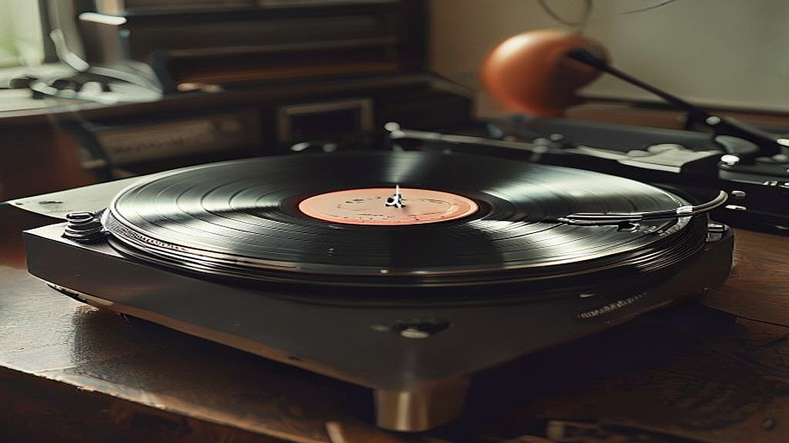

AI 작곡 시대, 왜 우리는 여전히 90년대 아날로그 LP를 찾는가?

생성형 AI가 30초 만에 완벽한 코드 진행과 세련된 편곡을 뽑아내는 AI 작곡 시대에 살고 있는 우리는 역설적으로 가장 불편한 매체인 90년대 아날로그 LP를 다시 찾고 있습니다. 스마트폰 터치 한 번이면 전 세계 거의 모든 음악을 무료에 가깝게 들을 수 있는 시대에, 왜 굳이 먼지를 털어내고 바늘을 올리는 번거로움을 자처하는 것일까요? 이는 단순한 복고풍 유행이나 힙한 취미를 넘어선 일종의 디지털 디톡스이자, 알고리즘이 지배하는 음악 소비 방식에 대한 조용한 저항이기도 합니다. 저는 오늘 음악 칼럼니스트로서 스트리밍 서비스의 무한한 목록이 주는 피로감을 해소하고, 다시 음악 본연의 가치에 집중할 수 있는 실무적인 LP 입문 가이드와 아날로그 감상의 본질을 전해드리고자 합니다.

## 스트리밍 피로감을 이기는 아날로그의 물리적 실체와 소유의 감각

우리가 스트리밍 서비스에서 느끼는 가장 큰 피로감은 선택지가 너무 많다는 점입니다. 수천만 곡의 바다에서 알고리즘이 추천해주는 곡을 수동적으로 넘기다 보면, 정작 내가 어떤 음악을 좋아하는지 잊어버리게 됩니다. 이때 90년대 아날로그 LP는 물리적인 실체를 통해 음악에 무게감을 부여합니다. 12인치 크기의 커다란 앨범 재킷을 손에 쥐고 가사집을 읽는 행위는 디지털 데이터가 줄 수 없는 시각적, 촉각적 만족감을 줍니다. 특히 90년대는 한국 가요계의 황금기로 불리며 발라드, 댄스, 록 등 다양한 장르가 LP와 CD로 동시에 발매되던 과도기적 시기였기에, 당시의 음반들은 제작자의 의도가 가장 밀도 있게 담겨 있습니다.

구체적인 예시로, 90년대 초반 발매된 유재하 혹은 빛과 소금 같은 아티스트의 LP를 감상한다고 가정해 봅시다. 스트리밍으로 들을 때는 배경음악처럼 흘러갔던 베이스 라인이 LP 특유의 따뜻하고 두툼한 질감을 통해 귀에 꽂히는 경험을 할 수 있습니다. 이는 단순히 기분 탓이 아닙니다. 디지털 음원이 가청 주파수 외의 영역을 깎아내어 용량을 줄이는 압축 방식을 택한다면, 아날로그 LP는 소리의 파동을 물리적으로 새겨 넣었기에 소리의 잔향과 공기감이 훨씬 풍부하게 살아있기 때문입니다.

실패 케이스를 하나 짚어보자면, 단순히 예쁘다는 이유로 저가의 일체형 가방 모양 턴테이블을 구매하는 경우입니다. 이런 기기들은 바늘의 압력 조절이 불가능해 소중한 90년대 희귀반의 소리골을 깎아 먹을 위험이 큽니다. 제대로 된 음악 감상을 시작하고 싶다면, 최소한 침압 조절이 가능하고 포노 앰프가 내장된 입문용 브랜드의 개별 모델을 선택하는 것이 기준이 되어야 합니다. 공간이 협소한 원룸이라 하더라도 스피커와 턴테이블을 분리 배치하는 것만으로도 소리의 해상도가 비약적으로 상승합니다.

## AI가 흉내 낼 수 없는 불완전함의 미학과 90년대 사운드의 복원

AI 음악은 완벽합니다. 박자는 칼같이 정확하고 음정은 한 치의 오차도 없습니다. 하지만 인간은 때로 그 완벽함에서 권태를 느낍니다. 우리가 90년대 LP를 찾는 이유는 그 안에 담긴 인간적인 불완전함 때문입니다. 녹음실의 공기 소리, 연주자의 미세한 숨소리, 그리고 세월이 흘러 LP 표면에 생긴 아주 작은 스크래치가 내는 지직거리는 노이즈는 그 자체로 하나의 서사가 됩니다. AI가 생성한 로파이(Lo-fi) 비트가 이 느낌을 인위적으로 흉내 내지만, 실제 30년 된 음반이 내는 우연의 소리를 대체할 수는 없습니다.

선택 기준을 정할 때 가장 중요한 것은 음반의 상태 등급입니다. 90년대 중고 LP를 구매할 때는 자켓의 보존 상태보다 알판(Vinyl)의 상태를 우선시해야 합니다. 육안으로 보았을 때 깊은 스크래치가 없고 광택이 살아있는 NM(Near Mint) 혹은 EX(Excellent) 등급을 선택하는 것이 정신 건강에 이롭습니다. 소리가 튈 정도로 손상된 판을 아날로그 감성이라며 참아내는 것은 감상이 아니라 고역이기 때문입니다.

실전 팁을 드리자면, 90년대 가요 LP는 당시 발매량이 적어 희소성이 높으므로 무턱대고 비싼 초판을 고집하기보다 최근 리마스터링되어 재발매된 180g 중량반을 노리는 것도 좋은 전략입니다. 재발매반은 노이즈가 적고 소리가 깔끔하여 현대적인 오디오 장비와도 궁합이 잘 맞습니다. 반면, 오리지널의 거칠고 야생적인 사운드를 즐기고 싶다면 상태가 좋은 중고 매장을 직접 방문하여 청음 후 구매하는 절차를 권장합니다. 온라인 중고 거래에서 상태 확인 없이 덜컥 고가의 음반을 샀다가 잡음 때문에 실망하는 것이 입문자들이 가장 흔히 겪는 실패 사례입니다.

## 실패 없는 LP 입문을 위한 실전 체크리스트와 장비 구성 가이드

이제 막 아날로그의 세계에 발을 들이려는 분들을 위해, 예산 50만 원 내외에서 시작할 수 있는 구체적인 가이드를 제안합니다. 이 금액대는 너무 저렴해서 음반을 망가뜨리지 않으면서도, 하이엔드 오디오의 늪에 빠지기 전 아날로그의 맛을 충분히 느낄 수 있는 합리적인 기준점입니다.

첫째, 턴테이블 선택입니다. 입문자에게는 벨트 드라이브 방식보다는 속도가 일정하고 관리가 편한 다이렉트 드라이브 혹은 자동 정지 기능이 있는 입문형 모델이 적합합니다. 바늘(카트리지) 교체가 용이한지도 확인해야 합니다. 나중에 실력이 붙었을 때 바늘만 업그레이드해도 소리의 성향을 완전히 바꿀 수 있기 때문입니다.

둘째, 유지 관리 도구입니다. LP는 정전기와 먼지에 취약합니다. 판을 올리기 전 먼지를 털어내는 카본 브러시와 바늘 끝의 먼지를 제거하는 스타일러스 클리너는 선택이 아닌 필수 준비물입니다. 이 두 가지만 갖춰도 음반 수명을 두 배 이상 늘릴 수 있습니다.

셋째, 감상 환경 조성입니다. 턴테이블은 진동에 매우 예민합니다. 가급적 흔들림이 없는 단단한 수납장 위에 수평을 맞춰 설치하세요. 스피커를 턴테이블과 같은 선반에 두면 소리의 진동이 다시 바늘로 전달되어 웅웅거리는 하울링 현상이 발생할 수 있으니, 아주 작은 방이라 하더라도 스피커 밑에 진동 방지 패드를 깔아주는 디테일이 필요합니다.

핵심 기준 체크리스트:
- 턴테이블에 침압 조절용 무게추(Counterweight)가 있는가?
- 포노 EQ가 내장되어 있어 별도의 앰프 없이 스피커 연결이 가능한가?
- 중고 LP 구매 시 알판에 손톱에 걸릴 정도의 깊은 상처가 없는가?
- 음반을 수직으로 세워서 보관할 수 있는 전용 랙이 있는가?

이러한 준비 과정 자체가 음악을 대하는 태도를 바꿉니다. 스트리밍이 편의점 도시락이라면, LP 감상은 직접 재료를 손질하고 불 조절을 하며 정성껏 차려낸 집밥과 같습니다. 과정이 번거로울수록 결과물에 대한 애착은 깊어집니다.

## 디지털 디톡스로서의 음악 감상, 이제는 귀를 쉴 수 있게 해주세요

AI 작곡 기술이 발전할수록 우리는 더 빠르고 자극적인 음악에 노출될 것입니다. 하지만 인간의 뇌는 끊임없이 쏟아지는 정보의 홍수 속에서 휴식을 원합니다. 90년대 아날로그 LP를 찾는 행위는 단순히 과거에 대한 향수가 아니라, 현재의 나를 지키기 위한 적극적인 선택입니다. 음악 한 곡을 듣기 위해 자리에 앉아 20분 동안 한 면을 온전히 책임지는 그 시간만큼은 스마트폰 알람에서 자유로워질 수 있습니다.

만약 여러분이 지금 스트리밍 리스트를 넘기다가 무엇을 들을지 몰라 다시 앱을 닫는 경험을 반복하고 있다면, 이번 주말에는 근처의 레코드숍을 방문해 보세요. 90년대 명반 중 재킷 디자인이 마음에 드는 것을 딱 한 장만 골라보는 것입니다. 그 음반이 여러분의 공간에서 처음 바늘과 만나는 순간, AI가 계산해낼 수 없는 오직 당신만을 위한 공진이 시작될 것입니다.

음악은 이제 소유하는 것이 아니라 소비하는 것이라고들 말합니다. 하지만 저는 여전히 믿습니다. 내 손때가 묻은 음반, 내가 직접 닦아낸 먼지, 그리고 그 모든 과정을 거쳐 흘러나오는 90년대의 따뜻한 사운드가 우리 삶을 훨씬 더 풍요롭게 만든다는 사실을요. 아날로그는 구식이 아니라, 가장 인간다운 방식으로 음악을 사랑하는 방법입니다. 지금 당장 방 한구석에 작은 턴테이블을 놓을 자리를 만들어보시길 바랍니다. 그 좁은 공간이 당신의 복잡한 머릿속을 비워줄 가장 넓은 휴식처가 되어줄 것입니다.

## 마치며

AI가 음악을 작곡하고 알고리즘이 우리의 취향을 대신 결정해 주는 편리한 세상입니다. 하지만 우리가 여전히 90년대의 낡은 LP를 고집하는 이유는, 음악을 단순히 '듣는 것'을 넘어 '경험하는 것'의 소중함을 알고 있기 때문입니다. 손끝에 닿는 묵직한 재킷의 질감과 바늘이 레코드판 위를 긁으며 내는 특유의 따뜻한 소음은, 무한한 스트리밍 목록이 결코 채워줄 수 없는 정서적 풍요로움을 우리에게 선물합니다.

이제는 스마트폰 화면 속의 차가운 재생 버튼 대신, 직접 음반을 고르고 먼지를 닦아내며 바늘을 올리는 기분 좋은 수고로움을 선택해 보시길 권합니다. 이번 주말, 근처의 레코드숍을 방문해 여러분의 마음을 움직이는 90년대 명반 한 장을 품에 안아보세요. 그 작은 행동 하나가 복잡했던 당신의 일상을 잠시 멈추게 하고, 오직 당신만을 위한 깊은 휴식의 시간을 만들어줄 것입니다.

음악을 소유한다는 것은 단순히 물건을 갖는 것이 아니라, 그 음악이 흐르는 시간과 공간을 나의 것으로 만드는 일입니다. 아날로그가 전하는 그 투박하지만 진실한 온기가 여러분의 지친 마음을 포근하게 감싸 안아주기를 진심으로 바랍니다. 여러분의 방 한구석에서 시작될 새로운 공진이 일상의 작은 행복이 되길 응원하며, 오늘도 좋아하는 음악과 함께 따뜻하고 평온한 하루 보내시길 바랍니다.
