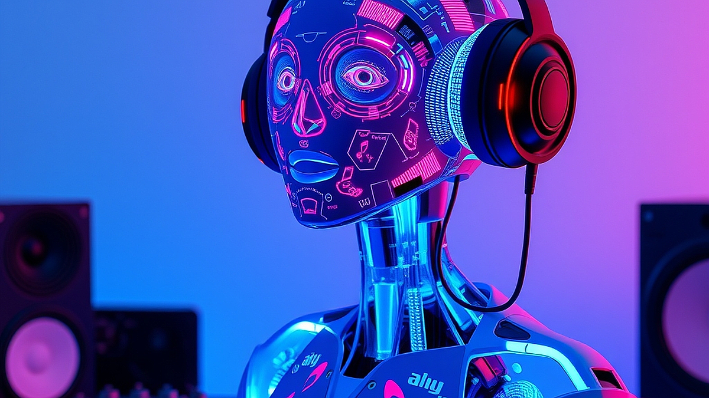

# AI 작곡 툴로 만든 '나만의 플레이리스트', 저작권과 감성의 경계선

AI 음악 기술이 일상에 스며들면서, 이제 누구나 클릭 몇 번으로 자신만의 플레이리스트를 생성하는 시대가 열렸습니다. 단순히 기존 곡을 큐레이션하는 수준을 넘어, 특정 분위기와 악기 구성, 심지어는 특정 아티스트의 향수를 자극하는 곡까지 AI가 뚝딱 만들어내는 상황입니다. 하지만 이 편리함 뒤에는 창작의 주체가 누구인가라는 묵직한 질문과, 저작권이라는 현실적인 벽, 그리고 인간만이 가질 수 있는 '감성'의 실체에 대한 의문이 뒤따릅니다. 오늘 이 글에서는 기술의 발전 속에서 우리가 음악을 소비하는 방식이 어떻게 변하고 있는지, 그리고 AI 생성 음악을 내 취향의 영역으로 받아들일 때 고려해야 할 실질적인 지점들을 짚어보고자 합니다. 단순히 기술을 찬양하거나 비판하는 것이 아니라, 당신이 오늘 밤 당장 나만의 플레이리스트를 편집할 때 어떤 기준을 가져야 할지 고민해 보겠습니다.

## AI 음악, 내 취향의 도구인가 대체재인가

AI 작곡 툴을 사용하는 가장 큰 이유는 '즉각적인 개인화'입니다. 퇴근길 지하철에서 '비 오는 날의 재즈풍 로파이 비트'를 검색하고 수십 분을 헤매는 대신, 툴에 입력값만 넣으면 그 순간 내 상황에 딱 맞는 음악이 생성됩니다. 이때 중요한 선택 기준은 '완성도'가 아니라 '맥락의 일치'입니다. 하지만 여기서 발생하는 첫 번째 문제는 감성의 대체 가능성입니다. 인간 아티스트가 자신의 삶을 녹여내며 선택한 화음과 리듬에는 서사가 담겨 있습니다. 반면 AI는 확률적 데이터의 조합으로 결과물을 내놓습니다.

실패 사례를 하나 들어보겠습니다. 많은 사용자가 특정 아티스트의 화법을 모방하도록 AI에 명령을 내립니다. 결과물은 그럴듯하게 들리지만, 반복해서 듣다 보면 어딘가 공허함을 느낍니다. 이는 의도된 불협화음이나 박자의 미묘한 밀당 같은 '인간적 실수'가 결여되어 있기 때문입니다. 

선택 기준은 명확합니다. 당신이 음악을 배경음(BGM)으로 소비한다면 AI는 훌륭한 도구입니다. 하지만 음악을 통해 타인의 내면을 공감하거나 서사를 읽고 싶다면, AI 음악은 영원히 보조적인 역할에 머물러야 합니다. 

*   **선택 기준:** 음악의 용도가 명확한가? (공부용 집중음악, 영상 배경음 등)
*   **비선택 기준:** 음악을 통해 아티스트의 철학이나 인생의 굴곡을 찾으려 하는가?

## 저작권의 회색 지대와 창작 주체의 모호함

AI 생성 음악에서 가장 골치 아픈 점은 저작권입니다. 현재 대부분의 AI 작곡 서비스는 생성된 결과물에 대한 소유권을 사용자에게 부여한다고 약관에 명시합니다. 하지만 그 기반이 된 데이터셋, 즉 수많은 인간 아티스트의 원곡에 대한 권리는 여전히 논란의 중심에 있습니다. 

실제 사례로, 개인 SNS에 AI가 만든 곡을 올렸을 때 저작권 필터링 시스템에 걸려 영상이 삭제되는 경우가 빈번합니다. AI가 학습한 특정 곡의 멜로디 라인이나 악기 배치가 우연히 기존 저작물과 겹치기 때문입니다. 여기서 당신이 주의해야 할 점은 '독창성'에 대한 증명입니다. AI 툴을 사용해 곡을 만들었다고 해서 그 곡이 저작권으로부터 자유로운 '무결점 곡'은 아니라는 점을 인지해야 합니다.

실수하기 쉬운 부분은 AI 툴의 '무료 버전'을 사용할 때입니다. 상업적 이용이 불가한 경우가 많음에도 이를 간과하고 홍보 영상이나 수익 창출 채널에 사용했다가 법적 분쟁의 빌미를 제공할 수 있습니다.

**실전 체크리스트:**
1. 사용 중인 AI 툴의 약관 확인: 상업적 이용 가능 여부와 크레딧 표기 의무 확인.
2. 결과물 검증: 생성된 곡이 기존 히트곡과 유사한 마디 구조를 갖는지 확인(유사도 검사 툴 활용).
3. 보관 방식: AI가 생성한 프롬프트(명령어) 자체를 기록해두어 추후 창작의 근거를 마련할 것.

## 감성 소비의 새로운 기준, '인간적 개입'의 정도

AI가 만든 음악이 인간의 감성을 대체할 수 없는 이유는 '기억의 부재' 때문입니다. 음악은 시간의 예술이고, 특정 시점의 감정을 기억하게 하는 매개체입니다. AI는 사용자가 원하는 분위기를 만들어줄 순 있지만, 당신이 그 음악을 들으며 느꼈던 첫사랑의 기억이나 좌절의 순간을 공유하지는 못합니다. 

그렇다면 우리는 어떻게 AI 음악을 향유해야 할까요? 핵심은 '인간적 개입'에 있습니다. 단순히 AI가 뱉어낸 결과물을 그대로 듣는 것이 아니라, 이를 편집하고, 다른 인간의 음악과 섞고, 나만의 스토리텔링을 입히는 행위가 필요합니다. 

예를 들어, AI로 만든 연주곡을 기본 베이스로 깔고 그 위에 당신이 직접 녹음한 일상의 소음이나 짧은 독백을 얹어보세요. 이렇게 되면 그 결과물은 단순한 AI 생성물이 아니라, 당신과 AI가 협업한 '개인적 기록물'이 됩니다. 

*   **실전 방법:** 
    *   1단계: AI 툴로 분위기에 맞는 루프 생성.
    *   2단계: DAW(디지털 오디오 워크스테이션)를 활용해 특정 구간에 직접 녹음한 악기나 효과음 삽입.
    *   3단계: 큐레이션 과정에서 인간의 곡과 AI 곡을 교차 배치하여 서사 만들기.

이렇게 하면 AI의 차가운 데이터 산물에 인간의 온기가 섞이게 됩니다. 기술은 도구일 뿐, 감성의 주체는 여전히 당신이라는 사실을 잊지 마세요.

결론적으로, AI 작곡 툴은 음악을 소비하는 방식을 확장해 줄 뿐, 인간의 예술적 본질을 대체할 수는 없습니다. 중요한 것은 기술을 맹목적으로 추종하거나 무조건 배척하는 것이 아니라, AI가 만든 음악에 나만의 맥락과 경험을 더해 '진짜 내 취향'으로 다듬어 나가는 과정입니다. 

오늘 당장 당신의 플레이리스트를 살펴보세요. AI가 생성한 곡이 있다면, 그 곡이 왜 그 자리에 있어야 하는지 스스로에게 물어보시기 바랍니다. 만약 그 답이 단순히 '편해서'라면, 그 곡 위에 당신만의 작은 편집을 한 번 더해보세요. 음악은 듣는 것에서 그치지 않고, 당신의 삶을 어떻게 구성하느냐에 따라 그 가치가 결정됩니다. 기술의 편리함을 누리되, 감성의 주도권을 잃지 않는 건강한 음악 생활을 이어가시길 바랍니다.

## 마치며

AI 작곡 툴은 음악을 즐기는 새로운 방식을 제시하지만, 결국 음악의 가치를 완성하는 것은 기술이 아닌 당신의 경험과 맥락입니다. AI가 만든 차가운 데이터에 여러분만의 고유한 감성과 서사를 더할 때, 비로소 그 곡은 단순한 알고리즘의 산물이 아닌 '나만의 플레이리스트'라는 특별한 작품으로 거듭납니다.

기술을 무조건 배척하거나 맹목적으로 따르기보다, 그 편리함을 영리하게 활용하며 감성의 주도권을 잃지 않는 것이 무엇보다 중요합니다. 오늘 여러분의 플레이리스트를 다시 한번 찬찬히 살펴보세요. AI가 추천하거나 생성한 곡에 나만의 추억이나 특별한 의미를 한 스푼 더해 보는 건 어떨까요? 음악은 듣는 행위를 넘어, 당신의 삶을 어떻게 구성하느냐에 따라 그 깊이가 달라집니다. 기술과 감성이 조화롭게 어우러진, 당신만의 소중한 음악 세계를 지금 바로 완성해 보시길 바랍니다.
