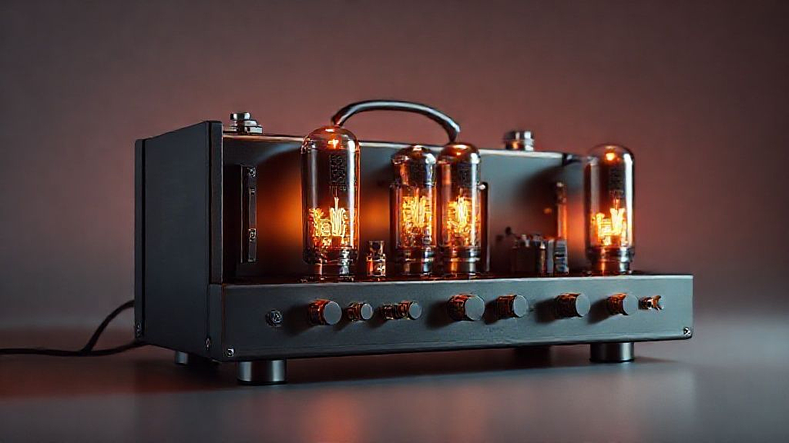

안녕하세요, 음악이라면 사족을 못 쓰는 라이브 공연 애호가 여러분! 오늘은 음악을 사랑하는 우리에게 절대 빼놓을 수 없는, 어쩌면 가장 중요하지만 때로는 그 존재감을 잊기 쉬운 존재, 바로 **앰프**에 대해 이야기해보려고 해요. 우리가 듣는 모든 음악, 특히 라이브 현장에서 심장을 울리는 그 웅장한 사운드 뒤에는 언제나 앰프의 묵묵한 활약이 숨어있죠. 저는 마치 숨 쉬는 것처럼 공연장을 드나들고, 다양한 장르의 음악을 탐닉하면서 앰프가 단순히 소리를 키우는 기계를 넘어, 음악에 영혼을 불어넣는 마법 같은 존재라는 것을 깨달았습니다. 처음에는 그저 기타리스트 옆에 놓인 커다란 상자 정도로만 생각했었죠. 하지만 시간이 흐르고 수많은 사운드를 경험하면서, 앰프가 어떻게 음악의 질감과 감성을 완전히 뒤바꿀 수 있는지 직접 몸으로 느끼게 되었습니다.

음악은 제 삶의 가장 깊은 곳을 어루만져 주는 친구이자 위로였고, 특히 라이브 공연의 생생한 에너지는 저를 다시금 일어서게 하는 원동력이 되곤 했습니다. 그 감동의 순간마다, 무대 위 뮤지션의 열정과 고스란히 연결되어 우리에게 전달되는 소리의 '질감'은 바로 앰프의 역할이었습니다. 앰프는 단순히 작은 전기 신호를 증폭시켜 스피커를 통해 들리게 하는 기본적인 기능만을 하는 것이 아닙니다. 그것은 악기의 개성을 극대화하고, 보컬의 미묘한 떨림을 증폭시키며, 때로는 의도적인 왜곡을 통해 새로운 예술적 표현을 창조하는 도구이기도 합니다. 마치 화가가 붓을 고르듯, 뮤지션에게 앰프는 그들의 음악적 메시지를 가장 효과적으로 전달하기 위한 필수적인 선택이 되는 것이죠. 저는 오늘 이 글을 통해 앰프가 선사하는 소리의 마법과 함께, 제 개인적인 경험담, 그리고 2025년 현재의 트렌드까지 아우르며 여러분과 함께 앰프의 매력 속으로 깊이 들어가 보고 싶습니다.

## 앰프, 단순한 소리 증폭기를 넘어선 예술의 도구

앰프를 처음 접했을 때, 저는 그저 소리를 '크게' 만드는 기계라고만 생각했습니다. 하지만 다양한 공연장을 다니고, 스튜디오 세션을 엿보며, 그리고 직접 악기를 만져보면서 앰프가 단순한 볼륨 조절기를 넘어선다는 것을 깨달았죠. 앰프는 악기나 마이크에서 나오는 아주 미세한 전기 신호를 우리가 들을 수 있는 강력한 소리 에너지로 변환하는 장치입니다. 이 과정에서 앰프의 종류와 설계 방식에 따라 소리의 **색깔**, **질감**, **다이내믹스**가 완전히 달라집니다. 마치 같은 재료로도 요리사의 손맛에 따라 전혀 다른 음식이 나오듯이 말이죠.

제가 처음 진정한 앰프의 마법을 경험했던 건, 몇 년 전 홍대 인근의 작은 재즈 클럽에서였습니다. 낡았지만 깊은 울림을 자랑하는 빈티지 진공관 앰프를 통해 흘러나오는 기타 사운드는 제 귀를 완전히 사로잡았어요. 그 전까지는 솔리드 스테이트 앰프의 깔끔하고 명료한 소리에 익숙해져 있었는데, 진공관 앰프 특유의 따뜻하고 풍성하며, 미묘하게 오버드라이브되는 그 소리는 마치 오랜 친구의 포옹처럼 저에게 다가왔습니다. 기타리스트의 손가락 움직임 하나하나가 소리의 질감으로 완벽하게 표현되면서, "아, 이 곡 들으면서 정말 위로받았어요"라는 말이 절로 나왔죠. 그 소리는 단순히 크기만 한 것이 아니라, 살아 숨 쉬는 듯한 유기적인 에너지를 가지고 있었습니다. 진공관 앰프는 높은 볼륨에서 자연스럽게 따뜻하고 부드러운 디스토션을 만들어내는데, 이 특유의 배음은 록, 블루스, 재즈 등 다양한 장르에서 그야말로 '명불허전'의 사운드를 만들어냅니다. 녹음 스튜디오에서 엔지니어들이 수억 원을 호가하는 진공관 마이크 프리앰프를 고집하는 이유도 바로 여기에 있습니다. 악기나 보컬의 미묘한 뉘앙스를 손실 없이 포착하고, 아날로그 특유의 따뜻함을 더해 주기 때문이죠.

물론 솔리드 스테이트 앰프도 그만의 매력이 분명합니다. 트랜지스터를 기반으로 하는 솔리드 스테이트 앰프는 진공관 앰프에 비해 훨씬 **견고하고 유지보수가 용이하며, 가격도 합리적**입니다. 무엇보다 **클린 톤이 매우 명료하고 정확하며, 높은 헤드룸을 제공**하여 다양한 페달 이펙터를 사용하기에 최적의 환경을 제공합니다. 제가 처음 밴드를 시작했을 때, 예산 문제로 솔리드 스테이트 앰프를 구입했는데, 그 앰프 덕분에 다양한 이펙터 조합을 시도하며 저만의 사운드를 찾아가는 재미를 느낄 수 있었죠. 특히 메탈이나 현대적인 팝 장르에서는 솔리드 스테이트 앰프의 날카롭고 단단한 사운드가 곡의 에너지를 폭발시키는 데 큰 역할을 합니다. 요즘에는 진공관과 솔리드 스테이트의 장점을 결합한 하이브리드 앰프도 많이 출시되어, 두 가지 사운드의 매력을 동시에 즐기려는 뮤지션들에게 인기를 얻고 있습니다. 앰프의 선택은 단순히 장비의 문제가 아니라, 뮤지션이 어떤 음악적 표현을 추구하는지에 대한 깊은 고민의 결과물인 셈이죠.

## 2025년, 앰프 기술의 진화와 라이브 현장의 변화

2025년 현재, 앰프 기술은 과거와는 비교할 수 없을 정도로 놀라운 발전을 거듭하고 있습니다. 특히 **디지털 모델링 앰프**와 **프로파일링 앰프**의 등장은 라이브 현장과 스튜디오 환경 모두에 혁명적인 변화를 가져왔죠. 과거에는 수많은 앰프와 이펙터를 쌓아두고 사용해야만 다양한 사운드를 연출할 수 있었지만, 이제는 이 작은 디지털 기기 하나로 수십, 수백 가지의 전설적인 앰프 사운드를 완벽하게 재현할 수 있게 되었습니다.

몇 년 전, 한 페스티벌에서 제가 좋아하는 밴드의 공연을 보러 갔을 때였습니다. 무대에는 예전처럼 거대한 앰프 스택이 아닌, 작은 디지털 앰프 헤드와 함께 이펙터 보드가 놓여 있었죠. 처음에는 '저 작은 걸로 저런 웅장한 사운드가 나올까?' 하고 의아했지만, 공연이 시작되자마자 제 의심은 감탄으로 바뀌었습니다. 밴드의 기타리스트는 곡마다 전혀 다른 앰프 톤을 자유자재로 넘나들며, 마치 여러 대의 앰프를 동시에 사용하는 듯한 착각을 불러일으켰어요. 클린 톤의 청량함부터 헤비메탈의 육중한 디스토션까지, 모든 사운드가 놀랍도록 생생하고 풍부했습니다. 이 모든 것이 디지털 모델링 기술 덕분이었죠. 이 기술은 실제 앰프의 회로도를 분석하고, 각 부품의 특성과 상호작용까지 정교하게 시뮬레이션하여 오리지널 앰프의 소리를 거의 완벽하게 모방합니다.

특히 **프로파일링 앰프**는 한발 더 나아가, 실제 앰프와 캐비닛, 마이크의 조합으로 만들어진 '특정 사운드' 자체를 캡처하여 저장할 수 있습니다. 예를 들어, 제가 아끼는 빈티지 진공관 앰프와 특정 마이크, 그리고 제가 좋아하는 세팅으로 만들어낸 사운드를 그대로 프로파일링하여 디지털 기기 안에 '복제'해둘 수 있다는 거죠. 그러면 언제 어디서든 그 복제된 사운드를 불러와 사용할 수 있습니다. 이는 뮤지션들에게 엄청난 자유와 유연성을 제공합니다. 투어 중에도 무거운 장비를 들고 다닐 필요 없이, 백업용으로도 완벽한 사운드를 항상 휴대할 수 있게 된 것입니다. 실제로 요즘 많은 톱 아티스트들이 라이브 투어 시 프로파일링 앰프를 활용하여 일관된 고품질 사운드를 유지하고 있습니다. 이는 앨범 녹음 시 사용했던 사운드를 라이브에서도 그대로 재현하여, 팬들이 익숙하게 듣던 그 소리를 현장에서 직접 경험하게 해주는 중요한 역할을 합니다.

또한, **클래스 D 앰프**의 발전도 주목할 만합니다. 클래스 D 앰프는 기존의 아날로그 앰프보다 훨씬 **효율적이고 가벼우며, 적은 전력으로도 강력한 출력을 낼 수 있습니다.** 덕분에 휴대성이 뛰어난 소형 앰프나 베이스 앰프 등에서 활발하게 사용되고 있으며, 점차 고음질 오디오 시스템으로도 확대되는 추세입니다. 앰프의 소형화와 경량화는 라이브 뮤지션들에게 큰 부담을 덜어주었고, 동시에 환경적인 측면에서도 전력 소비를 줄이는 긍정적인 효과를 가져왔습니다. 물론 여전히 아날로그 앰프의 '손맛'과 '숨 쉬는 듯한' 사운드를 고집하는 뮤지션들도 많습니다. 저 역시 그 미묘한 아날로그의 감성을 완전히 포기할 수는 없죠. 하지만 2025년 현재의 기술은 디지털과 아날로그의 간극을 거의 없애버릴 정도로 발전했고, 이제는 어떤 앰프를 선택하든 뮤지션의 음악적 의도를 완벽하게 구현할 수 있는 시대가 되었습니다. 중요한 것은 장비 자체가 아니라, 그 장비를 통해 어떤 음악을 만들어내는가 하는 뮤지션의 창의성이라는 것을 다시 한번 깨닫게 됩니다.

## 나에게 맞는 앰프 찾기: 시행착오와 실전 팁

앰프를 선택하는 과정은 저에게 수많은 시행착오의 연속이었습니다. 처음에는 그저 유명한 브랜드, 혹은 디자인이 멋진 앰프를 덜컥 구매하기도 했죠. 하지만 막상 집에 가져와서 연주해보니 제가 원하는 사운드가 전혀 나오지 않아 실망했던 적이 한두 번이 아닙니다. 그때마다 "아, 역시 장비는 비싼 게 최고인가?" 하는 자괴감에 빠지기도 했었죠. 하지만 돌이켜보면, 그것은 앰프에 대한 이해가 부족했고, 저의 음악적 필요와 앰프의 특성을 제대로 연결하지 못했던 저의 미숙함 때문이었습니다.

가장 큰 실수는 아마도 밴드 연습실에서 사용할 고출력 앰프가 필요한데, 소규모 공연장용으로 적합한 저출력 앰프를 구매했던 경험일 겁니다. 밴드 합주 시 제 기타 소리가 다른 악기 소리에 묻혀버려 스트레스를 받았고, 결국 추가적인 비용을 들여 앰프를 교체해야만 했죠. 그때 저는 앰프를 고를 때 **사용 목적**과 **장르**, 그리고 **예산**을 가장 먼저 고려해야 한다는 값비싼 교훈을 얻었습니다. 집에서 혼자 연습할 용도라면 너무 큰 출력의 앰프는 오히려 불필요하며, 작은 볼륨에서도 좋은 톤을 내주는 미니 앰프나 헤드폰 앰프가 훨씬 효율적입니다. 반대로 밴드 합주나 소규모 공연용이라면 최소 30W 이상의 출력을 가진 앰프가 필요하죠.

앰프 선택에 있어서 중요한 실전 팁은 바로 **'직접 경험'**입니다. 악기점에 방문하여 다양한 앰프를 직접 연주해보세요. 같은 기타라도 어떤 앰프에 연결하느냐에 따라 소리가 천차만별로 달라진다는 것을 느끼실 수 있을 겁니다. 이때 단순히 볼륨을 키우는 것뿐만 아니라, 앰프의 **게인(Gain)**, **EQ (이퀄라이저)**, **마스터 볼륨(Master Volume)** 노브를 조작해보며 소리의 변화를 느껴보는 것이 중요합니다. 게인은 프리앰프 단에서 신호를 얼마나 증폭시킬지 결정하여 사운드의 '드라이브'나 '오버드라이브' 정도를 조절하고, EQ는 저음(Bass), 중음(Middle), 고음(Treble)을 조절하여 소리의 '색깔'을 바꿉니다. 마스터 볼륨은 최종 출력 볼륨을 조절하는 것이죠. 이러한 컨트롤들을 조작해보면서 "아, 이 앰프는 내 기타 소리를 이렇게 바꿔주는구나!" 하고 직관적으로 느끼는 것이 중요합니다.

또한, 앰프와 함께 사용할 **스피커 캐비닛**의 매칭도 간과할 수 없습니다. 앰프 헤드와 캐비닛을 따로 사용하는 경우, 앰프의 출력 임피던스(옴수)와 캐비닛의 임피던스를 반드시 맞춰주어야 합니다. 잘못된 매칭은 앰프에 심각한 손상을 줄 수 있으니 주의해야 하죠. 저도 한때 이 임피던스 매칭을 소홀히 했다가 앰프 수리비로 적지 않은 돈을 날린 아픈 기억이 있습니다. 이제는 앰프를 구매할 때 항상 매뉴얼을 꼼꼼히 읽어보고, 판매자에게 직접 문의하여 확인하는 습관을 들이고 있습니다.

마지막으로, 앰프는 단순히 소리를 내는 장비를 넘어, 뮤지션의 **개성을 담는 캔버스**와도 같습니다. 다양한 이펙터 페달들이 그림의 물감이라면, 앰프는 그 물감들이 펼쳐질 도화지인 셈이죠. 어떤 앰프를 선택하느냐에 따라 페달들의 소리도 전혀 다르게 들릴 수 있습니다. 저 역시 지금은 저에게 딱 맞는 앰프를 찾아 정착했지만, 그 과정에서 수많은 앰프를 경험하며 저만의 소리 취향을 확고히 할 수 있었습니다. 여러분도 저처럼 시행착오를 두려워하지 말고, 다양한 앰프를 탐험하며 여러분의 음악적 여정에 가장 잘 맞는 '영혼의 동반자'를 찾아 나서시기를 진심으로 응원합니다.

앰프는 우리에게 단순히 소리를 전달하는 것을 넘어, 음악의 감동을 극대화하고, 뮤지션의 영혼을 담아내는 중요한 매개체입니다. 진공관 앰프의 따뜻하고 유기적인 울림부터 솔리드 스테이트의 명료함, 그리고 2025년 최신 기술인 디지털 모델링과 프로파일링 앰프의 놀라운 재현력까지, 앰프의 세계는 무궁무진한 매력으로 가득합니다. 제 개인적인 경험과 시행착오를 통해 여러분도 자신에게 맞는 앰프를 찾고, 그 과정에서 얻게 될 새로운 음악적 영감과 소리의 즐거움을 만끽하시기를 바랍니다. 이 글이 여러분의 앰프 탐험에 작은 이정표가 되기를 바라며, 여러분의 음악 생활이 더욱 풍성해지기를 응원합니다.