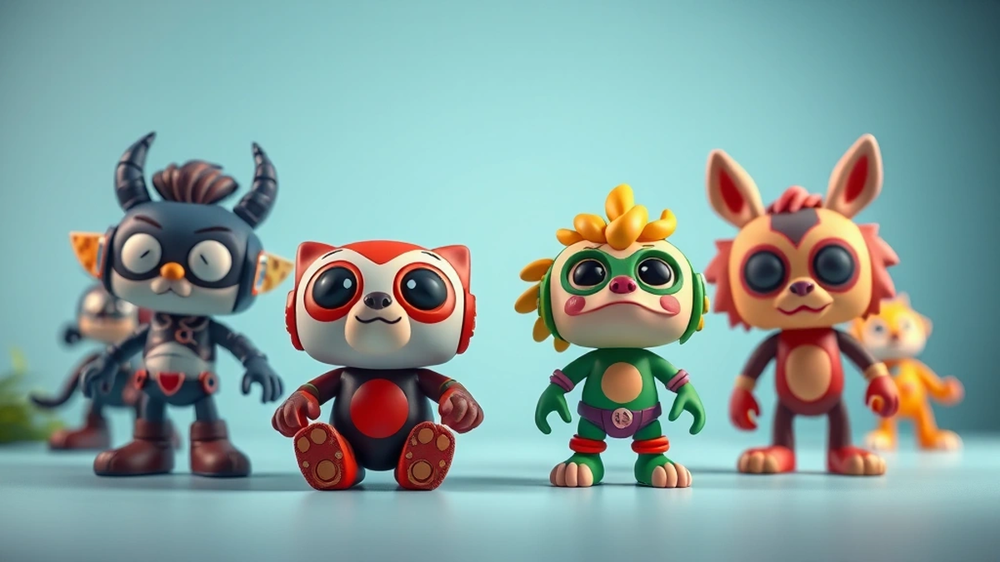

# 아트토이, 어릴 적 꿈을 현실로 만드는 마법 같은 존재들

어릴 적, 우리는 모두 자신만의 보물 지도를 품고 살았죠. 저 역시 그랬습니다. 40대가 된 지금, 제 방 한쪽 벽면을 가득 채운 **아트토이**들을 보고 있자면, 마치 그 시절 보물섬에서 찾아낸 진귀한 보물들을 마주하는 기분이에요. 아트토이는 저에게 단순한 장난감이나 수집품이 아닙니다. 어린 시절의 꿈과 현대 예술의 감각이 절묘하게 어우러진, 감성을 자극하는 작은 예술 작품이자, 바쁜 일상 속에서도 잠시 잊고 지냈던 동심을 일깨워주는 소중한 친구들이죠. 레고나 피규어처럼 정형화된 형태를 넘어, 작가의 독창적인 세계관과 메시지가 담겨 있어서 볼 때마다 새로운 영감과 위로를 받곤 합니다. 처음에는 그저 "아, 이거 진짜 갖고 싶었는데!" 하는 마음으로 하나둘 모으기 시작했지만, 이제는 이 작은 친구들이 제 삶의 한 부분이 되었어요. 때로는 예상치 못한 리셀 가치로 저를 놀라게 하기도 하고, 때로는 오랜 시간 찾아 헤맨 끝에 손에 넣었을 때의 짜릿함으로 일상의 활력을 불어넣어 주기도 합니다. 오늘 이 자리에서는 저 같은 키덜트 수집가들이 왜 아트토이에 열광하는지, 그리고 2025년에는 어떤 아트토이들이 우리의 마음을 사로잡을지, 저의 솔직한 경험과 함께 이야기해보려 합니다.

## 아트토이, 단순한 장난감을 넘어선 예술의 세계

어릴 적 제게 장난감은 상상력의 전부였습니다. 딱딱한 플라스틱 병정 하나만 있어도 온 세상이 전장이 되고, 만화 속 주인공 피규어 하나만 있어도 우주를 넘나드는 모험이 펼쳐졌죠. 시간이 흘러 어른이 된 지금, 그 시절의 순수한 열정은 아트토이라는 새로운 형태로 다시 피어났습니다. 아트토이는 말 그대로 '예술적인 장난감'을 뜻하는데요, 주로 디자이너나 아티스트가 직접 디자인하고 제작하는 한정판 피규어나 오브제를 일컫습니다. 대량 생산되는 일반 장난감과는 다르게, 작가의 개성과 철학이 듬뿍 담겨 있어서 소장 가치가 남다르죠.

제가 아트토이에 처음 눈을 뜬 건 10년도 더 된 일이에요. 당시만 해도 아트토이라는 개념 자체가 생소했는데, 우연히 들른 편집숍에서 독특한 형태의 캐릭터 토이를 보고는 첫눈에 반해버렸습니다. 그 캐릭터는 뭔가 서글프면서도 희망적인 표정을 짓고 있었는데, 제 마음속에 있는 복잡한 감정들을 그대로 표현해 주는 것 같았어요. "아, 이런 것도 있었구나! 어릴 적에 이런 걸 알았더라면 얼마나 좋았을까?" 하는 생각과 함께, 그 자리에서 망설임 없이 구매를 결정했죠. 그 순간부터 제 키덜트 수집 인생의 새로운 장이 열렸습니다. 이후 베어브릭, 큐브릭 같은 유명한 아트토이들을 시작으로, 국내외 다양한 작가들의 개성 넘치는 작품들을 찾아 헤매기 시작했어요.

아트토이의 매력은 그 종류와 소재의 다양성에 있습니다. PVC, ABS 같은 플라스틱부터 시작해서 레진, 나무, 심지어 금속이나 패브릭으로 만들어진 아트토이들도 많아요. 어떤 건 손바닥만 한 크기로 책상 위를 지키고, 어떤 건 사람 키만 한 대형 조형물로 공간을 압도하기도 합니다. 이 모든 것들이 작가들의 무한한 상상력과 만나 저마다의 이야기를 뿜어내죠.

특히 2025년 아트토이 트렌드를 살펴보면, **친환경 소재와 디지털 기술과의 융합**이 더욱 두드러질 것으로 보입니다. 환경 문제에 대한 인식이 높아지면서, 재활용 플라스틱이나 바이오 플라스틱, FSC 인증 목재 등을 사용한 아트토이들이 많이 등장하고 있어요. 단순히 '예쁜 쓰레기'가 아닌, 지속 가능한 가치를 담은 아트토이에 대한 수요가 늘고 있는 거죠. 저는 이런 변화가 정말 반갑게 느껴집니다. 또, NFT(대체 불가능 토큰) 아트토이나 AR(증강현실) 기술을 접목한 아트토이들도 주목받고 있습니다. 실물 아트토이를 구매하면 디지털 아트워크를 함께 소장하거나, 스마트폰으로 비춰보면 토이가 움직이는 듯한 경험을 할 수 있는 거죠. 아직은 초기 단계지만, 디지털 세상에서만 존재하던 아트가 현실로, 현실의 아트가 디지털로 확장되는 경험은 수집의 즐거움을 한층 더 풍부하게 만들 겁니다.

수집가로서 이런 아트토이들을 모으는 즐거움은 이루 말할 수 없습니다. 한정판 아트토이를 구하기 위해 밤새도록 온라인 쇼핑몰을 새로고침 하거나, 주말마다 아트페어를 찾아다니며 발품을 팔 때도 많아요. 그렇게 어렵게 손에 넣은 아트토이를 처음 개봉할 때의 설렘, 그리고 제 수집 공간에 새로운 친구를 들일 때의 뿌듯함은 그 어떤 것으로도 대체할 수 없는 행복이죠. 가끔은 제가 소장한 아트토이들이 예상치 못한 프리미엄이 붙어 리셀 시장에서 높은 가치를 인정받을 때도 있습니다. 물론 저는 투자 목적보다는 소장 가치 때문에 모으는 편이지만, 이런 경험은 아트토이가 단순히 취미를 넘어선 또 다른 의미를 가질 수 있다는 걸 알려주죠. 아트토이는 저에게 발견의 기쁨과 소장의 가치, 그리고 끊임없이 새로운 것을 탐험하는 모험심을 선물해 주는 마법 같은 존재입니다.

## 아트토이 수집, 현명하게 즐기는 노하우

저처럼 아트토이의 매력에 푹 빠진 분들이라면, 아마 "어떻게 하면 현명하게 수집을 시작하고, 또 잘 관리할 수 있을까?" 하는 고민을 한 번쯤 해보셨을 겁니다. 저도 처음에는 시행착오를 많이 겪었어요. 충동구매로 후회하기도 하고, 정품인지 아닌지 제대로 확인하지 못해 낭패를 본 적도 있습니다. 하지만 이런 경험들이 쌓여 지금의 저만의 노하우가 되었죠.

초보 수집가분들께 제가 가장 먼저 드리고 싶은 조언은 **"자신만의 취향을 파악하고, 무리하지 않는 선에서 시작하라"**는 겁니다. 아트토이는 워낙 종류가 다양해서, 남들이 좋다고 하는 걸 무작정 따라 사다 보면 금방 지칠 수 있어요. 저는 처음에는 귀여운 캐릭터 토이 위주로 모으다가, 점차 특정 작가의 작품이나 특정 테마의 아트토이로 범위를 좁혀나갔습니다. 이렇게 자신만의 기준을 세우면 수집의 방향성도 명확해지고, 만족도도 훨씬 높아지죠. 그리고 무엇보다 중요한 건 예산입니다. 아트토이는 가격대가 천차만별인데, 한정판이나 유명 작가의 작품은 가격이 상당히 높아요. 처음부터 비싼 걸 욕심내기보다는, 부담 없는 가격대의 제품으로 시작해서 점차 안목을 넓혀가는 것이 좋습니다. 저도 처음에 예산을 생각하지 않고 마음에 드는 건 무조건 사 모으다 보니, 한동안 지갑이 텅 비어 고생했던 기억이 생생합니다.

아트토이 수집에서 빼놓을 수 없는 부분이 바로 **가격 대비 품질과 리셀 가치**입니다. 모든 아트토이가 시간이 지날수록 가치가 오르는 건 아니에요. 오히려 희소성이 떨어지거나 인기가 식으면 감가상각이 심하게 일어날 수도 있죠. 저의 실패담 중 하나는, 한때 유행했던 특정 캐릭터 아트토이를 큰맘 먹고 여러 개 구매했던 적이 있어요. 당시에는 "이건 무조건 오를 거야!" 하고 확신했는데, 몇 년 지나지 않아 인기가 사그라들면서 리셀 가치가 거의 바닥으로 떨어졌습니다. 그때 깨달았죠. "유행은 돌고 돌지만, 진정한 가치는 작가의 철학과 작품성에 있다." 그 이후부터는 단순히 인기만 쫓기보다는, 작가의 서명이 있거나, 특정 에디션 넘버가 있는 한정판, 혹은 스토리가 있는 작품들을 선별해서 모으기 시작했습니다. 이런 아트토이들은 시간이 지나도 가치가 크게 변하지 않거나, 오히려 오르는 경우가 많더라고요. 구매할 때는 박스 상태, 도색 불량 여부 등을 꼼꼼히 확인하는 것도 중요합니다. 미개봉 상태의 박스도 리셀 가치에 영향을 미치니, 보관할 때도 신경 써야 하죠.

아트토이 구매처도 다양합니다. 온라인 쇼핑몰이나 해외 직구 사이트는 물론, 국내외 아트토이 전문 갤러리나 아트페어를 통해 직접 작가들의 작품을 만나볼 수도 있습니다. 저는 주로 온라인 커뮤니티나 SNS를 통해 정보를 얻고, 신제품 출시 소식이 뜨면 알람을 맞춰놓고 대기하는 편입니다. 특히 아트페어는 작가와 직접 소통하며 작품에 대한 설명을 들을 수 있는 좋은 기회이니, 꼭 한번 방문해 보시길 추천해요.

2025년 트렌드 중 하나는 바로 **커스터마이징 아트토이와 작가와의 소통 강화**입니다. 단순히 완성된 제품을 구매하는 것을 넘어, 나만의 개성을 담아 직접 도색하거나 부품을 교체할 수 있는 'DIY 아트토이'가 인기를 끌고 있어요. 또, 작가들이 SNS 라이브 방송이나 온라인 워크숍을 통해 팬들과 소통하며 작품 제작 과정을 공유하고, 팬들의 의견을 반영하는 경우도 늘고 있습니다. 이런 상호작용은 수집가들에게 더욱 특별한 경험을 선사하죠. 팝업 스토어 역시 진화하고 있습니다. 단순한 판매 공간을 넘어, 작가의 세계관을 체험할 수 있는 몰입형 전시 공간으로 변모하면서 아트토이를 더욱 매력적으로 선보이고 있습니다.

마지막으로, 아트토이 **보관 및 관리 팁**입니다. 아트토이는 직사광선에 노출되면 변색되거나 재질이 손상될 수 있으니, 햇빛이 들지 않는 곳에 보관해야 합니다. 저는 투명 아크릴 케이스를 활용해서 먼지로부터 보호하고, 습도 조절에도 신경을 쓰는 편입니다. 특히 레진이나 PVC 재질은 온습도에 민감하니 주의해야 해요. 가끔 부드러운 천으로 먼지를 닦아주는 것도 잊지 마세요. 이 작은 노력들이 아트토이의 가치를 오래도록 지켜주는 비결이 된답니다.

## 아트토이, 취미를 넘어선 투자와 커뮤니티

아트토이를 수집하다 보면 자연스럽게 드는 생각이 있습니다. "이게 나중에 가치가 오를까?" 저도 처음엔 순수한 취미로 시작했지만, 몇몇 아트토이들이 예상치 못한 프리미엄이 붙어 거래되는 것을 보면서 아트토이가 단순한 취미를 넘어선 **투자 가치**도 가질 수 있다는 것을 알게 되었습니다. 물론 모든 아트토이가 투자 가치가 있는 건 아닙니다. 어떤 아트토이가 가치가 있을지는 아무도 장담할 수 없지만, 몇 가지 특징을 살펴보면 좀 더 현명한 선택을 할 수 있습니다.

가장 중요한 건 **희소성**입니다. 한정판, 특히 전 세계적으로 소량만 생산되는 아트토이들은 시간이 지날수록 가치가 오를 가능성이 높습니다. 예를 들어, 특정 작가가 직접 손으로 작업한 에디션 넘버가 있는 작품이나, 특정 이벤트나 컬래버레이션을 통해 아주 잠깐만 판매되었던 아트토이들이 그렇죠. 저도 예전에 한 아트페어에서 100개 한정으로 출시된 아트토이를 운 좋게 구매한 적이 있는데, 당시에는 그냥 마음에 들어서 샀을 뿐인데 몇 년 뒤에는 출시가보다 몇 배나 높은 가격에 거래되는 것을 보고 깜짝 놀랐습니다. "아, 이래서 한정판, 한정판 하는구나!" 하고 무릎을 탁 쳤죠.

다음으로는 **유명 작가의 작품**입니다. 이미 인지도가 높고 확고한 팬층을 가진 작가들의 아트토이는 꾸준히 수요가 있기 때문에 가치 하락의 위험이 적고, 오히려 시간이 지남에 따라 가치가 상승하는 경우가 많습니다. 물론 신진 작가들의 작품도 잠재력이 크지만, 투자의 관점에서 본다면 검증된 작가의 작품이 좀 더 안정적이라고 할 수 있습니다. 하지만 저의 개인적인 경험으로는, 무명 작가였을 때 발굴해서 소장했던 아트토이가 나중에 그 작가가 유명해지면서 가치가 급등하는 짜릿한 경험도 있었습니다. 이건 마치 숨겨진 보석을 찾아낸 듯한 기쁨이죠.

하지만 반대로 실패담도 있습니다. 저는 한때 특정 브랜드의 아트토이가 엄청난 인기를 끌기에, "이건 무조건 투자다!" 싶어서 여러 개를 한꺼번에 구매했던 적이 있어요. 그때는 품절 대란이라 구하기도 힘들었는데, 시간이 지나면서 인기가 사그라들고 새로운 트렌드가 생겨나자 그 아트토이의 가치는 급락했습니다. 그때의 아픈 경험은 저에게 "아트토이 투자는 신중해야 하며, 무엇보다 자신이 진정으로 좋아하는 것을 모으는 것이 중요하다"는 교훈을 주었습니다. 소장 가치와 투자는 분명 다른 영역이니까요.

아트토이 수집의 또 다른 중요한 부분은 바로 **커뮤니티**입니다. 혼자서 정보를 모으고 작품을 찾아다니는 것보다, 같은 취미를 공유하는 사람들과 함께할 때 수집의 즐거움은 배가 됩니다. 온라인 카페나 SNS 그룹을 통해 신제품 출시 정보, 한정판 구매 팁, 작가 소식 등을 공유하고, 때로는 서로의 아트토이를 교환하거나 공동 구매를 진행하기도 합니다. 저는 오프라인 모임에도 가끔 나가는데, 직접 만나서 서로의 아트토이를 구경하고 이야기를 나누다 보면 시간 가는 줄 모릅니다. 이런 커뮤니티는 단순한 정보 공유를 넘어, 수집 생활의 활력소가 되고 때로는 새로운 영감을 얻는 장이 되기도 합니다.

2025년 아트토이 트렌드 중 하나는 **글로벌 시장의 확대와 신진 작가 발굴, 그리고 IP(지식재산권)의 확장**입니다. 온라인 플랫폼의 발전으로 전 세계 어디서든 아트토이를 구매할 수 있게 되면서, 해외 유명 작가들의 작품뿐만 아니라 국내외 신진 작가들의 독창적인 작품들이 더욱 주목받고 있습니다. 저는 이런 흐름이 참 좋습니다. 새로운 작가들의 참신한 시도를 만날 수 있으니까요. 또, 인기 있는 아트토이 캐릭터가 애니메이션, 게임, 패션 등 다양한 분야의 IP로 확장되면서 아트토이 자체의 가치를 높이고, 더욱 많은 사람에게 아트토이의 매력을 알리는 데 기여하고 있습니다.

결론적으로, 아트토이는 저에게 단순한 수집품을 넘어선 삶의 동반자입니다. 어릴 적 꿈을 다시 꾸게 해주고, 바쁜 일상 속에서 잠시 잊었던 행복을 찾아주는 존재죠. 이 작은 조형물들은 때로는 저를 미소 짓게 하고, 때로는 깊은 생각에 잠기게 합니다. 왜 우리는 여전히 아트토이에 열광하는 걸까요? 아마도 이 작은 친구들이 우리 내면에 숨어있는 어린아이의 감성을 건드리고, 잠시나마 현실의 무게를 잊고 순수한 즐거움을 느끼게 해주기 때문일 겁니다.

## 아트토이, 당신의 일상에 즐거움을 더하는 작은 예술

지금까지 저의 40대 키덜트 수집가로서 아트토이에 대한 깊은 애정과 경험담을 솔직하게 풀어놓았습니다. 아트토이는 단순히 예쁜 장난감이 아니라, 작가의 영혼이 깃든 예술 작품이자, 우리 내면의 어린아이를 다시 만나게 해주는 소중한 매개체입니다. 2025년에는 친환경 소재의 확산, 디지털 기술과의 융합, 그리고 커뮤니티와 소통의 강화가 아트토이 시장을 더욱 풍성하게 만들 것이라는 기대를 저버리지 않을 겁니다. 저 역시 이런 변화 속에서 새로운 아트토이들을 만나고, 또 다른 수집의 즐거움을 찾아 나설 준비가 되어 있습니다.

혹시 지금, 당신의 책상 한구석이나 선반 위가 왠지 모르게 허전하게 느껴진다면, 혹은 잊고 지냈던 어린 시절의 꿈을 다시 떠올리고 싶다면, 아트토이의 세계에 한번 발을 들여놔 보는 건 어떨까요? 처음에는 작은 아트토이 하나로 시작해도 좋습니다. 중요한 건 자신만의 취향을 발견하고, 그 안에서 진정한 행복을 느끼는 것이니까요. 아트토이 하나하나가 당신의 일상에 작은 미소와 큰 영감을 선사할 것이라고 확신합니다. 망설이지 말고, 당신의 마음을 움직이는 아트토이를 찾아 떠나보세요. 분명 그 과정 자체가 최고의 모험이 될 것입니다.