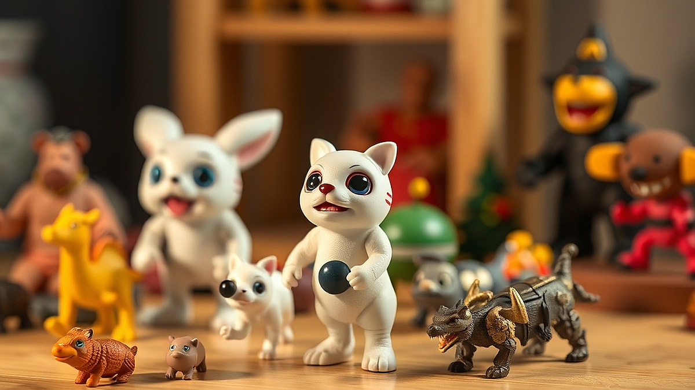

# 아트토이 수집의 끝판왕, '희소성 데이터'로 가치 판단하기

아트토이 수집은 이제 단순한 장난감 모으기를 넘어, 명확한 희소성 데이터를 기반으로 자산의 가치를 판단하는 정교한 취미 영역으로 진입했습니다. 20대 후반부터 40대까지의 수집가들이 이 시장에 열광하는 이유는 명확합니다. 어린 시절의 향수를 자극하는 동시에, 성인이 된 지금은 그것을 '투자 자산'이라는 논리적 잣대로 평가할 수 있기 때문입니다. 하지만 시장이 커질수록 쏟아지는 신제품 속에서 무엇이 장기적으로 가치를 유지하고, 무엇이 일시적인 유행에 그칠지 구분하는 눈이 필요합니다. 단순히 예쁘다는 이유만으로 구매 버튼을 누르는 시대는 끝났습니다. 이제는 발행량, 작가의 아카이브, 커뮤니티 내 거래 빈도라는 차가운 데이터를 읽어낼 줄 아는 사람만이 수집의 즐거움과 자산적 가치를 동시에 거머쥘 수 있습니다.

## 데이터로 읽는 아트토이의 시장성: 생존하는 디자인의 조건

아트토이의 가치는 디자인의 독창성보다 '생산 데이터'에서 결정됩니다. 제가 수집을 시작했던 초기에는 무조건 한정판이라는 말에 현혹되어 예산을 쏟아부었지만, 지금은 다릅니다. 가치가 유지되는 아트토이는 생산된 총수량뿐만 아니라, 그 수량이 시장에 어떻게 풀렸는지를 추적해야 합니다. 

예를 들어, 전 세계 100개 한정이라 하더라도 그중 80개가 특정 인플루언서에게 배포되었다면, 일반 수집가들 사이의 유통량은 20개에 불과합니다. 이런 제품은 시간이 지나도 커뮤니티 내에서 매물이 거의 나오지 않아 가격 하락이 거의 없습니다. 반대로 500개 한정이라도 오픈런을 통해 대중에게 고루 분산된 제품은 초기에는 거래가 활발하지만, 시간이 지나면 소위 '덤핑' 현상이 발생하기 쉽습니다.

**선택 기준:** 저는 이제 구매 전 세 가지를 확인합니다. 첫째, 작가가 이전 작품에서 '에디션 넘버'를 어떻게 관리했는가. 둘째, 2차 시장(중고 거래 커뮤니티)에서 해당 작가의 작품이 판매 완료까지 걸리는 평균 시간. 셋째, 패키지 구성품의 완결성입니다. 

**실패 케이스:** 무작정 '콜라보레이션'이라는 이름표만 보고 구매했던 초기 작품들이 가장 큰 실패였습니다. 유명 브랜드와 협업했지만, 작가의 고유한 조형미가 희석되고 단순히 로고만 박힌 제품들은 2년이 지나면 가치가 반 토막 납니다. 아트토이는 작가의 세계관이 강할수록 데이터상으로도 롱런합니다.

**실전 팁:** 매달 10만 원에서 30만 원 정도의 예산을 설정하고, 너무 많은 종류를 사기보다는 작가별로 '시리즈의 완결성'을 지키는 데 집중하세요. 낱개보다는 세트로 소장할 때, 나중에 처분할 때의 데이터 가치가 훨씬 높습니다.

## 아트토이 수집가들을 위한 실전 체크리스트: 공간과 유지비의 미학

아트토이를 수집하다 보면 가장 먼저 마주하는 난관은 '공간'입니다. 20평대 아파트에 사는 30대 직장인이라면, 수집품을 진열할 공간은 한정되어 있습니다. 저는 수집을 시작할 때 '박스 보관'과 '전시' 중 하나를 선택하라고 권합니다. 가치를 중시한다면 박스를 포함한 모든 구성품을 완벽하게 보존해야 하며, 이는 사실상 집안 공간의 30% 이상을 창고로 내주어야 한다는 뜻입니다.

**공간 활용 전략:** 저는 2단 높이의 아크릴 장식장을 추천합니다. 너무 높으면 조명 관리가 어렵고, 너무 낮으면 먼지가 쌓입니다. 유지비 면에서 가장 간과하는 것이 '조명'과 '습도 관리'입니다. 아트토이는 소재에 따라 변색이 빠릅니다. 직사광선이 닿지 않는 북향 방에 두거나, UV 차단 필름을 창문에 붙이는 것만으로도 5년 뒤 자산 가치가 달라집니다.

**실전 체크리스트:**
1. 장식장 내부 습도 45~55% 유지 가능한가?
2. 패키지 박스를 접지 않고 완벽하게 보관할 공간이 있는가?
3. 제품의 생산 연도와 작가 서명 위치를 기록할 데이터베이스(엑셀이나 노션)를 만들었는가?
4. 구매한 제품의 '정품 인증서'가 누락되지 않았는가?

**피해야 할 경우:** 만약 당신이 반려동물을 키우거나, 집안에 아이가 있다면 아트토이 수집은 매우 신중해야 합니다. 소재가 약한 PVC나 레진은 작은 충격에도 파손되기 쉽습니다. 파손된 제품은 데이터상으로 '가치 0원'으로 수렴합니다. 수집은 취미이지 스트레스가 되어서는 안 됩니다. 공간과 환경이 허락하지 않는다면, 차라리 작가의 한정판 아트 프린트나 소형 피규어 위주로 수집 범위를 좁히는 것이 현명합니다.

## 커뮤니티와 2차 시장에서 살아남는 법: 매도 타이밍의 과학

수집가들이 흔히 하는 착각 중 하나가 '영원한 소장'입니다. 하지만 아트토이 시장은 유행에 매우 민감합니다. 특정 작가의 스타일이 트렌드에서 멀어지기 시작하면, 데이터는 즉각적으로 반응합니다. 거래 글의 댓글 수, 조회수, 그리고 '구매 희망자'의 요청글이 줄어드는 시점이 바로 매도 타이밍입니다.

**매도 타이밍 판단 지표:** 커뮤니티에서 특정 작가의 작품이 '판매 완료'까지 걸리는 시간이 1주일에서 1개월로 늘어났다면, 시장의 관심이 식고 있다는 신호입니다. 이때는 감상에 젖어 있을 때가 아닙니다. 보유한 작품 중 가장 대중적인 모델부터 정리하여 현금화하고, 다시 떠오르는 작가의 초기 작품으로 갈아타는 '포트폴리오 리밸런싱'이 필요합니다.

**실제 사례:** 저의 경우, 3년 전 크게 유행했던 A 작가의 피규어 시리즈를 20만 원대에 구매했습니다. 당시에는 인기가 최고조였지만, 커뮤니티 내 거래가 뜸해지는 것을 감지하고 2년 뒤 25만 원에 매도했습니다. 수익률은 낮았지만, 그 현금으로 다시 신진 작가의 작품 3점을 구매해 데이터 기반의 수집을 이어가고 있습니다.

**실패 케이스:** 무조건 가격이 오를 것이라 믿고 '존버'하다가, 작가가 활동을 중단하거나 대중의 관심에서 완전히 멀어진 경우입니다. 이 경우 작품은 재판매가 불가능한 '골동품'이 되어버립니다. 아트토이는 주식과 비슷합니다. 시장의 흐름을 읽지 못하고 개인적인 애착만 앞세우면, 결국 방구석에 먼지만 쌓이는 플라스틱 덩어리가 되고 맙니다.

**행동 가이드:** 지금 당장 자신이 가진 작품들의 시세를 커뮤니티 검색을 통해 확인해 보세요. 최근 3개월간 거래가 한 건도 없었다면, 그 작품은 더 이상 자산으로서의 가치를 잃었을 확률이 높습니다. 차라리 지금 처분하고 그 공간에 새로운 가치를 채우는 것이 수집가로서의 지능적인 선택입니다.

아트토이 수집은 단순히 예쁜 것을 모으는 행위가 아니라, 자신의 취향을 데이터로 증명하는 과정입니다. 오늘 제가 나눈 기준들이 여러분의 수집 생활에 실질적인 나침반이 되길 바랍니다. 무조건적인 수집보다는 '나만의 컬렉션 기준'을 세우고, 시장의 흐름에 맞춰 유연하게 대응하는 수집가가 되십시오. 지금 여러분의 책상 위에 있는 그 작은 피규어 하나가, 몇 년 뒤 어떤 가치를 지니게 될지는 오늘 여러분이 내리는 결정에 달려 있습니다. 망설이지 말고 지금 바로 자신의 수집 리스트를 점검하고, 가치가 없는 것은 과감히 정리한 뒤 새로운 가치를 향해 나아가길 권합니다. 수집은 끝이 아니라, 매 순간 선택하는 즐거움입니다.

## 마치며

아트토이 수집은 단순한 취미를 넘어, 나의 안목과 취향을 데이터로 증명해 나가는 지적인 투자 과정입니다. 시장의 흐름을 읽고 희소성이라는 명확한 기준을 세울 때, 여러분의 컬렉션은 비로소 단순한 피규어를 넘어 가치 있는 자산으로 거듭날 것입니다. 

지금 바로 여러분의 수집 리스트를 펼쳐보세요. 최근 거래가 뜸하거나 애정이 식은 작품이 있다면 과감히 정리하고, 그 빈자리를 더 큰 잠재력을 가진 새로운 작품으로 채워보시길 바랍니다. 수집의 본질은 무조건적인 소유가 아니라, 매 순간 자신의 취향을 선택하고 다듬어가는 즐거움에 있으니까요.

오늘의 점검이 여러분의 컬렉션을 한층 더 가치 있게 만드는 터닝 포인트가 되길 바랍니다. 똑똑하고 즐거운 수집 생활, 지금 바로 시작해보세요! 여러분의 책상 위가 어떤 특별한 가치들로 채워질지 벌써부터 기대됩니다.
