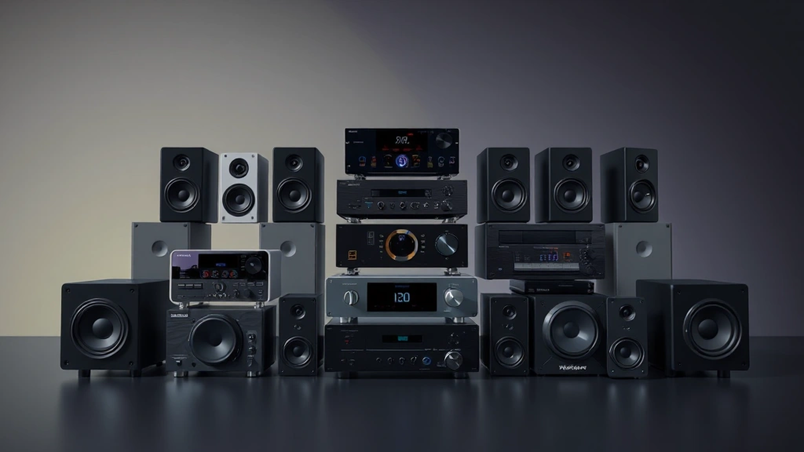

# 내 방을 공연장 1열로 만드는 음향기기 이야기: 실패와 성공 사이에서 찾은 나만의 사운드

최고의 **음향기기**를 찾는 여정은 제게 있어 단순히 더 좋은 소리를 듣기 위한 기술적 탐구 그 이상이었어요. 그것은 제가 사랑하는 아티스트의 숨결을 더 가까이 느끼고, 공연장의 뜨거운 공기를 집 안으로 고스란히 옮겨오려는, 어쩌면 조금은 무모하고 지독한 애정의 표현이었죠. 십수 년간 홍대 클럽부터 잠실 주경기장까지, 땀과 함성으로 가득한 라이브 공연장을 제집처럼 드나들면서 항상 아쉬웠던 점이 하나 있었거든요. 공연이 끝나고 집으로 돌아오는 길, 귓가에 맴도는 멜로디를 스마트폰 번들 이어폰으로 다시 들을 때의 그 공허함. 분명 같은 곡인데, 심장을 울리던 베이스 드럼의 진동도, 관객들의 숨 막히는 정적 뒤에 터져 나오던 기타 솔로의 전율도 온데간데없이 사라져 버린 그 순간의 상실감 말이에요.

그 상실감을 채우기 위해 시작된 저의 '음향기기 탐방'은 순탄치만은 않았습니다. 처음에는 그저 디자인이 예쁘거나, 광고에서 '압도적 베이스'라고 말하는 제품에 현혹되기 일쑤였죠. 그렇게 사들인 몇몇 기기들은 제 방 한구석에서 먼지만 쌓여갔고, 제 통장은 텅 비어갔습니다. 하지만 수많은 실패와 시행착오 끝에 깨달은 것이 있어요. 좋은 음향기기란 비싼 가격표나 화려한 스펙이 아니라, 아티스트가 녹음실에서 의도했던 감정과 소리의 질감을 내 귀에 가장 정직하게 전달해주는 '매개체'라는 사실을요. 이 글은 저처럼 음악을 너무나도 사랑한 나머지, 그 감동을 온전히 소유하고 싶어 안달이 났던 한 음악 팬의 솔직한 고백이자, 여러분이 자신만의 '인생 사운드'를 찾아가는 여정에 작은 등불이 되어줄 안내서입니다. 제 실패담과 약간의 성공담을 따라오시다 보면, 어느새 여러분의 공간도 세상에서 가장 아늑한 공연장 1열이 되어 있을 거예요.

## 헤드폰과 이어폰: 고독한 몰입의 세계, 어디서부터 시작할까?

모든 시작은 작고 개인적인 공간에서 비롯되곤 하죠. 제 음향 여정의 출발점도 바로 헤드폰이었습니다. 당시 저는 자취방에서 밤늦게까지 음악을 듣는 게 유일한 낙이었는데, 스피커를 맘껏 울릴 형편은 못 됐거든요. 그때까지만 해도 제게 헤드폰은 그저 '소리가 나는 머리띠' 정도의 물건이었어요. 그러다 우연히 음악 커뮤니티에서 '모니터링 헤드폰'이라는 존재를 알게 됐고, 큰맘 먹고 스튜디오에서 가장 많이 쓴다는 SONY의 MDR-7506 모델을 구매했습니다. 지금 돌이켜보면 그리 비싼 제품도 아니었지만, 제게는 완전히 새로운 세상이 열리는 경험이었죠.

처음 그 헤드폰으로 라디오헤드의 <OK Computer> 앨범을 들었던 순간을 잊을 수가 없어요. 수백 번은 더 들었던 'Paranoid Android'의 도입부에서, 이전에는 뭉뚱그려 들리던 어쿠스틱 기타 소리가 한 올 한 올 분리되어 왼쪽 귀와 오른쪽 귀를 선명하게 오가는 것을 느꼈습니다. 톰 요크의 목소리 뒤에 희미하게 깔려 있던 코러스의 작은 숨소리까지 들리는 순간, 온몸에 소름이 돋았죠. "아, 이게 프로듀서 나이젤 고드리치가 의도했던 사운드구나." 그 순간 저는 깨달았어요. 좋은 헤드폰은 단순히 소리를 크게 들려주는 게 아니라, 아티스트와 엔지니어가 수많은 밤을 새워가며 조각해 넣은 소리의 '디테일'과 '공간감'을 비로소 듣는 이에게 전달해주는 도구라는 것을요. 마치 흐릿한 흑백 사진을 4K 컬러 영상으로 보는 듯한 충격이었습니다. 이 곡을 들으면서 정말이지 혼자 방 안에서 위로받는 기분이었어요. 마치 밴드가 저만을 위해 연주해주는 것 같았거든요.

### 유선 vs. 무선, 그리고 노이즈 캔슬링의 함정

요즘은 단연 무선 이어폰과 헤드폰이 대세죠. 저도 출퇴근길에는 편의성 때문에 무선 제품을 애용합니다. 특히 2025년 현재, 블루투스 코덱 기술은 비약적으로 발전해서 퀄컴의 aptX Lossless나 소니의 LDAC 같은 고음질 코덱을 지원하는 기기들은 웬만한 유선 못지않은 소리를 들려주기도 해요. 하지만 진득하게 앉아 앨범 한 장을 '감상'할 때, 저는 여전히 주섬주섬 유선 헤드폰을 꺼내 듭니다. 이유는 간단해요. 유선은 신호 손실과 지연(latency)에서 훨씬 자유롭기 때문이죠. 무선 기술이 아무리 발전해도, 디지털 신호를 압축하고 전송하고 다시 푸는 과정에서 미세한 손실은 피할 수 없거든요. 특히 애플 뮤직이나 타이달 같은 스트리밍 서비스에서 '무손실(Lossless)' 음원을 제공하는 지금, 그 음원의 가치를 100% 느끼려면 유선 연결이 여전히 가장 확실한 방법입니다.

노이즈 캔슬링에 대한 제 실패담도 이야기하지 않을 수 없네요. 한때 저도 주변 소음을 완벽히 차단해주는 그 고요함에 매료되어 최고 성능의 노이즈 캔슬링 헤드폰을 구매한 적이 있어요. 물론 비행기나 시끄러운 카페에서는 정말 유용했습니다. 하지만 조용한 방에서 음악에만 집중하고 싶을 때, 저는 미묘한 이질감을 느꼈어요. 노이즈 캔슬링은 외부 소음의 파형을 분석해 그와 반대되는 파형을 쏴서 소음을 상쇄시키는 원리인데, 이 과정에서 음악 본연의 소리에도 아주 미세한 영향을 주더라고요. 마치 음식에 조미료를 살짝 친 것처럼, 소리가 약간 인공적으로 다듬어진 느낌이랄까요? 그 뒤로는 노이즈 캔슬링 기능은 필요할 때만 켜고, 집에서는 주로 외부 소음이 자연스럽게 드나드는 '오픈형' 헤드폰을 선호하게 되었습니다. 여러분도 무조건 최신 기술을 좇기보다는, 내가 주로 음악을 듣는 환경과 추구하는 소리의 방향성을 먼저 고민해보는 시간이 꼭 필요해요.

## 스피커 세팅 삽질기: 공간이 울어야 진짜 음악이다

헤드폰으로 디테일의 세계에 눈을 뜬 저는 이내 더 큰 욕심을 부리기 시작했습니다. '그래, 이 감동을 고막에만 가둬둘 순 없어. 온몸으로 느껴야 해!' 스피커는 헤드폰과는 전혀 다른 차원의 경험을 선사합니다. 소리가 귀에 직접 꽂히는 게 아니라, 공간 전체를 울리고 그 공기의 진동이 피부로 느껴지는 경험. 라이브 공연장에서 느끼는 물리적인 타격감과 현장감을 재현하기 위해선 스피커가 필수적이었죠.

제 첫 스피커 구매는 처참한 실패였습니다. 음향 지식이라곤 전무했던 저는, 그저 크고 우퍼가 달린 '있어 보이는' 2.1채널 PC 스피커를 덜컥 구매했어요. 그리고는 제 작은 자취방이 터져라 볼륨을 높였죠. 결과는 어땠을까요? 단단하고 명료해야 할 베이스는 통제 불능 상태로 '부웅'거리며 방 전체를 잠식했고, 보컬과 기타 소리는 그 저음의 진흙탕 속에서 허우적거렸습니다. 음악이 아니라 거대한 소음 덩어리에 가까웠어요. 심지어 옆집에서 항의까지 들어왔죠. 그때의 좌절감이란. 좋은 소리를 듣고 싶었을 뿐인데, 현실은 엉망진창이었어요.

그 실패를 교훈 삼아 저는 '공간'의 중요성을 깨닫게 되었습니다. 스피커는 기기 자체의 성능만큼이나, 그 스피커가 놓이는 공간의 특성(크기, 형태, 마감재 등)에 엄청난 영향을 받습니다. 작은 방에 과도하게 큰 스피커를 두는 건, 좁은 골목길에 덤프트럭을 몰고 들어가는 것과 같아요. 저는 그때부터 제 방 크기에 맞는 스피커를 찾기 시작했고, '니어필드(Near-field) 모니터 스피커'라는 해답을 찾았습니다. 원래 녹음 스튜디오에서 엔지니어들이 가까운 거리에서 소리를 정확하게 듣기 위해 사용하는 스피커인데, 비교적 작은 공간에서도 저음의 부밍 없이 정확하고 균형 잡힌 소리를 내주는 게 특징이에요. 야마하의 HS5나 KRK의 Rokit 5 같은 모델들이 대표적이죠. 이 스피커들을 들여놓고 처음 레드 제플린의 'Whole Lotta Love'를 틀었을 때의 충격은 아직도 생생합니다. 지미 페이지의 기타 리프가 왼쪽에서 오른쪽으로 이동하는 그 유명한 스테레오 효과가, 마치 제 머리를 관통하며 지나가는 것처럼 입체적으로 펼쳐졌거든요. 드디어 방 안에서 '공간'이 느껴지기 시작한 겁니다.

### 스피커 배치, 돈 안 들이고 소리 잡는 최고의 마법

좋은 스피커를 샀다고 끝이 아닙니다. 어쩌면 진짜 시작은 지금부터일지도 몰라요. 제가 수많은 시행착오 끝에 얻은 가장 값진 교훈은 바로 '배치'의 마법입니다. 값비싼 케이블이나 액세서리를 사는 것보다, 스피커 위치를 단 10cm 옮기는 것이 훨씬 더 드라마틱한 소리의 변화를 가져올 수 있어요. 가장 기본적이면서도 중요한 원칙은 바로 **'정삼각형 배치'**입니다.

1.  **왼쪽 스피커, 오른쪽 스피커, 그리고 내 머리(청취 위치)를 꼭짓점으로 하는 정삼각형을 만드세요.**
2.  **스피커의 높이는 내 귀 높이와 맞추는 것이 이상적입니다.** 트위터(고음을 내는 유닛)가 귀를 향하도록요.
3.  **스피커는 벽에서 최소 30cm 이상 떼어놓는 것이 좋습니다.** 특히 뒷벽에 가깝게 붙이면 저음이 과하게 증폭되어 소리가 벙벙거리는 원인이 됩니다.

저도 처음엔 '에게, 고작 이걸로 뭐가 달라지겠어?' 하고 반신반의했어요. 하지만 책상 위에 아무렇게나 놓여 있던 스피커를 스탠드 위에 올리고, 줄자로 거리를 재어가며 정삼각형 배치를 맞추는 순간, 마법 같은 일이 일어났습니다. 흩어져 있던 악기 소리들이 제자리를 찾기 시작했고, 보컬의 목소리가 마치 스피커 사이 허공에 정확히 맺히는 듯한 '음상(sound image)'이 생겨났어요. 돈 한 푼 들이지 않고 오직 노력만으로 얻어낸 업그레이드였죠. 여기에 카펫을 깔거나, 책장에 책을 꽂아두거나, 두꺼운 커튼을 치는 것만으로도 방 안의 불필요한 소리 울림(반사음)을 줄여 훨씬 더 깔끔하고 정돈된 소리를 만들 수 있습니다. 스피커에 투자하기로 마음먹었다면, 가장 먼저 투자해야 할 것은 돈이 아니라 바로 이 '배치'에 대한 고민과 시간이라는 걸 꼭 기억해주세요.

## DAC와 앰프, 보이지 않는 심장과 근육

헤드폰과 스피커라는 '입'을 마련했다면, 이제 그 입에 좋은 음식을 넣어줄 차례입니다. 많은 분들이 음향기기 여정에서 스피커나 헤드폰 교체 후 만족하고 멈추곤 합니다. 하지만 소리의 근원, 즉 '소스 기기'와 이를 증폭하는 과정의 중요성을 알게 되면 또 다른 신세계가 열리죠. 여기서 등장하는 주인공이 바로 DAC와 앰프입니다. 이름부터 어렵게 느껴지시나요? 최대한 쉽게 비유를 들어 설명해 볼게요.

우리가 스트리밍 서비스나 PC에서 듣는 음악 파일은 모두 0과 1로 이루어진 '디지털' 신호입니다. 하지만 스피커나 헤드폰이 소리를 내려면 아날로그 전기 신호가 필요하죠. **DAC(Digital-to-Analog Converter)**는 바로 이 디지털 신호를 우리가 들을 수 있는 아날로그 신호로 '번역'해주는 번역가 역할을 합니다. 노트북이나 스마트폰에도 기본 DAC가 내장되어 있지만, 이건 딱 기본적인 기능만 하는 초보 번역가에 가까워요. 전문적인 외장 DAC는 훨씬 더 능숙하고 섬세한 번역가라서, 디지털 파일에 담긴 정보의 뉘앙스와 디테일을 거의 손실 없이 아날로그 신호로 바꿔줍니다.

**앰프(Amplifier)**는 번역된 아날로그 신호를 스피커나 헤드폰이 소리를 낼 수 있을 만큼 힘껏 '증폭'시켜주는 근육과 같은 존재입니다. 특히 출력이 많이 필요한(전문 용어로 '임피던스가 높은') 헤드폰이나 덩치 큰 스피커일수록 튼튼한 근육, 즉 좋은 앰프가 필수적이죠. 힘이 약한 앰프에 까다로운 스피커를 물리면, 마치 힘없는 사람이 무거운 역기를 들려고 낑낑대는 것처럼 소리가 힘없고 왜곡되기 쉽습니다.

제게도 'DAC와 앰프가 정말 효과가 있을까?' 의심하던 시절이 있었어요. 그러다 젠하이저의 명기, HD 600 헤드폰을 들인 후 그 차이를 온몸으로 체감했습니다. 이 헤드폰을 노트북에 직결했을 때는 어딘가 힘없고 답답한 소리가 났어요. '이게 왜 그렇게 명기라고 칭송받는 거지?' 실망감이 들었죠. 하지만 비교적 저렴한 입문용 DAC/헤드폰 앰프 콤보 제품에 연결하는 순간, HD 600은 잠자던 사자가 포효하듯 완전히 다른 소리를 들려주었습니다. 악기들의 소리가 훨씬 더 풍성하고 입체적으로 살아났고, 베이스는 깊고 단단하게 울렸죠. 그때의 경험은 제게 '좋은 소리는 어느 한 부분만 뛰어나다고 완성되는 것이 아니라, 소스가 재생되는 첫 순간부터 최종적으로 귀에 닿기까지 모든 과정이 조화롭게 연결되어야 한다'는 큰 가르침을 주었습니다. 마치 훌륭한 요리가 최상의 재료(음원 파일)를 구해, 뛰어난 셰프(DAC)가 조리하고, 강력한 화력(앰프)으로 완성되는 것과 같은 이치죠. 2025년 최근에는 이런 DAC, 앰프, 그리고 네트워크 스트리밍 기능까지 하나로 합친 올인원 기기들이 많이 출시되어, 복잡한 연결 없이도 고품질의 사운드를 즐길 수 있는 환경이 점점 더 좋아지고 있답니다.

## 당신의 귀를 믿으세요

길고 긴 저의 음향기기 방랑기를 함께해주셔서 감사합니다. 헤드폰에서 시작해 스피커의 공간감을 배우고, 보이지 않는 DAC와 앰프의 세계까지 탐험하며 제가 최종적으로 내린 결론은 아주 단순합니다. 이 모든 여정의 끝에 가장 중요한 기준은 백만 원짜리 스피커의 스펙 시트도, 유명 리뷰어의 평가도 아닌, 바로 '나 자신의 귀'라는 것입니다.

음악 감상은 지극히 개인적이고 주관적인 경험입니다. 누군가에게는 심장을 때리는 단단한 저음이 최고의 쾌감일 수 있고, 또 다른 누군가에게는 여성 보컬의 청아한 고음이 가장 중요할 수 있죠. 제가 오늘 공유한 이야기들은 정답이 아닙니다. 여러분이 자신만의 '소리의 취향'을 찾아가는 과정에서 겪을 수 있는 시행착오를 조금이나마 줄여드리기 위한 하나의 참고 자료일 뿐이에요. 비싼 기기가 무조건 좋은 소리를 보장하지 않으며, 때로는 저렴한 기기의 의외의 조합이 나에게 딱 맞는 소리를 들려주기도 합니다. 중요한 것은 남의 말에 휩쓸리지 않고, 다양한 소리를 직접 들어보며 내가 어떤 소리를 들을 때 가장 행복하고 가슴 뛰는지를 스스로 발견해나가는 과정 그 자체입니다.

자, 이제 여러분의 차례입니다. 오늘 저녁, 평소에 가장 아끼는 곡 하나를 골라보세요. 그리고 늘 듣던 방식이 아닌, 헤드폰을 끼고 눈을 감은 채 온전히 소리에만 집중해서 다시 한번 들어보세요. 혹시 전에는 들리지 않았던 새로운 악기 소리나 가수의 작은 숨소리가 들리지 않나요? 만약 그렇다면, 축하합니다. 여러분의 멋진 음향 여정은 바로 그 작은 발견에서부터 시작됩니다. 부디 그 여정 속에서 수많은 실패를 두려워하지 마시고, 마침내 여러분의 공간을 세상 가장 완벽한 공연장으로 만드는 기쁨을 누리시길 진심으로 응원합니다.

## 마치며

결국 음향의 세계는 정답이 없는, 지극히 개인적인 탐험과 같습니다. 중요한 것은 스펙이나 가격표가 아닌, 내 마음을 울리는 소리를 찾아가는 여정 그 자체라는 점을 기억해주세요. 값비싼 장비가 없어도 괜찮습니다. 지금 가진 이어폰과 좋아하는 음악, 그리고 약간의 호기심만 있다면 누구든 자신만의 소리를 찾아 떠날 준비가 된 것입니다. 이 글이 그 여정의 작은 등불이 되었기를 바랍니다.

오늘 밤, 여러분이 새롭게 발견한 소리는 무엇이었나요? 어떤 곡에서 가수의 숨소리나 미처 몰랐던 악기 소리를 찾아내셨나요? 댓글을 통해 여러분의 첫 발견을 공유해주세요. 비슷한 경험을 한 다른 분들과 소통하며, 여러분의 음향 여정이 더욱 즐겁고 풍성해질 것입니다. 음악이 주는 순수한 즐거움을 온전히 누리며, 여러분만의 멋진 소리를 완성해나가시길 응원합니다.