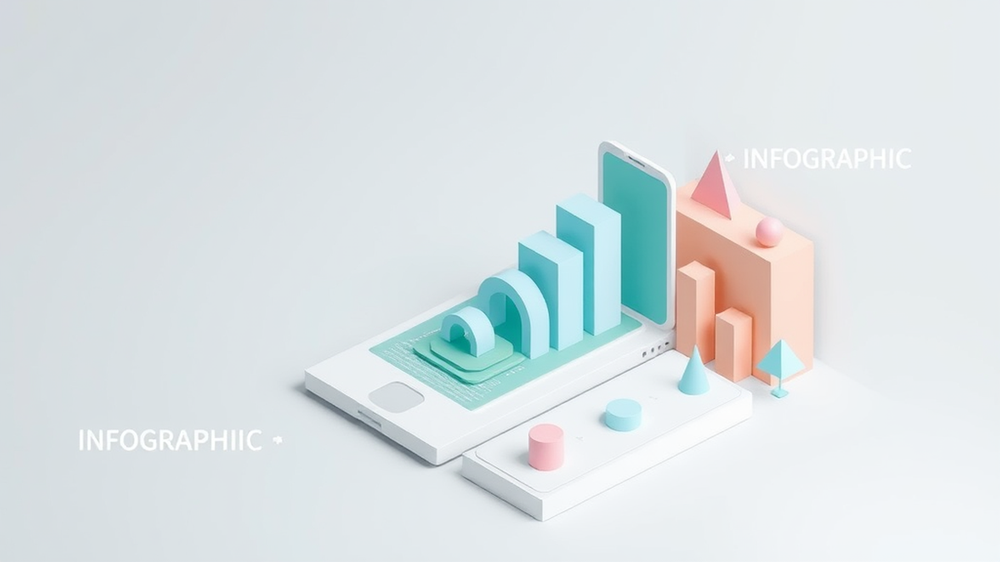

안녕하세요, 여러분! 20년 동안 디지털 마케팅 바닥을 구르면서 산전수전 다 겪은 베테랑 마케터, 오늘 여러분의 든든한 길잡이가 되어줄 마케터 박진우입니다. 오늘은 저처럼 이 분야에 푹 빠져 살고 싶은 초보 마케터 분들을 위해 **온라인 광고**의 세계를 쉽고 재미있게 파헤쳐 볼까 합니다. 솔직히 말해서, 이 바닥이 생각보다 복잡하고 어렵게 느껴질 수 있어요. 저도 처음엔 그랬으니까요. 수많은 광고 종류 앞에서 '도대체 뭘 해야 하는 거야?' 하고 막막했던 기억이 생생합니다. 하지만 걱정 마세요! 제가 20년 동안 수많은 캠페인을 돌리고, 성공도 실패도 맛보면서 얻은 찐 경험과 노하우를 아낌없이 풀어드릴 테니까요.

어떤 광고가 우리 비즈니스에 맞을지, 예산은 어떻게 써야 효율적일지, 또 어떤 함정이 도사리고 있는지 등등. 이런 궁금증을 시원하게 해결해 드릴 겁니다. 단순히 이론적인 설명만 늘어놓는 게 아니라, "실제로 해보니까 이게 효과가 있더라고요" 같은 살아있는 경험담과 구체적인 수치, 그리고 제가 겪었던 눈물 젖은 실패담까지 솔직하게 공유해 드릴게요. 2025년 마케팅 트렌드까지 싹 다 반영해서 말이죠. 준비되셨나요? 그럼, 지금부터 여러분의 성공적인 온라인 광고 여정을 위한 첫걸음을 저와 함께 힘차게 내딛어 봅시다!

## 검색 엔진 마케팅 (SEM): 고객이 나를 찾게 만드는 힘

가장 기본적이면서도 강력한 온라인 광고 유형 중 하나가 바로 **검색 엔진 마케팅(SEM, Search Engine Marketing)**입니다. 쉽게 말해, 사람들이 네이버나 구글 같은 검색 엔진에 특정 키워드를 검색했을 때, 우리 광고가 상단에 노출되도록 하는 거죠. 이 SEM은 크게 두 가지로 나뉩니다. 하나는 돈을 내고 노출하는 **검색 광고(Paid Search Ads, PPC)**이고, 다른 하나는 돈 안 내고 검색 엔진 최적화(SEO)를 통해 자연스럽게 상위 노출을 노리는 **자연 검색(Organic Search)**입니다. 초보자분들은 보통 PPC, 즉 키워드 광고부터 시작하죠.

제가 처음 마케팅을 시작했을 때, 작은 쇼핑몰의 신발 광고를 맡았습니다. 그때는 그저 "운동화"라는 키워드에 무작정 입찰하면 되는 줄 알았죠. 예상하셨겠지만, 결과는 처참했습니다. 클릭당 단가는 비싼데, 정작 구매로 이어지는 전환율은 0.1%도 안 되는 거예요. 광고비는 광고비대로 나가고, 대표님은 저를 한심하게 쳐다보시고… 정말 등골이 오싹했죠. 그때 깨달았습니다. *단순히 노출만 시키는 게 능사가 아니구나.*

**검색 광고의 장점**은 뭐니 뭐니 해도 **높은 구매 의도를 가진 잠재 고객에게 직접 노출**된다는 점입니다. "예쁜 구두 추천"을 검색하는 사람은 이미 구두를 사고 싶어 하는 사람이잖아요? 이런 사람들에게 우리 제품을 보여줄 수 있으니 전환율이 높을 수밖에 없습니다. 제가 실패를 딛고 개선한 방법은 이랬습니다. 단순히 "운동화" 같은 광범위한 키워드 대신, "나이키 에어포스 화이트 여성"처럼 **구체적이고 세분화된 롱테일 키워드**에 집중한 거죠. 그리고 광고 문구도 "여성용 에어포스, 20% 할인 중!"처럼 고객의 검색 의도에 딱 맞게 수정했습니다. 결과는 놀라웠어요. 클릭당 단가는 낮아지고, 전환율은 무려 3%까지 치솟았습니다. 이전에 0.1%도 안 되던 것에 비하면 정말 엄청난 발전이었죠. ROAS(광고비 대비 매출액)도 100% 미만에서 300% 이상으로 껑충 뛰었습니다.

하지만 **단점**도 명확합니다. 경쟁이 치열한 키워드는 **클릭당 단가(CPC)가 매우 높을 수 있다**는 점이에요. 대기업들이 싹쓸이하는 키워드에 무턱대고 달려들면 예산만 날리기 십상입니다. 그리고 키워드 선정, 입찰 전략, 광고 문구 최적화 등 **세심한 관리가 필요**합니다. 2025년에는 AI 기반의 자동 입찰 기능이 더욱 고도화되어 효율적인 운영이 가능해졌지만, 여전히 사람의 인사이트가 중요해요. AI가 아무리 똑똑해도 우리 브랜드의 가치와 고객의 미묘한 심리는 완벽하게 파악하기 어렵거든요.

*   **꿀팁:** 초보자라면 처음부터 비싼 키워드에 올인하지 말고, **경쟁률이 낮고 구체적인 롱테일 키워드부터 시작**하세요. 그리고 광고 문구에 **고객의 니즈를 자극하는 강력한 후킹 문구와 명확한 CTA(Call To Action)**를 포함하는 것이 중요합니다. 예를 들어, "지금 구매 시 무료 배송!" 같은 문구는 전환율을 높이는 데 큰 도움이 됩니다. A/B 테스트를 통해 어떤 문구가 가장 효과적인지 꾸준히 실험하는 것도 잊지 마세요. 검색 광고는 단순히 돈을 쓰는 것이 아니라, 고객의 마음을 읽는 심리전과 같습니다.

## 디스플레이 광고 (DA): 시각적 매력으로 잠재 고객을 유혹하다

다음으로 살펴볼 광고 유형은 **디스플레이 광고(DA, Display Advertising)**입니다. 이건 쉽게 말해, 우리가 웹사이트나 앱을 이용할 때 보이는 이미지나 동영상 형태의 배너 광고를 말합니다. 뉴스 기사를 읽다가 옆에 보이는 예쁜 옷 광고, 유튜브 영상을 보다가 나오는 짧은 광고 등이 모두 디스플레이 광고의 일종이죠. 검색 광고가 '고객이 나를 찾는' 방식이라면, 디스플레이 광고는 '내가 고객을 찾아가는' 방식이라고 할 수 있습니다.

제가 맡았던 한 패션 앱 마케팅 캠페인에서 디스플레이 광고의 진가를 경험했습니다. 초기에는 검색 광고에만 집중했는데, 아무리 전환율이 높아도 신규 고객 유입에 한계가 있더라고요. 앱 다운로드 수가 정체되는 상황이었죠. 그때 디스플레이 광고를 시도했습니다. 주요 패션 커뮤니티나 라이프스타일 관련 웹사이트에 저희 앱의 강점을 보여주는 매력적인 비주얼 광고를 내보냈습니다. 단순히 예쁜 옷 사진만 넣은 게 아니었습니다. "나만의 스타일을 찾아줄 AI 코디네이터"라는 메시지를 담아, 앱의 차별점을 명확히 보여줬죠.

**디스플레이 광고의 가장 큰 장점**은 바로 **폭넓은 도달 범위**와 **강력한 브랜딩 효과**입니다. 검색 광고로는 닿기 어려운 잠재 고객에게 우리 브랜드를 노출시키고, 시각적인 요소를 통해 브랜드 이미지를 각인시킬 수 있습니다. 처음에는 앱 다운로드 전환율이 0.8% 정도로 그리 높지 않았지만, 꾸준히 노출되면서 브랜드 인지도가 올라가자 점차 상승하기 시작했습니다. 특히 **리타겟팅(Retargeting)** 기능을 활용했을 때 효과가 폭발적이었습니다. 저희 앱을 설치했다가 사용하지 않는 고객이나, 웹사이트에 방문했지만 구매하지 않고 이탈한 고객들에게 다시 광고를 보여줬더니, 전환율이 무려 5% 이상으로 급등하는 것을 확인했습니다. 광고를 통해 한 번이라도 우리 브랜드를 접한 사람들에게 다시 다가가는 것이 얼마나 중요한지 깨달은 순간이었죠.

하지만 **단점**도 분명히 있습니다. 검색 광고에 비해 **구매 의도가 낮은 잠재 고객에게 노출될 가능성**이 높다는 점입니다. 뉴스 기사를 읽다가 우연히 광고를 보는 경우, 당장 구매할 생각이 없는 경우가 많죠. 따라서 클릭률(CTR)이나 직접적인 전환율이 검색 광고보다 낮게 나타날 수 있습니다. 또한, 광고 피로도가 높아지면 고객들이 광고를 무시하거나 심지어 부정적으로 인식할 수도 있습니다. 2025년에는 개인 정보 보호 강화와 함께 쿠키 없는 세상이 도래하면서, 타겟팅의 정확도가 다소 떨어질 수 있다는 우려도 있습니다. 하지만 AI 기반의 문맥 타겟팅이나 퍼스트 파티 데이터 활용 등으로 새로운 돌파구를 찾고 있죠.

*   **꿀팁:** 디스플레이 광고는 **다양한 크리에이티브(광고 소재)를 지속적으로 테스트**하는 것이 중요합니다. 어떤 이미지나 동영상이 고객의 시선을 사로잡고 클릭을 유도하는지 끊임없이 분석해야 합니다. 그리고 **타겟팅 전략을 정교하게 세우세요.** 인구통계학적 정보뿐만 아니라, 관심사, 행동 패턴 등을 기반으로 우리 제품에 관심을 가질 만한 고객들에게만 광고를 노출해야 예산을 효율적으로 사용할 수 있습니다. 특히, 웹사이트 방문자나 앱 사용자를 대상으로 하는 **리타겟팅 캠페인은 필수**입니다. 이들은 이미 우리 브랜드에 대한 인지가 있는 "따뜻한" 고객들이니까요.

## 소셜 미디어 광고 (SMA): 관계를 통해 팬덤을 만들다

마지막으로 살펴볼 유형은 오늘날 가장 뜨겁고, 또 초보 마케터들에게 가장 친숙할 **소셜 미디어 광고(SMA, Social Media Advertising)**입니다. 페이스북, 인스타그램, 틱톡, 유튜브 등 우리가 매일 이용하는 소셜 미디어 플랫폼에 노출되는 광고를 말하죠. 소셜 미디어 광고는 단순한 상품 판매를 넘어, 고객과 **관계를 맺고 팬덤을 형성하는 데 특화**되어 있습니다.

제가 한 식품 스타트업의 신제품 런칭을 맡았을 때, 예산이 넉넉하지 않았습니다. 전통적인 매체 광고는 엄두도 못 냈죠. 그래서 소셜 미디어 광고에 모든 것을 걸었습니다. 특히 인스타그램과 틱톡을 중심으로 젊은 층에 어필할 수 있는 짧고 재미있는 챌린지 영상과 인플루언서 협업 콘텐츠를 만들었습니다. 제품의 특장점을 딱딱하게 설명하기보다는, 사람들이 직접 제품을 즐기는 모습을 보여주며 자연스럽게 입소문을 유도했죠. 처음에는 100만 원으로 시작한 캠페인에서 전환율이 1% 미만이었지만, 2주 만에 릴스 챌린지가 바이럴을 타면서 유기적 도달이 폭발적으로 늘었고, 유료 광고의 전환율 또한 2.5%까지 상승했습니다. ROAS는 무려 450%를 기록했고요. 이 경험을 통해 소셜 미디어 광고가 단순히 광고비를 태우는 것을 넘어, '콘텐츠의 힘'이 얼마나 중요한지 다시 한번 깨달았습니다.

**소셜 미디어 광고의 가장 큰 장점**은 **정교한 타겟팅 능력**입니다. 소셜 미디어 플랫폼은 사용자의 관심사, 행동, 인구통계학적 정보 등을 방대하게 수집하고 있기 때문에, 우리 제품이나 서비스에 가장 적합한 잠재 고객을 찾아 광고를 노출할 수 있습니다. 예를 들어, '20대 여성, 고양이 집사, 비건 식품에 관심 있는' 사람들에게만 광고를 보여줄 수 있는 거죠. 또한, **사용자 참여를 유도하기 쉽다**는 것도 큰 장점입니다. 좋아요, 댓글, 공유, 저장 등 다양한 형태로 고객이 광고와 상호작용할 수 있으며, 이는 바이럴 마케팅으로 이어질 가능성이 높습니다. 2025년에는 숏폼 콘텐츠의 강세와 더불어, 라이브 커머스와 인플루언서 마케팅이 더욱 고도화될 것으로 예상됩니다. AI가 콘텐츠 제작 및 최적화를 돕는 기능도 활발하게 도입되고 있고요.

하지만 **단점**도 존재합니다. **광고 피로도가 높고, 광고성 메시지에 대한 거부감**이 생기기 쉽습니다. 사람들은 소셜 미디어를 친구들과 소통하거나 엔터테인먼트를 즐기기 위해 사용하기 때문에, 노골적인 광고는 쉽게 스킵하거나 부정적으로 반응할 수 있습니다. 또한, **콘텐츠의 수명이 짧아 지속적인 업데이트와 관리가 필요**하며, 유행에 민감하여 빠르게 변화하는 트렌드를 따라잡아야 합니다. 제가 겪었던 실패 사례 중 하나는, 한때 유행했던 밈(meme)을 활용한 광고를 만들었다가 타이밍을 놓쳐서 오히려 촌스럽다는 비판을 받은 적도 있습니다. 트렌드를 좇는 것도 중요하지만, 우리 브랜드의 본질을 잃지 않는 것이 더 중요하죠.

*   **꿀팁:** 소셜 미디어 광고는 **'광고 같지 않은 광고'**를 만드는 것이 핵심입니다. 단순히 제품 사진만 올리지 말고, **고객의 공감을 얻을 수 있는 스토리텔링이나 유용한 정보, 재미있는 챌린지 등 콘텐츠 요소를 강화**하세요. 그리고 **타겟 고객이 주로 사용하는 플랫폼에 집중**하고, 각 플랫폼의 특성에 맞는 콘텐츠 형식(숏폼, 라이브, 이미지 등)을 활용해야 합니다. 마지막으로, **인플루언서 마케팅은 신중하게 접근**해야 합니다. 팔로워 수가 많다고 무조건 좋은 것이 아니라, 우리 브랜드 이미지와 잘 맞고 진정성 있는 소통을 하는 인플루언서를 선택하는 것이 중요합니다. 그들의 팬덤이 우리 브랜드의 팬덤으로 이어질 수 있도록요.

자, 이렇게 초보 마케터 분들이 꼭 알아야 할 주요 온라인 광고 종류 세 가지를 자세히 살펴봤습니다. 검색 광고는 '찾는 고객'에게, 디스플레이 광고는 '잠재 고객'에게, 그리고 소셜 미디어 광고는 '관계를 맺고 싶은 고객'에게 다가가는 전략이라고 요약할 수 있겠네요. 이 세 가지 광고는 서로 다른 목적을 가지고 있지만, 실제 마케팅에서는 이들을 **유기적으로 결합하여 시너지를 내는 것이 가장 중요**합니다. 예를 들어, 검색 광고로 높은 구매 의도를 가진 고객을 유입시키고, 이탈한 고객에게는 디스플레이 리타겟팅 광고를 보여주며, 소셜 미디어를 통해 브랜드 충성도를 높이는 식이죠.

어떤가요? 조금은 온라인 광고의 큰 그림이 그려지시나요? 처음부터 모든 것을 완벽하게 하려 하지 마세요. 저도 20년 동안 수많은 시행착오를 겪으며 여기까지 왔습니다. 중요한 것은 **작게 시작해서 꾸준히 실험하고, 데이터를 기반으로 개선해 나가는 용기**입니다. 실패를 두려워 말고, 오늘 제가 알려드린 꿀팁들을 바탕으로 여러분만의 성공 방정식을 찾아나가시길 바랍니다. 당장 오늘부터 여러분의 비즈니스에 맞는 광고 유형 하나를 선택해서 작은 예산으로라도 시작해보세요. 그리고 그 결과를 분석하고, 다음 단계로 나아가는 겁니다. 여러분의 멋진 마케팅 여정을 항상 응원하겠습니다!