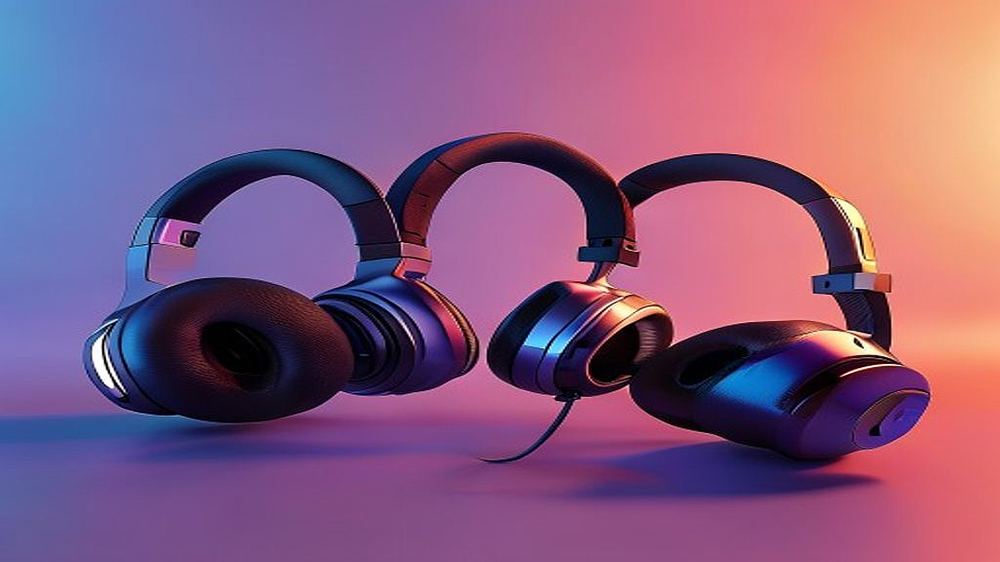

10만원대 가성비 블루투스 헤드폰은 음악을 사랑하는 우리 같은 리스너들에게 가장 치열하고도 즐거운 고민을 안겨주는 영역입니다. 공연장에서 밴드의 베이스 라인이 가슴을 울릴 때 느꼈던 그 전율을 일상에서도 느끼고 싶어 처음 장비를 찾던 날이 기억납니다. 당시 저는 예산이 넉넉하지 않아 무작정 비싼 제품만 쫓다가 낭패를 본 적이 있었죠. 소리는 뭉개지고 연결은 자꾸 끊겨서 결국 서랍 구석에 박아둔 헤드폰만 두 개였습니다. 저처럼 시행착오를 겪지 않길 바라는 마음에서, 오늘은 10만원대라는 합리적인 가격대에서 최고의 퍼포먼스를 보여주는 블루투스 헤드폰들을 꼼꼼히 비교해 보려고 합니다.

단순히 인기 순위가 아니라, 실제 스트리밍 플랫폼에서 고음질 음원을 들을 때의 해상도, 그리고 지하철이나 카페 같은 외부 소음이 많은 환경에서 얼마나 쾌적하게 음악에만 집중할 수 있는지에 초점을 맞췄습니다. 10만원대 제품군은 사실 브랜드의 엔트리 라인업이 많아 기술적 타협이 존재할 수밖에 없습니다. 하지만 그 타협 지점이 사용자의 음악 취향과 맞닿아 있다면, 그 어떤 하이엔드 장비보다도 큰 위로를 건네주는 최고의 동반자가 될 수 있습니다. 여러분의 귀를 즐겁게 해줄 실전 가이드를 지금 시작합니다.

## 10만원대 헤드폰 선택을 위한 핵심 기준

많은 분이 디자인만 보고 제품을 결정했다가 낭패를 보곤 합니다. 헤드폰은 결국 '착용감'과 '사운드 튜닝'의 조화가 핵심입니다. 제가 수많은 제품을 테스트하며 세운 첫 번째 기준은 바로 '무게 배분'입니다. 10만원대 제품들은 플라스틱 소재를 많이 사용하는데, 너무 가벼우면 내구성이 의심스럽고 너무 무거우면 1시간도 채 못 가 목이 뻐근해집니다. 250g 전후의 무게가 가장 적당하며, 정수리 부분의 쿠션이 얼마나 푹신한지 반드시 확인해야 합니다.

사운드 측면에서는 'V자형 사운드'를 선호하는지, '플랫한 사운드'를 선호하는지 스스로 물어봐야 합니다. 10만원대 가성비 제품들은 대체로 저음이 강조된 V자형 튜닝이 많습니다. 힙합이나 일렉트로닉을 즐긴다면 환영할 일이지만, 보컬 중심의 발라드나 어쿠스틱 음악을 듣는다면 보컬이 악기에 묻혀 답답하게 느껴질 수 있습니다. 이때 중요한 것이 '전용 앱 지원 여부'입니다. 전용 앱에서 EQ(이퀄라이저)를 조절할 수 있다면, 저음을 낮추고 중고음을 끌어올려 나만의 사운드를 찾을 수 있죠.

마지막으로 확인해야 할 것은 '코덱 지원'입니다. 아이폰 유저는 AAC 코덱만 있어도 충분하지만, 안드로이드 유저라면 LDAC이나 aptX Adaptive 같은 고음질 코덱을 지원하는지 확인해야 합니다. 스트리밍 사이트에서 무손실 음원을 재생해도, 헤드폰이 이를 처리하지 못하면 데이터는 반토막 난 채로 귀에 전달됩니다. 제가 처음 입문할 때 이 사실을 몰라 고음질 요금제를 쓰고도 저음질로 음악을 듣고 있었던 기억이 납니다. 여러분은 저와 같은 실수를 하지 않도록, 반드시 스펙 시트의 '지원 코덱' 항목을 체크하세요.

## 실전 체크리스트: 내게 맞는 헤드폰 찾기

이제 구체적으로 어떤 점을 점검해야 할지 단계별로 정리해 보겠습니다. 이 체크리스트를 메모장에 저장해두고 제품을 고를 때 하나씩 지워나가 보세요.

1. **착용 환경 확인**: 주로 어디서 듣나요? 지하철이나 카페라면 '액티브 노이즈 캔슬링(ANC)' 기능이 필수입니다. 10만원대에서도 이제는 꽤 준수한 성능의 ANC를 탑재한 모델들이 많습니다.
2. **배터리 타임**: 최소 40시간 이상 재생이 가능한지 보세요. 일주일 내내 충전 없이 사용하려면 이 정도 스펙이 안정적입니다.
3. **통화 품질**: 마이크 위치가 입과 가까운지, 주변 소음을 걸러주는 빔포밍 기술이 들어갔는지 확인하세요. 카페에서 급한 전화를 받을 때 마이크가 좋지 않으면 정말 곤란해집니다.
4. **연결성**: 블루투스 5.0 이상인지 확인하세요. 버전이 낮으면 사람이 많은 지하철에서 음악이 툭툭 끊기는 현상을 겪게 됩니다.

실패하지 않는 구매를 위한 실전 팁을 하나 더 드리자면, '공간감'을 확인하는 것입니다. 녹음 기술이 좋아진 요즘, 아티스트들은 악기의 위치를 계산하며 믹싱을 합니다. 헤드폰을 썼을 때 악기 소리가 머릿속이 아닌, 양옆으로 넓게 펼쳐지는 느낌이 드는 제품을 고르세요. 이를 확인하는 가장 쉬운 방법은 유튜브에서 '바이노럴 레코딩' 음원을 검색해 들어보는 것입니다. 마치 현장에 있는 듯한 입체감이 느껴진다면 그 헤드폰은 합격점입니다. 

반면, 피해야 할 경우도 명확합니다. '브랜드만 보고 사는 경우'입니다. 유명 브랜드의 이름값 때문에 성능이 훨씬 떨어지는 구형 모델을 사는 것만큼 아까운 일은 없습니다. 최신 모델은 블루투스 기술이 비약적으로 발전해 있어, 3년 전 플래그십 모델보다 10만원대 신제품이 더 나은 소리를 들려주는 경우가 허다합니다. 항상 출시 연도를 확인하는 습관을 들이세요.

## 브랜드별 특성 분석과 최종 판단 기준

현재 시장에서 10만원대에 포진한 브랜드들은 저마다 뚜렷한 색깔을 가지고 있습니다. 사운드 밸런스를 중시하는 브랜드, 기능성(ANC)을 극대화한 브랜드, 그리고 내구성을 강조하는 브랜드로 나뉩니다. 제가 직접 사용해 본 경험으로 말씀드리면, 앤커(Anker)와 같은 브랜드는 기능성에서 압도적인 가성비를 보여줍니다. 앱 연동성이 매우 뛰어나고, 노이즈 캔슬링 성능도 가격대 이상의 퍼포먼스를 냅니다. 반면, 소니나 오디오테크니카의 입문형 라인은 기본기에 충실합니다. 화려한 기능보다는 드라이버 유닛 자체의 성능을 높여 음악 본연의 질감을 살리는 데 집중하죠.

판단 기준을 세울 때 가장 중요한 것은 '내가 무엇을 포기할 수 없는가'입니다. 출퇴근길의 소음 차단이 1순위라면 노이즈 캔슬링 성능이 검증된 제품을, 집에서 방해받지 않고 음악의 세밀한 뉘앙스를 즐기는 것이 목적이라면 유선 연결을 지원하거나 음질 튜닝이 좋은 제품을 선택해야 합니다. 

마지막으로 당부드리고 싶은 점은 '직접 착용'입니다. 아무리 성능이 좋아도 내 머리 모양과 맞지 않아 압박감이 느껴지면 결국 손이 가지 않게 됩니다. 가능하다면 오프라인 매장에서 5분 이상 착용해 보고, 안경을 썼을 때 귀가 눌리는지도 확인해 보세요. 안경 착용자에게는 이어패드의 쿠션 복원력이 정말 중요하거든요. 이런 디테일한 차이가 결국 여러분이 음악을 얼마나 더 자주, 더 깊게 즐길 수 있는지를 결정합니다.

결국 10만원대 헤드폰은 음악이라는 거대한 세계로 들어가는 가장 친절한 문턱입니다. 오늘 정리해 드린 기준들을 바탕으로 여러분의 귀를 즐겁게 해줄 최고의 파트너를 찾으셨으면 좋겠습니다. 처음에는 소리의 차이를 구분하기 어려울 수도 있습니다. 하지만 매일 즐겨 듣던 곡을 새로운 헤드폰으로 들었을 때, 이전에는 들리지 않았던 베이스의 떨림이나 보컬의 숨소리가 들리는 순간이 올 겁니다. 그때 느끼는 그 작은 희열이 바로 음악 애호가로서의 삶이 시작되는 순간입니다. 

브랜드 이름에 갇히지 말고, 여러분의 귀가 즐거워하는 소리를 찾아보세요. 사양표의 숫자보다 중요한 것은 여러분이 그 헤드폰을 쓰고 음악을 들으며 얼마나 행복한 시간을 보낼 수 있는가입니다. 오늘 이 글이 여러분의 음악 생활에 작은 도움이 되었기를 진심으로 바랍니다. 이제 마음에 드는 제품을 골라, 여러분이 가장 좋아하는 플레이리스트를 재생해 보세요. 그 음악이 여러분의 일상을 조금 더 따뜻하게 위로해 줄 것입니다. 주저하지 말고 여러분만의 사운드 여정을 지금 시작해 보시길 권합니다.

## 마치며

결론적으로 10만 원대 블루투스 헤드폰 시장은 입문자들에게 가장 매력적인 선택지들이 모여 있는 곳입니다. 우리는 오늘 소니의 안정적인 밸런스, JBL의 역동적인 베이스, 그리고 브리츠나 앤커가 보여준 놀라운 가성비까지 각 브랜드의 핵심적인 특징들을 짚어보았습니다. 중요한 것은 남들의 기준이 아니라, 내가 주로 듣는 음악 장르와 착용 환경에 딱 맞는 제품을 고르는 것입니다. 화려한 광고 문구에 현혹되기보다 배터리 지속 시간, 무게, 그리고 사운드 성향이라는 세 가지 기준을 다시 한번 복기해 보시길 바랍니다.

이제 여러분의 일상에 새로운 리듬을 더할 차례입니다. 오늘 마음에 담아둔 모델이 있다면 고민만 하기보다 가까운 청음 매장을 방문해 직접 착용해 보거나, 온라인의 생생한 사용자 후기들을 마지막으로 점검해 보세요. 직접 귀로 듣고 느끼는 순간, 여러분의 선택은 확신으로 변할 것입니다. 나만의 첫 번째 헤드폰을 결정하는 그 설레는 과정을 충분히 즐기셨으면 합니다.

좋은 헤드폰은 단순히 음악을 들려주는 기기를 넘어, 복잡한 세상 속에서 온전히 나만의 공간을 만들어주는 마법 같은 도구입니다. 여러분이 선택한 그 헤드폰이 매일 반복되는 출퇴근길을 즐겁게 만들고, 지친 저녁의 휴식 시간을 더욱 깊이 있게 채워주기를 진심으로 응원합니다. 궁금한 점이 있다면 언제든 댓글로 소통해 주세요. 여러분의 첫 번째 사운드 여정이 행복한 기억으로 가득하기를 바랍니다!