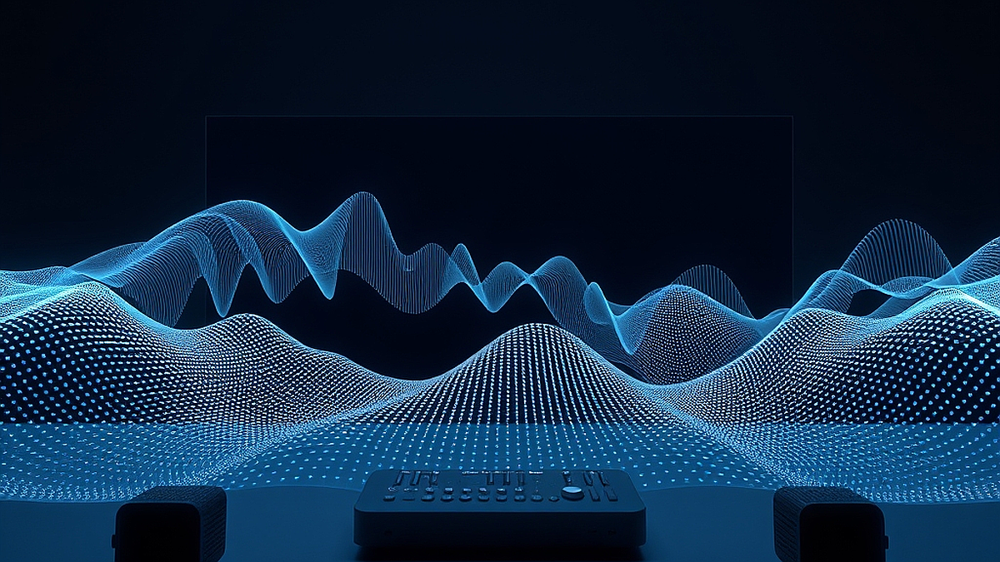

사운드마케팅과 ASMR은 이제 단순히 감성을 자극하는 도구를 넘어, 브랜드의 정체성을 각인시키는 가장 강력한 청각적 전략이 되었습니다. 숏폼 콘텐츠가 미디어의 주류가 된 지금, 시각적 정보는 0.5초 만에 스쳐 지나가지만 귀에 꽂힌 소리는 뇌리에 훨씬 길게 머뭅니다. 하지만 많은 기획자가 소리를 활용할 때 흔히 저지르는 실수가 있습니다. 바로 '좋은 소리'를 만드는 데만 집중하고, 그 소리가 브랜드의 맥락과 연결되는지, 혹은 고객의 일상에 어떤 소음으로 남을지는 고민하지 않는다는 점입니다.

우리는 흔히 카페에 들어섰을 때 들리는 특유의 재즈 음악, 혹은 특정 가전제품의 알림음을 통해 해당 브랜드를 떠올립니다. 이것이 바로 사운드 브랜딩의 핵심입니다. 단순히 ASMR처럼 심리적 안정을 주는 소리를 나열하는 것은 마케팅이 아니라 콘텐츠 소비에 불과합니다. 진짜 마케팅은 고객이 그 소리를 들었을 때 브랜드의 가치를 떠올리고, 특정 행동을 유도하게 만드는 설계입니다. 오늘 이 글에서는 브랜딩을 고민하는 분들이 시각적 요소 외에 청각적 요소를 어떻게 실무에 적용할 수 있을지, 실패하지 않는 기준과 구체적인 체크포인트를 다뤄보겠습니다.

## 첫 번째 단계: 우리 브랜드만의 '시그니처 사운드' 정의하기

사운드마케팅을 시작할 때 가장 먼저 해야 할 일은 우리 브랜드가 고객에게 어떤 '질감'으로 다가갈지 결정하는 것입니다. 여기서 질감이란 음색, 박자, 그리고 소리의 잔향을 의미합니다. 예를 들어 고급스러운 호텔 브랜드라면 낮고 묵직한 베이스가 깔린 앰비언트 사운드가 어울리고, 활동적인 스포츠 브랜드라면 비트가 빠르고 명확한 타격음이 필요합니다.

실패하는 케이스는 명확합니다. 브랜드가 지향하는 이미지와 소리의 톤이 완전히 다른 경우입니다. 예를 들어, 친근하고 저렴한 가격을 내세우는 브랜드가 지나치게 클래식하고 무거운 오케스트라 사운드를 로고송으로 쓴다면, 고객은 브랜드의 정체성에 혼란을 느낍니다. 이는 결국 브랜드 신뢰도 하락으로 이어집니다.

선택 기준은 단순합니다. '우리 브랜드의 소리를 5초 동안 들려주었을 때, 고객이 경쟁사와 구분할 수 있는가?'입니다. 이를 테스트하려면 브랜드 내부에서 사용하는 소리 샘플 3가지를 준비하고, 브랜드 이름을 모르는 사람들에게 들려준 뒤 어떤 분위기가 연상되는지 물어보십시오. 만약 '고급스럽다'는 답변이 나왔는데, 여러분이 추구하는 브랜드가 '가성비'라면 그 소리는 즉시 폐기해야 합니다.

준비물은 간단합니다. 브랜드의 핵심 키워드를 3개 뽑고, 그 키워드를 소리로 치환했을 때의 '악기'나 '환경음'을 매칭해 보세요. 예를 들어 '신뢰'는 낮은 첼로음, '속도'는 짧은 퍼커션 사운드와 같이 말입니다. 이 작업은 비용이 들지 않으며, 기획 단계에서 1시간 정도의 브레인스토밍만으로 충분히 방향성을 잡을 수 있습니다.

## 두 번째 단계: 고객의 일상을 점유하는 실전 체크리스트

사운드마케팅은 고객의 일상 속 '틈새'를 노려야 합니다. 가장 효과적인 방법은 고객이 제품을 사용하는 특정 행동과 소리를 결합하는 것입니다. 이를 '사운드 페어링'이라고 부릅니다. 예를 들어 결제 완료 시 발생하는 짧은 효과음, 앱을 실행할 때 들리는 로고 사운드 등은 고객에게 행동의 결과가 성공했음을 알리는 강력한 신호가 됩니다.

실전 체크리스트를 제안합니다. 아래의 4가지 항목을 점검해 보세요.

1. 반복성: 소리가 10번, 100번 반복되어도 고객이 피로감을 느끼지 않는가?
2. 명확성: 소음이 많은 환경(지하철, 길거리)에서도 브랜드의 소리가 구별되는가?
3. 일관성: 온라인 영상, 오프라인 매장, 고객센터 대기음에서 모두 동일한 소리인가?
4. 반응성: 고객의 행동(클릭, 결제, 터치)에 즉각적으로 반응하는가?

실패 사례 중 하나는 소리의 길이가 너무 긴 경우입니다. 로고 사운드가 3초를 넘어가면 고객은 이를 정보가 아닌 '방해물'로 인식합니다. 특히 숏폼 영상에서는 1초 이내에 브랜드의 정체성이 드러나야 합니다. 2초가 넘어가면 이미 고객은 화면을 넘겨버릴 준비를 합니다.

선택 기준은 '소리의 정보 밀도'입니다. 소리가 짧을수록 더 밀도 높은 파장을 사용해야 합니다. 0.5초의 짧은 소리라면 베이스보다 고음역대의 선명한 소리가 더 효과적입니다. 반대로 브랜드의 무게감을 전달하고 싶다면 1.5초 정도의 여유 있는 소리를 선택하십시오. 이 작업을 수행할 때는 전문 음향 장비가 없어도 됩니다. 스마트폰의 녹음 기능만으로도 충분히 시안을 만들 수 있습니다.

## 세 번째 단계: 실패를 줄이는 측정과 사후 관리

사운드마케팅을 도입한 뒤 가장 많이 묻는 질문은 "이게 정말 효과가 있나요?"입니다. 소리는 시각 데이터처럼 클릭률이나 조회수로 즉각 환산되지 않습니다. 하지만 '기억 점유율'을 측정할 수는 있습니다. 가장 쉬운 방법은 소리를 제거한 버전과 소리를 포함한 버전을 각각 다른 고객군에 노출한 뒤, 브랜드 인지도를 묻는 간단한 설문을 진행하는 것입니다.

실패하는 기획은 소리를 '장식'으로만 생각하는 것입니다. 소리를 넣고 나면 끝이라고 생각하는 경우가 많지만, 소리는 유지보수가 필요합니다. 예를 들어 유행하는 음악 장르가 바뀌면 브랜드 사운드의 톤도 미세하게 조정해야 합니다. 5년 전의 세련된 비트가 지금은 촌스럽게 느껴질 수 있기 때문입니다.

측정 지표는 다음과 같이 설정하세요.
- 브랜드 연상도: 소리를 들려준 후 브랜드명을 맞추는 비율
- 이탈률 변화: 사운드 삽입 전후, 영상 시청 지속 시간의 변화
- 감정적 반응: 소리를 들은 뒤 브랜드에 대해 느끼는 형용사(친절한, 빠른, 신뢰 가는 등)

준비물은 별도의 예산보다 '데이터를 쌓으려는 의지'입니다. 매달 사운드 마케팅 성과를 점검할 때는 소리를 제외했을 때 고객의 행동이 어떻게 변하는지 관찰하십시오. 만약 소리를 넣었을 때 오히려 이탈률이 높다면, 소리가 너무 자극적이거나 브랜드와 어울리지 않는다는 신호입니다. 즉시 소리의 볼륨을 낮추거나 주파수 대역을 조정하여 고객의 피로도를 낮추는 방향으로 수정해야 합니다.

사운드마케팅은 비싼 스튜디오 비용이나 복잡한 저작권 협의가 반드시 필요한 것은 아닙니다. 핵심은 우리 브랜드만의 소리를 정의하고, 그것을 고객의 일상 행동 속에 얼마나 자연스럽게 녹여내느냐에 달려 있습니다. 오늘 당장 우리 브랜드의 소리를 녹음기 앱으로 직접 들어보세요. 그 소리가 브랜드의 이미지를 대변하고 있는지, 아니면 단순히 소음을 만들고 있는지 판단하는 것부터가 시작입니다. 소리는 보이지 않지만, 가장 깊은 기억을 남깁니다. 지금 바로 여러분의 브랜드가 어떤 소리를 내고 있는지 점검해 보시길 권합니다.

## 마치며

결국 사운드 마케팅은 단순히 귀를 즐겁게 하는 것을 넘어, 고객의 뇌리에 브랜드의 정체성을 각인시키는 강력한 전략입니다. 거창한 예산보다는 브랜드의 색깔을 담은 소리를 정의하고, 고객의 반응을 데이터로 확인하며 세밀하게 다듬어가는 과정이 무엇보다 중요합니다. 소리는 보이지 않기에 오히려 더 깊고 오래 기억되기 때문입니다.

지금 바로 스마트폰 녹음기를 켜고 브랜드가 내는 소리를 객관적으로 들어보세요. 그 소리가 고객에게 신뢰를 주나요, 아니면 단순히 피로한 소음으로 남고 있나요? 오늘부터 우리 브랜드만의 고유한 ‘소리’를 고민해 보시기 바랍니다. 작은 소리의 변화가 브랜드의 인상을 바꾸고, 고객과의 관계를 더욱 단단하게 만들어 줄 것입니다. 여러분의 브랜드는 지금 어떤 이야기를 들려주고 있나요? 지금 바로 그 소리의 주인공이 되어보세요!
