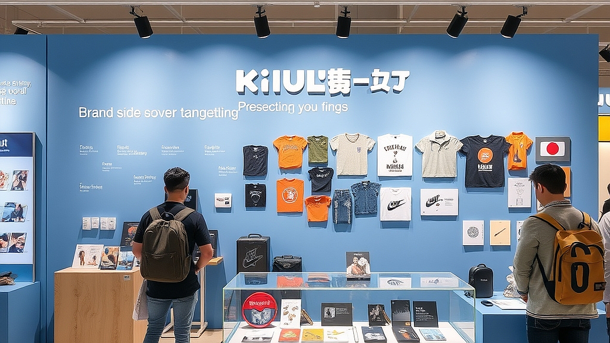

# 키덜트 전시회에서 배우는 브랜드 스토리텔링

키덜트 전시회에서 배우는 브랜드 스토리텔링은 단순히 귀여운 캐릭터를 구경하는 것을 넘어, 팬덤이 어떻게 형성되고 그들이 왜 지갑을 여는지 그 이면의 설계도를 읽어내는 과정입니다. 하반기 들어 팝업스토어와 브랜드 전시가 홍수처럼 쏟아지는 지금, 많은 마케터와 기획자는 "우리도 이런 전시를 하면 팬이 늘어날까?"라는 질문을 던집니다. 하지만 전시 공간에 들어섰을 때 무엇을 관찰해야 할지 모른다면, 그저 화려한 사진 촬영 장소에 다녀온 것에 그치고 맙니다. 

전시회는 브랜드가 가진 무형의 가치를 공간이라는 물리적 언어로 번역하는 작업입니다. 우리가 흔히 접하는 캐릭터 전시는 단순한 상품 나열이 아니라, 브랜드가 독자와 맺고 싶은 관계의 성격, 즉 '세계관'을 구축하는 일종의 무대입니다. 이 글에서는 전시회를 통해 마케팅의 본질을 파악하고, 내 브랜드나 프로젝트에 적용할 수 있는 구체적인 스토리텔링의 기술을 다룹니다. 단순히 전시를 즐기는 관객을 넘어, 그 안에서 비즈니스의 실마리를 찾는 전략적 관점을 공유하겠습니다.

## 관람객의 동선을 따라 읽는 브랜드 가치 전달법

전시회에 들어서면 가장 먼저 확인해야 할 것은 입구에서 출구까지 이어지는 '서사의 흐름'입니다. 잘 설계된 전시는 관람객을 브랜드의 주인공으로 만드는 과정을 밟습니다. 예를 들어, 특정 캐릭터의 탄생 비화를 다루는 전시라면 입구에는 그 캐릭터가 살던 배경을, 중간에는 역경을, 마지막에는 현재의 완성된 모습을 배치합니다. 여기서 중요한 점은 관람객이 각 구간에서 어떤 감정을 느껴야 하는지 명확히 설계되어 있다는 사실입니다.

실제 사례를 들어보겠습니다. 유명 애니메이션 IP를 활용한 전시에서는 입구에서 캐릭터의 일기장을 관람객에게 나눠줍니다. 관람객은 전시 내내 그 일기장의 빈칸을 채우며 캐릭터의 친구가 되는 경험을 합니다. 이는 단순 관람을 '참여형 서사'로 전환하는 강력한 도구입니다. 반면, 실패하는 케이스는 브랜드의 역사만을 나열하는 '박물관식 전시'입니다. 연도별 매출이나 수상 이력을 벽면에 가득 채우면 관람객은 브랜드의 성과를 구경할 뿐, 브랜드와 정서적 유대감을 쌓지 못합니다. 

선택 기준은 명확합니다. '관람객이 이 공간을 나갈 때 어떤 한 문장을 기억하게 할 것인가'입니다. 만약 당신이 기획자라면, 전시의 각 섹션을 지날 때마다 관람객이 스스로 질문을 던지게 만드세요. "이 캐릭터는 왜 여기서 슬퍼했을까?"라는 질문을 던지게 하는 것이 "이 캐릭터는 2010년에 만들어졌다"라고 정보를 주입하는 것보다 훨씬 강력한 스토리텔링입니다. 

## 실전 체크리스트: 전시가 굿즈 구매로 이어지는 이유

전시회 끝자락에는 항상 굿즈 숍이 있습니다. 여기서 우리는 '전시가 어떻게 구매를 유도하는가'에 대한 해답을 찾을 수 있습니다. 성공적인 전시는 굿즈를 단순한 상품이 아니라 '전시의 기억을 박제하는 매개체'로 포장합니다. 관람객이 전시 서사에 깊이 몰입했다면, 굿즈는 단순히 예쁜 물건이 아니라 그 세계관의 일부를 소유하는 행위가 됩니다.

실패하는 전시는 전시 내용과 굿즈가 따로 놉니다. 전시에서는 미래지향적인 기술을 다루는데 굿즈 숍에는 흔한 로고가 박힌 볼펜만 있다면 관람객은 구매 동기를 잃습니다. 굿즈를 선택할 때 고려할 기준은 '전시에서 느낀 감정을 일상으로 가져갈 수 있는가'입니다. 예를 들어, 캐릭터의 위로를 주제로 한 전시라면, 일상에서 지쳤을 때 꺼내 볼 수 있는 작은 피규어나 메모지가 훌륭한 굿즈가 됩니다.

실전 체크리스트를 활용해 보세요. 
1. 전시의 핵심 키워드가 굿즈 패키지에 반영되어 있는가?
2. 굿즈의 가격대가 관람객의 전시 몰입도와 비례하는가? (저관여 상품부터 고관여 상품까지 배치)
3. 굿즈를 구매하는 과정이 전시의 결말과 이어지는가? (예: 전시의 마지막 메시지를 담은 포스트카드)

이 세 가지를 충족하지 못한다면 굿즈 숍은 그저 물건을 파는 창고로 전락합니다. 마케팅 측면에서 볼 때, 굿즈는 브랜드의 철학을 일상으로 연장하는 가장 효과적인 수단임을 기억해야 합니다.

## 브랜드 마케팅에 적용하는 전시 기획의 기술

전시회에서 배운 스토리텔링을 내 비즈니스에 적용하려면 '공간 경험의 구조화'를 시도해야 합니다. 온라인 마케팅이 정보의 전달이라면, 전시적 마케팅은 경험의 전달입니다. 당신의 브랜드가 서비스라면, 사용자가 서비스를 이용하는 과정을 전시의 동선처럼 설계해 보세요. 가입 단계에서 기대감을 주고, 첫 이용에서 성취감을 느끼게 하며, 마지막에 브랜드의 철학을 전달하는 식입니다. 

실패하기 쉬운 부분은 '너무 많은 것을 보여주려는 욕심'입니다. 전시회에서도 정보가 과잉되면 관람객은 피로를 느낍니다. 브랜드 마케팅 역시 마찬가지입니다. 우리 브랜드가 가진 가치를 하나만 정해서 그 가치를 느낄 수 있는 단 하나의 지점을 설계하는 것이 중요합니다. 예를 들어, '친환경'이 핵심 가치라면 매장 전체를 친환경으로 꾸미는 것보다, 고객이 상품을 구매할 때 포장재가 어떻게 자연으로 돌아가는지를 보여주는 '단 하나의 설치물'이 훨씬 기억에 남습니다. 

선택 기준은 '고객의 행동 변화'입니다. 전시를 보고 난 후 관람객이 캐릭터를 한 번 더 검색하거나, 굿즈를 구매하거나, SNS에 인증샷을 올리는 것처럼, 고객이 마케팅 메시지를 접한 뒤 즉각적으로 반응할 수 있는 '행동 유도 지점'을 만드세요. 이를 측정할 때는 단순히 방문자 수에 집중하지 말고, 고객이 브랜드와 얼마나 깊은 상호작용을 했는지, 그 상호작용이 재구매로 이어졌는지를 점검해야 합니다. 실패했을 때는 동선 중간에 고객이 이탈하는 지점이 어디인지, 왜 그 지점에서 브랜드와의 연결고리가 끊어졌는지를 분석해 다음 기획에 반영하는 과정이 필수입니다.

## 결론: 전시의 경험을 내 비즈니스의 자산으로 만드는 법

결국 키덜트 전시회는 브랜드가 팬과 대화하는 가장 밀도 높은 방식 중 하나입니다. 전시회에서 보고 느낀 감정은 단순히 눈을 즐겁게 하는 것을 넘어, 브랜드가 어떤 방식으로 이야기를 전달하고, 그 이야기를 통해 어떻게 수익을 창출하는지를 보여주는 교과서입니다. 

지금 당장 전시회에 가야 할 이유는 명확합니다. 내 브랜드가 고객에게 어떤 '경험'을 제공하고 있는지, 고객이 우리 브랜드의 세계관 속에 머물고 싶어 하는지를 객관적으로 평가하기 위해서입니다. 전시장에서 단순히 사진만 찍고 나오지 마세요. 그 공간이 왜 그런 배치로 구성되었는지, 왜 사람들은 특정 굿즈 앞에서 오래 머무는지 관찰하십시오. 

전시가 끝난 뒤, 당신이 기록해야 할 것은 화려한 장식물이 아니라 '사람들이 어떤 순간에 미소 지었는지'입니다. 그 작은 미소의 순간들이 모여 브랜드의 강력한 팬덤을 만듭니다. 이제 당신의 비즈니스에도 관객을 주인공으로 만드는 스토리텔링을 도입해 보세요. 전시회에서 배운 것처럼 고객의 여정을 설계하고, 그 여정의 끝에 브랜드의 가치를 담은 결과물을 배치하는 것만으로도 고객과의 관계는 이전보다 훨씬 깊어질 것입니다. 지금 바로 기획 중인 프로젝트의 여정을 한 장의 지도로 그려보는 것부터 시작해 보시기 바랍니다.

키덜트 전시회는 단순한 볼거리를 넘어, 브랜드가 고객과 어떻게 깊게 연결될 수 있는지를 보여주는 훌륭한 교과서입니다. 고객이 브랜드의 세계관 속에서 주인공이 되어 즐거움을 느낄 때, 비로소 강력한 팬덤이 탄생하기 때문입니다.

이제 여러분의 차례입니다. 이번 주말, 가까운 전시회장을 찾아 고객의 여정을 면밀히 관찰해 보세요. 단순히 사진을 찍는 것을 넘어, 사람들이 어디서 발걸음을 멈추고 어떤 순간에 미소 짓는지 기록하는 것만으로도 브랜드의 미래를 바꿀 귀중한 인사이트를 얻을 수 있을 것입니다.

거창한 전략을 먼저 고민하기보다, 지금 기획 중인 프로젝트를 한 장의 지도로 그려보세요. 고객이 브랜드와 만나는 모든 접점에 어떤 '경험'을 심어줄지 고민하다 보면, 어느새 고객의 마음속에 깊이 자리 잡은 여러분만의 이야기를 완성하게 될 것입니다. 오늘부터 고객의 여정을 설계하는 즐거운 여정을 시작해 보는 건 어떨까요? 여러분의 브랜드가 누군가에게는 가장 설레는 전시회가 되기를 진심으로 응원합니다.
