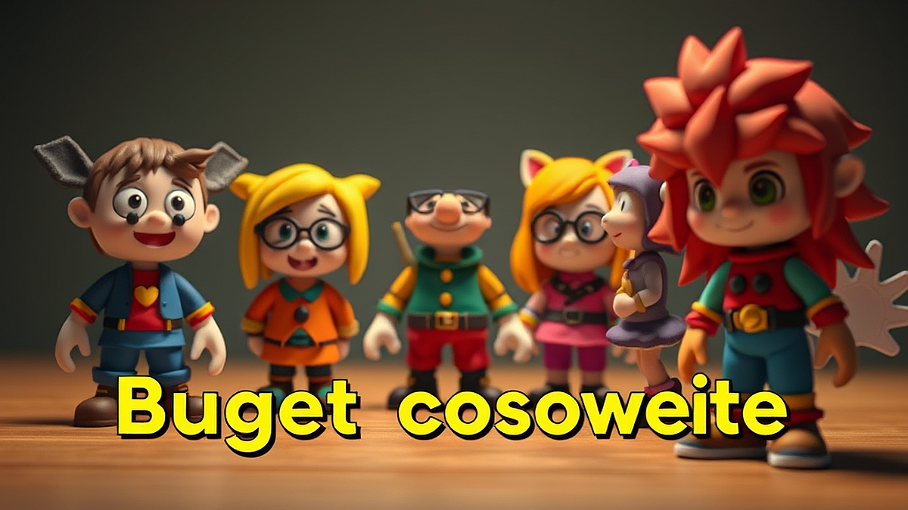

초보 코스어를 위한 저렴한 코스프레 의상 제작 가이드를 준비하며, 제 방 한구석에 가득 쌓인 피규어들을 바라보니 문득 옛날 생각이 납니다. 저도 20대 시절, 처음 코스프레 행사에 도전했을 때가 떠오르거든요. 그때는 돈도 없고 정보도 없어서 동대문 원단 시장을 맨몸으로 헤매고 다녔죠. 지금이야 인터넷으로 뭐든 구할 수 있는 세상이지만, 처음 시작하는 분들에게는 여전히 어디서부터 손을 대야 할지 막막할 겁니다. 저도 처음 만든 의상이 행사장에서 뜯어지는 대참사를 겪어본 사람으로서, 여러분의 지갑은 지키고 퀄리티는 높일 수 있는 실전 팁을 알려드리고 싶어 키보드를 잡았습니다.

## 발품 대신 손품, 재료는 어디서 구할까

코스프레 의상을 만들 때 가장 큰 실수는 처음부터 너무 비싼 원단을 사는 겁니다. 저도 멋모르고 고급 공단 원단을 샀다가 재단 실수로 다 버렸던 뼈아픈 기억이 있어요. 초보자라면 무조건 가성비를 따져야 합니다. 2025년 현재, 온라인 쇼핑몰과 오픈마켓은 보물창고나 다름없습니다. 특히 '코스프레 전용 원단'이라는 이름표가 붙으면 가격이 껑충 뛰는데, 사실 그냥 일반 원단 시장이나 온라인 원단 몰에서 '폴리 에스테르' 혼방 원단을 찾는 게 훨씬 저렴합니다. 

제가 추천하는 팁은 '대용량 자투리 원단'을 활용하는 거예요. 큰 의상을 만드는 게 아니라면, 판매자들이 모아둔 자투리 세트를 구매해보세요. 가격은 몇 천 원 수준인데, 소품이나 장식을 만들기엔 차고 넘칩니다. 그리고 다이소나 문구점에서 파는 '펠트지'나 'EVA 폼'을 무시하지 마세요. 특히 EVA 폼은 저렴한 가격에 비해 가공성이 뛰어나서 갑옷이나 무기 같은 소품을 만들 때 이만한 재료가 없습니다. 저도 처음엔 이걸로 칼을 만들었다가 너무 가벼워서 놀랐던 기억이 나네요. 전문가들도 폼을 겹쳐서 입체감을 내는 방식을 많이 쓰니까, 유튜브에서 'EVA 폼 제작 강좌'를 한 번 찾아보세요. 돈은 들이지 않으면서도 퀄리티는 몇 배로 올라가는 마법을 경험하실 겁니다. 처음부터 완벽하려고 하면 지쳐요. 일단 저렴한 재료로 구조를 잡아보는 것부터 시작하세요.

## 중고 거래와 리폼의 현명한 활용법

가끔 당근마켓이나 코스프레 중고 거래 카페를 보면 눈이 휘둥그레질 때가 있습니다. 누군가 정성스럽게 만든 의상이 헐값에 나오는 경우가 많거든요. 사실 처음부터 바느질을 시작하는 것보다, 기존에 만들어진 의상을 사서 내 몸에 맞게 수선하는 게 훨씬 경제적입니다. 저도 예전에 좋아하던 캐릭터 의상을 직접 만들려다가 포기하고, 중고로 산 뒤에 단추 위치만 바꿔서 성공한 적이 있어요. 

중고 의상을 고를 때는 '원단 재질'을 꼭 확인하세요. 사진상으로는 좋아 보여도 실제로 받으면 싼티가 나는 경우가 있거든요. 그래서 저는 판매자에게 반드시 '원단 근접 촬영 사진'을 요청합니다. 그리고 사이즈는 본인보다 약간 큰 것을 사는 게 좋습니다. 줄이는 건 쉽지만, 늘리는 건 천을 덧대야 해서 난도가 높거든요. 만약 의상이 너무 밋밋하다면 다이소의 레이스나 리본을 사서 덧대보세요. 요즘은 다이소 수예 코너가 정말 잘 나와서, 몇 천 원만 투자해도 의상 분위기가 확 달라집니다. 실패해도 부담 없는 가격이니까요. 

그리고 꼭 기억할 점은 '리세일 가치'입니다. 나중에 코스프레를 그만두거나 캐릭터를 바꿀 때, 내가 공들여 만든 의상을 다시 팔 수 있다면 그건 비용을 아끼는 또 다른 방법이 됩니다. 그러니 의상을 만들 때 너무 내 몸에 딱 맞게 재단하지 말고, 어느 정도 조절이 가능한 끈이나 벨크로를 활용하세요. 나중에 다른 사람에게 팔 때 사이즈 호환성이 좋으면 훨씬 잘 팔리거든요. 이게 바로 40대 수집가의 짠돌이 노하우입니다.

## 실패를 줄이는 제작 순서와 꿀팁

무작정 가위부터 들지 마세요. 이게 제가 가장 강조하고 싶은 부분입니다. 먼저 종이에 도안을 그려보세요. 거창한 설계도가 아니라 그냥 캐릭터 사진을 옆에 두고 내가 만들 파츠를 하나씩 적어보는 겁니다. 상의, 하의, 장식, 소품 식으로요. 저는 처음 시작할 때 의상 전체를 다 만들려고 하다가 중간에 포기하고 의욕을 잃은 적이 많았습니다. 그래서 요즘은 '파츠별 제작'을 추천합니다. 오늘은 상의, 내일은 소품, 이런 식으로 쪼개서 하면 성취감도 생기고 지루하지 않거든요.

그리고 재봉틀이 없다고 걱정하지 마세요. 요즘은 '옷 수선 테이프'가 정말 잘 나옵니다. 다림질만 하면 천과 천이 붙는 테이프인데, 이게 생각보다 튼튼합니다. 바느질이 서툰 초보자들에게는 구세주 같은 존재죠. 저도 급할 때는 이걸로 밑단을 처리하곤 합니다. 다만, 너무 얇은 원단에는 자국이 남을 수 있으니 안 보이는 안감 쪽에 먼저 테스트해보는 센스가 필요합니다.

마지막으로, 의상 완성도보다 중요한 건 '자신감'입니다. 처음에는 누구나 어설픕니다. 제 첫 코스프레 사진을 지금 보면 손발이 오그라들어서 바로 삭제하고 싶을 정도예요. 하지만 그 경험이 쌓여서 지금의 제가 있는 겁니다. 완벽한 의상보다는 내가 좋아하는 캐릭터를 입고 즐기는 그 시간 자체가 소중한 거니까요. 너무 비싼 재료에 집착하지 말고, 지금 당장 집에 있는 재료부터 활용해보세요. 여러분만의 창의적인 해석이 들어간 의상이 가장 멋진 법입니다.

결론적으로, 저렴한 코스프레 의상 제작은 비싼 재료보다는 아이디어와 정성의 싸움입니다. 온라인 몰의 자투리 원단, 다이소의 수예 용품, 그리고 중고 의상의 리폼을 적절히 활용한다면 충분히 가성비 좋은 코스프레를 즐길 수 있습니다. 완벽함보다는 완성에 의의를 두고, 파츠별로 하나씩 만들어가는 재미를 느껴보세요. 여러분의 첫 코스프레가 멋진 추억으로 남기를 진심으로 응원합니다. 오늘 당장 인터넷 창을 열고, 만들고 싶은 캐릭터의 사진을 저장하는 것부터 시작해보는 건 어떨까요? 그 작은 첫걸음이 여러분의 새로운 취미 생활을 더욱 풍성하게 만들어 줄 겁니다. 궁금한 점이 있다면 언제든 물어봐 주세요. 저도 여러분의 열정을 보며 다시금 옛 추억을 떠올릴 수 있어서 참 좋네요. 자, 이제 직접 나만의 의상을 만들어 볼 시간입니다. 용기를 내서 도전해보세요!

## 마치며

결론적으로 저렴한 코스프레 의상 제작은 비싼 재료보다 아이디어와 정성이 핵심입니다. 온라인 자투리 원단, 다이소 수예 용품, 중고 의상 리폼을 활용하면 누구나 가성비 넘치는 멋진 결과물을 만들 수 있습니다. 완벽함보다는 '완성'에 의의를 두고, 파츠를 하나씩 만들어가는 과정 자체를 즐겨보세요.

여러분의 첫 코스프레가 소중한 추억으로 남기를 진심으로 응원합니다. 지금 바로 만들고 싶은 캐릭터의 사진을 저장하는 것부터 시작해보는 건 어떨까요? 그 작은 첫걸음이 여러분의 새로운 취미를 더욱 풍성하게 만들어 줄 거예요. 제작 과정에서 궁금한 점이 생기면 언제든 편하게 물어봐 주세요. 여러분의 열정을 보며 저도 다시금 코스프레의 설렘을 떠올릴 수 있어 참 행복합니다. 자, 이제 직접 나만의 의상을 만들어 볼 시간입니다. 망설이지 말고 용기 있게 도전해보세요!