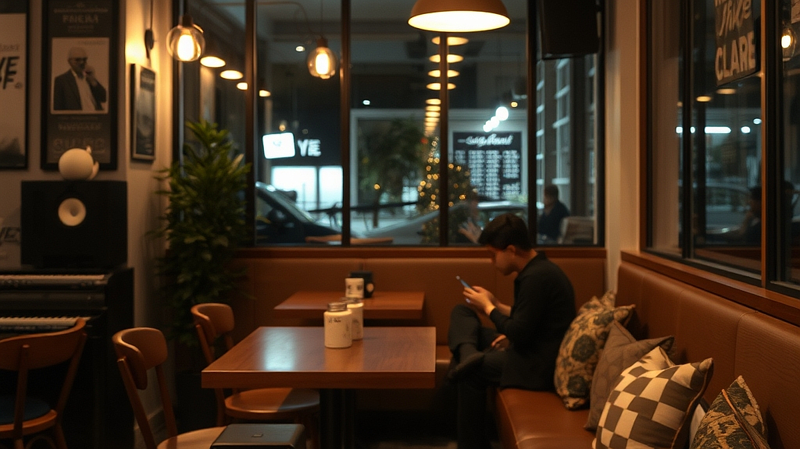

## 공간을 채우는 사운드: 카페 사장들이 선호하는 2026년 플레이리스트 큐레이션

공간음악은 단순히 배경으로 흐르는 소음이 아니라, 그 공간의 온도를 결정하는 핵심적인 브랜드 마케팅 요소입니다. 퇴근 후 나만의 거실을 카페처럼 꾸미고 싶어 하는 분들이 가장 먼저 하는 실수는, 단순히 좋아하는 가수의 앨범을 순서대로 트는 것입니다. 하지만 카페 운영자들이 음악을 고르는 기준은 철저히 '공간의 목적'에 맞춰져 있습니다. 2026년의 트렌드는 소리의 밀도가 낮으면서도 공간의 질감을 해치지 않는 '앰비언트 팝'과 '질감 있는 재즈'의 조화입니다. 본 글에서는 단순히 좋은 노래를 찾는 법이 아니라, 여러분의 거실이라는 좁고 한정된 공간을 어떻게 하면 카페처럼 '브랜드화'할 수 있는지, 그 큐레이션의 원리와 실전 적용법을 다룹니다. 오늘 당장 여러분의 플레이리스트를 수정할 구체적인 기준을 제시하겠습니다.

## 첫 번째 원칙: 공간의 밀도와 음악의 질감 일치시키기

카페 사장들이 가장 먼저 고려하는 것은 공간의 '밀도'입니다. 천장이 낮고 가구로 꽉 찬 좁은 공간에 웅장한 오케스트라 사운드나 비트가 강한 힙합을 틀면, 손님들은 금세 피로감을 느낍니다. 반대로 층고가 높고 여백이 많은 공간에 너무 잔잔한 음악만 틀면 공간이 휑하게 느껴집니다.

집을 카페처럼 꾸미려는 당신에게 필요한 첫 번째 체크 포인트는 '주파수 대역의 선택'입니다. 거실에 소파와 카펫이 많아 소리를 흡수하는 환경이라면, 고음역대가 강조된 악기 구성이 필요합니다. 반면, 바닥이 타일이거나 가구가 적어 울림이 심한 공간이라면 중저음이 부드럽게 깔리는 로파이(Lo-fi) 계열의 음악이 공간의 날카로움을 중화합니다.

실패 케이스는 명확합니다. 보컬이 너무 강렬하게 튀어나오는 라디오 방송을 그대로 틀어두는 경우입니다. 사람의 목소리는 뇌가 가장 민감하게 반응하는 주파수라, 대화가 오가는 공간에서 보컬이 강조된 음악은 소음으로 인식됩니다. 

선택 기준은 이렇습니다. 대화가 중심이 되는 거실이라면 '보컬이 없는 연주곡 비중을 70% 이상'으로 유지하세요. 만약 공간의 분위기를 차분하게 가라앉히고 싶다면, 악기의 수가 3개 이하로 제한된 미니멀한 재즈 트리오 구성을 선택하십시오. 이는 공간의 여백을 소리로 메우되, 결코 방해하지 않는 최적의 밀도를 만듭니다.

## 실전 체크리스트: 큐레이션의 단계별 실행

플레이리스트를 구성할 때 가장 흔히 하는 실수는 시간대별로 같은 템포의 음악을 배치하는 것입니다. 카페는 오전, 오후, 저녁의 조도가 다르듯 음악의 템포도 달라야 합니다.

1단계: 오전 9시~12시 (활력의 시간)
이때는 BPM(분당 박자 수) 90에서 105 사이의 리드미컬한 음악을 배치합니다. 너무 느리면 나른해지고, 너무 빠르면 불안합니다. 어쿠스틱 기타가 중심이 된 팝이나 가벼운 보사노바가 적합합니다.

2단계: 오후 2시~5시 (집중과 휴식의 시간)
가장 중요한 시간입니다. 이때는 BPM 70~80 정도의 다운템포 음악이 좋습니다. 가사가 없는 연주곡 위주로 구성하여 읽기나 작업에 방해되지 않게 합니다.

3단계: 저녁 7시 이후 (분위기의 시간)
조도를 낮추고 재즈, 혹은 소울(Soul) 장르를 활용합니다. 악기의 질감이 강조된, 즉 레코딩 상태가 좋은 고음질 음원을 선택해야 합니다. 저렴한 스피커에서도 소리가 뭉개지지 않는 단순한 구성이 좋습니다.

실전 팁으로, 플레이리스트를 만들 때 '곡 간의 간격'을 확인하세요. 곡이 끝날 때마다 3초 이상의 침묵이 흐르면 공간의 긴장감이 깨집니다. 큐레이션 앱에서 '크로스페이드(Crossfade)' 기능을 5초 정도로 설정해 두면, 곡과 곡 사이가 자연스럽게 이어져 카페 특유의 끊김 없는 사운드 스케이프를 완성할 수 있습니다. 

## 마케팅적 관점에서의 사운드 실험: 무엇이 '좋은' 음악인가

카페 사장들이 음악을 고를 때 사용하는 측정 지표는 '회전율'과 '체류 시간'입니다. 집에서는 '나의 집중력'이 지표가 됩니다. 어떤 음악을 틀었을 때 책을 더 잘 읽는지, 혹은 어떤 음악을 틀었을 때 멍하니 스마트폰만 보게 되는지 스스로 기록해 보세요.

실패 사례는 '너무 익숙한 노래'를 트는 것입니다. 대중 가요 차트 1위 곡은 사람의 뇌를 과거의 기억으로 강제 소환합니다. 카페의 목적은 '현재의 공간'에 집중하게 하는 것인데, 익숙한 노래는 과거의 추억을 불러와 현재의 몰입을 방해합니다. 

선택 기준은 '낯설지만 편안한 것'입니다. 멜로디는 낯설지만 화성학적으로 안정된 음악, 즉 우리가 흔히 말하는 '카페 음악'의 전형을 찾으려면, 특정 아티스트를 검색하기보다 '라이브러리 음악'이나 '인디 레이블'의 샘플러를 활용하는 것이 좋습니다.

마지막으로, 스피커의 위치를 점검하세요. 아무리 좋은 플레이리스트를 준비해도 스피커가 벽을 향해 있거나 바닥에 놓여 있다면 소리는 반사되어 벙벙거립니다. 스피커를 귀 높이와 비슷하게 맞추고, 벽면에서 최소 20cm 정도 떼어놓는 것만으로도 큐레이션의 효과는 배가 됩니다.

결론적으로, 공간을 채우는 음악은 여러분의 취향을 전시하는 것이 아니라, 여러분의 행위를 돕는 배경입니다. 오늘 당장 여러분의 플레이리스트에서 보컬 중심의 곡을 걷어내고, 악기 중심의 연주곡들로 리스트를 재편해 보십시오. 공간의 소음이 정돈되는 순간, 여러분의 집은 비로소 카페라는 브랜드로 완성될 것입니다. 음악은 들으려 애쓰는 것이 아니라, 공간에 자연스럽게 녹아들어야 한다는 사실을 기억하십시오. 오늘 밤, 조도를 낮추고 템포가 낮은 연주곡부터 하나씩 채워나가며 나만의 사운드 브랜딩을 시작해 보길 권합니다.

## 마치며

결국 공간을 완성하는 음악은 단순히 취향을 드러내는 도구가 아니라, 그곳에서 머무는 이들의 시간을 편안하게 감싸는 배경입니다. 보컬이 강조된 곡보다는 악기 중심의 연주곡을 선택하고, 스피커의 위치를 세심하게 조정하는 것만으로도 공간의 공기는 완전히 달라집니다. 음악은 억지로 귀를 기울여야 하는 대상이 아니라, 공간의 일부처럼 자연스럽게 스며들어야 합니다.

이제 여러분의 차례입니다. 오늘 밤, 조명을 조금 낮추고 평소보다 차분한 템포의 연주곡들로 플레이리스트를 새롭게 채워보세요. 작은 변화가 모여 여러분만의 감각적인 사운드 브랜딩이 완성될 것입니다. 정돈된 소음 속에서 비로소 카페처럼 아늑해진 공간을 만끽하며, 나만의 평온한 시간을 즐겨보시길 바랍니다. 오늘부터 여러분의 일상에 기분 좋은 선율을 더해보는 건 어떨까요?
