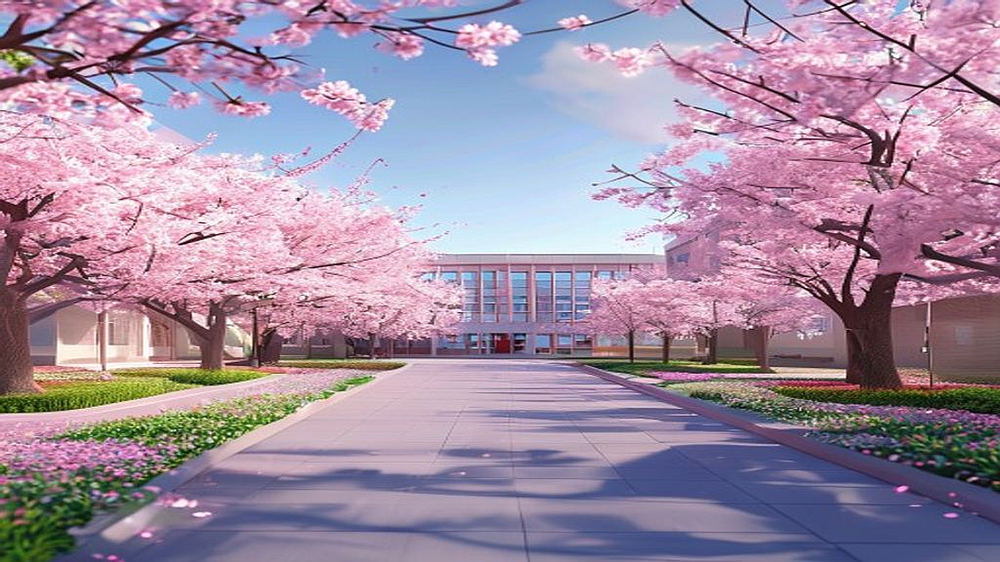

대전 유성구의 넓은 부지에 자리 잡은 충남대는 저 같은 40대 키덜트 수집가에게는 단순한 대학교 이상의 의미를 지닌 공간입니다. 어린 시절 아버지가 사주셨던 첫 레고 세트의 박스를 열었을 때 느꼈던 그 설렘처럼, 충남대 정문을 들어설 때 느껴지는 탁 트인 개방감은 언제나 마음을 들뜨게 하거든요. 벚꽃이 흩날리는 봄날이면 카메라는 물론이고 아끼는 피규어 몇 점을 챙겨 들고 이곳을 찾곤 합니다. 거점 국립대학교라는 듬직한 타이틀 덕분인지, 이곳의 건물들은 마치 튼튼한 다이캐스트 모델처럼 세월이 흘러도 변치 않는 단단한 멋을 풍깁니다. 오늘은 제가 수년 동안 이 근처를 오가며, 그리고 지인들의 경험을 통해 수집한 충남대에 대한 아주 사적이고도 실용적인 정보들을 공유해보려 합니다. 마치 귀한 한정판 피규어의 도색 상태와 관절 강도를 꼼꼼히 리뷰하듯이 말이죠.

## 광활한 캔버스 같은 캠퍼스, 수집가의 눈으로 본 공간의 미학

충남대학교 캠퍼스에 처음 발을 들이면 누구나 그 압도적인 크기에 놀라게 됩니다. 제가 처음 대형 스타워즈 레고 디오라마를 완성했을 때 느꼈던 그 막막하면서도 뿌듯한 기분이 이곳의 지도를 볼 때마다 떠오릅니다. 정문에서 도서관까지 이어지는 직선 도로는 마치 잘 설계된 도시 계획 모델을 보는 것 같습니다. 수집가들에게 공간은 곧 전시의 생명인데, 충남대는 그 넓은 부지를 활용해 각 단과대학 건물을 여유 있게 배치했습니다. 특히 인문대 부근의 고즈넉한 분위기와 공대 쪽의 현대적인 건물들이 이루는 조화는 신구 조화가 잘 된 피규어 컬렉션을 보는 듯한 즐거움을 줍니다.

개인적인 경험담을 하나 보태자면, 저는 몇 년 전 가을에 충남대 중앙도서관 앞 광장에서 출사를 진행한 적이 있습니다. 당시 제가 아끼던 빈티지 로봇 피규어를 들고 갔는데, 도서관의 거대한 외벽을 배경으로 사진을 찍으니 마치 거대 로봇이 도시 한복판에 서 있는 듯한 연출이 가능하더군요. 학교 관계자분들이나 학생들에게 방해가 되지 않는 선에서 조용히 촬영을 마쳤는데, 결과물을 보니 배경이 주는 웅장함이 피규어의 디테일을 한층 살려주었습니다. 이처럼 충남대의 공간은 단순히 공부하는 장소를 넘어, 누군가에게는 영감을 주는 거대한 스튜디오가 되기도 합니다.

하지만 이 넓은 공간은 실용적인 면에서 양날의 검입니다. 신입생들이나 방문객들이 가장 많이 실수하는 부분이 "걸어서 다닐 수 있겠지"라는 안일한 생각입니다. 저도 처음에는 운동 삼아 걷기 시작했다가, 농대 쪽 언덕에서 항복을 선언하고 말았습니다. 마치 부품이 수천 개인 레고를 설명서 없이 조립하려다 지치는 것과 비슷하죠. 그래서 충남대 안을 돌아다니는 노란색 순환 버스는 선택이 아닌 필수입니다. 이 버스 노선을 미리 파악하는 것은 마치 희귀 매물을 구하기 위해 중고 거래 사이트의 알림 설정을 해두는 것만큼이나 중요한 팁입니다.

## 거점 국립대의 가성비와 리세일 가치, 실용적 관점에서의 분석

우리 수집가들은 물건 하나를 살 때도 가격 대비 품질, 즉 가성비를 따지지 않을 수 없습니다. 그리고 나중에 이 물건을 다시 내놓았을 때 어느 정도의 가치를 인정받을 수 있을지, 소위 말하는 리세일 가치도 고민하죠. 충남대학교를 교육이라는 관점에서 보면, 이 가성비와 리세일 가치가 매우 뛰어난 아이템이라고 평가할 수 있습니다. 국립대학교라는 특성상 사립대에 비해 현저히 낮은 등록금은 학부모님들과 학생들에게 엄청난 경제적 이점을 제공합니다. 제가 취미 생활을 위해 용돈을 아끼듯, 이곳에서 절약한 등록금은 자기 계발이나 다른 소중한 경험에 투자할 수 있는 시드머니가 됩니다.

또한 대전과 충청 지역에서 충남대가 가지는 위상은 컬렉션 중에서도 가장 중심이 되는 메인 피규어와 같습니다. 지역 할당제 같은 제도적 이점은 취업 시장에서 강력한 무기가 되는데, 이는 마치 한정판 제품이 특정 지역이나 행사에서만 프리미엄을 받는 것과 비슷한 원리입니다. 제가 아는 후배 중 하나도 충남대를 졸업하고 지역 공기업에 취업했는데, 학교에서 쌓은 인적 네트워크와 지역 내 인지도가 큰 도움이 되었다고 하더군요. 물론 수도권 집중 현상이라는 외부 요인이 변수로 작용하긴 하지만, 거점 국립대라는 브랜드 파워는 여전히 탄탄한 지지층을 보유하고 있습니다.

주변 상권인 궁동과 어은동의 물가 역시 수집가의 지갑을 가볍게 해주지 않는 고마운 요소입니다. 대학가 특유의 저렴하고 양 많은 식당들은 마치 덤으로 끼워주는 보너스 파츠처럼 든든합니다. 저는 가끔 궁동 로데오거리를 걸으며 예전 대학 시절의 향수를 느끼곤 하는데, 그때나 지금이나 학생들의 주머니 사정을 고려한 착한 가게들이 여전히 자리를 지키고 있는 것을 보면 마음이 따뜻해집니다. 실용적인 면에서 볼 때, 충남대는 투입 대비 산출이 명확한, 아주 효율적인 선택지임이 분명합니다.

## 충남대 라이프를 위한 실전 체크리스트와 판단 기준

충남대에 입학을 고려하거나 이 근처에서 생활을 시작하려는 분들을 위해, 저만의 까다로운 수집가적 시선으로 정리한 체크리스트를 준비했습니다. 제품을 구매하기 전 공정상의 하자가 없는지 검수하듯, 다음 항목들을 꼼꼼히 따져보세요.

### 실전 체크리스트: 이것만은 확인하자

1. 전공의 전통과 지원 규모: 충남대는 농생명, 공학, 의약학 분야에서 전통적인 강세를 보입니다. 본인이 희망하는 전공이 학교의 주력 분야인지, 산학 협력은 활발한지 확인하는 것이 마치 제조사의 주력 라인업을 확인하는 것과 같습니다.
2. 기숙사 및 자취 여건: 캠퍼스가 워낙 넓어 기숙사 위치에 따라 수업 강의실까지의 거리가 천차만별입니다. 신축 기숙사와 구형 기숙사의 시설 차이도 존재하므로, 입주 전 사진이나 후기를 꼼꼼히 살피는 디테일이 필요합니다.
3. 교통 및 접근성: 유성온천역에서 학교 정문까지, 그리고 정문에서 각 단과대까지의 거리를 직접 체감해보세요. 전동 킥보드나 자전거가 왜 이곳의 필수 아이템인지 금방 깨닫게 될 것입니다.
4. 지역 인프라 활용도: 대전이라는 도시가 주는 인프라, 특히 인근의 카이스트나 연구단지와의 교류 기회를 얼마나 활용할 수 있는지 따져보세요. 이는 제품의 확장성을 고려하는 것과 같습니다.

### 이런 분들에게 추천합니다

- 실용적인 가치를 중시하며, 경제적인 부담을 줄이고 싶은 분
- 지역 내 탄탄한 기반을 바탕으로 안정적인 진로를 설계하고 싶은 분
- 넓고 쾌적한 캠퍼스 환경에서 여유로운 대학 생활을 즐기고 싶은 분

### 이런 분들은 신중하세요

- 화려한 서울의 대학가 문화를 매일 누리고 싶은 분
- 캠퍼스 내 이동 거리가 긴 것을 극도로 싫어하는 분
- 특정 예술 분야 등 충남대의 주력 라인업이 아닌 전공을 희망하는 분

충남대는 마치 오랜 시간 사랑받아온 클래식한 레고 세트와 같습니다. 화려한 최신 유행을 따르기보다 기본에 충실하고, 시간이 흐를수록 그 가치를 증명해내는 묵직함이 있죠. 제가 수집한 수많은 피규어 중에서도 결국 손이 자주 가는 것은 조형미가 뛰어나고 튼튼한 녀석들인데, 충남대가 바로 그런 학교가 아닐까 싶습니다.

## 추억과 미래가 공존하는 공간에서 보내는 응원

지금까지 40대 키덜트 수집가의 시선으로 충남대학교에 대해 이야기해보았습니다. 저에게 충남대는 벚꽃 사진을 찍으러 가는 출사지이자, 가끔은 젊은 에너지를 충전하러 가는 배터리 같은 곳이기도 합니다. 누군가에게는 이곳이 인생의 가장 빛나는 4년을 보낼 소중한 무대가 되겠지요. 수집품을 관리할 때 먼지를 털어주고 직사광선을 피해주듯, 여러분의 대학 생활도 세심한 관리와 열정이 더해진다면 그 어떤 한정판보다 귀한 가치를 지니게 될 것입니다.

만약 여러분이 충남대를 목표로 공부하고 있거나, 혹은 이곳에서의 새로운 시작을 앞두고 있다면 너무 두려워하지 마세요. 처음 박스를 개봉할 때의 설렘을 간직한 채, 하나씩 부품을 맞춰가다 보면 어느새 멋진 결과물이 완성되어 있을 테니까요. 넓은 캠퍼스만큼이나 여러분의 꿈도 넓게 펼쳐지길 진심으로 응원합니다. 가끔 캠퍼스 어딘가에서 피규어를 세워두고 열심히 사진을 찍고 있는 아저씨를 보신다면, "아, 저 사람이 그 블로그 쓴 사람이구나" 하고 가볍게 웃으며 지나가 주세요.

여러분의 선택이 훗날 되돌아보았을 때 가장 만족스러운 소장품처럼 기억되길 바랍니다. 충남대라는 거대한 세계관 안에서 여러분만의 멋진 에피소드를 만들어가시길 바랍니다. 저도 조만간 다시 카메라를 들고, 이번에 새로 들인 피규어와 함께 충남대의 노을을 담으러 가야겠습니다. 학교 앞 카페에서 마시는 시원한 커피 한 잔의 여유를 기대하며, 오늘 글을 마칩니다. 여러분의 모든 시작을 응원합니다.

## 마치며

충남대학교는 단순히 학문을 탐구하는 공간을 넘어, 여러분이 꿈꾸는 미래라는 조립 키트를 하나씩 완성해 나가는 소중한 제작소와 같습니다. 오늘 소개해 드린 넓은 캠퍼스의 풍경과 그 속에 담긴 다채로운 기회들은 여러분이 멋진 결과물을 만들어낼 수 있도록 돕는 든든한 설계도가 되어줄 것입니다. 처음 박스를 열었을 때의 그 벅찬 설렘을 잊지 마세요. 비록 과정 중에 시행착오가 있더라도, 그 모든 순간이 여러분만의 독창적인 에피소드가 되어 가치 있는 소장품으로 남을 것입니다.

이제 여러분의 차례입니다. 충남대에서의 새로운 시작을 준비하며 가장 기대되는 점은 무엇인가요? 혹은 여러분만이 간직한 특별한 취미나 목표가 있다면 댓글을 통해 자유롭게 들려주세요. 예비 신입생분들의 궁금증이나 재학생분들만의 캠퍼스 꿀팁 공유도 언제나 환영합니다. 서로의 꿈을 응원하며 소통하는 이 공간이 여러분에게 작은 휴식처가 되었으면 합니다.

저는 조만간 카메라 렌즈 너머로 보이는 충남대의 또 다른 매력을 찾아 다시 돌아오겠습니다. 혹시 캠퍼스 산책 중에 피규어와 씨름하며 사진을 찍고 있는 저를 발견하신다면, 반갑게 눈인사라도 나누어 주세요. 여러분의 모든 도전과 선택이 훗날 가장 아름다운 기억으로 남기를 진심으로 응원합니다. 시원한 커피 한 잔과 함께 여유로운 하루 보내시길 바라며, 오늘 글을 마칩니다. 여러분의 찬란한 내일을 응원합니다!