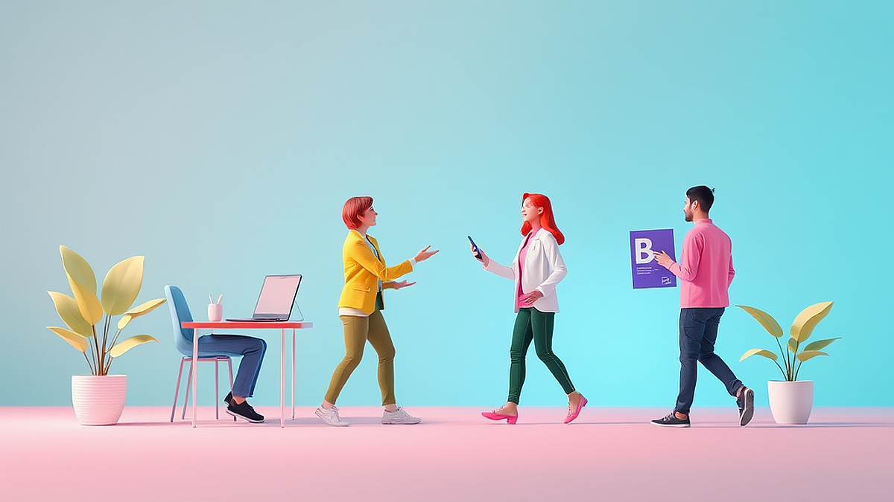

콜라보(Collaboration)라는 단어가 이제는 일상의 배경음악처럼 느껴지는 시대입니다. 편의점에 가도, 패션 편집숍에 가도 '한정판'이라는 딱지가 붙은 협업 제품들이 넘쳐나죠. 저 역시 얼마 전 캐릭터 브랜드와 협업한 텀블러를 사기 위해 아침부터 줄을 섰던 경험이 있습니다. 사실 집에 텀블러가 이미 다섯 개나 있는데 말이죠. 왜 우리는 굳이 아는 브랜드와 아는 캐릭터가 만났을 뿐인데 이토록 열광하는 걸까요? 단순히 예뻐서일까요, 아니면 놓치면 안 된다는 불안감 때문일까요? 라이프스타일 에디터로서 제가 관찰한 최근의 협업 트렌드는 단순히 두 브랜드의 로고를 합치는 수준을 넘어섰습니다. 이제는 소비자들의 취향과 정체성을 대변하는 하나의 문화 현상이 되었죠. 하지만 모든 협업이 성공적인 것은 아닙니다. 때로는 "이게 왜 같이 나왔지?" 싶은 뜬금없는 조합에 당혹감을 느끼기도 하니까요. 오늘 이 글에서는 우리가 왜 콜라보에 열광하는지, 그리고 수많은 선택지 중에서 진짜 가치 있는 '득템'을 구별하는 기준은 무엇인지 제 개인적인 실패담과 함께 깊이 있게 다뤄보려고 합니다.

## 왜 우리는 '낯선 만남'에 기꺼이 지갑을 열까요

우리가 콜라보 제품에 열광하는 가장 큰 이유는 '의외성'이 주는 즐거움 때문입니다. 전혀 어울릴 것 같지 않은 두 영역이 만났을 때 발생하는 스파크가 우리의 호기심을 자극하는 것이죠. 예를 들어 패션 브랜드와 식품 브랜드의 만남을 생각해보세요. 몇 년 전 선풍적인 인기를 끌었던 곰표 밀가루와 맥주의 협업은 그 정점이었습니다. 밀가루 포대의 디자인이 맥주캔으로 옮겨갔을 때 사람들은 그 이질감에서 오는 '힙함'을 느꼈습니다. 이는 단순히 물건을 사는 행위를 넘어, 내가 이 유행을 알고 있고 즐기고 있다는 '문화적 자부심'을 소비하는 것과 같습니다.

브랜드 입장에서도 콜라보는 아주 영리한 전략입니다. 이미 충성도가 높은 팬덤을 가진 두 브랜드가 만나면, 서로의 고객층을 자연스럽게 공유할 수 있기 때문입니다. 제가 좋아하는 신발 브랜드가 제가 즐겨 마시는 음료 브랜드와 협업을 한다면, 저는 고민 없이 그 신발을 선택할 확률이 높습니다. 두 브랜드에 대한 신뢰가 합쳐져 구매 결정의 허들을 낮춰주는 효과가 발생하는 것이죠. 하지만 이런 현상이 가속화되면서 부작용도 생겨났습니다. 브랜드의 철학이나 제품의 본질보다는 오직 '화제성'만을 쫓는 급조된 협업들이 시장에 쏟아져 나오기 시작한 것입니다.

저 역시 이런 화제성에 속아 실패한 경험이 있습니다. 유명 디자이너와 SPA 브랜드가 협업한 코트를 산 적이 있는데, 디자인은 화려했지만 소재가 너무 나빠서 한 시즌도 못 입고 옷장 구석에 처박아두게 되었죠. '디자이너의 감성을 저렴하게 소유한다'는 명분에 눈이 멀어 정작 옷의 기본인 착용감과 내구성을 간과했던 것입니다. 이처럼 콜라보는 우리에게 즐거움을 주기도 하지만, 때로는 냉정한 판단력을 흐리게 만드는 함정이 되기도 합니다.

## 실패하지 않는 콜라보 소비를 위한 핵심 기준

그렇다면 수많은 콜라보의 홍수 속에서 우리는 어떤 기준으로 제품을 골라야 할까요? 제가 수많은 시행착오 끝에 세운 첫 번째 기준은 '디자인의 융합도'입니다. 단순히 하얀 티셔츠에 유명 캐릭터 로고 하나만 덜렁 박혀 있는 제품은 진정한 콜라보라고 보기 어렵습니다. 이는 브랜드의 창의성을 빌린 것이 아니라 이름값을 빌린 것에 불과하기 때문입니다. 진정으로 가치 있는 협업은 두 브랜드의 정체성이 제품의 디테일에 얼마나 잘 녹아 있는지를 봐야 합니다. 젠틀몬스터와 메종 마르지엘라의 협업처럼, 안경테의 실루엣부터 케이스의 질감까지 두 브랜드의 미학이 충돌하고 섞이는 과정이 눈에 보여야 합니다.

두 번째는 '희소성의 가치'를 냉정하게 따져보는 것입니다. 많은 브랜드가 '한정판'이라는 타이틀을 걸고 나오지만, 실제로는 수량이 넉넉하거나 나중에 비슷한 디자인이 다시 출시되는 경우가 많습니다. 정말로 소장 가치가 있는 제품인지, 아니면 마케팅 상술에 의한 인위적인 희소성인지를 구분해야 합니다. 저는 구매 전에 스스로에게 묻습니다. "만약 이 제품에 저 로고가 없더라도 나는 이 가격에 이 물건을 살 것인가?" 이 질문에 즉답하지 못한다면 그 소비는 브랜드의 이름값에 휘둘리고 있을 가능성이 큽니다.

세 번째는 '기능적 완성도'입니다. 콜라보 제품은 디자인에 치중하다 보니 정작 원래 제품이 가져야 할 기능을 놓치는 경우가 많습니다. 캐릭터와 협업한 가전제품이 예쁘긴 한데 조작이 불편하다거나, 유명 아티스트가 디자인한 신발이 발이 너무 아프다면 그것은 좋은 제품이라고 할 수 없습니다. 특히 고가의 제품일수록 디자인적 허영심보다는 실용적인 가치를 우선순위에 두어야 합니다. 취미를 위해 큰돈을 쓰는 만큼, 그 물건이 제 역할을 다할 때 만족감도 오래 지속되기 때문입니다.

### 실전 체크리스트: 결제 버튼을 누르기 전 확인하세요

*   **브랜드 정체성 확인:** 두 브랜드의 만남이 자연스러운가, 아니면 억지스러운가?
*   **소재와 마감:** 콜라보라는 이름 뒤에 저렴한 소재를 숨기고 있지는 않은가?
*   **단독 모델 여부:** 기존 제품에 로고만 바꾼 것인가, 아니면 이 협업만을 위해 새로 설계된 모델인가?
*   **지속 가능성:** 유행이 지난 1년 뒤에도 이 물건을 꺼내 쓸 자신이 있는가?
*   **가격 적정성:** 협업 비용으로 인해 가격이 비합리적으로 높게 책정되지는 않았는가?

## 에디터의 솔직한 고백, 이런 협업은 일단 멈추세요

제가 가장 경계하는 콜라보 중 하나는 '리셀(Resell) 시장'을 겨냥한 노골적인 마케팅입니다. 제품의 가치보다 중고 시장에서의 프리미엄이 더 강조되는 순간, 그 제품은 취미를 위한 도구가 아니라 투기 수단이 되어버립니다. 이런 분위기에 휩쓸려 구매하게 되면, 물건을 아끼고 사용하는 즐거움보다는 가격 변동에 일희일비하게 됩니다. 저는 운동화 콜라보 열풍이 한창일 때 인기 모델을 어렵게 구했지만, 가격이 떨어질까 봐 신지도 못하고 신발장에 모셔두기만 했던 적이 있습니다. 결국 그 신발은 제 발을 감싸주는 편안함 대신 스트레스만 안겨주었죠.

또한, '브랜드의 남발'이 느껴지는 협업도 피해야 합니다. 한 브랜드가 매달 다른 파트너와 새로운 콜라보를 내놓는다면, 그것은 브랜드의 철학이 확고하지 않다는 증거일 수 있습니다. 이런 경우 제품의 질보다는 양으로 승부하려는 경향이 강해 실망스러운 결과물을 마주할 확률이 높습니다. 진정성 있는 브랜드는 자신의 가치를 훼손하지 않기 위해 협업 파트너를 고르는 데 매우 신중합니다. 1년에 단 한 번, 혹은 몇 년에 한 번씩 나오는 협업이 더 기다려지고 가치 있는 이유입니다.

마지막으로 본인의 라이프스타일과 전혀 맞지 않는 협업 제품도 주의해야 합니다. 캠핑을 전혀 하지 않는 사람이 유명 캠핑 브랜드와 패션 브랜드의 콜라보 텐트를 사는 것, 혹은 요리를 즐기지 않는 사람이 셰프와 협업한 주방용품 세트를 사는 것은 전형적인 '과잉 소비'입니다. 콜라보는 나의 취미를 더 풍성하게 만들어주는 양념이어야지, 주객이 전도되어 필요 없는 취미를 억지로 만들게 해서는 안 됩니다.

## 나만의 취향을 완성하는 실전 가이드

성공적인 콜라보 소비를 위해서는 나만의 '필터'를 만드는 과정이 필요합니다. 저는 새로운 협업 소식이 들려오면 바로 예약 페이지를 새로고침하는 대신, 며칠간 그 제품이 제 일상에 들어왔을 때의 모습을 상상해봅니다. 제가 가진 기존의 물건들과 잘 어우러지는지, 그리고 제가 그 물건을 사용하는 구체적인 장면이 떠오르는지를 확인하는 것이죠. 만약 그 장면이 명확하지 않다면, 그것은 제품이 아니라 이미지를 사고 싶은 욕구일 뿐입니다.

또한, 콜라보 제품을 구매할 때는 '오리지널 브랜드의 역사'를 먼저 공부해보는 것을 추천합니다. 그 브랜드가 왜 유명한지, 어떤 기술력을 가지고 있는지를 알게 되면 협업 제품에서 무엇을 중점적으로 봐야 할지 눈이 뜨입니다. 예를 들어 기능성 의류 브랜드와 협업한 재킷을 살 때, 그 브랜드의 고유한 방수 기술이나 봉제 방식이 협업 제품에도 그대로 적용되었는지를 확인하는 식입니다. 아는 만큼 보이고, 아는 만큼 좋은 물건을 고를 수 있습니다.

### 구매 판단 기준: 이런 분에게 추천합니다

1.  **확고한 팬덤을 가진 분:** 평소 애정하던 두 브랜드가 만났다면, 그것은 단순한 소비 이상의 기념비적인 사건이 됩니다.
2.  **새로운 스타일을 시도하고 싶은 분:** 혼자서는 시도하기 어려웠던 과감한 디자인도 콜라보라는 틀 안에서는 조금 더 편안하게 도전해볼 수 있습니다.
3.  **수집의 즐거움을 아는 분:** 특정 테마나 아티스트의 작업물을 모으는 분들에게 콜라보는 컬렉션의 완성도를 높여주는 중요한 퍼즐 조각입니다.

### 이런 상황이라면 구매를 피하세요

1.  **단순히 '한정판'이라서 끌릴 때:** 품절 임박이라는 문구에 마음이 조급해진다면 잠시 스마트폰을 내려놓으세요.
2.  **원래 가격보다 리셀가가 너무 높을 때:** 거품 낀 가격으로 구매하는 것은 합리적인 취미 생활이 아닙니다.
3.  **제품의 기본 정보가 부족할 때:** 상세 페이지에 소재나 사이즈 정보보다 화보 사진만 가득하다면 품질을 의심해봐야 합니다.

## 마치며: 콜라보는 취향의 발견이어야 합니다

콜라보 제품을 산다는 것은 단순히 물건 하나를 추가하는 행위가 아닙니다. 그것은 두 브랜드가 제안하는 새로운 세계관에 발을 들이는 것이고, 그 안에서 나의 취향을 다시 한번 확인하는 과정입니다. 쏟아지는 협업의 홍수 속에서 우리가 잃지 말아야 할 것은 '나만의 중심'입니다. 남들이 다 사니까, 혹은 지금 아니면 못 사니까 구매하는 것이 아니라, 정말로 내 삶을 즐겁게 해줄 수 있는 물건인지를 먼저 고민해야 합니다.

저의 실패담이 여러분에게 작은 이정표가 되었으면 좋겠습니다. 저 역시 수많은 '예쁜 쓰레기'를 사 모으며 배운 것은, 결국 오래 곁에 남는 것은 이름값이 아니라 본질에 충실한 물건이라는 사실이었습니다. 다음번에 매력적인 콜라보 소식을 접하신다면, 잠시 숨을 고르고 제가 말씀드린 체크리스트를 떠올려보세요. 그 고민의 시간이 여러분의 취향을 더욱 단단하고 깊게 만들어줄 것입니다. 진정한 득템은 결제하는 순간이 아니라, 그 물건을 꺼내 쓸 때마다 기분이 좋아지는 그 경험 속에 있으니까요. 오늘 여러분의 장바구니에 담긴 그 제품이 단순한 유행의 조각이 아닌, 여러분의 라이프스타일을 빛내주는 소중한 조각이 되기를 진심으로 바랍니다.

콜라보레이션은 분명 우리 일상에 신선한 자극과 즐거움을 주는 흥미로운 이벤트입니다. 하지만 화려한 브랜드의 이름과 마케팅 뒤에 숨겨진 제품의 본질을 꿰뚫어 보는 안목이 그 어느 때보다 필요한 시점이기도 합니다. 결국 중요한 것은 남들의 시선이나 '한정판'이라는 타이틀이 아니라, 그 물건이 나의 공간과 시간 속에서 어떤 가치를 지니느냐 하는 점입니다. 제가 앞서 공유해 드린 체크리스트를 통해 충동적인 소비는 조금씩 줄여나가고, 여러분의 고유한 취향을 온전히 담아낼 수 있는 현명한 선택을 차근차근 이어가시길 바랍니다.

이제 여러분의 소중한 이야기도 궁금합니다. 최근 여러분의 마음을 강력하게 흔들었던 콜라보 소식은 무엇이었나요? 혹은 나만의 쇼핑 실패를 줄여주는 특별한 구매 기준이 있다면 댓글로 자유롭게 공유해 주시기 바랍니다. 서로의 고민과 노하우를 나누다 보면, 복잡한 유행의 홍수 속에서도 각자의 색깔이 더욱 선명해지는 기분 좋은 경험을 하실 수 있을 거예요.

단순한 소유를 넘어 나의 삶을 진정으로 풍요롭게 만드는 '진정한 득템'의 기쁨을 매일 누리시길 진심으로 응원합니다. 저는 다음번에도 여러분의 라이프스타일에 작은 영감을 더해줄 수 있는 유익하고 따뜻한 이야기로 다시 찾아오겠습니다. 긴 글 끝까지 함께해주셔서 감사합니다. 오늘도 여러분만의 취향이 가득 담긴 편안하고 행복한 하루 보내시길 바랍니다!