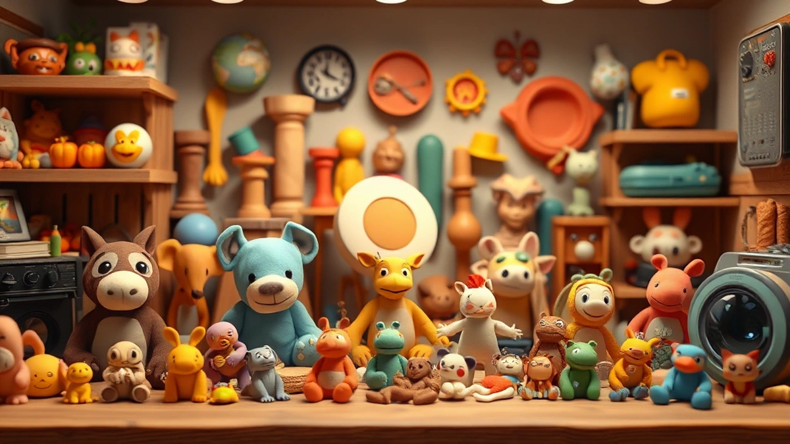

수집, 그 단어만 들어도 가슴 한편이 몽글몽글해지는 40대 키덜트 수집가입니다. 어릴 적 용돈을 모아 겨우 손에 넣었던 장난감부터, 이제는 제법 묵직한 무게감으로 책장을 가득 채운 레고 모듈러 건물들, 그리고 섬세한 조형미가 돋보이는 액션 피규어들까지, 제 주변은 온통 추억과 열정의 흔적으로 가득합니다. 단순히 물건을 모으는 행위를 넘어, 저에게 수집은 어린 시절의 저와 다시 만나는 소중한 시간이며, 팍팍한 일상 속에서 잠시나마 동심으로 돌아가게 해주는 마법 같은 취미입니다. 오늘은 여러분과 함께 제가 걸어온 수집의 길, 그 속에서 느꼈던 기쁨과 아쉬움, 그리고 2025년의 최신 트렌드까지 솔직하고 담백하게 이야기 나누고 싶습니다. 제 이야기가 여러분의 수집 여정에도 작은 영감이나마 될 수 있다면 정말 기쁠 것 같습니다.

## 추억을 쫓는 설렘, 키덜트 수집의 시작

제 수집의 역사는 아마도 어린 시절, 동네 문방구 유리 진열장 너머로 빛나던 로봇 장난감을 하염없이 바라보던 그 순간부터 시작되었을 겁니다. 그 당시에는 부모님께 졸라도 좀처럼 허락되지 않았던 고가의 장난감들은 제 마음속 깊이 '언젠가 꼭 갖고 말 거야'라는 씨앗을 심어주었죠. 그렇게 시간은 흘러 어른이 되었고, 경제적인 여유가 조금씩 생기면서 그 씨앗은 싹을 틔우기 시작했습니다. 처음에는 우연히 인터넷에서 어린 시절 즐겨 보던 애니메이션의 주인공 피규어를 발견했어요. 사진을 보는 순간, "아, 이거 진짜 갖고 싶었는데!" 하는 탄성이 절로 나오더군요. 망설임 없이 구매 버튼을 눌렀고, 며칠 뒤 택배 상자를 뜯었을 때의 그 벅찬 감격은 아직도 생생합니다. 손에 든 피규어는 단순한 플라스틱 조각이 아니라, 잊고 지냈던 어린 시절의 저를 현재로 불러오는 타임머신 같았습니다.

그때부터였어요. 잠자고 있던 키덜트 본능이 깨어나면서 본격적인 수집의 세계로 빠져들게 된 건 말이죠. 처음에는 그저 어린 시절의 '한'을 풀기 위해 마구잡이로 구매했습니다. 추억 속에 있던 모든 것을 다 제 품에 안고 싶었으니까요. 문방구 앞에서 침만 흘리던 그 시절의 아쉬움을 채우듯, 이것저것 가리지 않고 사 모으기 시작했습니다. 그러다 보니 어느새 제 방은 발 디딜 틈 없이 장난감으로 가득 차 버렸고, 통장 잔고는 물론, 아내의 눈치까지 보는 지경에 이르렀습니다. 심지어 똑같은 캐릭터인데 포즈만 다른 피규어를 몇 개씩이나 사 모으기도 했어요. 그때는 그게 왜 그렇게 중요했는지 모르겠습니다. 지금 와서 생각해보면, 그저 채워지지 않던 어린 시절의 결핍을 과도하게 보상받으려 했던 것 같아요.

하지만 이런 시행착오를 겪으면서 저만의 수집 철학이 생기기 시작했습니다. 단순히 '갖고 싶었던 것'을 넘어 '진정으로 소장하고 싶은 것'이 무엇인지 고민하게 된 거죠. 더 이상 무분별한 구매는 하지 않게 되었습니다. 대신 특정 시리즈나 테마를 정하고, 그 안에서 희소성과 조형미, 그리고 무엇보다 저에게 주는 감성적인 가치를 깊이 따져보게 되었죠. 예를 들어, 저는 특정 시대의 로봇 애니메이션 피규어와 레고 모듈러 시리즈에 집중하기 시작했습니다. 각 시리즈마다 스토리가 있고, 완성했을 때의 성취감이나 전시했을 때의 만족감이 남달랐거든요. 특히 레고 모듈러는 브릭 하나하나를 조립하면서 무언가를 창조하는 기쁨을 주고, 완성된 건물을 보면 마치 작은 도시를 소유한 듯한 기분이 듭니다. 어린 시절, 작은 블록으로 나만의 성을 만들던 추억이 그대로 이어지는 느낌이랄까요.

이런 과정을 통해 수집은 저에게 단순히 물건을 모으는 취미가 아닌, 스트레스 해소와 정서적 안정감을 주는 중요한 삶의 일부가 되었습니다. 복잡한 생각에 잠겨 있을 때, 피규어 진열장을 정리하거나 레고 브릭을 조립하다 보면 어느새 마음이 평온해지는 것을 느낍니다. 마치 어린 시절로 돌아가 아무 걱정 없이 놀이에 몰두하는 아이처럼요. 저에게 수집은 과거의 저를 만나 위로하고, 현재의 저에게 활력을 불어넣는 소중한 행위입니다. 여러분도 혹시 어린 시절의 추억이 담긴 어떤 물건이 있다면, 그 작은 설렘을 다시 한번 느껴보는 건 어떠실까요?

## 현명한 수집가를 위한 실전 가이드: 가치와 품질을 보는 눈

수집을 단순히 감성적인 영역으로만 생각하면 큰 오산입니다. 저처럼 무턱대고 달려들었다가 통장 잔고가 텅 비는 경험을 할 수도 있거든요. 그래서 이제는 좀 더 현명하고 실용적인 관점에서 수집을 바라보는 노하우를 여러분과 공유하고 싶습니다. 특히 2025년 현재, 수집 시장은 과거와는 비교할 수 없을 정도로 다양하고 복잡해졌기 때문에, '가치와 품질을 보는 눈'을 키우는 것이 정말 중요합니다.

가장 먼저 고려해야 할 것은 **가격 대비 품질**입니다. 비싸다고 무조건 좋은 것은 아닙니다. 저는 예전에 한정판이라는 말에 현혹되어 고가의 피규어를 구매한 적이 있습니다. 그런데 막상 받아보니 도색 상태가 엉망이거나 관절이 헐거운 경우가 있었죠. 그때의 실망감이란 이루 말할 수 없었습니다. 이후로는 구매 전에 반드시 **온라인 리뷰나 유튜브 언박싱 영상**을 꼼꼼히 찾아봅니다. 특히 실제 구매자들의 후기는 제품의 마감 상태, 재질, 가동성 등 중요한 정보를 제공해줍니다. 또, 신뢰할 수 있는 커뮤니티에서 정보를 얻는 것도 좋은 방법입니다. 간혹 사진만 보고 구매했다가 실제 제품과 너무 달라서 후회하는 경우가 있는데, 이런 불상사를 막기 위해선 사전 조사가 필수입니다.

다음으로 중요한 것이 바로 **리세일(Resale) 가치**, 즉 재판매 가치입니다. 모든 수집품이 시간이 지난다고 해서 가치가 오르는 것은 아닙니다. 오히려 대부분의 제품은 시간이 지날수록 가치가 하락하죠. 하지만 특정 조건들을 만족하는 수집품은 시간이 지날수록 그 가치가 상승하기도 합니다. 제가 경험한 바로는 **희소성, 브랜드 인지도, 제품의 상태, 그리고 한정판 여부**가 가장 큰 영향을 미칩니다. 예를 들어, 특정 브랜드의 한정판 레고 세트나 유명 작가의 아트 토이는 출시 당시보다 몇 배나 높은 가격에 거래되는 경우가 많습니다. 저는 이런 제품들을 구매할 때는 단순히 소장 가치뿐만 아니라, 나중에 혹시라도 판매하게 될 경우를 대비해 **원 박스를 보관하고, 제품의 손상을 최소화하며 관리**합니다. 박스 상태가 좋지 않거나 구성품 중 하나라도 없으면 가치가 크게 떨어지거든요. 포장 박스까지도 수집품의 일부라고 생각하는 마음가짐이 필요합니다.

2025년 수집 시장의 트렌드도 주목할 필요가 있습니다.
첫째, **레트로와 노스탤지어**는 여전히 강력한 키워드입니다. 8090세대뿐만 아니라 MZ세대까지도 과거의 감성을 찾아 빈티지 토이나 복각판 제품에 열광하고 있습니다. 저도 어릴 적 즐겨 보던 만화 캐릭터의 복각판 피규어를 구매하며 그 시절의 향수를 느끼곤 합니다. 단순히 옛날 제품을 다시 만드는 것을 넘어, 현대적인 기술과 디자인을 접목하여 새로운 가치를 창출하는 방식이 인기를 끌고 있습니다.
둘째, **지속 가능성**이 중요한 트렌드로 떠오르고 있습니다. 환경 보호에 대한 인식이 높아지면서, 재활용 소재로 만들어진 피규어나 업사이클링 아트 토이처럼 친환경적인 수집품에 대한 관심이 커지고 있습니다. 이런 제품들은 단순한 수집품을 넘어 사회적 메시지를 담고 있어 더욱 특별한 의미를 가집니다. 저도 최근에는 환경 친화적인 소재로 만들어진 제품들을 눈여겨보고 있습니다.
셋째, **디지털과 물리적 수집품의 결합**입니다. 단순한 피규어에 그치지 않고, 스마트폰 앱과 연동되어 증강현실(AR)을 통해 새로운 경험을 제공하거나, 제품별 고유 시리얼 넘버를 통해 온라인 커뮤니티에서 특별한 혜택을 제공하는 방식 등이 대표적입니다. 예를 들어, 제가 최근 구매한 한 피규어는 전용 앱을 통해 피규어의 배경 스토리를 감상하고, 다른 유저들과 소통하며 정보를 교환할 수 있는 기능이 있습니다. 이는 수집의 경험을 한층 더 풍부하게 만들어줍니다.

이 외에도 **커스터마이징(Customizing) 수집품**의 인기가 높아지고 있습니다. 나만의 개성을 담아 직접 도색하거나 부품을 교체하는 등 세상에 하나뿐인 수집품을 만드는 것에 매력을 느끼는 사람들이 많아지고 있는 거죠. 저도 언젠가는 직접 피규어를 커스터마이징 해보고 싶은 욕심이 있습니다. 이처럼 수집 시장은 끊임없이 변화하고 진화하고 있습니다. 단순히 물건을 모으는 것을 넘어, 시장의 흐름을 읽고 현명하게 접근한다면 여러분의 수집 생활은 훨씬 더 풍요롭고 즐거워질 것입니다. 저의 실패담을 거울 삼아 여러분은 더욱 성공적인 수집가가 되시길 바랍니다.

## 수집, 그 이상의 가치: 삶을 풍요롭게 하는 취미

수집은 단순히 물건을 모으고 진열하는 행위를 넘어, 우리의 삶을 다채롭게 채워주는 깊이 있는 취미입니다. 처음에는 단순히 어린 시절의 결핍을 채우기 위해 시작했지만, 시간이 흐르면서 저는 수집이 주는 다양한 부가적인 가치들을 발견하게 되었습니다. 이 가치들은 제 삶을 더욱 풍요롭고 의미 있게 만들어 주었죠.

가장 먼저 이야기하고 싶은 것은 바로 **커뮤니티의 힘**입니다. 수집을 시작하기 전에는 제가 이렇게 많은 사람들과 교류하게 될 줄은 상상도 못 했습니다. 온라인 커뮤니티나 오프라인 모임을 통해 저와 같은 취미를 가진 사람들을 만나면서 새로운 세상이 열렸습니다. 같은 제품을 보고 감탄하고, 서로의 수집품을 자랑하며 정보를 공유하는 과정은 정말 즐겁습니다. "아, 이 제품은 제가 정말 찾던 건데!"라며 서로의 열정에 공감하고, 때로는 구하기 어려운 제품을 교환하거나 공동 구매를 통해 더 저렴하게 구매하는 기회도 얻게 됩니다. 한번은 제가 오랫동안 찾던 레고 브릭이 있었는데, 커뮤니티 회원 한 분이 여유분이 있다며 흔쾌히 나눠주셔서 정말 감동받았던 기억이 있습니다. 단순히 물건을 넘어 사람과 사람을 이어주는 연결고리가 되는 것이죠. 이런 교류를 통해 저는 취미를 공유하는 친구들을 얻었고, 혼자 즐기던 취미가 함께 즐기는 문화로 발전하는 것을 경험했습니다.

수집은 또한 **새로운 지식과 기술을 배우는 기회**를 제공합니다. 특정 피규어나 레고 세트를 수집하다 보면, 그 배경이 되는 애니메이션의 역사, 디자인 철학, 심지어는 제조 과정에 대한 깊이 있는 지식까지 탐구하게 됩니다. 예를 들어, 저는 로봇 피규어를 수집하면서 일본 애니메이션의 황금기에 대한 이해를 높였고, 각 로봇 디자이너들의 특징적인 스타일까지 파악하게 되었습니다. 레고 모듈러를 조립하면서는 건축물의 구조나 미니어처 표현 방식에 대한 섬세한 관찰력을 기를 수 있었죠. 때로는 손상된 수집품을 직접 수리하거나 커스터마이징을 시도하면서 도색 기술이나 조립 기술을 익히기도 합니다. 이런 과정은 단순히 수집품을 소유하는 것을 넘어, 스스로를 발전시키는 자기 계발의 과정이 됩니다. 인내심을 기르고, 문제 해결 능력을 향상시키는 데도 큰 도움이 됩니다.

그리고 빼놓을 수 없는 것이 바로 **심미적 만족감**입니다. 잘 정리된 진열장 속에서 빛나는 수집품들을 보면 마음이 저절로 평화로워집니다. 저는 제 거실 한쪽 벽면을 수집품 전시 공간으로 꾸며 놓았습니다. 각각의 피규어나 레고 세트가 마치 작은 예술 작품처럼 존재감을 뽐내고 있죠. 퇴근 후 지친 몸을 이끌고 집에 돌아와 이 공간을 바라보면, 하루의 피로가 싹 가시는 듯한 기분이 듭니다. 어떤 날은 좋아하는 음악을 틀어놓고 따뜻한 차 한 잔과 함께 수집품들을 하나하나 살펴보며 그 속에 담긴 추억을 되새기기도 합니다. 이 공간은 저만의 작은 박물관이자 갤러리이며, 저의 취향과 개성을 고스란히 담고 있는 특별한 장소입니다. 손님들이 집에 오면 가장 먼저 이 진열장을 보고 감탄하는데, 그때마다 뿌듯함과 자부심을 느낍니다. 수집품은 단순한 물건이 아니라, 제 삶의 공간을 풍요롭게 만들어주는 인테리어 요소이자 저의 정체성을 드러내는 예술 작품인 셈입니다.

물론, 수집이 항상 즐겁기만 한 것은 아닙니다. 때로는 과도한 지출로 인한 재정적 압박, 한정된 공간 문제, 그리고 가족과의 갈등 같은 어려움에 직면하기도 합니다. 저 역시 이런 문제들로 아내와 실랑이를 벌인 적이 한두 번이 아닙니다. 그때마다 수집의 즐거움과 현실적인 책임감 사이에서 균형을 잡는 것이 얼마나 중요한지 깨닫습니다. 이제는 무분별한 구매 대신, **예산을 정하고 신중하게 선택하며, 새로운 수집품을 들일 때는 기존의 것을 정리하는 등 나름의 원칙**을 세웠습니다. 수집은 분명 즐겁고 가치 있는 취미이지만, 그것이 우리의 삶을 압도하지 않도록 현명하게 관리하는 지혜가 필요합니다.

수집은 저에게 과거를 추억하고, 현재를 즐기며, 미래를 꿈꾸게 하는 소중한 행위입니다. 단순히 물건을 모으는 것을 넘어, 사람들과 소통하고, 새로운 것을 배우며, 삶의 공간을 아름답게 꾸미는 다층적인 가치를 제공합니다. 여러분의 삶 속에서도 수집이 단순한 취미를 넘어, 이처럼 깊고 풍요로운 의미를 지니게 되기를 진심으로 바랍니다.

수집은 단순히 물건을 모으는 행위를 넘어, 우리 내면의 어린아이를 만나게 하고, 잊고 지냈던 추억을 되살려주는 마법 같은 취미입니다. 저의 오랜 수집 경험을 통해, 처음에는 감성적인 끌림으로 시작했지만, 점차 현명한 선택과 관리가 필요하다는 것을 깨달았습니다. 가격 대비 품질, 리세일 가치, 그리고 2025년의 최신 트렌드를 파악하는 안목을 기르는 것이 중요하죠. 하지만 무엇보다 중요한 것은 수집이 주는 깊은 만족감과 삶의 풍요로움입니다. 같은 취미를 공유하는 사람들과의 소통, 새로운 지식을 얻는 기쁨, 그리고 나만의 공간을 아름답게 꾸미는 심미적 만족감까지, 수집은 우리에게 생각보다 훨씬 더 많은 것을 선사합니다. 여러분도 이 글을 통해 수집의 진정한 가치를 발견하고, 자신만의 특별한 수집 여정을 시작하거나 더욱 풍요롭게 이어가시길 바랍니다. 혹시 여러분만의 특별한 수집품이나 재미있는 에피소드가 있다면 댓글로 함께 나눠주세요.

## 마치며

수집은 단순한 물건 모으기를 넘어, 우리 삶에 깊은 만족감과 풍요로움을 더하는 마법 같은 여정입니다. 내면의 어린아이를 만나 추억을 되살리고, 현명한 선택과 관리를 통해 가치를 높이는 지혜를 얻는 과정이죠. 가격이나 트렌드 파악도 중요하지만, 진정한 가치는 같은 취미를 공유하는 이들과의 소통, 새로운 지식 습득, 그리고 나만의 공간을 아름답게 꾸미는 심미적 만족감에 있습니다.

이 글이 여러분의 수집 여정을 시작하거나 더욱 풍요롭게 하는 계기가 되기를 진심으로 바랍니다. 일상에 즐거움과 영감을 더할 수집의 세계로 함께 떠나요! 여러분만의 소중한 수집품이나 재미있는 에피소드가 있다면 댓글로 자유롭게 나눠주세요. 다음 포스팅에서 더 흥미로운 이야기로 찾아뵙겠습니다!