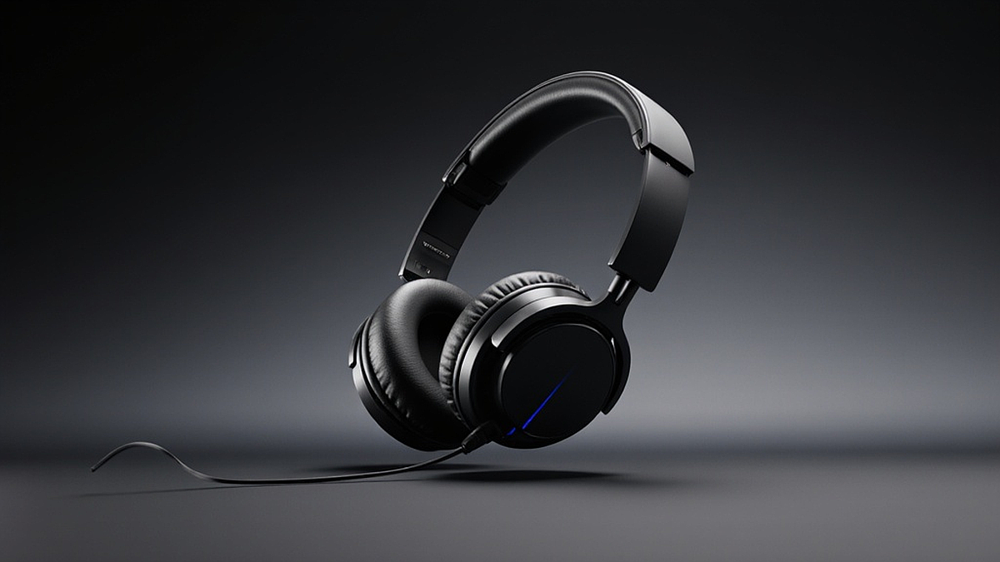

장시간 착용해도 귀가 아프지 않은 편안한 노이즈 캔슬링 헤드폰을 찾는 일은 음악을 사랑하는 이들에게는 단순한 쇼핑을 넘어선 일종의 안식처를 찾는 과정과도 같습니다. 저는 매주 서너 번은 라이브 공연장을 찾고, 집에서는 수천 장의 LP와 무손실 스트리밍을 번갈아 들으며 하루의 절반 이상을 음악과 함께 보내는 중증 음악 마니아입니다. 특히 최근에는 고해상도 음원 시장이 커지면서 녹음실의 미세한 공기감까지 전달해 주는 장비에 대한 욕심이 커졌습니다. 하지만 아무리 소리가 황홀해도 30분만 지나면 귓바퀴가 저릿하고 정수리가 눌리는 통증이 찾아온다면 그건 음악 감상이 아니라 고문이 됩니다. 저 역시 과거에는 오직 음질과 차트 성적만 보고 무거운 스튜디오 모니터링 헤드폰을 샀다가, 한 달도 못 가 중고 장터에 내놓았던 뼈아픈 시행착오를 겪었습니다.

음악은 우리에게 위로를 주어야 합니다. 퇴근길 지하철의 소음을 지우고 오직 아티스트의 숨소리에만 집중하고 싶을 때, 혹은 집중력을 높여야 하는 업무 시간에 노이즈 캔슬링 헤드폰은 필수적인 도구입니다. 하지만 시중에 나온 수많은 제품 중에서 내 두상에 딱 맞고 안경을 써도 불편하지 않은 제품을 고르기는 생각보다 쉽지 않습니다. 기술적으로 노이즈 캔슬링은 외부 소음과 반대되는 파동을 쏘아 소리를 상쇄하는 원리인데, 이 과정에서 발생하는 이압(귀 내부의 압력) 때문에 답답함을 느끼는 분들도 많습니다. 오늘은 제가 수많은 공연장을 누비고 수십 개의 헤드폰을 직접 써보며 느꼈던 경험을 바탕으로, 소리와 편안함이라는 두 마리 토끼를 잡는 기준을 공유해 보려 합니다.

## 물리적인 압박을 결정하는 세 가지 핵심 요소

헤드폰의 편안함을 결정하는 첫 번째 요소는 바로 장력(Clamping Force)입니다. 헤드폰이 양쪽 귀를 누르는 힘이 너무 강하면 금방 통증이 오고, 너무 약하면 노이즈 캔슬링 성능이 떨어지거나 머리에서 흘러내립니다. 제가 실패했던 경험 중 하나는 디자인이 예뻐서 구매했던 한 유명 브랜드 제품이었는데, 장력이 너무 강해 안경 다리가 관자놀이를 파고드는 고통을 주었습니다. 반면 소니(Sony)의 WH-1000XM5 같은 모델은 이전 세대보다 장력을 미세하게 조정하여 장시간 착용 시에도 압박감이 훨씬 덜하다는 것을 직접 체감할 수 있었습니다. 이 제품은 약 250그램이라는 가벼운 무게를 유지하면서도 헤드밴드의 두께를 줄여 정수리에 가해지는 하중을 효과적으로 분산시켰습니다.

두 번째는 이어패드의 재질과 내부 공간의 넓이입니다. 귀가 큰 편인 분들은 이어패드 내부 공간이 좁으면 귓바퀴가 유닛에 닿아 열감이 생기고 통증이 발생합니다. 보스(Bose)의 콰이어트컴포트(QuietComfort) 시리즈는 이름 그대로 편안함에 모든 것을 건 제품군입니다. 특히 최근 모델인 QC 울트라는 단백질 가죽이라 불리는 부드러운 인조 가죽을 사용해 피부에 닿는 촉감이 마치 아기 피부처럼 보드랍습니다. 이어패드 내부의 메모리 폼은 복원력이 뛰어나 안경을 쓴 상태에서도 틈새를 완벽하게 메워주면서 압력은 최소화합니다. 이런 소재의 차이는 단순히 느낌의 문제가 아니라, 장시간 착용 시 땀이 차는 정도나 피부 트러블 발생 여부에도 큰 영향을 미칩니다.

세 번째는 헤드밴드의 설계 구조입니다. 무게가 가볍더라도 하중이 정수리 한 점에 집중되면 '정수리 압박'이 심해집니다. 이를 방지하기 위해 최근 제조사들은 헤드밴드의 곡률을 인체공학적으로 설계하거나 쿠션을 다단 구조로 만듭니다. 에어팟 맥스(AirPods Max)의 경우 무게는 약 385그램으로 상당히 무거운 편에 속하지만, 상단의 니트 메쉬 캐노피 구조 덕분에 무게를 머리 전체로 골고루 분산시킵니다. 하지만 무게 자체가 절대적으로 무겁기 때문에 목 근육이 약한 분들에게는 여전히 부담이 될 수 있다는 점을 기억해야 합니다. 무게 수치만 볼 것이 아니라 그 무게가 어디로 향하는지를 관찰하는 것이 중요합니다.

### 나에게 맞는 헤드폰을 고르기 위한 실전 체크리스트

편안한 헤드폰을 선택할 때 단순히 남들의 후기만 믿어서는 안 됩니다. 사람마다 두상 크기, 귀의 위치, 안경 착용 여부가 모두 다르기 때문입니다. 매장에서 직접 착용해 볼 기회가 있다면 다음의 체크리스트를 반드시 확인해 보시기 바랍니다.

*   안경을 쓴 상태에서 10분 이상 착용했을 때 관자놀이가 눌리지 않는가?
*   고개를 숙이거나 뒤로 젖혔을 때 헤드폰이 앞뒤로 흔들리지 않고 안정적인가?
*   이어컵 내부 공간에 내 귀가 완전히 들어가서 유닛에 귀가 닿지 않는가?
*   헤드밴드를 최대로 늘렸을 때 내 머리 크기에 여유가 있는가?
*   노이즈 캔슬링을 켰을 때 귀 내부가 먹먹해지는 이압이 느껴지지 않는가?

이 체크리스트 중 하나라도 걸린다면 그 제품은 장시간 착용용으로는 부적합할 가능성이 높습니다. 특히 이압 문제는 노이즈 캔슬링 알고리즘의 특성에 따라 사람마다 느끼는 정도가 천차만별입니다. 어떤 분들은 소니의 강력한 소음 차단을 선호하지만, 어떤 분들은 보스의 자연스러운 소음 감쇄를 더 편안하게 느낍니다. 이는 개인의 청각 예민도와 관련이 있으므로 반드시 직접 들어보고 판단해야 할 문제입니다.

## 사운드 튜닝과 노이즈 캔슬링 기술의 조화

우리가 헤드폰을 쓰는 본질적인 이유는 결국 소리입니다. 하지만 노이즈 캔슬링 기술이 들어가면 필연적으로 음질에 영향을 미칠 수밖에 없습니다. 과거에는 노이즈 캔슬링을 켜면 저음이 벙벙해지거나 고음이 답답해지는 현상이 잦았지만, 최근에는 DSP(디지털 신호 처리) 기술의 비약적인 발전으로 이를 극복하고 있습니다. 제가 최근 감명 깊게 들었던 앨범 중 하나는 류이치 사카모토의 유작 앨범이었는데, 피아노의 타건 소리와 그 사이의 적막함이 노이즈 캔슬링 헤드폰을 통해 완벽하게 전달되는 것을 보고 기술의 발전을 실감했습니다. 외부의 소음을 0에 가깝게 지워주면서도 아티스트가 의도한 다이내믹 레인지를 보존하는 것이 바로 기술력의 핵심입니다.

노이즈 캔슬링 성능이 너무 강하면 오히려 귀가 쉽게 피로해질 수 있다는 점도 간과해서는 안 됩니다. 이를 해결하기 위해 소니나 보스 같은 선두 기업들은 '적응형 노이즈 캔슬링' 기능을 탑재합니다. 주변 환경 소음을 실시간으로 분석하여 차단 강도를 조절하는 방식입니다. 예를 들어 조용한 카페에서는 차단 강도를 낮춰 이압을 줄이고, 시끄러운 비행기 안에서는 강도를 높여 엔진 소음을 완벽히 차단합니다. 이러한 유연한 대처는 귀의 피로도를 낮추는 데 결정적인 역할을 합니다. 또한 주변 소리 듣기 모드의 자연스러움도 체크 포인트입니다. 헤드폰을 벗지 않고도 대화할 수 있을 만큼 자연스러운 소리를 들려주는 제품이 일상생활에서 훨씬 편안하게 느껴지기 때문입니다.

음악 마니아로서 저는 가끔 무선 헤드폰의 한계를 느끼기도 합니다. 블루투스 전송 과정에서 발생하는 데이터 손실 때문인데, 최근에는 LDAC이나 aptX Adaptive 같은 고음질 코덱이 보급되면서 유선 연결에 근접한 소리를 들려줍니다. 하지만 코덱보다 더 중요한 것은 헤드폰 내부의 드라이버 설계입니다. 탄소 섬유나 특수 폴리머 재질을 사용한 진동판은 반응 속도가 빨라 복잡한 오케스트라 연주에서도 악기 하나하나의 위치를 정확히 짚어줍니다. 편안한 착용감에 이런 정교한 해상력이 더해질 때, 우리는 비로소 음악 속으로 완전히 침잠하는 경험을 하게 됩니다.

## 선택의 기준과 피해야 할 상황들

그렇다면 어떤 분들에게 어떤 제품이 가장 어울릴까요? 그리고 어떤 경우에 헤드폰 구매를 재고해야 할까요? 우선 사무실에서 업무용으로 4시간 이상 연속 착용해야 하는 분들이라면 무조건 무게와 이어패드 소재를 1순위로 두어야 합니다. 이런 분들에게는 보스 QC 울트라를 추천합니다. 현존하는 제품 중 가장 압박감이 적고 가벼운 느낌을 주기 때문입니다. 반면 출퇴근길 지하철 소음을 완벽히 차단하고 최신 팝 음악의 베이스를 즐기고 싶다면 소니 WH-1000XM5가 훌륭한 선택지가 됩니다. 소니의 전용 앱을 통해 이퀄라이저를 세밀하게 조정하면 자신만의 취향에 맞는 소리를 찾기도 쉽습니다.

반대로 피해야 할 경우도 있습니다. 평소 귀에 습기가 잘 차거나 외이도염을 앓았던 경험이 있다면, 아무리 편안한 오버이어 헤드폰이라도 장시간 착용은 독이 될 수 있습니다. 이런 분들은 헤드폰보다는 노이즈 캔슬링 기능이 있는 오픈형 이어폰을 고려하는 것이 건강상 이롭습니다. 또한 땀을 많이 흘리는 운동 중에 착용할 목적이라면, 가죽 소재의 이어패드는 금방 삭거나 냄새가 밸 수 있으므로 주의해야 합니다. 스포츠용으로 나온 제품들은 대개 방수 등급이 높고 세척이 용이한 소재를 사용하므로 용도에 맞는 선택이 필요합니다.

처음 노이즈 캔슬링 헤드폰에 입문하시는 분들을 위한 기준을 정리해 드리자면, '가장 비싼 것이 가장 편한 것은 아니다'라는 점입니다. 50만 원이 넘는 하이엔드 제품들도 디자인이나 브랜드 가치 때문에 착용감을 희생하는 경우가 종종 있습니다. 따라서 스펙 시트에서 무게가 300그램 이하인지, 블루투스 버전은 최신인지, 그리고 멀티포인트(두 대의 기기에 동시에 연결하는 기능)를 지원하는지를 먼저 확인하십시오. 특히 멀티포인트 기능은 노트북으로 음악을 듣다가 스마트폰으로 전화를 받는 과정을 매끄럽게 연결해 주어 심리적인 편안함까지 제공합니다.

## 음악과 함께하는 편안한 일상을 위하여

음악은 때로 백 마디 말보다 더 깊은 위로를 건넵니다. 제가 힘들었던 시기, 밤늦게 거실 소파에 앉아 노이즈 캔슬링 헤드폰을 쓰고 들었던 브람스의 교향곡은 세상의 모든 소란으로부터 저를 지켜주는 방어막과 같았습니다. 그 소중한 시간을 통증 때문에 방해받지 않으려면, 착용감에 대한 철저한 분석과 선택이 선행되어야 합니다. 오늘 살펴본 것처럼 장력, 무게 분산, 소재, 그리고 적응형 기술의 유무를 꼼꼼히 따져본다면 여러분의 귀에 딱 맞는 '인생 헤드폰'을 찾으실 수 있을 것입니다.

결국 가장 좋은 헤드폰은 착용했다는 사실조차 잊게 만드는 제품입니다. 소리가 귀로 들어오는 것이 아니라 머릿속 공간 전체를 채우는 듯한 경험, 그리고 몇 시간이 지나 헤드폰을 벗었을 때 귀 주변이 아릿하지 않고 개운한 느낌이 든다면 그것이 바로 정답입니다. 여러분도 단순히 유행을 따르기보다 자신의 두상과 청취 환경을 냉정하게 분석해 보시기 바랍니다. 가까운 청음 매장을 방문해 오늘 제가 말씀드린 체크리스트를 하나씩 대조해 보며 직접 착용해 보는 시간을 가져보길 권합니다. 음악이 주는 진정한 위로를 온전히 누리기 위해, 여러분의 귀에 가장 친절한 동반자를 찾으시길 진심으로 응원합니다.