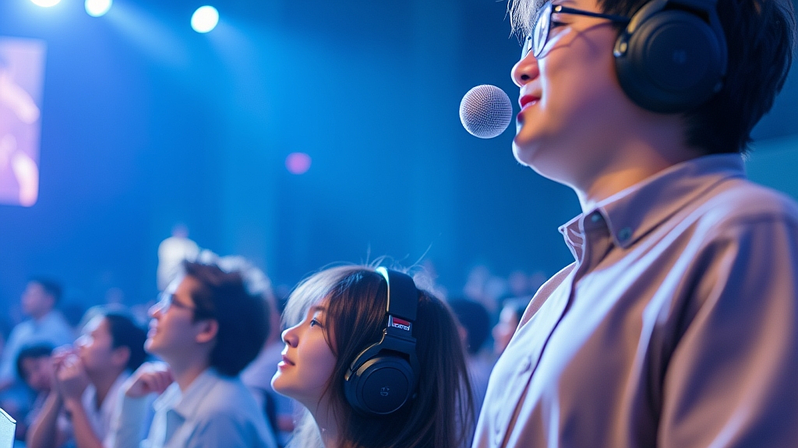

## 공연장 에티켓: 2026년, 콘서트 문화를 성숙하게 즐기는 법

공연장 에티켓은 단순히 남을 배려하라는 도덕적 강요가 아니라, 우리가 지불한 티켓 값에 포함된 '최상의 관람 경험'을 스스로 보호하는 가장 실질적인 전략입니다. 2026년 현재, 오프라인 공연 시장은 그 어느 때보다 뜨겁지만 그만큼 관객 간의 물리적, 심리적 충돌 또한 빈번해졌습니다. 수년 전만 해도 공연장에서의 관람 매너는 암묵적인 약속에 불과했으나, 이제는 공연의 질을 결정짓는 핵심 변수가 되었습니다. 특히 공연 중간에 시야를 가리는 촬영 행위나 과도한 함성, 개인의 돌출 행동은 타인의 몰입을 깨뜨릴 뿐만 아니라 본인 또한 공연의 맥락을 놓치게 만듭니다. 오늘 이 글에서는 수많은 공연장을 오가며 직접 겪은 시행착오를 바탕으로, 옆 사람과 얼굴 붉힐 일 없이 나만의 온전한 음악적 시간을 확보하는 현실적인 가이드를 정리해 보았습니다.

## 시야를 확보하는 기술: '머리 높이'와 '촬영의 경계'

공연장에서 가장 흔하게 발생하는 갈등은 단연 시야 방해입니다. 특히 스탠딩 구역이나 경사가 낮은 좌석에서 앞사람이 머리 위로 스마트폰을 높이 치켜들 때, 뒤에 있는 관객의 경험은 즉각적으로 훼손됩니다. 2026년의 관람 문화에서 가장 중요한 기준은 '내 스마트폰의 높이가 내 눈높이를 넘지 않는 것'입니다.

실제 사례를 들어보겠습니다. 지난달 방문한 대형 공연장에서 제 앞줄의 관객은 곡 전체를 촬영하기 위해 팔을 어깨 위로 뻗어 장시간 고정했습니다. 이로 인해 저는 무대의 중앙을 전혀 볼 수 없었고, 결국 공연의 절반을 대형 스크린에 의존해야 했습니다. 이는 명백한 관람권 침해입니다.

실패 케이스는 명확합니다. '나도 남기지 못하면 손해'라는 생각으로 무리하게 팔을 뻗어 촬영하는 경우입니다. 이는 결과물조차 흔들림이 심해 나중에 다시 보지 않게 될 확률이 높습니다. 선택 기준은 간단합니다. 촬영이 허용된 공연이라도 '내 가슴 높이'를 마지노선으로 삼아야 합니다. 카메라를 내 시야 아래에 두면 앞사람의 머리를 피할 수 있는 각도가 자연스럽게 나옵니다. 

다음은 시야를 지키기 위한 실전 체크리스트입니다.
- 좌석 선택 시: 무대 중앙보다는 살짝 측면이라도 단차가 확실한 구역을 선택하는 것이 시야 확보에 유리합니다.
- 촬영 시: 팔꿈치를 옆구리에 붙이고 찍는 습관을 들이세요. 이는 영상의 흔들림을 줄이는 물리적 방법이기도 합니다.
- 앞사람이 방해될 때: 무작정 화를 내기보다, 무대 조명이 잠시 어두워지는 곡 사이 휴식 시간에 정중하게 '영상을 찍으시는 것 같은데 조금만 낮춰주실 수 있을까요'라고 구체적인 상황을 전달하는 것이 효과적입니다.

## 소리의 몰입을 방해하는 행동: 함성과 박자의 상관관계

음악을 즐기는 방식은 개인마다 다르지만, 공연장은 개인의 거실이 아니라는 점을 인지해야 합니다. 자신이 좋아하는 곡이 나올 때의 흥분은 이해하지만, 아티스트의 정교한 라이브 연주를 가릴 정도의 큰 떼창이나 비명은 오히려 공연의 밸런스를 무너뜨립니다. 

제가 경험한 가장 당혹스러운 사례는 옆자리 관객이 곡의 도입부마다 아티스트의 이름을 소리 높여 부르며 가사를 선창하는 상황이었습니다. 이는 아티스트가 의도한 곡의 긴장감을 완전히 깨뜨렸고, 주변 관객들은 공연 내내 음악이 아닌 그 관객의 목소리를 들어야 했습니다. 

실패 케이스는 아티스트와 소통하고 싶다는 과도한 욕심에 사로잡혀 '내가 공연의 주인공'이라고 착각하는 경우입니다. 공연은 아티스트와 관객의 상호작용이지, 관객이 주도하는 노래방이 아닙니다. 선택 기준은 '아티스트의 보컬을 내가 직접 들을 수 있는 볼륨인가'입니다. 만약 옆 사람의 목소리가 아티스트의 마이크 소리보다 크게 들린다면, 당신은 이미 선을 넘은 것입니다.

핵심 기준을 정리해 드립니다.
- 공연 중 대화: 옆 사람과 나누는 짧은 감상평도 공연 중에는 마이크를 타고 흐르는 소리만큼이나 거슬립니다. 대화는 반드시 곡이 완전히 끝난 뒤, 혹은 인터미션 때로 미루세요.
- 박수와 함성: 아티스트가 호응을 유도할 때를 제외하고는, 곡의 감정선에 집중하는 것이 가장 성숙한 매너입니다.
- 펜라이트와 응원봉: 공연장 내에서 응원봉을 너무 높이 들거나 격하게 흔드는 것은 뒤쪽 관객의 시야를 가리는 장애물입니다. 가슴 높이까지만 올리는 것이 2026년 공연장의 표준입니다.

## 공연장 에티켓 실전 체크리스트: 입장부터 퇴장까지

많은 관객이 공연 시작 전후의 준비 과정에서 실수를 범합니다. 공연장은 밀폐된 공간이며, 수천 명의 사람이 모이는 곳인 만큼 기본적인 이동 예절과 준비물이 공연 전체의 만족도를 좌우합니다. 

실제 사례로, 공연 시작 직전에 겉옷을 정리하며 옆 사람의 좌석을 계속 치는 경우를 들 수 있습니다. 이는 입장하자마자 주변과의 관계를 악화시키고, 나 스스로도 공연에 집중할 준비를 하지 못하게 만듭니다. 공연장에 들어서면 가장 먼저 할 일은 내 주변 공간을 확인하고, 겉옷이나 가방을 내 좌석 아래로 완전히 밀어 넣는 것입니다.

실패 케이스는 공연 시작 5분 전에 도착하여 허둥지둥 자리를 찾는 행위입니다. 이는 자신의 시야를 확보할 시간도 없을뿐더러, 이미 착석한 사람들에게 불쾌함을 줍니다. 공연 시작 최소 20분 전에는 자리에 앉아 조명의 밝기나 스피커의 소리 방향을 미리 파악하는 것이 좋습니다.

다음은 성공적인 관람을 위한 3단계 실전 절차입니다.
1단계: 입장 후 5분 내에 내 주변 1미터 반경을 정리하십시오. 겉옷은 무릎 위에 두지 말고 의자 아래에 보관하여 옆 사람과의 물리적 접촉을 최소화합니다.
2단계: 공연 시작 전 아티스트의 셋리스트를 가볍게 훑어보십시오. 곡의 흐름을 알면 갑작스러운 함성이나 박수 타이밍을 미리 예측하여 분위기를 따라갈 수 있습니다.
3단계: 퇴장 시에는 서두르지 마십시오. 공연이 끝나자마자 출구로 달려가는 행위는 병목 현상을 일으키고 안전사고의 위험을 높입니다. 마지막 조명이 꺼지고 공연장의 여운이 가실 때까지 자리를 지키는 것이 가장 우아한 퇴장 방식입니다.

공연은 아티스트가 준비한 결과물을 관객이 함께 완성해 나가는 과정입니다. 2026년의 성숙한 공연 문화는 거창한 규칙을 지키는 데 있는 것이 아니라, 내 옆의 관객도 나와 똑같은 돈을 지불하고 온 '주인공'임을 인정하는 것에서 시작됩니다. 오늘 제시한 시야 확보와 소리 예절, 그리고 퇴장 매너는 공연장에 들어서기 전 한 번만 상기해도 훨씬 쾌적한 관람이 가능해집니다. 이제는 스마트폰을 내려놓고, 오롯이 당신의 귀와 눈으로 현장의 공기를 느껴보시길 바랍니다. 공연장의 에티켓을 지키는 것은 타인을 위한 배려이기도 하지만, 결국 그 공연을 가장 완벽하게 기억하려는 당신 스스로를 위한 최소한의 투자입니다. 다음 공연에서는 주변의 소란에 휘둘리지 않고 오직 아티스트와 나, 음악 사이의 교감에만 집중하는 성숙한 관객이 되어보시길 권합니다.

## 마치며

2026년의 콘서트 문화는 단순히 공연을 관람하는 것을 넘어, 아티스트와 관객이 함께 호흡하며 완성해 나가는 소중한 경험입니다. 오늘 살펴본 시야 확보, 소리 예절, 그리고 여운을 즐기는 퇴장 매너는 모두가 쾌적하고 안전하게 공연을 즐기기 위한 최소한의 약속입니다. 스마트폰 화면 너머의 기록보다 현장의 공기를 온전히 느끼는 것이야말로 공연을 가장 완벽하게 간직하는 방법임을 잊지 마세요.

다음 공연장으로 향하기 전, 내 옆의 관객도 똑같은 설렘을 안고 온 주인공임을 한 번만 떠올려 주세요. 작은 배려가 모여 우리 모두의 관람 경험을 더욱 빛나게 만들 것입니다. 이제는 공연장의 소란함 대신 음악과 나 사이의 깊은 교감에 오롯이 집중해보는 건 어떨까요? 성숙한 관객으로서 당신이 누릴 그 특별한 몰입의 순간을 진심으로 응원합니다. 이번 주말, 공연장에서 만나요!
