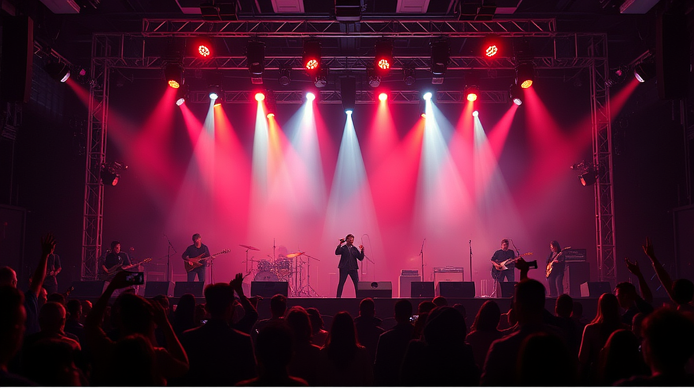
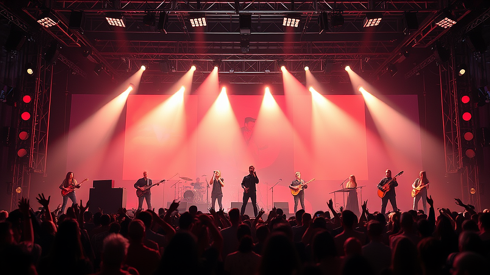

콘서트 현장에서만 느낄 수 있는 그 특유의 공기 진동을 좋아하시나요? 스피커를 통해 뿜어져 나오는 베이스 기타의 낮은 울림이 내 심장 박동과 일치되는 그 순간, 우리는 일상의 모든 근심을 잊고 오직 음악과 나, 그리고 아티스트만이 존재하는 세계로 들어갑니다. 저 역시 수많은 공연장을 전전하며 때로는 환희를, 때로는 깊은 위로를 받았던 음악 매니아로서 여러분께 이 특별한 경험을 공유하고자 합니다. 특히 제가 가장 힘들었던 시기에 어느 밴드의 라이브 공연에서 들었던 위로의 가사 한 줄은 그 어떤 상담보다 강력한 힘이 되었습니다. 하지만 처음 공연장을 찾는 분들에게는 티켓팅부터 좌석 선택, 준비물까지 모든 것이 낯설고 어렵게 느껴질 수 있습니다. 오늘 이 글에서는 예산이 한정된 입문자가 생애 첫 단독 콘서트를 실패 없이 즐기기 위해 반드시 알아야 할 실전 가이드를 제 경험을 담아 상세히 전해드리겠습니다.

## 스탠딩이냐 지정석이냐, 내 몸 상태와 시야를 고려한 최적의 구역 선택법

공연 관람의 만족도를 결정짓는 가장 큰 요인은 단연 좌석의 위치입니다. 많은 분이 아티스트를 가까이서 볼 수 있다는 이유만으로 무조건 무대 앞 스탠딩 구역을 선호하지만, 이는 양날의 검과 같습니다. 제가 처음으로 록 페스티벌 스탠딩 구역에 들어갔을 때의 기억이 떠오릅니다. 좋아하는 가수를 5미터 거리에서 볼 수 있다는 설렘도 잠시, 키 큰 관객들에게 둘러싸여 공연 내내 앞사람의 뒤통수만 구경하다 돌아온 뼈아픈 경험이 있습니다. 심지어 좁은 공간에서 계속 밀리다 보니 음악에 집중하기는커녕 체력 소모가 극심해 공연 후반부에는 빨리 집에 가고 싶다는 생각뿐이었습니다.

이런 시행착오를 겪지 않으려면 본인의 키와 체력, 그리고 공연의 성격을 냉정하게 판단해야 합니다. 만약 본인의 키가 165cm 이하이면서 구역 내 앞 번호를 선점하지 못했다면, 차라리 단차가 있는 2층 지정석을 선택하는 것이 시야 확보 면에서 훨씬 유리합니다. 특히 고척 스카이돔이나 잠실 실내체육관처럼 규모가 큰 공연장은 플로어 층이 평지로 되어 있어 뒷줄로 갈수록 시야 방해가 심해집니다. 반면, 아티스트와 함께 뛰며 에너지를 발산하고 싶다면 스탠딩이 정답입니다. 이때는 공연 시작 2시간 전부터 대기해야 하는 체력적 부담을 반드시 계산에 넣어야 합니다.

선택 기준을 명확히 하자면, 아티스트의 표정과 퍼포먼스를 디테일하게 관찰하고 싶다면 지정석 앞열을, 현장의 열기와 슬램 등 역동적인 분위기를 직접 체험하고 싶다면 스탠딩 구역을 선택하세요. 제가 추천하는 최고의 가성비 자리는 의외로 2층 정면 구역의 첫 번째 줄입니다. 시야가 탁 트여 전체적인 무대 연출과 조명을 한눈에 볼 수 있고, 사운드 밸런스도 가장 안정적으로 들리는 명당이기 때문입니다. 반대로 피해야 할 자리는 스피커 바로 옆이나 무대 극단 사이드 구역입니다. 소리가 뭉개져서 들릴 뿐만 아니라 무대 구조물에 가려 아티스트가 보이지 않는 시야 제한석이 될 확률이 높습니다.

## 실패 없는 콘서트 관람을 위한 사운드 체크리스트와 필수 준비물

공연은 단순히 눈으로 보는 것이 아니라 온몸으로 소리를 받아들이는 과정입니다. 앨범 녹음 기술은 완벽한 방음 시설이 갖춰진 스튜디오에서 수차례 수정 녹음을 거쳐 최상의 음질을 만들어내지만, 라이브 공연은 현장의 온도, 습도, 관객의 소음 등 수많은 변수가 작용합니다. 엔지니어들이 믹싱 콘솔을 통해 실시간으로 톤을 조절하더라도 공연장의 물리적 한계 때문에 소리가 날카롭게 튀거나 저음이 너무 강해 귀가 아픈 경우가 종종 발생합니다. 저도 예전에 음향 시설이 열악한 공연장에서 귀마개 없이 공연을 관람했다가 이틀 동안 이명 현상을 겪으며 고생했던 적이 있습니다.

이런 문제를 해결하기 위해 제가 제안하는 필수 아이템은 하이파이(High-Fidelity) 귀마개입니다. 일반적인 소음 차단용 귀마개는 모든 대역의 소리를 깎아버려 음악을 멍멍하게 만들지만, 공연용 귀마개는 음질을 유지하면서 고막에 무리를 주는 특정 데시벨만 낮춰줍니다. 이를 착용하면 오히려 아티스트의 목소리가 더 선명하게 들리는 마법을 경험할 수 있습니다. 또한, 장시간 서 있어야 하는 스탠딩 관객이라면 신발 선택이 무엇보다 중요합니다. 굽이 너무 높거나 딱딱한 신발은 발바닥 통증을 유발해 공연 집중도를 떨어뜨립니다. 반드시 쿠션감이 좋은 운동화를 착용하시길 권장합니다.

공연 당일 챙겨야 할 실전 체크리스트는 다음과 같습니다. 첫째, 디지털 티켓이나 예매 내역서와 신분증입니다. 최근에는 암표 방지를 위해 본인 확인 절차가 매우 까다로워졌으므로 반드시 지참해야 합니다. 둘째, 보조 배터리입니다. 입장 대기 시간 동안 스마트폰 사용량이 많고, 공연 중 사진 촬영이나 응원봉 연동 등으로 배터리가 빨리 소모됩니다. 셋째, 500ml 생수 한 병입니다. 공연장 내부 온도는 수천 명의 열기로 인해 생각보다 훨씬 덥고 건조합니다. 단, 뚜껑을 따지 않은 상태로만 반입이 가능한 곳이 많으니 사전에 공연장 공지사항을 확인하는 것이 좋습니다.

## 티켓 가격의 가치를 판단하는 객관적 기준과 효율적인 예산 배분

최근 콘서트 티켓 가격은 물가 상승과 대형 기획사의 정책에 따라 과거보다 상당히 높아진 추세입니다. 보통 대중적인 아티스트의 단독 공연 티켓 가격은 13만 원에서 15만 원 선이며, 해외 아티스트의 내한 공연은 20만 원을 훌쩍 넘기도 합니다. 스트리밍 서비스의 확대로 아티스트들의 음원 수익이 줄어들면서 공연 수익의 비중이 커진 결과이기도 합니다. 따라서 우리는 한정된 예산 안에서 이 공연이 과연 그만한 가치가 있는지 냉정하게 따져볼 필요가 있습니다. 무조건 비싼 자리가 좋은 것은 아니며, 본인의 경제 상황과 팬심의 깊이를 고려해 예산을 배분해야 합니다.

가치를 판단하는 가장 좋은 방법은 해당 아티스트의 직전 투어 셋리스트(Setlist)를 확인하는 것입니다. Setlist.fm 같은 사이트를 활용하면 아티스트가 주로 어떤 곡들을 연주하는지, 공연 시간은 얼마나 되는지 파악할 수 있습니다. 만약 내가 좋아하는 곡이 리스트에 거의 없거나 공연 시간이 90분 미만으로 짧다면 가격 대비 만족도가 낮을 수 있습니다. 또한, 공연장의 규모와 음향 장비 퀄리티도 고려 대상입니다. 전문 공연장이 아닌 체육관이나 대강당에서 열리는 공연은 음향 반사음 조절이 어려워 소리가 울리는 경우가 많으므로, 고가의 티켓을 구매할 때 신중해야 합니다.

실제 사례를 들어보자면, 저는 예전에 좋아하는 해외 밴드의 공연을 보기 위해 거액을 들여 VIP 패키지를 구매한 적이 있습니다. 하지만 막상 가보니 굿즈 몇 개와 우선 입장 권한 외에는 일반석과 큰 차이가 없어 실망했던 기억이 납니다. 반면, 예산의 일부를 티켓에 집중하고 굿즈 구매를 포기하는 대신 시야가 좋은 좌석을 선택했을 때는 훨씬 깊은 감동을 받았습니다. 처음 시작하는 분들에게 추천하는 예산 배분 방식은 티켓에 70%, 교통비와 식비에 20%, 응원봉이나 슬로건 같은 필수 굿즈에 10%를 할당하는 것입니다. 불필요한 기념품 구매보다는 공연 그 자체를 가장 좋은 환경에서 즐기는 것에 투자하는 것이 훨씬 남는 장사입니다.

## 아티스트와 호흡하는 법, 공연 매너와 감상의 디테일

공연의 완성은 아티스트뿐만 아니라 관객의 태도로 결정됩니다. 녹음된 음반은 완벽한 정적 속에서 감상하는 것이 미덕이지만, 라이브 공연은 현장의 에너지를 주고받는 상호작용이 핵심입니다. 하지만 무분별한 함성이나 옆 사람의 관람을 방해하는 행동은 지양해야 합니다. 특히 발라드 곡이나 정적인 연주가 이어지는 구간에서 눈치 없이 소리를 지르는 것은 아티스트의 몰입을 깨뜨리는 최악의 행동입니다. 제가 경험했던 최고의 공연들은 관객들이 숨소리조차 죽이고 음악에 집중하다가, 곡이 끝나는 순간 폭발적인 박수를 보내던 순간들이었습니다.

또한, 스마트폰 촬영에 너무 집착하지 마세요. 소중한 순간을 기록하고 싶은 마음은 이해하지만, 작은 화면을 통해 보는 공연은 현장의 생동감을 반감시킵니다. 렌즈 너머가 아니라 내 두 눈으로 아티스트의 움직임을 쫓고, 귀로 직접 소리를 담을 때 비로소 그 공연은 온전히 나의 기억으로 저장됩니다. 실제로 많은 아티스트가 공연 중 특정 곡에서는 휴대폰을 내려놓고 함께 즐겨달라고 요청하기도 합니다. 그 짧은 시간 동안 스마트폰의 밝은 화면이 주변 관객의 시야를 방해하고 공연의 분위기를 해칠 수 있다는 점을 항상 기억해야 합니다.

진정한 감상의 팁을 하나 드리자면, 공연 전 아티스트의 앨범 제작 비하인드 스토리나 인터뷰를 미리 읽어보는 것입니다. 이 곡을 만들 때 어떤 감정이었는지, 가사에 담긴 속뜻은 무엇인지를 알고 들으면 라이브에서 전해지는 감동의 깊이가 달라집니다. 어떤 곡에서 아티스트가 살짝 목소리가 떨리거나 편곡을 가미하는 이유를 이해하게 될 때, 우리는 단순한 관객을 넘어 음악적 동반자가 된 듯한 기분을 느낄 수 있습니다. 이것이야말로 스트리밍 수치나 차트 성적으로는 설명할 수 없는, 라이브 공연만이 줄 수 있는 유일무이한 가치입니다.

## 결론: 당신의 일상을 바꿀 단 한 번의 무대

콘서트는 단순히 음악을 듣는 자리가 아니라, 우리가 살아있음을 느끼게 해주는 축제입니다. 15만 원이라는 금액이 누군가에게는 비싸게 느껴질 수 있지만, 그 현장에서 얻는 위로와 에너지는 수개월간의 일상을 버티게 하는 원동력이 됩니다. 저 역시 수많은 실패와 시행착오를 겪으며 나만의 관람 기준을 세워왔고, 이제는 공연장으로 향하는 발걸음 자체가 설렘으로 가득합니다. 시야가 좋지 않아 실망했던 날도, 비를 맞으며 관람했던 페스티벌의 기억도 결국은 음악을 사랑하는 과정의 일부였습니다.

처음이라 망설여진다면, 오늘 제가 말씀드린 좌석 선택 기준과 준비물 체크리스트를 다시 한번 살펴보세요. 완벽한 준비보다는 음악을 즐기겠다는 열린 마음이 더 중요합니다. 좋아하는 아티스트의 공연 일정을 확인하고, 예산 범위 내에서 가장 합리적인 티켓을 예매하는 것부터 시작해 보시길 바랍니다. 공연장이 암전되고 첫 음이 울려 퍼지는 그 전율의 순간, 당신은 분명 "오길 정말 잘했다"라고 생각하게 될 것입니다. 지금 바로 당신의 가슴을 뛰게 할 아티스트를 찾아 티켓 예매 사이트를 열어보는 것은 어떨까요? 그곳에서 새로운 세상이 당신을 기다리고 있습니다.

결국 콘서트는 단순히 음악을 감상하는 자리를 넘어, 메마른 일상에 촉촉한 단비를 내리고 다시 나아갈 힘을 얻는 소중한 경험입니다. 오늘 함께 알아본 효율적인 좌석 선택 노하우와 꼼꼼한 준비물 체크리스트가 여러분의 설레는 첫걸음에 든든한 가이드가 되었기를 바랍니다. 비록 완벽한 명당을 차지하지 못하더라도, 혹은 작은 실수가 있더라도 그 모든 순간은 여러분만의 특별한 추억으로 남을 것입니다. 가장 중요한 것은 아티스트와 같은 공간에서 호흡하며 그 에너지를 온전히 받아들이겠다는 열린 마음이니까요.

이제 더 이상 고민하며 망설이지 말고, 지금 바로 평소 좋아하던 아티스트의 공연 일정을 확인해 보세요. 티켓 예매 창을 열고 좌석을 고민하는 그 순간부터 여러분의 콘서트는 이미 시작된 것이나 다름없습니다. 현장에서만 느낄 수 있는 그 압도적인 전율과 벅찬 감동을 여러분도 꼭 직접 경험해 보셨으면 좋겠습니다.

여러분의 일상이 음악이라는 마법으로 더욱 풍성해지길 진심으로 응원합니다. 공연 관람에 대해 더 궁금한 점이 있거나 여러분만의 소중한 관람 꿀팁이 있다면 언제든 댓글로 자유롭게 공유해 주세요. 우리 함께 음악이 주는 행복을 나누며 더 즐거운 문화생활을 만들어 가요. 다음에도 유익하고 생생한 공연 정보로 찾아뵙겠습니다. 오늘도 음악처럼 싱그럽고 행복한 하루 보내시길 바랍니다!
