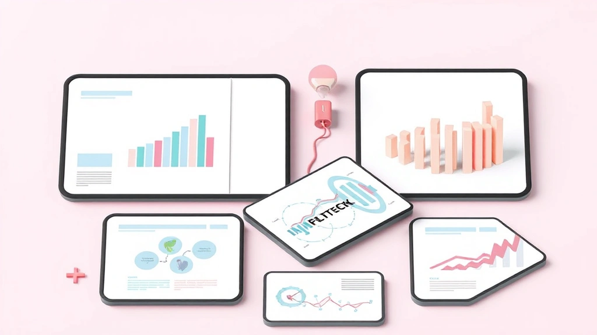

# 20년차 마케터가 까놓고 말하는, 돈 버는 콘텐츠 마케팅의 모든 것 (실패담 포함)

**콘텐츠 마케팅**, 정말 지겹도록 들으셨죠? "요즘엔 콘텐츠가 왕이다", "진정성 있는 콘텐츠로 고객과 소통해야 한다"… 그런데 막상 해보면 어떻던가요? 밤새워 블로그 글 하나 썼는데 조회수는 100을 넘기기 힘들고, 거금 들여 영상 만들었더니 '좋아요' 몇 개가 전부인 경험, 다들 한 번쯤은 있으실 겁니다. 저 역시 20년 넘게 이 바닥에서 구르면서 수없이 겪었던 일입니다. 특히 저는 숫자, 즉 ROI(투자 대비 수익률)와 전환율에 목숨 거는 퍼포먼스 마케터 출신이라, '감성'이나 '브랜딩' 같은 뜬구름 잡는 소리로는 도저히 만족할 수 없었죠. "그래서 이 콘텐츠가 얼마를 벌어다 줬는데?" 이 질문에 답하지 못하는 콘텐츠는 제게는 그냥 비싼 취미 활동일 뿐이었습니다.

솔직히 말해볼까요? 초반에는 저도 실패를 정말 많이 했습니다. 수천만 원짜리 캠페인이 공중분해되는 것도 봤고, 제가 확신했던 콘텐츠가 처참하게 외면받는 것도 겪었죠. 하지만 그 뼈아픈 경험들 덕분에 깨달은 게 있습니다. 진짜 '돈 버는' 콘텐츠 마케팅은 예술이 아니라 과학에 가깝다는 사실을요. 그리고 그 과학은 거창한 이론이 아니라, 고객의 마음을 읽고 데이터를 집요하게 파고드는 '실전'에서 완성된다는 것을요. 오늘 이 글에서는 교과서적인 이야기는 전부 빼겠습니다. 대신 지난 20년간 제 돈과 고객사의 돈을 태워가며 직접 부딪히고 깨달은, "실제로 해보니까 이게 되더라" 하는 날것 그대로의 이야기들을 풀어보려고 합니다. 준비되셨나요?

## "좋아요"만 많은 콘텐츠, 이제 그만 만드세요

마케팅 팀에 있다 보면 이런 말을 자주 듣습니다. "이번 콘텐츠 반응 대박이에요! '좋아요'가 1만 개나 달렸어요!" 그럼 저는 속으로 생각하죠. *'그래서, 매출은 얼마나 올랐는데?'* 이게 바로 많은 마케터들이 빠지는 첫 번째 함정, 바로 **'허상 지표(Vanity Metrics)'의 늪**입니다. '좋아요', 공유 수, 도달률 같은 지표들은 분명 기분 좋은 숫자지만, 그것만으로는 비즈니스의 성장을 증명할 수 없습니다.

제가 겪었던 가장 뼈아픈 실패 중 하나가 바로 이 허상 지표 때문에 일어났습니다. 10여 년 전, 한창 패션 이커머스 시장이 뜨거울 때였죠. 꽤 큰 규모의 여성 의류 브랜드와 함께 일하게 됐습니다. 저희는 당시 유행하던 '감성'에 초점을 맞췄습니다. 해외 로케이션 촬영에 모델 섭외, 감각적인 영상 편집까지 더해 정말 영화 같은 콘텐츠를 뽑아냈죠. 인스타그램에 올리자마자 반응은 폭발적이었습니다. '좋아요'는 수만 개가 찍혔고, "옷이 너무 예뻐요", "분위기 미쳤다" 같은 댓글이 수백 개씩 달렸습니다. 저희 팀은 축제 분위기였죠. "이거다! 우리 브랜드 이미지가 완전히 달라졌다!"고 자축했습니다.

하지만 한 달 뒤, 매출 보고서를 받아본 저희는 모두 말을 잃었습니다. 콘텐츠 제작과 광고비로 수천만 원을 썼는데, 정작 매출은 이전과 거의 차이가 없었습니다. ROI는 처참한 마이너스였죠. 도대체 뭐가 문제였을까요? 데이터를 까보고 나서야 이유를 알 수 있었습니다. 우리 콘텐츠에 열광했던 사람들은 '옷을 사고 싶은 사람'이 아니라, '예쁜 이미지를 보고 싶어 하는 사람'이었던 겁니다. 그들은 우리 브랜드의 잠재 고객이 아니라, 그저 스쳐 지나가는 구경꾼이었죠. 우리는 잠재 고객을 위한 콘텐츠가 아니라, 모두를 위한 '예쁜 쓰레기'를 만들고 있었던 셈입니다.

그 실패 이후, 저는 콘텐츠를 기획할 때 가장 먼저 스스로에게 묻는 질문이 생겼습니다. **"그래서 이 콘텐츠의 '일(Job)'이 정확히 뭐야?"**

모든 콘텐츠는 각자 맡은 역할이 있어야 합니다. 이건 마치 축구팀과 같습니다. 골을 넣는 공격수만 11명 있으면 경기에 이길 수 없죠. 수비수도, 미드필더도, 골키퍼도 필요합니다. 콘텐츠 마케팅도 마찬가지입니다.

### 고객 여정(Customer Journey)에 맞는 역할 분담

고객이 우리 제품을 인지하고, 고민하고, 구매하기까지의 과정을 보통 '고객 여정'이라고 부릅니다. 이걸 아주 간단하게 3단계로 나눠볼게요.

1.  **인지 (Awareness / Top of Funnel):** 고객이 아직 우리 브랜드를 모르거나, 자신의 문제를 막 인식하기 시작한 단계입니다. 여기서 필요한 콘텐츠는 '우리 제품 사세요!'가 아닙니다. 고객의 문제를 긁어주고 해결책의 방향을 제시하는 정보성 콘텐츠가 필요하죠.
    *   **실패 예시:** "역대급 기능! OO 청소기 출시!" (X)
    *   **성공 예시:** "강아지털 때문에 고생이라면? 청소기 고를 때 절대 놓치면 안 되는 3가지" (O)
    *   *실전 팁:* 이 단계의 콘텐츠 목표는 '판매'가 아니라 '이메일 구독'이나 '블로그 즐겨찾기' 같은 **'관계의 시작'**이 되어야 합니다. 유용한 정보를 주고 우리를 전문가로 인식하게 만드는 거죠.

2.  **고려 (Consideration / Middle of Funnel):** 이제 고객은 문제를 해결하기 위해 여러 대안을 비교하고 탐색하는 단계입니다. 여기서 우리 콘텐츠는 "왜 다른 제품이 아니라 우리 제품이어야 하는가?"에 대한 답을 줘야 합니다.
    *   **실패 예시:** "우리 청소기는 최고입니다!" (X)
    *   **성공 예시:** "A사, B사, 그리고 우리 OO 청소기 솔직 비교! 흡입력부터 배터리까지 (영상 포함)" (O)
    *   *실전 팁:* 고객 후기, 상세한 사용 가이드, 전문가 리뷰, 케이스 스터디 같은 **'신뢰를 주는' 콘텐츠**가 폭발적인 효과를 냅니다. 제가 관리하던 한 SaaS(서비스형 소프트웨어) 기업은 기능 소개 페이지만 있던 웹사이트에 '고객 성공 사례' 섹션을 추가한 것만으로 데모 신청 전환율이 40%나 상승했습니다.

3.  **전환 (Conversion / Bottom of Funnel):** 구매를 거의 마음먹은 고객의 등을 살짝 밀어주는 단계입니다. 망설이는 고객의 마지막 불안감을 해소해주는 콘텐츠가 필요합니다.
    *   **실패 예시:** "지금 바로 구매하세요!" (X)
    *   **성공 예시:** "첫 구매 고객 15% 할인 쿠폰 + 무료 배송 혜택" 또는 "만족 못 하면 100% 환불 보장" (O)
    *   *실전 팁:* 기간 한정 프로모션, 무료 체험, 상세한 FAQ, 구매 가이드 등이 효과적입니다. 특히 B2B의 경우 '무료 컨설팅 신청'이나 '견적 문의' 같은 명확한 행동 유도(Call to Action, CTA)가 필수적입니다.

이제 '좋아요' 숫자에 일희일비하지 마세요. 대신 이 콘텐츠가 고객 여정의 어느 단계에서 어떤 역할을 하고 있는지, 그리고 그 역할을 제대로 수행했는지(예: 정보성 블로그 글에서 이메일 구독 전환율이 몇 %인가?)를 측정하세요. 그것이 바로 돈 버는 콘텐츠 마케팅의 첫걸음입니다.

## 데이터, 감으로 읽지 말고 '돈'으로 번역하는 법

"우리 콘텐츠 팀은 데이터를 정말 열심히 봐요. 구글 애널리틱스(GA)도 매일 들어가고, 인스타그램 인사이트도 꼼꼼히 챙겨요."

마케터들과 이야기하다 보면 이런 말을 자주 듣습니다. 하지만 제가 "그래서 그 데이터를 보고 어떤 액션을 하셨나요?"라고 물으면 대부분 말문이 막힙니다. 데이터를 보는 것과 데이터를 '활용'하는 것은 완전히 다른 이야기입니다. 데이터는 성적표가 아닙니다. 정답이 숨겨져 있는 **보물 지도**죠. 대부분의 마케터는 그저 지도 표면의 그림만 보고 있을 뿐, 보물이 묻힌 'X' 표시를 찾아내지 못합니다.

데이터를 돈으로 번역하는 가장 확실한 방법은 **'가설 설정 → 실험 → 검증'**의 사이클을 끊임없이 돌리는 것입니다. 거창하게 들리지만, 사실 별거 아닙니다. "혹시 이렇게 바꾸면 더 잘 팔리지 않을까?"라는 생각을 실제로 실행해보고, 결과를 숫자로 확인하는 과정일 뿐이죠.

제가 직접 겪었던 가장 짜릿한 성공 사례 중 하나를 공유해 드릴게요. 건강기능식품을 판매하는 한 이커머스 클라이언트가 있었습니다. 그들은 '숙면에 좋은 영양제'를 주력으로 밀고 있었죠. 콘텐츠 팀에서 "수면의 질을 높이는 5가지 방법"이라는 아주 유용한 블로그 글을 발행했고, 이 글은 검색을 통해 꾸준히 많은 트래픽을 끌어모으고 있었습니다. 문제는, 트래픽은 높은데 이 글을 통해 제품을 구매하는 전환율은 0.5%로 처참할 정도로 낮았다는 겁니다.

대부분의 팀이라면 "아, 정보만 얻고 다들 나가나 보네"하고 넘어갔을 겁니다. 하지만 저희는 보물 지도를 펼쳐보기로 했습니다.

### 1단계: 데이터에서 '이상 신호' 찾기 (보물 지도 펼치기)

먼저 구글 애널리틱스를 통해 이 블로그 글의 데이터를 깊게 파봤습니다.
*   **평균 페이지 체류 시간:** 4분 30초. (사람들이 글을 대충 훑고 나가는 게 아니라, 꽤 정독하고 있다는 긍정적 신호!)
*   **이탈률(Bounce Rate):** 85%. (글을 다 읽고 다른 페이지로 넘어가지 않고 그냥 나가버린다는 뜻. 이게 문제!)
*   **스크롤 뎁스(Scroll Depth):** 90% 이상의 사용자가 글의 맨 끝까지 스크롤을 내림. (콘텐츠 자체의 매력도는 높다는 증거!)

데이터가 말해주고 있었습니다. "콘텐츠는 정말 좋은데, 사람들이 다음 행동을 뭘 해야 할지 모르겠어!"

### 2단계: '왜?'라고 묻고 가설 세우기 (X 표시 지점 추측)

데이터를 기반으로 저희는 몇 가지 가설을 세웠습니다.
*   **가설 1:** 글의 맨 마지막에 있는 '제품 보러 가기' 텍스트 링크가 너무 눈에 띄지 않아서 사람들이 그냥 지나친다.
*   **가설 2:** 정보성 글 중간에 갑자기 제품을 들이미는 게 부담스러워서, 제품 링크를 본문과 완전히 분리시킨 것이 오히려 문제다.
*   **가설 3:** 글을 다 읽고 구매할 마음이 생겼더라도, '왜 지금 당장 사야 하는지'에 대한 긴급성이 부족하다.

저희는 이 중 2번과 3번 가설이 가장 유력하다고 판단했습니다.

### 3단계: A/B 테스트로 검증하기 (삽으로 땅 파보기)

그래서 기존 페이지(A안)는 그대로 두고, 새로운 버전의 페이지(B안)를 만들어서 트래픽을 50:50으로 나눠 보내는 A/B 테스트를 진행했습니다. B안에는 두 가지를 바꿨습니다.

1.  본문 내용 중 '마그네슘'이 수면에 좋다는 내용 바로 아래에, **"에디터 추천! 편안한 밤을 위한 프리미엄 마그네슘"** 이라는 문구와 함께 제품 이미지, 가격, 구매 버튼이 포함된 '제품 카드'를 삽입했습니다.
2.  페이지를 떠나려고 마우스 커서를 옮기는 사용자에게 **"잠깐만요! 첫 구매라면 숙면 영양제 15% 할인 쿠폰을 드려요"** 라는 출구전환 팝업(Exit-intent Popup)을 띄웠습니다.

결과는 어땠을까요? 2주간의 테스트 끝에, B안 페이지의 구매 전환율은 **3.8%**를 기록했습니다. 기존 0.5%에 비해 **7배 이상 상승**한 수치였죠. 이 작은 변화 하나로, 해당 블로그 글은 매달 수백만 원의 추가 매출을 일으키는 '효자 콘텐츠'이자 '자동화된 영업사원'으로 탈바꿈했습니다. 이게 바로 데이터를 '돈'으로 번역하는 과정입니다.

여러분도 당장 시작할 수 있습니다.
*   **UTM 파라미터 활용:** 어떤 채널(네이버, 인스타, 페북 등)의 어떤 콘텐츠를 보고 고객이 유입되었는지 정확하게 추적하세요. 이건 기본 중의 기본입니다. "인스타에서 많이 들어왔어요"가 아니라, "인스타 2월 3일자 릴스를 보고 들어온 사람들의 구매 전환율이 가장 높았어요"라고 말할 수 있어야 합니다.
*   **구글 애널리틱스 목표 설정:** 회원가입, 장바구니 담기, 구매 완료 등 비즈니스에 중요한 행동들을 '목표'로 설정해두세요. 그래야 어떤 콘텐츠가 실질적인 성과를 내는지 측정할 수 있습니다.
*   **가장 트래픽 높은 페이지부터 분석:** 모든 페이지를 다 뜯어볼 필요 없습니다. 가장 많은 사람이 방문하는 상위 5개 페이지의 이탈률, 체류 시간, 전환율부터 분석하고 개선점을 찾아보세요. 가장 적은 노력으로 가장 큰 효과를 볼 수 있는 지점입니다.

데이터는 어렵고 복잡한 것이 아닙니다. 고객이 우리에게 남기는 '힌트'입니다. 그 힌트를 놓치지 마세요.

## 2025년, AI와 '진정성' 사이에서 살아남는 콘텐츠 전략

최근 몇 년 사이 마케팅 업계를 뒤흔든 가장 큰 화두는 단연 'AI'일 겁니다. 저 역시 ChatGPT를 비롯한 다양한 AI 툴을 매일같이 사용하고 있습니다. 솔직히 말해서, AI 덕분에 제 업무 효율은 최소 3배 이상 올랐습니다. 블로그 글의 초안을 잡고, 광고 카피 아이디어를 수십 개씩 뽑아내고, 복잡한 리포트를 요약하는 일들을 AI가 순식간에 해치워주니까요.

하지만 동시에 저는 엄청난 위기감을 느끼고 있습니다. AI가 콘텐츠 생산의 장벽을 낮추면서, 인터넷은 영혼 없는 'AI 생성 콘텐츠'로 넘쳐나기 시작했습니다. 어디선가 본 듯한 뻔한 정보, 인간적인 감정이나 경험이 전혀 느껴지지 않는 기계적인 문장들. 이런 콘텐츠는 단기적으로 검색엔진을 속일 수는 있을지 몰라도, 절대 고객의 마음을 사로잡고 지갑을 열게 할 수는 없습니다. 구글이 '도움이 되는 콘텐츠 업데이트(Helpful Content Update)'를 통해 이런 저품질 콘텐츠를 걸러내려는 이유도 바로 여기에 있죠.

그렇다면 2025년을 앞둔 지금, 우리는 어떻게 해야 할까요? AI라는 강력한 무기를 활용하면서도, AI가 절대 흉내 낼 수 없는 우리만의 경쟁력을 갖춰야 합니다. 그 해답은 바로 **'AI를 조수(Assistant)로, 진정성을 무기(Weapon)로'** 삼는 전략에 있습니다.

### AI는 똑똑한 조수, 하지만 작가는 당신이어야 합니다

제가 콘텐츠를 만드는 워크플로우를 예시로 보여드릴게요.
1.  **아이디어 브레인스토밍 (AI 활용):** "30대 직장인을 위한 시간 관리 SaaS의 블로그 주제 20개 추천해줘. 잠재 고객의 '문제점(Pain Point)'에 집중해서."
2.  **아웃라인 구성 (AI 활용):** 마음에 드는 주제를 고른 뒤, "선택한 주제로 블로그 글의 상세 목차를 짜줘. 서론, 본론 3개, 결론 구조로 하고, 각 본론에는 구체적인 팁 3가지씩 포함해줘."
3.  **초안 작성 (AI 활용):** "위 목차에 맞춰서 블로그 글 초안을 1500자 정도로 작성해줘. 친근하고 설득력 있는 톤으로."
4.  **'영혼' 주입 (나의 역할!):** 이제부터가 진짜 시작입니다. AI가 만든 뼈대에 제 경험과 스토리를 입히는 과정이죠.
    *   AI가 "시간 관리가 중요합니다"라고 쓴 부분을 "제가 야근에 허덕이다 번아웃 직전까지 갔을 때, 이 방법을 쓰고 처음으로 '저녁 있는 삶'을 되찾을 수 있었습니다" 와 같이 **제 개인적인 실패담과 극복기**로 바꿉니다.
    *   AI가 제시한 팁에 **"실제로 제 고객사 중 한 곳은 이 기능을 이렇게 활용해서 팀 전체 회의 시간을 주당 5시간이나 줄였습니다"** 와 같이 구체적인 사례를 덧붙입니다.
    *   문장 전체를 제 말투, 즉 독자에게 말을 거는 듯한 친근한 톤으로 다듬습니다.

AI는 팩트와 구조를 제공할 수 있지만, 당신이 겪은 실패, 성공, 그리고 거기서 얻은 깨달음은 절대 만들어낼 수 없습니다. 바로 그 **'당신만의 이야기'**가 고객의 마음을 움직이는 가장 강력한 무기, 즉 '진정성'입니다.

### 2025년, 살아남기 위한 '진정성' 강화 전략 3가지

AI 시대에 당신의 콘텐츠가 살아남기 위해 반드시 강화해야 할 3가지 요소입니다.

1.  **UGC (User-Generated Content, 사용자 생성 콘텐츠)의 적극적 활용:** 고객의 목소리만큼 강력한 무기는 없습니다. 제품 리뷰, 고객이 직접 찍어 올린 사용 사진이나 영상은 그 어떤 잘 만든 광고보다 높은 신뢰를 줍니다. 제가 컨설팅했던 한 화장품 브랜드는 상세 페이지에 전문가가 찍은 모델 사진만 사용하다가, 실제 고객들이 인스타그램에 올린 '#내돈내산' 후기 사진들을 함께 배치했습니다. 그 결과, 해당 페이지의 구매 전환율이 **22%나 상승**하는 놀라운 결과를 얻었습니다. 고객들이 완벽한 모델보다, 나와 비슷한 피부 고민을 가진 평범한 사람의 실제 후기에서 더 큰 진정성을 느낀 것이죠. 고객 후기를 요청하고, 그걸 콘텐츠로 재가공해서 널리 알리세요.

2.  **'날것'의 영상 콘텐츠, 특히 숏폼:** 완벽하게 편집된 홍보 영상의 시대는 저물고 있습니다. 이제 사람들은 조금 어설프더라도 솔직하고 인간적인 모습을 보고 싶어 합니다. 인스타그램 릴스나 유튜브 쇼츠, 틱톡 같은 숏폼 플랫폼을 활용해 보세요. 제품의 '만들어지는 과정(Behind the scenes)', 직원들의 소소한 일상, 고객 질문에 실시간으로 답하는 라이브 방송 등은 브랜드에 인간적인 매력을 더하고 강력한 팬덤을 만듭니다. 완벽함에 대한 부담을 버리고, 지금 당장 스마트폰을 드는 것이 중요합니다.

3.  **당신의 '실패'를 공개하세요:** 성공담은 넘쳐나지만, 실패담은 귀합니다. 그리고 사람들은 완벽한 성공 신화보다, 실패를 겪고 일어서는 스토리에 훨씬 더 깊이 공감하고 신뢰를 보냅니다. "저희가 신제품 개발할 때 이런 실수를 해서 수천만 원을 날렸습니다. 그리고 그 경험을 통해 이런 교훈을 얻었죠." 이런 솔직한 고백은 브랜드를 단순한 판매자가 아니라, 함께 성장하는 파트너로 느끼게 만듭니다. 당신의 약점을 드러내는 것을 두려워하지 마세요. 그것이 가장 강력한 차별점이 될 수 있습니다.

AI의 발전은 위기이자 기회입니다. AI를 단순 복제 도구로 쓰는 마케터는 도태될 것이고, AI를 자신의 경험과 진정성을 증폭시키는 확성기로 쓰는 마케터는 이전과는 비교할 수 없는 성과를 낼 것입니다. 선택은 당신의 몫입니다.

## 이제 당신의 차례입니다

지금까지 20년간의 경험을 압축해서 '돈 버는 콘텐츠 마케팅'의 핵심 원칙 세 가지를 말씀드렸습니다. 첫째, '좋아요' 같은 허상 지표에 속지 말고, 고객 여정의 각 단계에서 명확한 역할을 하는 콘텐츠를 만드세요. 둘째, 데이터는 성적표가 아니라 보물 지도입니다. 데이터를 통해 가설을 세우고, 작은 실험을 반복하며 '돈이 되는' 포인트를 찾아내세요. 마지막으로, AI를 효율적인 조수로 활용하되, 당신만의 경험과 실패담이라는 '진정성'을 가장 강력한 무기로 삼으세요.

콘텐츠 마케팅은 하룻밤에 대박을 터뜨리는 마법이 아닙니다. 꾸준히 고객에게 가치를 제공하고, 신뢰를 쌓고, 그 과정을 데이터로 검증하며 나아가는 지루하고 긴 여정에 가깝습니다. 하지만 제대로만 쌓아 올리면, 그 어떤 광고 캠페인보다 튼튼하고 지속 가능한 성장의 기반이 되어줄 겁니다. 광고를 멈추면 매출이 멈추는 비즈니스가 아니라, 잘 만든 콘텐츠 하나가 몇 년이고 새로운 고객을 데려오는 '자산'을 갖게 되는 것이죠.

오늘 제가 공유한 이야기들이 여러분의 막막함에 작은 등불이 되었으면 합니다. 이제 이론은 충분합니다. 이 글을 닫고, 여러분의 콘텐츠 중 가장 트래픽이 높은 글 하나를 골라 딱 한 가지만 개선해보는 것부터 시작해 보세요. 그것이 변화의 첫걸음이 될 겁니다.

**여러분이 올해 콘텐츠 마케팅을 하면서 겪었던 가장 큰 어려움은 무엇이었나요? 댓글로 남겨주시면, 제가 직접 읽고 한 분 한 분께 작은 조언이라도 드릴 수 있도록 노력하겠습니다. 우리 함께 이 힘든 길을 헤쳐나가 봅시다.**

## 마치며

결국 콘텐츠 마케팅의 핵심은 '꾸준함'과 '진정성'입니다. 단기적인 성과에 조급해하기보다, 고객과 단단한 신뢰를 쌓아가는 긴 호흡의 마라톤임을 기억하는 것이 중요합니다. 화려한 광고 캠페인과는 달리, 잘 만든 콘텐츠는 시간이 지나도 스스로 일하며 비즈니스의 든든한 자산이 되어줄 것입니다.

이론은 머리에 남지만, 실행은 결과를 만듭니다. 오늘 당장 거창한 계획을 세우기보다는, 가장 반응이 좋았던 콘텐츠 하나를 다시 꺼내 더 나은 버전으로 만들어보는 작은 시도를 해보세요. 그 작은 성공 경험이 막막함을 이겨낼 가장 강력한 동력이 되어줄 것입니다.

여러분의 고민과 경험을 댓글로 나눠주세요. 저 또한 여러분의 여정에서 함께 배우고 성장하겠습니다. 혼자가 아닌 '함께'라는 연대감 속에서, 우리 모두 지치지 않고 나아갈 수 있기를 바랍니다. 여러분의 빛나는 성장을 진심으로 응원합니다.