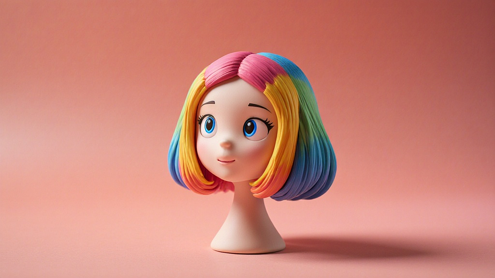

어릴 적 일요일 아침이면 이불을 뒤집어쓰고 만화동산을 기다리던 소년이 어느덧 마흔을 넘긴 키덜트 수집가가 되었습니다. 제 서재에는 수백만 원을 호가하는 스태츄와 한정판 레고들이 가득하지만, 가끔은 그 캐릭터 자체가 되고 싶다는 열망에 코스프레라는 세계에 발을 들이기도 합니다. 하지만 캐릭터의 완성도를 결정짓는 가장 중요한 요소인 퀄리티 높이는 코스프레 가발 스타일링 및 관리 팁을 제대로 알지 못하면, 공들여 준비한 의상과 메이크업이 한순간에 무너지는 경험을 하게 됩니다. 저 역시 처음에는 중고 장터에서 산 엉망진창인 가발을 보고 "아, 이거 진짜 갖고 싶었던 캐릭터인데 가발이 왜 이래?"라며 좌절했던 기억이 납니다. 번들거리는 인조 광택과 제멋대로 뻗친 앞머리를 보며 한숨을 쉬던 그 시절의 시행착오를 바탕으로, 오늘은 여러분의 소중한 캐릭터를 완벽하게 재현할 수 있는 실무적인 가이드라인을 공유하고자 합니다. 단순히 머리에 쓰는 도구가 아니라, 수집품의 가치를 높이는 하나의 예술 작품으로 가발을 바라보는 관점이 필요합니다.

## 고퀄리티 가발 선택을 위한 소재 이해와 구매 기준

가장 먼저 고민해야 할 부분은 어떤 소재의 가발을 선택하느냐입니다. 피규어를 고를 때 PVC냐 레진이냐를 따지는 것과 비슷합니다. 코스프레 가발은 크게 일반사, 고열사, 그리고 혼합사로 나뉩니다. 제가 입문자들에게 가장 강조하는 것은 무조건 고열사를 선택하라는 점입니다. 일반사는 가격이 저렴하지만 열에 약해서 고데기나 드라이기를 사용할 수 없습니다. 스타일링이 생명인 코스프레에서 열 기구를 쓰지 못한다는 것은 치명적인 단점입니다. 고열사는 보통 120도에서 180도 사이의 온도를 견딜 수 있어, 캐릭터 특유의 삐죽삐죽한 머리칼이나 부드러운 웨이브를 연출하기에 최적입니다. 또한, 리세일 가치를 고려하더라도 고열사 제품이 중고 시장에서 훨씬 대접을 받습니다.

제품을 선택할 때 꼭 확인해야 할 체크리스트가 있습니다. 첫째는 가발 캡의 크기입니다. 서양인 두상에 맞춰진 해외 직구 제품은 한국인의 두상에 맞지 않아 착용 시 머리가 커 보일 수 있습니다. 둘째는 모량의 밀도입니다. 가발을 들춰봤을 때 안쪽의 망(캡)이 훤히 들여다보인다면 그 가발은 실패작입니다. 특히 정수리 부분의 스킨 처리가 얼마나 자연스러운지 확인해야 합니다. 셋째는 인위적인 광택의 유무입니다. 너무 번들거리는 가발은 사진 촬영 시 반사광 때문에 소위 떡진 머리처럼 보이기 쉽습니다. 무광 처리가 잘 된 가발일수록 실제 사람의 머리카락 같은 고급스러운 느낌을 줍니다.

처음 시작하는 분들이라면 너무 저렴한 가격에 현혹되지 마세요. 만 원대의 저가 가발은 대개 모량이 부족하고 엉킴이 심해 한 번 쓰고 버리게 되는 경우가 많습니다. 최소 3만 원에서 5만 원대의 중가 브랜드 제품을 선택하는 것이 정신 건강과 지갑 건강에 이롭습니다. 저 역시 "이 가격이면 레고 피규어 하나 더 사겠는데?"라는 생각에 저가 제품을 샀다가, 결국 스타일링이 안 되어 쓰레기통으로 보낸 경험이 한두 번이 아닙니다. 좋은 소재는 스타일링의 절반을 먹고 들어간다는 사실을 잊지 마십시오.

## 캐릭터의 생명력을 불어넣는 실전 스타일링 테크닉

가발을 배송받고 나서 가장 먼저 해야 할 일은 가발 스탠드에 씌우는 것입니다. 가발은 배송 과정에서 눌려 있기 때문에 본래의 볼륨감을 되찾아주는 시간이 필요합니다. 여기서 제가 겪었던 가장 큰 실수는 바로 받자마자 가위질을 시작한 것이었습니다. 가발 커트는 일반적인 머리 커트와는 완전히 다릅니다. 가발은 한 번 자르면 다시 자라지 않기 때문입니다. 그래서 저는 항상 빗질을 충분히 한 뒤, 분무기로 물을 살짝 뿌려 결을 정돈하고 커트를 시작합니다. 특히 앞머리를 자를 때는 본인의 눈썹 위치를 기준으로 삼지 말고, 가발을 쓴 상태에서 거울을 보며 아주 조금씩 세로로 가위질을 해야 자연스럽습니다.

삐죽거리는 스파이크 헤어를 연출할 때는 강력한 고정력이 필요합니다. 저는 주로 헤어 왁스와 강력 스프레이를 병행해서 사용합니다. 먼저 왁스를 손가락 끝에 소량 묻혀 가발 가닥을 꼬아 모양을 잡습니다. 그 상태에서 드라이기의 약한 바람으로 열을 가해주면 모양이 고정됩니다. 마지막으로 스프레이를 멀리서 분사해 코팅하듯 마무리합니다. 이때 주의할 점은 스프레이를 너무 가까이서 뿌리면 가발 입자 사이에 하얀 가루가 생기는 백화 현상이 일어날 수 있다는 점입니다. 마치 건담 프라모델에 마감재를 뿌릴 때와 비슷한 주의가 필요합니다.

자연스러운 가르마를 만들고 싶다면 칫솔을 활용해 보세요. 칫솔에 물이나 헤어 에센스를 묻혀 가르마 방향으로 살살 빗어주면 정교한 정돈이 가능합니다. 만약 가발이 너무 번들거린다면 노세범 파우더나 드라이 샴푸를 가볍게 도포해 보세요. 광택을 죽여주면서 훨씬 매트하고 고급스러운 질감을 연출할 수 있습니다. 제가 예전에 은발 캐릭터를 준비할 때 이 방법을 썼는데, 지인들이 가발인지 실제 머리인지 헷갈려 할 정도로 효과가 좋았습니다. 스타일링의 핵심은 과유불급입니다. 너무 많은 제품을 바르기보다는 최소한의 터치로 캐릭터의 특징을 잡아내는 연습이 필요합니다.

## 수명과 퀄리티를 유지하는 철저한 관리 및 보관법

코스프레 행사가 끝나고 집에 돌아오면 녹초가 되기 마련입니다. 하지만 소중한 가발을 그대로 방치하는 것은 수집가로서의 도리가 아닙니다. 가발은 미세먼지와 땀, 그리고 스프레이 잔여물로 인해 쉽게 오염됩니다. 이를 방치하면 가발의 결이 상하고 냄새가 배어 결국 폐기해야 할 상황에 이릅니다. 저는 행사가 끝난 직후, 가발 전용 빗으로 끝부분부터 살살 엉킴을 풀어줍니다. 억지로 힘을 주어 빗으면 가발 원사가 늘어나거나 빠지게 되니 주의해야 합니다.

세척은 매번 할 필요는 없지만, 스프레이를 많이 사용했거나 땀을 많이 흘렸을 때는 반드시 해야 합니다. 미지근한 물에 가발 전용 샴푸나 섬유 유연제를 풀어 10분 정도 담가둡니다. 여기서 팁은 절대로 비벼 빨지 않는 것입니다. 손으로 부드럽게 눌러가며 오염물을 제거해야 원사가 손상되지 않습니다. 헹굴 때도 흐르는 물에 자연스럽게 씻어내고, 수건으로 감싸 꾹꾹 눌러 물기를 제거합니다. 드라이기 사용은 가급적 피하고 통풍이 잘되는 그늘에서 자연 건조하는 것이 가장 좋습니다. 건조가 80퍼센트 정도 되었을 때 가발 에센스를 뿌려주면 정전기를 방지하고 윤기를 유지할 수 있습니다.

보관할 때는 가발망에 넣어 가발 스탠드에 씌우거나, 원래 들어있던 지퍼백에 공기를 살짝 넣어 보관하는 것이 좋습니다. 저는 공간 효율을 위해 지퍼백 보관을 선호하는데, 이때 가발 안쪽에 종이 뭉치를 넣어 형태가 뒤틀리지 않게 잡아줍니다. 가발도 레고나 피규어처럼 습도와 직사광선에 취약합니다. 햇빛이 잘 드는 창가에 두면 색이 변질될 수 있으니 어둡고 서늘한 곳에 보관하세요. 이렇게 관리된 가발은 2년에서 3년이 지나도 새것 같은 퀄리티를 유지하며, 나중에 다른 수집가에게 양도할 때도 좋은 가격을 받을 수 있는 밑거름이 됩니다.

## 실패를 줄이기 위한 실전 체크리스트와 판단 기준

가발 스타일링에 처음 도전하는 분들이라면 무엇을 먼저 해야 할지 막막할 것입니다. 그래서 제가 수년간의 경험을 통해 정리한 판단 기준을 공유하고자 합니다. 이 기준에 따라 준비한다면 최소한 돈을 낭비하거나 캐릭터를 망치는 일은 없을 것입니다.

첫째, 캐릭터의 헤어스타일 난이도를 파악하세요. 생머리나 가벼운 웨이브는 초보자도 충분히 스타일링이 가능합니다. 하지만 중력을 거스르는 입체적인 머리나 복잡한 땋기 머리는 전문가가 셋팅한 제품을 구매하는 것이 정신 건강에 좋습니다. 저도 예전에 무리하게 복잡한 스타일링에 도전했다가 가발 세 개를 연달아 망치고 결국 전문가에게 의뢰했던 뼈아픈 기억이 있습니다.

둘째, 가발의 색상을 선택할 때는 모니터 화면보다 한 톤 낮은 색상을 고르세요. 촬영용 조명 아래서는 색상이 평소보다 밝게 날아가는 경향이 있습니다. 너무 쨍한 원색보다는 약간의 회색기가 섞인 차분한 색상이 사진에서 훨씬 고급스럽게 나옵니다.

셋째, 스타일링 도구의 준비 상태를 점검하세요.
- 가발 전용 빗 (금속 빗살 추천)
- 가발 전용 에센스 (정전기 방지 필수)
- 미용 가위 및 틴닝 가위 (숱 가위)
- 고정력이 강한 가스형 스프레이와 액체형 스프레이
- 가발 스탠드와 핀

이 도구들은 한 번 사두면 평생 쓰는 장비들입니다. 피규어 장식장을 사는 마음으로 조금 좋은 것을 구비해 두시길 권합니다. 만약 가발의 결이 이미 심하게 엉켰다면 미련 없이 전용 빗으로 아래서부터 조금씩 풀어보고, 그래도 안 된다면 섬유 유연제 물에 장시간 담가두는 응급 처치를 시도해 보세요. 하지만 원사가 녹거나 심하게 늘어났다면 그것은 교체 주기가 왔다는 신호입니다.

마지막으로, 본인에게 맞는 스타일인지 냉정하게 판단해야 합니다. 특정 캐릭터가 너무 좋아서 가발을 샀지만, 본인의 얼굴형과 너무 맞지 않아 스트레스를 받는 경우도 많습니다. 이럴 때는 가발의 구레나룻 길이를 조절하거나 앞머리 각도를 수정하여 본인의 얼굴형에 최적화하는 커스텀 과정이 반드시 필요합니다.

키덜트 수집가로서 제가 느낀 코스프레 가발의 매력은 정교한 피규어를 내 몸에 이식하는 것과 같습니다. 퀄리티 높이는 코스프레 가발 스타일링 및 관리 팁을 숙지하는 것은 단순히 외형을 꾸미는 것을 넘어, 내가 사랑하는 캐릭터에 대한 예우이기도 합니다. 처음에는 가위질 한 번에 손이 떨리고, 스프레이 조절 실패로 가발이 떡지는 일도 다반사일 것입니다. 하지만 그 모든 과정은 결국 여러분의 수집 인생에서 소중한 경험치가 됩니다.

오늘 제가 공유해 드린 팁들이 여러분의 장식장 속 캐릭터를 현실로 불러내는 데 작은 도움이 되기를 바랍니다. 완벽하게 세팅된 가발을 쓰고 거울 앞에 섰을 때의 그 전율은, 구하기 힘들었던 한정판 피규어를 마침내 손에 넣었을 때의 기쁨과 맞먹습니다. 실패를 두려워하지 마세요. 가발은 소모품이지만, 그것을 만지며 익힌 여러분의 기술은 사라지지 않는 자산이 됩니다. 이제 가위를 들고, 혹은 빗을 들고 여러분만의 캐릭터를 완성해 보시기 바랍니다. 여러분의 멋진 취미 생활을 진심으로 응원하며, 다음에도 수집가의 감성을 담은 실용적인 이야기로 찾아오겠습니다. 소중한 가발과 함께 더욱 빛나는 코스프레 활동 되시길 바랍니다.