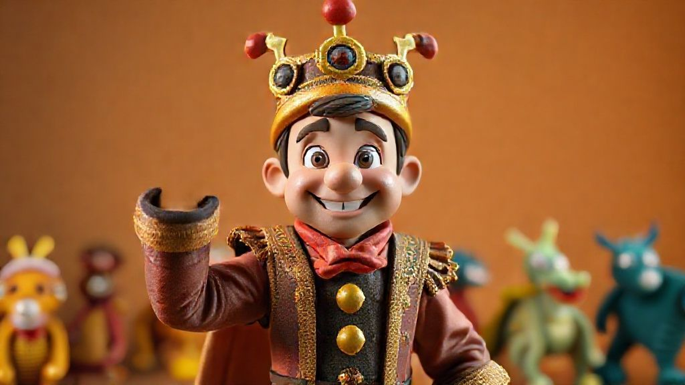

# 40대 아재의 코스프레 도전기? 아니, 덕업일치 로망 실현기!

**코스프레**, 이 단어만 들어도 어릴 적 TV 앞에 옹기종기 모여 앉아 보던 만화영화 주인공들이 눈앞에 아른거리는 분들, 저 말고도 또 계시죠? 안녕하세요, 방 한쪽 벽을 빼곡히 채운 피규어와 미개봉 레고 박스를 보며 흐뭇한 미소를 짓는, 마흔을 갓 넘긴 키덜트 수집가입니다. 제게 수집은 단순한 취미를 넘어 어린 시절의 저와 만나는 통로 같은 건데요. 건담 프라모델을 조립하며 파일럿이 된 듯한 착각에 빠지고, 스타워즈 피규어를 보며 광선검을 휘두르던 상상을 하던 그 마음, 다들 한 번쯤은 품어보셨잖아요.

그런데 말입니다. 언제부턴가 진열장 안의 피규어를 보는 것만으로는 채워지지 않는 갈증이 생기더라고요. '아, 이 캐릭터 진짜 멋진데. 내가 직접 이 옷을 입어보면 어떨까?' 하는, 조금은 엉뚱하고 대담한 상상이었죠. 주변에서는 "그 나이에 무슨 주책이냐"며 핀잔을 줄지도 모를 일이지만, 제 안의 '소년'은 계속해서 속삭였습니다. "한 번쯤은 괜찮잖아!" 라고요. 이건 단순히 캐릭터를 따라 하는 놀이가 아닙니다. 제게 코스프레는 수집의 연장선이자, 2D 스크린과 3D 현실의 경계를 허무는 가장 능동적인 '덕질'의 형태였어요. 그래서 결심했습니다. 더 이상 망설이지 말고, 내 안의 열정을 직접 표현해보자고. 이 글은 저처럼 마음속에 '최애캐' 하나쯤 품고 사는, 하지만 선뜻 용기 내지 못하는 40대 동지들을 위한 아주 솔직하고 현실적인 코스프레 입문 가이드입니다.

## 모든 것의 시작, '최애캐' 선정과 현실적인 예산 짜기

자, 가장 설레면서도 머리 아픈 첫 단계입니다. 바로 어떤 캐릭터가 될 것인가를 정하는 일이죠. 마음 같아서는 당장이라도 <기동전사 건담>의 샤아 아즈나블이 되어 "아직이다! 아직 끝나지 않았어!"를 외치고 싶었지만, 잠깐만요. 헬멧을 쓰면 앞은 제대로 보일까? 붉은 군복은 어디서 구해야 하지? 현실적인 문제들이 꼬리를 물고 이어집니다.

캐릭터 선정은 단순히 '내가 제일 좋아하는 캐릭터'에서 그치면 안 되더라고요. 특히 처음 도전하는 분이라면 몇 가지 기준을 더 생각해보는 게 좋습니다.

*   **난이도와 접근성:** 갑옷이나 거대한 날개, 복잡한 메카닉 슈트 등은 초심자가 도전하기엔 너무나 큰 벽입니다. 저도 처음엔 풀아머 건담 같은 걸 상상했다가 바로 마음을 접었죠. 일상복에 가까운 의상이나 교복, 제복처럼 비교적 구하기 쉬운 아이템으로 구성된 캐릭터가 시작하기에 부담이 적습니다. 예를 들어 <주술회전>의 고죠 사토루나 <체인소 맨>의 아키 같은 캐릭터는 검은색 의상이 기본이라 접근성이 아주 좋죠.
*   **인지도:** 물론 자기만족이 가장 중요하지만, 행사장에서 다른 사람들과 교류하는 즐거움도 코스프레의 큰 매력 중 하나입니다. 많은 사람이 알아봐 주는 캐릭터를 선택하면 "어! OOO 맞으시죠? 사진 한 장만 부탁드려요!"라는 요청을 받으며 특별한 경험을 할 수 있습니다. 2025년 트렌드를 살짝 예측해보자면, 여전히 <원신>이나 <스타레일> 같은 게임 캐릭터들의 인기가 뜨거울 거고, 새롭게 애니메이션화되는 인기 웹툰이나 만화의 주인공들도 주목받을 겁니다.
*   **예산 설정:** 이게 가장 현실적인 부분이죠. 코스프레는 생각보다 돈이 많이 들 수 있습니다. 의상, 가발, 소품, 신발, 메이크업 용품까지... 뭐 하나 그냥 되는 게 없어요. 제 첫 코스프레였던 <스파이 패밀리>의 로이드 포저를 예로 들어볼까요?

    *   **의상 (녹색 정장 세트):** 기성품 구매. 중국 직구 사이트(알리익스프레스 등)를 이용하면 5만 원에서 10만 원 선에서 구할 수 있습니다. 저는 약 7만 원 정도에 구매했는데, 바지 기장이 너무 길어서 수선비 5천 원이 추가로 들었네요.
    *   **가발:** 절대 싸구려 파티용 가발은 피하세요. 사진에서 플라스틱처럼 번들거려서 망한 느낌을 제대로 줍니다. 코스프레 전문샵에서 파는 '고열사' 가발을 추천합니다. 약간의 스타일링이 된 제품을 3만 원에서 5만 원 사이에 구매할 수 있습니다.
    *   **소품 (권총, 장갑 등):** 소품은 퀄리티를 좌우하는 핵심입니다. 로이드의 권총은 안전한 BB탄 총 모델을 중고로 2만 원에 구했고, 흰 장갑은 5천 원 정도에 구매했습니다.

이렇게 하나하나 따져보니 첫 코스프레에 대략 **13만 원에서 15만 원** 정도가 들었더군요. 여기서 직접 무언가를 만들거나 더 높은 퀄리티를 원한다면 비용은 천정부지로 솟을 수 있습니다. 그러니 처음부터 '이 캐릭터를 위해 얼마까지 쓸 수 있다'는 명확한 예산선을 정해두는 것이 현명한 지출의 시작입니다.

## 퀄리티는 디테일에서! 소품과 가발, '진짜'처럼 보이게 하는 마법

피규어를 수집하다 보면 자연스레 눈이 높아집니다. 도색의 미묘한 차이, 조형의 섬세함, 원작 고증 같은 것들을 따지게 되죠. 코스프레도 똑같습니다. 멀리서 보면 그럴듯해 보여도, 가까이서 봤을 때 '아, 이건 진짜다' 싶은 느낌을 주는 건 결국 디테일의 차이에서 오거든요. 그리고 그 디테일의 핵심은 바로 **가발**과 **소품**입니다.

### ### 가발, 제2의 얼굴을 만드는 가장 중요한 투자

솔직히 고백하자면, 저도 처음엔 가발의 중요성을 몰랐습니다. "대충 비슷한 색깔 머리 쓰면 되는 거 아냐?"라고 생각하고 1만 원짜리 저렴한 가발을 샀다가 크게 후회했죠. 광택이 너무 심해서 조명 아래서 번쩍이는 건 둘째치고, 머리카락이 힘없이 축 처져서 도무지 스타일링이 불가능하더라고요. 그야말로 '가발 쓴 일반인' 그 이상도 이하도 아니었습니다.

실패를 거울삼아 몇 가지 팁을 드리자면,

1.  **'코스프레용 고열사 가발'을 검색하세요:** 고열사는 드라이기나 고데기 사용이 가능해서 원하는 스타일을 연출하기 좋습니다. 일반 인조모보다 광택이 적어 훨씬 자연스럽죠.
2.  **컷팅과 스타일링은 필수:** 캐릭터의 헤어스타일은 생각보다 복잡합니다. 앞머리 길이, 옆머리의 층, 뒷머리의 뻗침 등 디테일을 살려줘야 해요. 유튜브에 '(캐릭터 이름) wig styling'이라고 검색하면 금손들의 튜토리얼이 넘쳐납니다. 처음엔 어색해도 몇 번 가위질을 해보면 감이 와요. 정 자신이 없다면, 추가 비용을 내고 '달비'라고 불리는 스타일링 전문가에게 맡기는 방법도 있습니다.
3.  **보관이 생명:** 행사가 끝나면 가발을 아무렇게나 던져두지 마세요. 엉킴 방지 에센스를 뿌려 빗질한 뒤, 가발걸이에 걸어두거나 원래 포장 비닐에 넣어 보관해야 다음번에도 예쁘게 쓸 수 있습니다.

가발에 3-5만 원을 투자하는 건 절대 낭비가 아닙니다. 잘 고른 가발 하나가 전체적인 인상을 180도 바꿔놓는 마법을 경험하게 될 거예요.

### ### 소품, 캐릭터의 영혼을 불어넣는 작업

캐릭터를 상징하는 무기나 도구는 코스프레의 완성도를 결정짓는 화룡점정입니다. <귀멸의 칼날> 캐릭터가 일륜도 없이 서 있다면 얼마나 허전할까요? 제가 로이드 포저를 할 때도 소음기가 달린 권총 하나가 '스파이'라는 정체성을 확실하게 보여주었죠.

소품은 구하는 방법이 크게 세 가지입니다.

*   **기성품 구매:** 가장 간편한 방법입니다. 요즘은 3D 프린터 기술이 발달해서 웬만한 캐릭터 소품은 온라인에서 쉽게 찾을 수 있습니다. 가격은 크기와 복잡도에 따라 다르지만, 보통 3만 원에서 10만 원 이상까지 다양합니다.
*   **직접 제작 (DIY):** 시간과 노력이 들지만 가장 저렴하고 만족도가 높은 방법입니다. 코스프레 소품 제작의 성배와도 같은 재료는 바로 'EVA 폼'입니다. 가볍고, 자르기 쉽고, 열을 가하면 구부러져서 곡면 표현도 자유롭죠. 유튜브에 'EVA foam sword' 같은 키워드로 검색하면 A부터 Z까지 알려주는 영상이 정말 많습니다. 저도 다음엔 <원피스> 조로의 칼을 직접 만들어볼까 생각 중입니다.
*   **생활용품 활용:** 의외의 물건들이 훌륭한 소품이 되기도 합니다. 다이소에서 파는 장난감이나 주방용품을 사서 색을 칠하고 개조하는 거죠. 창의력을 발휘하면 아주 저렴한 비용으로 꽤 그럴듯한 결과물을 얻을 수 있습니다.

어떤 방법을 선택하든 가장 중요한 것은 **안전**입니다. 특히 칼이나 총 같은 무기류 소품은 행사장의 규정을 반드시 확인해야 합니다. 칼날 끝은 무디게 처리하고, 총구는 주황색 칼라파츠를 붙여 실제 총이 아님을 명확히 표시하는 것이 기본 매너입니다.

## '코스어는 처음이라...' 행사장에서 살아남는 현실적인 꿀팁

자, 이제 모든 준비를 마치고 드디어 결전의 날, 코믹월드나 AGF 같은 행사장으로 향합니다. 심장이 두근거리시나요? 저도 그랬습니다. 집에서 거울 볼 땐 완벽해 보였는데, 막상 수많은 인파 속에 들어서려니 괜히 위축되고 어색하더라고요. 하지만 걱정 마세요. 몇 가지만 미리 알고 가면 훨씬 즐겁고 편안하게 하루를 보낼 수 있습니다.

먼저, **'코스프레 비상 키트'**는 선택이 아닌 필수입니다. 거창한 건 아니고, 작은 파우치에 꼭 필요한 몇 가지만 챙기면 됩니다.

*   **의상 수습용:** 옷핀, 양면테이프(강력한 의상용 추천!), 순간접착제, 작은 바늘과 실. 믿으세요, 행사장에서 돌아다니다 보면 뭐 하나는 꼭 떨어지거나 찢어집니다.
*   **개인 관리용:** 수정용 화장품, 물티슈, 기름종이, 그리고 가장 중요한 **진통제와 반창고**. 특히 새 신발을 신었다면 발뒤꿈치는 남아나질 않을 겁니다.
*   **기타:** 보조 배터리, 간단한 간식(초코바 등), 물. 행사장은 넓고 사람은 많아서 금방 지치고 배고파집니다.

그리고 행사장에서 다른 코스플레이어(코스어)나 일반 관람객들과 교류할 때 알아두면 좋은 에티켓이 몇 가지 있습니다.

1.  **사진 촬영은 허락부터:** 마음에 드는 코스어를 발견했다고 해서 바로 카메라부터 들이대면 큰 실례입니다. 다가가서 "안녕하세요, 코스프레 너무 멋진데 혹시 사진 한 장 찍어도 될까요?"라고 정중하게 물어보는 것이 기본입니다. 대부분의 코스어들은 자신의 노력을 알아봐 주는 것을 기뻐하며 흔쾌히 촬영에 응해줄 겁니다.
2.  **포즈 요청은 정중하게:** 원하는 포즈가 있다면 "혹시 이런 포즈도 가능하실까요?"라고 조심스럽게 여쭤보세요. 물론 너무 무리하거나 어려운 포즈는 피해야겠죠.
3.  **만지지 마세요:** 의상이나 소품은 보기보다 약하고 비싼 경우가 많습니다. 궁금하다고 해서 함부로 만지거나 잡아당기면 절대 안 됩니다.
4.  **'감사합니다'는 필수:** 촬영이 끝나면 "멋진 사진 감사합니다!"라는 인사를 잊지 마세요. 이 작은 한마디가 서로의 하루를 기분 좋게 만듭니다.

제가 처음 로이드 포저 코스프레를 하고 행사장에 갔을 때, 한 어린아이가 다가와서 "아냐 아빠다!"라며 수줍게 손을 흔들어주던 순간을 잊을 수가 없습니다. 어색함과 긴장이 한순간에 녹아내리면서 '아, 이 맛에 코스프레 하는구나' 싶더라고요. 다른 사람들과 캐릭터를 통해 소통하고, 잠시나마 내가 아닌 다른 누군가가 되어보는 경험. 이건 피규어를 진열장에 모셔두는 것과는 또 다른 차원의, 살아있는 즐거움이었습니다.

## 망설이는 당신에게, 40대 키덜트가 전하는 마지막 한마디

코스프레에 도전하는 것은 단순히 옷을 갈아입는 행위가 아니었습니다. 그것은 캐릭터에 대한 깊은 애정을 표현하는 방식이었고, 잊고 있던 어린 시절의 꿈을 내 손으로 직접 실현하는 과정이었습니다. 물론 준비 과정은 번거롭고 때로는 시행착오도 겪습니다. 어설픈 바느질에 손가락을 찔리기도 하고, 원하는 소품을 구하기 위해 온갖 사이트를 뒤져야 할 때도 있죠. 하지만 그 모든 과정이 쌓여 마침내 거울 앞에 완성된 내 모습을 보았을 때의 희열은 그 어떤 수집품을 손에 넣었을 때보다도 짜릿했습니다.

혹시 이 글을 읽고 계신 분 중에 '나도 해볼까?' 하는 마음이 조금이라도 생겼다면, 더 이상 망설이지 마세요. 나이가 무슨 상관이며, 다른 사람의 시선이 뭐가 중요하겠습니까. 우리 마음속에는 여전히 세상을 구하고 싶고, 마법을 부리고 싶고, 우주를 여행하고 싶은 소년, 소녀가 살고 있잖아요. 그 친구에게 하루쯤 멋진 옷을 입혀주는 건 어떨까요?

처음부터 너무 거창할 필요는 없습니다. 좋아하는 캐릭터의 상징적인 아이템 하나, 가발 하나부터 시작해보세요. 그리고 용기를 내어 행사장에 한 번 방문해보세요. 그곳에서 당신은 혼자가 아님을, 같은 꿈을 꾸는 수많은 '어른이'들이 있다는 사실을 깨닫게 될 겁니다. 혹시 모르죠, 다음 행사장에서 어딘가 어색하게 포즈를 취하고 있는 40대 아저씨 코스어를 만난다면, 저일지도 모릅니다. 그때는 반갑게 아는 척해주셔도 좋습니다. 우리, 좋아하는 걸 좋아한다고 당당하게 외치며 살아도 괜찮은 나이잖아요?