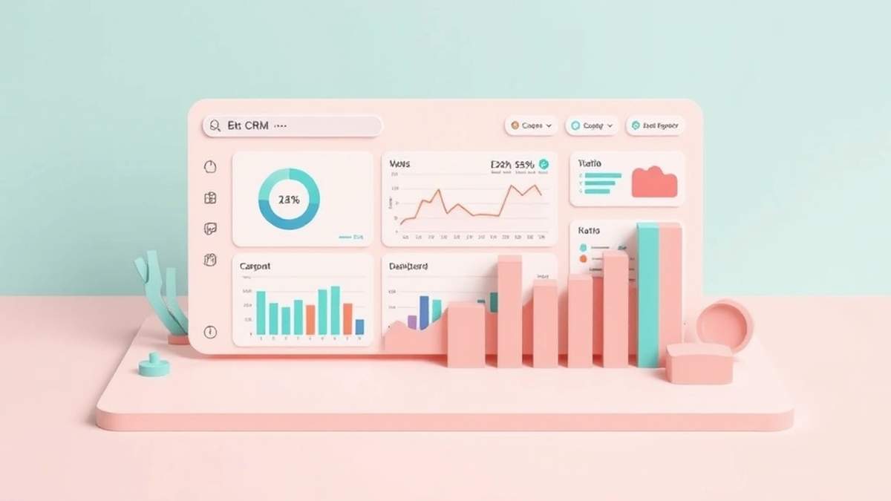

여러분, 혹시 어린 시절부터 모아온 소중한 보물들이 있으신가요? 저처럼 40대 키덜트 수집가들에게 **CRM**은 마치 잘 정돈된 피규어 장식장이나 레고 박스 같아요. 처음에는 그저 예쁜 장난감 하나하나를 모으는 데 집중하지만, 시간이 지나면 각각의 스토리를 기억하고, 어떻게 관리해야 더 오래 빛을 발할지 고민하게 되죠. 기업도 마찬가지예요. 고객 한 명 한 명이 우리 브랜드의 소중한 컬렉션이고, 이들과의 관계를 어떻게 관리하느냐가 사업의 성패를 좌우합니다. 고객 관계 관리, 즉 CRM은 단순히 고객 정보를 모으는 걸 넘어, 고객의 마음을 이해하고, 그들과의 유대감을 돈독히 하며, 궁극적으로는 우리 브랜드를 향한 충성심을 키워나가는 일련의 과정이에요.

어릴 적 용돈을 모아 겨우 샀던 로봇 피규어를 아직도 버리지 못하고 소중히 간직하는 것처럼, 기업도 어렵게 얻은 고객을 함부로 대하면 안 됩니다. 고객이 무엇을 좋아하고, 무엇을 불편해하며, 어떤 경험을 통해 우리와 더 가까워지는지 끊임없이 파악하고 반응해야 하죠. 마치 제가 한정판 레고를 구매했을 때, 그 브랜드가 저에게 보내준 감사 메시지와 다음 신제품 소식에 얼마나 설레었는지 모릅니다. 이런 작은 관심들이 쌓여 저는 그 브랜드의 충성 고객이 되었고, 제 주변 친구들에게도 자랑스레 추천하곤 했죠. CRM은 바로 이런 고객 경험을 체계적으로 관리하고 개선해서, 고객이 우리 브랜드를 '나만의 소중한 컬렉션'처럼 여기게 만드는 마법 같은 도구라고 생각해요. 단순히 물건을 사고파는 관계를 넘어, 감성적인 유대감을 형성하는 것이 2025년 비즈니스 환경에서 그 어느 때보다 중요해질 겁니다.

## CRM, 그게 뭔데? 우리 추억을 지키는 비법

자, 그럼 이쯤에서 CRM이 도대체 뭐 하는 녀석인지 좀 더 쉽게 풀어볼까요? CRM은 Customer Relationship Management의 약자로, 말 그대로 '고객 관계 관리'를 의미합니다. 제가 좋아하는 피규어들을 모으는 과정을 한번 떠올려보세요. 저는 이 피규어가 어느 회사 제품인지, 언제 출시되었는지, 한정판인지, 어떤 캐릭터와 연결되는지, 심지어는 제가 어디서 얼마에 샀는지까지 다 기억하고 있습니다. 그리고 이 피규어들을 어떻게 보관해야 손상되지 않고 가치를 유지할지, 어떤 장식장에 진열해야 더 멋있을지 고민하죠. 이게 바로 제 '피규어 관계 관리'인 셈이에요.

기업의 CRM도 이와 똑같습니다. 고객이 우리 제품이나 서비스를 언제, 어떻게, 얼마에 구매했는지, 어떤 문의를 했고 어떤 피드백을 주었는지, 어떤 프로모션에 반응했는지 같은 모든 정보를 한곳에 모아서 체계적으로 관리하는 거죠. 이렇게 모은 정보를 바탕으로 고객 한 명 한 명에게 맞춤형 서비스를 제공하고, 더 나은 경험을 선사해서 장기적인 관계를 구축하는 것이 CRM의 핵심이에요. 예전에 제가 한정판 레고 스타워즈 UCS 팔콘을 놓쳤을 때, 아, 진짜 땅을 치고 후회했었죠. 그 뒤로는 제가 자주 가는 단골샵 사장님이 저한테 신제품 정보나 재입고 소식을 미리 알려주셨어요. 제가 좋아하는 테마가 뭔지, 어떤 제품을 사고 싶어 하는지 아셨던 거죠. 이게 바로 CRM의 작은 예시라고 할 수 있습니다. 사장님은 저라는 고객의 취향과 구매 이력을 기억하고 저에게 꼭 필요한 정보를 적시에 제공함으로써, 저를 단골을 넘어 충성 고객으로 만든 거예요.

CRM을 통해 기업은 고객의 불만을 미리 감지하고 해결할 수 있고, 고객이 원하는 것을 정확히 파악해서 딱 맞는 제품이나 서비스를 추천할 수 있어요. 예를 들어, 제가 좋아하는 로봇 피규어 시리즈의 새 제품이 출시되면, CRM 시스템은 제가 과거에 그 시리즈를 구매했던 이력을 바탕으로 저에게만 특별한 할인 쿠폰과 함께 신제품 출시 소식을 보내주는 거죠. "아, 이거 진짜 갖고 싶었는데!" 소리가 절로 나오게 만드는 이런 경험들이 쌓여 고객은 그 브랜드를 신뢰하게 되고, 결국 지속적인 구매로 이어지는 겁니다. 더 나아가, 기업은 고객 데이터를 분석해서 시장 트렌드를 읽고, 새로운 제품 개발이나 마케팅 전략 수립에도 활용할 수 있어요. 고객 이탈률을 줄이고, 고객 생애 가치(Customer Lifetime Value, CLV)를 높이는 데 CRM만큼 효과적인 도구도 없다고 저는 확신합니다. 제 레고 컬렉션의 희귀 브릭 하나하나가 모여 멋진 작품을 만들듯, 고객 한 명 한 명과의 소중한 관계가 모여 우리 회사의 단단한 미래를 만들어가는 거죠.

## 2025년, CRM은 어떻게 진화할까? AI와 데이터의 콜라보

시간은 멈추지 않고 흐르고, CRM의 세계도 빠르게 진화하고 있습니다. 2025년의 CRM은 과거의 단순한 고객 정보 관리 시스템을 넘어, 인공지능(AI)과 빅데이터 분석을 기반으로 한 초개인화된 경험을 제공하는 방향으로 나아가고 있어요. 마치 제가 아끼는 피규어 장식장이 단순히 전시 기능을 넘어, 제가 어떤 피규어를 좋아하는지 학습하고, 관련 신제품 정보를 자동으로 찾아주며, 심지어는 제가 가장 좋아하는 피규어의 희귀성을 분석해서 미래 가치를 예측해주는 스마트한 시스템으로 진화하는 것과 같달까요? 상상만 해도 두근거리는 일이죠.

AI는 CRM 시스템에 놀라운 변화를 가져오고 있습니다. 과거에는 고객 문의에 일일이 사람이 응대해야 했지만, 이제는 챗봇이나 AI 기반의 가상 비서가 24시간 내내 고객의 질문에 즉각적으로 답변하고 문제를 해결해줍니다. 제가 새벽에 문득 레고 브릭 하나가 없어진 것 같아 문의했을 때, AI 챗봇이 바로 재고 여부를 확인해주고 배송까지 처리해준다면 얼마나 편리할까요? 더 나아가 AI는 고객의 과거 구매 이력, 웹사이트 방문 기록, 소셜 미디어 활동 등 방대한 데이터를 분석해서 고객이 다음에 어떤 제품을 구매할지, 어떤 서비스를 필요로 할지 예측하는 '예측 분석' 기능을 제공합니다. 제 레고 커뮤니티에서 어떤 분이 "이 브릭은 조립감이 별로였어요"라고 남긴 글을 AI가 분석해서, 다음 구매 추천에서 그 브릭이 들어간 제품은 제외하고 다른 조립감 좋은 제품을 추천해준다면? 와, 진짜 감동이죠. 이런 초개인화된 추천은 고객 만족도를 극대화하고, 매출 증대에도 직접적으로 기여하게 됩니다.

하지만 AI와 데이터를 활용한 CRM이 마냥 장밋빛 미래만 있는 건 아니에요. 바로 '데이터 윤리'와 '개인 정보 보호' 문제가 중요하게 대두됩니다. 아무리 좋은 기능이라도, 고객의 개인 정보를 함부로 다루거나 동의 없이 활용하면 안 되죠. 제가 아끼는 피규어가 함부로 다뤄지는 것만큼 속상한 일은 없으니까요. 2025년에는 기업들이 고객 데이터 활용에 대한 투명성을 높이고, 고객이 자신의 데이터를 통제할 수 있는 권한을 더 많이 부여하는 방향으로 나아가야 할 겁니다. 또한, AI 기반의 CRM은 단순히 기술 도입에서 끝나는 것이 아니라, 데이터를 올바르게 해석하고 활용할 수 있는 전문가의 역할도 더욱 중요해질 거예요. 마치 피규어 가치를 제대로 평가하려면 단순한 정보 검색을 넘어 전문가의 안목이 필요한 것처럼 말이죠. 결국 2025년의 CRM은 기술과 인간적인 이해가 조화롭게 어우러져, 고객에게 더욱 의미 있고 가치 있는 경험을 선사하는 방향으로 진화할 것이라고 저는 확신합니다.

## 우리 회사에 맞는 CRM, 어떻게 고를까? 삽질 줄이는 실전 팁

자, 이제 CRM이 뭔지도 알겠고, 미래가 어떻게 변할지도 대충 감이 잡혔습니다. 그런데 막상 우리 회사에 맞는 CRM 솔루션을 고르려고 하면 머리가 지끈거릴 거예요. 시중에 너무나 많은 CRM 시스템이 나와 있거든요. 마치 제가 피규어 컬렉션을 위해 어떤 장식장을 골라야 할지 고민하는 것과 똑같습니다. 공간 활용도, 디자인, 내구성, 가격… 따져볼 게 한두 가지가 아니죠. CRM도 마찬가지예요. 섣불리 선택했다가는 돈 낭비, 시간 낭비, 그리고 직원들의 불만까지 초래할 수 있습니다. 제가 예전에 저렴한 중국산 피규어 샀다가 관절 헐렁거리고 도색 미스 심해서 후회한 적이 한두 번이 아니거든요. CRM도 초기 투자 비용이 좀 들더라도, 장기적으로 고객 유지율이나 매출 증대로 이어지면 그게 훨씬 이득이에요. 마치 레고 UCS 시리즈가 나중에 리세일 가치가 엄청나게 오르는 것처럼 말이죠.

가장 먼저 고려해야 할 것은 우리 회사의 **규모와 예산**입니다. 스타트업이나 소규모 기업이라면 비교적 저렴하고 사용하기 쉬운 클라우드 기반의 CRM 솔루션이 적합할 수 있어요. 반면, 대기업이라면 더 복잡하고 커스터마이징이 가능한 엔터프라이즈급 솔루션이 필요할 겁니다. 저는 개인적으로 작은 사업을 할 때 무료 혹은 저렴한 요금제의 CRM을 써봤는데, 기본적인 기능은 좋았지만 나중에 확장성이 부족해서 결국 다른 시스템으로 갈아탔던 경험이 있어요. 그때 들었던 시간과 노력 생각하면, 처음부터 우리 규모에 맞는 적절한 솔루션을 선택하는 게 얼마나 중요한지 깨달았죠.

다음으로는 **필요한 기능**을 명확히 정의해야 합니다. 고객 데이터 관리, 영업 파이프라인 관리, 마케팅 자동화, 고객 서비스, 리포팅 등 우리 회사에 꼭 필요한 기능이 무엇인지 리스트업 해보세요. 모든 기능을 다 갖춘 만능 CRM은 없습니다. 불필요한 기능이 많으면 오히려 복잡하고 비싸기만 할 수 있어요. 제가 피규어 장식장을 고를 때, 단순 전시 기능만 필요한지, 아니면 습도 조절이나 조명 기능까지 필요한지 따져보는 것과 같아요. 우리 비즈니스의 핵심 프로세스와 고객 여정을 분석해서 어떤 기능이 가장 큰 가치를 가져다줄지 고민해야 합니다.

그리고 **기존 시스템과의 연동성**도 매우 중요합니다. 이미 사용하고 있는 회계 시스템, 이메일 마케팅 툴, ERP 시스템 등과 CRM이 얼마나 원활하게 데이터를 주고받을 수 있는지는 효율성 측면에서 결정적인 요소가 됩니다. 데이터가 여기저기 흩어져 있으면 오히려 업무가 더 복잡해질 수 있으니까요. 마지막으로, **사용자 친화적인 인터페이스**와 **충분한 교육 및 지원**이 제공되는지 확인해야 합니다. 아무리 좋은 CRM이라도 직원들이 사용하기 어렵거나, 문제가 생겼을 때 제대로 된 도움을 받지 못하면 무용지물이 됩니다. 저도 새 장식장 들여놓고 피규어 옮기다가 몇 개 떨어뜨려서 맘 아팠던 기억이 있어요. CRM 도입도 초기에는 좀 혼란스러울 수 있지만, 꾸준히 관리하고 직원들이 잘 활용하도록 지원하면 분명 빛을 발할 거예요. 데모 버전을 사용해보거나, 실제 사용자들의 리뷰를 꼼꼼히 살펴보는 것도 좋은 방법입니다.

결론적으로, CRM은 단순히 소프트웨어를 도입하는 것을 넘어, 고객과의 관계를 최우선으로 생각하는 기업 문화의 변화를 의미합니다. 마치 제가 아끼는 피규어 하나하나에 애정을 쏟고 관리하는 것처럼, 고객 한 명 한 명의 가치를 이해하고 그들의 경험을 풍요롭게 만드는 데 집중해야 하죠. 2025년에는 AI와 데이터 기술이 더욱 발전하며 CRM이 고객에게 제공하는 가치는 상상 이상으로 커질 겁니다. 하지만 아무리 기술이 발전해도, 결국 고객의 마음을 얻는 것은 진정성 있는 소통과 세심한 배려에서 시작된다는 사실을 잊지 말아야 해요. 여러분도 오늘부터 고객과의 관계를 소중한 컬렉션처럼 돌보는 건 어떠세요? 그렇게 쌓아 올린 관계는 분명 우리 비즈니스의 가장 강력한 자산이 될 것이라고 저는 믿습니다.

## 마치며

CRM은 단순히 기술적인 도구를 넘어, 고객 중심 비즈니스의 핵심이자 지속 가능한 성장을 위한 필수 전략입니다. 고객 데이터를 통합하고 분석하여 개인화된 경험을 제공하며, 모든 접점에서 고객과의 관계를 강화하는 것이 바로 CRM의 본질이죠. 이는 비즈니스가 고객의 진정한 파트너로 거듭나는 여정의 시작이기도 합니다.

복잡하게 느껴질 수도 있지만, 지금이 바로 고객 경험을 혁신할 기회입니다. 여러분의 비즈니스에 가장 적합한 CRM 솔루션을 찾아보고, 데모 버전을 통해 직접 경험해보세요. 그리고 무엇보다 중요한 것은, 시스템 도입 후에도 꾸준히 활용하며 직원들이 고객과의 관계 개선에 집중하도록 지원하는 것입니다. 고객의 작은 목소리에도 귀 기울이고, 진심을 다해 소통하는 노력이 쌓여 강력한 고객 충성도를 만들어낼 것입니다. 오늘부터 고객과의 관계를 소중한 자산으로 가꾸는 여정을 시작하여, 비즈니스의 빛나는 미래를 함께 만들어 나가시길 진심으로 응원합니다!