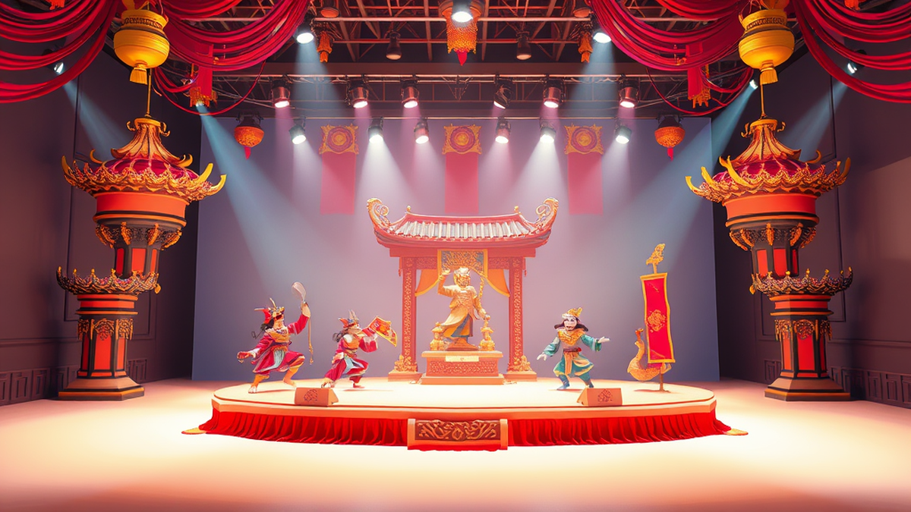

안녕하세요! 40대 키덜트 수집가, 오늘도 추억 한 조각을 찾아 헤매는 저입니다. 어릴 적 꿈꿨던 로봇 피규어부터 한정판 레고까지, 제 방 한구석은 제 어린 시절의 '보물창고'나 다름없죠. 그런데 말입니다, 물리적인 물건을 모으는 것만큼이나 소중하고, 때로는 더 큰 만족감을 주는 '수집품'이 있다는 거 아시나요? 바로 **가성비 좋은 대학로 연극**에서 얻는 생생한 경험과 추억입니다. 오늘은 제가 직접 발품 팔고, 때로는 아쉬움도 맛보며 터득한 대학로 연극 즐기기 꿀팁, 특히 주차 정보와 근처 맛집까지 싹 다 풀어볼까 해요.

저는 어릴 적부터 극장 문턱을 넘는 걸 좋아했어요. 흑백 TV 속 세상과는 또 다른, 살아 숨 쉬는 이야기가 눈앞에서 펼쳐지는 마법 같은 순간이 저를 늘 설레게 했죠. 그 시절엔 용돈 모아 어렵게 보던 연극 한 편이, 지금의 제가 아끼는 레어템 피규어보다 더 귀한 보물이었답니다. 지금은 여유가 좀 생겼지만, 여전히 '가성비'를 따지는 건 수집가의 본능 같은 거예요. 비싸다고 다 좋은 건 아니거든요. 값비싼 한정판 피규어도 결국은 먼지 쌓인 장식품이 될 수 있지만, 마음을 움직인 연극 한 편의 감동은 평생 가는 법이니까요. 그래서 오늘은 여러분의 지갑은 가볍게, 마음은 풍성하게 채워줄 대학로 연극의 세계로 저와 함께 떠나보시죠. 2025년에도 변함없이 뜨거운 열정으로 가득할 대학로에서, 숨겨진 보석 같은 연극을 찾는 '수집가'의 안목으로 제가 직접 경험한 이야기들을 솔직하게 들려드릴게요.

## 대학로, 추억을 수집하는 가장 가성비 좋은 방법

제가 피규어나 레고를 수집하면서 가장 중요하게 생각하는 건 역시 '가성비'입니다. 무작정 비싼 것만 쫓는 게 아니라, 가격 대비 얼마나 만족감을 주느냐가 관건이거든요. 연극도 마찬가지입니다. 대학로에는 수많은 공연이 있지만, 그중에서도 제 마음을 사로잡고 오랫동안 기억에 남는 연극들은 대개 '가성비'가 뛰어난 작품들이었어요. 소위 말하는 '대박' 작품들은 입소문이 나서 티켓값이 오르기 마련이지만, 조금만 부지런히 찾아보면 아직 빛을 보지 못한 보석 같은 작품들을 놀라운 가격에 만날 수 있죠.

가장 먼저 추천하고 싶은 건 바로 **스테디셀러 코미디 연극**입니다. 대학로의 터줏대감 같은 작품들이죠. 이런 연극들은 이미 수많은 관객에게 검증받았고, 배우들의 연기 합도 척척 맞아서 실패할 확률이 적습니다. 게다가 평일 낮 공연이나 특정 요일에 할인 프로모션을 자주 진행해서, 정가보다 훨씬 저렴하게 볼 수 있는 기회가 많아요. 저도 예전에 아내와 데이트 겸 평일 낮 공연을 보러 갔다가, 정가 대비 50% 가까이 할인받아 본 적이 있어요. 처음엔 별 기대 없이 갔는데, 너무 웃어서 배가 다 아플 지경이었죠. 그날의 유쾌한 기억은 지금도 아내와 종종 이야기하며 웃는 '컬렉션' 중 하나입니다.

그리고 **소극장 창작 연극**들도 눈여겨볼 만합니다. 아직 유명해지지 않은 신인 배우들이나 극단들이 열정 하나로 똘똘 뭉쳐 만드는 작품들이죠. 이런 연극들은 티켓 가격 자체가 저렴한 경우가 많고, 신선하고 실험적인 시도를 엿볼 수 있어서 예측 불가능한 재미를 선사하기도 합니다. 물론, 가끔은 제 취향에 맞지 않아서 '실패한 수집'으로 남는 경우도 있었지만, 그마저도 또 다른 경험으로 쌓이는 법이죠. 한 번은 젊은 연출가가 시도한 관객 참여형 연극을 본 적이 있는데, 배우들과 함께 호흡하며 극의 일부가 되는 경험은 어떤 한정판 피규어와도 바꿀 수 없는 특별한 추억이 되었답니다. 이런 연극들은 온라인 예매 사이트(인터파크 티켓, 예스24 티켓 등)에서 '오픈런 할인'이나 '얼리버드' 티켓을 잘 활용하면 정말 저렴하게 구할 수 있어요. 특히 2025년에는 모바일 앱 전용 할인이나 특정 결제 수단 할인 등 다양한 디지털 프로모션이 더욱 활성화될 것으로 예상되니, 미리미리 앱 알림을 설정해두는 것도 좋은 팁이 될 겁니다. 친구들과 함께라면 '단체 할인'을 노려보는 것도 현명한 방법이고요. 연극 감상은 단순히 공연을 보는 것을 넘어, 배우들의 땀과 열정이 담긴 '시간'을 수집하는 행위라고 생각하면, 이보다 더 가성비 좋은 문화생활이 또 있을까요?

## 주차 걱정 없이 연극 즐기기: 내 돈 아끼는 주차 꿀팁 대방출

대학로 연극을 즐기러 갈 때마다 제가 늘 가장 먼저 고민하는 것이 바로 '주차' 문제였습니다. 한정판 피규어를 구하러 갈 때도 주차 때문에 고생하면 김이 새는 법인데, 연극처럼 시간에 맞춰 가야 하는 경우는 더욱 그렇죠. 대학로는 워낙 유동인구가 많고 복잡해서 주차 공간 찾기가 하늘의 별 따기만큼 어렵고, 주차 요금도 만만치 않습니다. 하지만 제가 몇 년간 대학로를 드나들며 터득한 **주차 꿀팁**들이 있으니, 여러분은 저처럼 헤매지 마시라고 아낌없이 알려드릴게요.

가장 확실하고 저렴한 방법은 역시 **대중교통 이용**입니다. 혜화역 2번 출구로 나오면 바로 대학로 중심이라, 지하철이 가장 편리하고 스트레스 없는 선택이죠. 하지만 저처럼 차를 좋아하는 사람에게는 또 그게 아쉽잖아요? 그래서 차를 가져가야 한다면, 저는 주로 두 가지 방법을 활용합니다. 첫 번째는 **공영 주차장**을 이용하는 겁니다. 대표적으로는 **마로니에 공원 주차장**과 **한국방송통신대학교 주차장**이 있습니다. 마로니에 공원 주차장은 접근성이 아주 좋지만, 주말이나 공연 피크 시간에는 만차일 확률이 높아요. 그래서 저는 조금 더 안쪽으로 들어가서 한국방송통신대학교 주차장을 선호합니다. 상대적으로 공간도 넓고, 주차 요금도 비교적 합리적인 편이에요. 다만, 공연장까지 살짝 걸어가야 하는데, 대학로의 활기찬 분위기를 느끼며 걷는 것도 또 다른 재미가 될 수 있습니다.

두 번째 방법은 조금 더 전략적인 접근입니다. 바로 **주변 유료 주차장 앱을 활용**하는 거죠. '모두의 주차장' 같은 앱을 사용하면, 실시간으로 주변 주차장의 빈자리와 요금을 확인할 수 있습니다. 때로는 제휴 할인 혜택까지 제공하는 곳도 있어서, 예상치 못한 득템을 할 수도 있어요. 저도 예전에 급하게 연극 보러 갔다가 주차할 곳이 없어서 진땀을 뺀 적이 있는데, 앱으로 검색해서 한 시간당 50% 할인되는 곳을 찾아내서 얼마나 기뻤는지 모릅니다. 마치 숨겨진 레어 아이템을 발견한 기분이었죠. 또 한 가지 팁은, **주변 상가나 식당과 연계된 주차장**을 이용하는 겁니다. 특정 식당에서 식사를 하면 주차 할인을 해주거나 무료 주차를 제공하는 경우가 종종 있어요. 연극 관람 전후로 식사를 할 계획이라면, 이런 곳을 미리 찾아보는 것도 좋은 방법입니다. 2025년에는 스마트 주차 시스템이 더욱 고도화되어, 앱을 통한 예약 주차 서비스나 전기차 충전과 연계된 주차 공간도 늘어날 것으로 예상됩니다. 미리 앱을 깔아두고 즐겨찾기 해두시면 분명 도움이 될 거예요. 주차 스트레스 없이 편안하게 연극을 즐겨야, 그 감동이 온전히 제 것으로 스며들 수 있겠죠?

## 연극 후 미식 탐방: 지갑도 마음도 든든한 맛집 로드

연극이 끝난 후, 그 여운을 곱씹으며 맛있는 식사를 하는 것은 대학로에서의 하루를 완벽하게 마무리하는 저만의 의식 같은 겁니다. 잘 만든 피규어를 조립하고 나서 뿌듯하게 바라보는 것처럼, 좋은 연극을 보고 난 후 맛있는 음식을 먹는 그 순간은 또 다른 충족감을 주죠. 대학로에는 젊은 감각의 식당부터 오랜 역사를 자랑하는 노포까지, 정말 다양한 맛집들이 즐비합니다. 하지만 여기서도 '가성비'는 놓칠 수 없죠. 비싸다고 다 맛있는 것도 아니고, 비싸다고 다 만족스러운 것도 아니거든요.

제가 연극 관람 후 즐겨 찾는 곳들은 대개 **든든하고 따뜻한 한 끼를 제공하는 곳**들입니다. 예를 들어, **가성비 좋은 백반집**이나 **수제비, 칼국수 전문점** 같은 곳들이죠. 화려하진 않지만, 정성 가득한 손맛으로 연극으로 인해 채워진 감수성을 따뜻하게 보듬어주는 느낌이랄까요. 한 번은 아내와 함께 작은 소극장 연극을 보고 나서, 우연히 들어간 허름한 백반집에서 김치찌개를 시켜 먹었는데, 그 맛이 정말 기가 막혔어요. 연극의 여운과 김치찌개의 얼큰함이 어우러져 그날의 기억은 아직도 제 머릿속에 선명하게 남아있습니다. 마치 한정판 피규어와 딱 맞는 베이스를 찾은 것처럼, 연극과 완벽한 조화를 이루는 식사였다고 할까요.

물론, 젊은 감각의 **파스타나 퓨전 요리 전문점**도 대학로에는 많습니다. 이런 곳들은 분위기도 좋고 사진 찍기에도 예뻐서, 특히 연인이나 친구들과 함께 방문하기 좋아요. 하지만 가성비를 따진다면, 점심 특선이나 평일 할인 메뉴를 공략하는 것이 현명합니다. 저도 가끔 기분 전환 겸 파스타를 먹으러 가는데, 미리 인터넷으로 할인 정보를 찾아보고 가는 편이에요. 특정 시간대에 방문하면 음료 서비스나 사이드 메뉴를 추가로 주는 곳들도 있으니, 방문 전에 꼭 확인해보세요. 2025년에는 비건 메뉴나 건강식을 전문으로 하는 식당들도 더욱 많아질 것으로 예상됩니다. 연극 관람 후 건강하고 맛있는 식사를 찾는 분들에게는 좋은 선택지가 될 거예요.

마지막으로, 연극 관람 후 가볍게 즐길 수 있는 **길거리 음식**도 빼놓을 수 없죠. 붕어빵, 호떡, 닭꼬치 등 대학로 길거리에는 우리의 추억을 자극하는 맛있는 간식들이 많습니다. 연극의 감동을 이야기하며 따끈한 호떡 하나를 나눠 먹는 그 순간은, 어떤 고급 레스토랑에서의 식사보다도 값진 추억이 될 수 있습니다. 마치 어릴 적 문방구 앞에서 뽑기 하던 추억처럼, 소소하지만 확실한 행복을 주는 거죠. 주차 걱정 없이 연극을 보고, 취향에 맞는 맛집에서 든든하게 배를 채우는 것. 이 모든 것이 대학로에서 얻을 수 있는 최고의 '수집품'이 아닐까 싶습니다.

자, 40대 키덜트 수집가인 제가 직접 경험하고 느낀 대학로 연극 가성비 꿀팁, 주차 정보, 그리고 맛집 로드까지 알차게 풀어봤습니다. 어떠셨나요? 물리적인 피규어나 레고를 수집하는 것도 물론 즐겁지만, 때로는 이렇게 살아있는 경험과 추억을 수집하는 것이야말로 진정한 '삶의 컬렉션'을 풍성하게 만드는 방법이 아닐까 싶어요. 대학로 연극은 단돈 몇만 원으로 몇 시간 동안 다른 세상에 푹 빠져들 수 있는 마법 같은 공간입니다. 오늘 제가 드린 팁들을 활용해서, 여러분도 주머니는 가볍게, 마음은 꽉 채우는 멋진 대학로 연극 나들이를 계획해보시길 바랍니다. 망설이지 말고, 지금 바로 인터파크 티켓 앱을 열어보세요. 분명 여러분의 마음을 사로잡을 보석 같은 연극이 기다리고 있을 테니까요!

## 마치며

지금까지 대학로 연극을 더욱 풍성하고 알뜰하게 즐길 수 있는 다양한 방법들을 함께 살펴보았습니다. 가성비 좋은 연극 선택부터 편리한 주차 꿀팁, 그리고 공연 전후의 즐거움을 더해줄 맛집 정보까지, 대학로에서의 완벽한 하루를 위한 모든 퍼즐 조각을 맞춰드렸죠. 물리적인 수집품을 모으는 즐거움만큼이나, 마음을 채우는 소중한 경험과 추억을 수집하는 것은 우리 삶을 더욱 풍요롭게 만듭니다. 대학로 연극은 단돈 몇만 원으로 몇 시간 동안 다른 세상에 푹 빠져들 수 있는 마법 같은 기회를 제공하며, 여러분의 '삶의 컬렉션'에 잊지 못할 한 페이지를 추가해 줄 것입니다. 이제 망설일 필요가 없습니다. 제가 드린 팁들을 활용해서 주머니는 가볍게, 마음은 꽉 채우는 멋진 대학로 연극 나들이를 계획해보세요. 지금 바로 인터파크 티켓 앱을 열어보세요. 분명 여러분의 마음을 사로잡을 보석 같은 연극이 기다리고 있을 테니까요! 대학로에서 여러분만의 소중한 추억을 만들어 가시길 응원합니다.