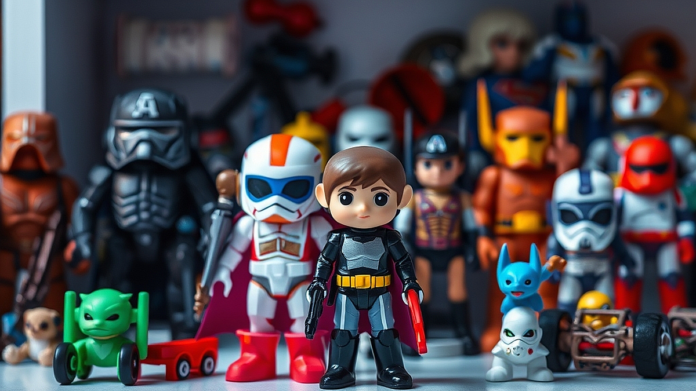

## 데이터 기반의 '덕질' 분석: 마케터가 키덜트 시장에서 배울 점

데이터 기반의 의사결정과 팬덤 마케팅은 이제 분리된 영역이 아닙니다. 많은 마케터가 충성 고객을 확보하기 위해 고군분투하지만, 정작 시장의 가장 강력한 엔진인 '덕질'의 메커니즘을 외부 현상으로만 치부하곤 합니다. 키덜트 시장, 즉 성인이 된 소비자들이 자신의 취향을 위해 기꺼이 지갑을 열고 시간을 쏟는 이 시장은 마케팅의 정수를 보여줍니다. 이곳에서는 브랜드가 단순히 제품을 파는 것이 아니라, 소비자가 스스로 놀이의 규칙을 만들고 그 안에서 소속감을 느끼게 합니다. 고객이 제품을 구매하는 이유가 성능이나 가성비가 아닌, '내가 이 세계관의 일부인가'라는 질문에 대한 답이 될 때 비로소 진정한 팬덤이 형성됩니다. 오늘 우리는 숫자로 증명되는 팬덤의 결집력을 우리 비즈니스에 어떻게 이식할지, 그 실전적인 관찰 포인트를 짚어봅니다.

## 데이터로 읽는 취향의 파편화와 팬덤의 응집력

키덜트 시장을 관통하는 핵심 데이터는 '재구매율'이 아니라 '체류 시간'과 '커뮤니티 참여도'입니다. 일반 소비재가 구매 시점의 전환율에 집중한다면, 덕질의 세계에서는 제품을 수령한 뒤 이를 어떻게 공유하고 변형하며 노는지가 더 중요합니다. 마케터가 여기서 배워야 할 점은 고객이 제품을 '소비'하는 행위보다 '경험'을 생성하는 행위에 더 높은 가치를 둔다는 사실입니다.

예를 들어, 한정판 피규어를 구매하는 고객은 제품 자체의 조형미만큼이나, 이를 자신의 책상 위에 어떻게 배치하고 어떤 조명 아래서 촬영하여 커뮤니티에 인증할지 고민합니다. 여기서 브랜드의 역할은 제품을 전달하는 데서 끝나지 않습니다. 사용자가 인증하기 좋은 패키지 디자인, 커뮤니티에서 공유할 수 있는 숨겨진 디테일, 그리고 동료들과 대화할 수 있는 공통의 언어를 제공하는 것이 핵심입니다.

실패 사례를 하나 들어보겠습니다. 어떤 브랜드는 단순히 고사양의 키덜트 제품을 출시하면서 '압도적인 성능'만을 강조했습니다. 하지만 커뮤니티 내에서는 그 제품을 '가지고 놀기 어렵다'거나 '인증할 만한 요소가 부족하다'는 이유로 외면받았습니다. 데이터상으로는 스펙이 훌륭했음에도 불구하고, 실제 팬덤은 그 제품을 자신의 취향을 대변하는 도구로 인식하지 않았기 때문입니다.

선택 기준은 명확합니다. 마케팅 기획 단계에서 '이 제품을 구매한 고객이 다음 주에 무엇을 할 것인가'를 질문하십시오. 만약 고객이 제품을 박스에서 꺼내 사진을 찍고, 자신의 SNS에 올리거나 단톡방에 자랑할 거리가 없다면 그 제품은 팬덤을 형성하기 어렵습니다. 단순히 물건을 파는 것이 아니라, 고객이 자신의 취향을 전시할 수 있는 '무대'를 설계하는 것이 데이터 마케팅의 시작입니다.

## 실전 체크리스트: 우리 고객은 덕질을 하고 있는가

고객이 우리 브랜드를 단순 이용자가 아닌 '팬'으로 인식하게 하려면, 고객의 행동을 데이터로 쪼개어 보아야 합니다. 다음은 마케터가 자신의 비즈니스에 도입할 수 있는 실전 체크리스트입니다.

1. 고객이 제품을 활용해 스스로 만드는 '2차 창작물'이 존재하는가? (사진, 후기 영상, 커스텀 세팅 등)
2. 우리 브랜드의 제품을 구매한 사람들끼리 서로 연결될 수 있는 접점이 있는가?
3. 브랜드가 제공하는 정보 외에, 고객들 사이에서만 통용되는 은어나 규칙이 형성되어 있는가?
4. 신제품 출시 시, 고객이 '내가 기다리던 것'이라고 반응할 수 있는 서사가 포함되어 있는가?

이 체크리스트 중 2개 이상 해당하지 않는다면, 마케터는 고객의 충성도를 높이기 위해 제품의 기능을 개선할 것이 아니라 '관계의 접점'을 늘려야 합니다. 

실수하기 쉬운 부분은 '팬덤을 강제로 만들려고 하는 것'입니다. 브랜드가 직접 커뮤니티를 개설하고 이벤트를 억지로 주도하면 오히려 고객은 거부감을 느낍니다. 키덜트 시장의 팬덤은 자연발생적이며, 브랜드는 그들이 놀기 좋은 환경을 조성하는 '조력자' 위치에 있어야 합니다. 예를 들어, 특정 제품의 조립 과정을 영상으로 찍어 공유하는 고객에게는 작은 리워드를 주거나, 그들의 리뷰를 공식 채널에 소개하는 방식으로 그들의 '놀이'를 인정해주어야 합니다. 마케터는 주인공이 되려 하지 말고, 고객이 주인공이 될 수 있는 판을 깔아주는 기획자가 되어야 합니다.

## 팬덤 마케팅의 데이터 측정 지표와 실패 시 점검 순서

팬덤 마케팅이 모호하게 느껴지는 이유는 성과 지표를 설정하는 방식이 기존 매출 중심의 사고방식과 다르기 때문입니다. 팬덤의 힘을 측정하려면 구매 전환율뿐만 아니라 '바이럴 파급력'과 '고객 유지율(Retention)'을 다르게 해석해야 합니다. 

데이터 마케터로서 성과를 측정할 때, 저는 다음의 지표를 권장합니다. 첫째, '자발적 언급량(UGC)'입니다. 고객이 브랜드의 광고를 퍼 나르는 것이 아니라, 자신의 일상 속에 제품을 녹여내어 자발적으로 생성한 콘텐츠의 수치를 측정하세요. 둘째, '커뮤니티 내 재방문 의사'입니다. 제품을 구매한 사람이 해당 브랜드의 다른 카테고리 제품까지 관심을 가지는지를 추적하십시오.

실패했을 때 점검해야 할 순서는 다음과 같습니다.
1. 고객이 제품을 사용한 후 '자랑하고 싶은 마음'이 드는 지점(트리거)이 있는가? 
2. 고객이 제품을 사용할 때 겪는 페인 포인트가 팬덤의 응집을 방해하고 있지는 않은가? (예: 지나치게 복잡한 가입 절차, 소통 채널의 부재)
3. 브랜드의 메시지가 고객이 생각하는 제품의 '가치'와 일치하는가?

대부분의 마케팅 실패는 제품의 품질이 아니라, 고객이 이 제품을 통해 얻고자 하는 '정서적 보상'을 잘못 읽었을 때 발생합니다. 키덜트 시장의 소비자는 제품을 사는 게 아니라 '취향의 증명'을 삽니다. 마케터는 데이터 속에서 고객이 어디에 머물고, 무엇을 공유하며, 어떤 언어로 소통하는지를 읽어내야 합니다. 

결론적으로 팬덤 마케팅은 데이터와 감성의 균형입니다. 데이터는 고객의 흐름을 보여주고, 감성은 그 흐름을 멈추게 하는 힘입니다. 이제 제품의 기능적 우위를 나열하는 대신, 고객이 여러분의 브랜드를 통해 어떤 '놀이'를 즐길 수 있을지 고민하십시오. 고객의 일상 속에 제품이 자연스럽게 스며들 때, 비로소 비즈니스는 지속 가능한 성장을 시작합니다. 지금 바로 고객의 후기 게시판을 열어보세요. 그들이 남긴 사진 속에서 여러분이 미처 보지 못했던 브랜드의 새로운 가치가 숨어 있을 것입니다.

## 마치며

데이터 기반의 분석이 단순히 숫자를 나열하는 것이 아니라, 고객의 마음을 읽는 도구라는 점을 잊지 마세요. 키덜트 시장이 보여주듯, 오늘날의 소비자는 제품의 기능을 넘어 자신의 취향과 정서적 가치를 증명하고 싶어 합니다. 결국 성공적인 마케팅은 고객의 일상 속에 브랜드가 하나의 '놀이'로 자리 잡을 때 완성됩니다. 데이터로 고객의 흐름을 포착하고, 감성으로 그들의 발길을 붙잡는 균형 감각이 무엇보다 중요합니다.

자, 이제 여러분의 차례입니다. 지금 바로 고객들의 후기 게시판을 찬찬히 살펴보세요. 그들이 올린 사진 한 장, 짧은 댓글 하나에는 여러분이 미처 발견하지 못한 브랜드의 새로운 가능성이 담겨 있을지도 모릅니다. 데이터 속 숨은 맥락을 읽어내어 고객과 더 깊게 연결되는 브랜드 팬덤을 만들어보세요. 여러분의 브랜드가 고객의 일상 속에서 어떤 즐거운 놀이가 될 수 있을지, 오늘부터 고민을 시작해 보는 건 어떨까요? 작은 시작이 브랜드의 지속 가능한 성장을 이끄는 큰 변화의 물결이 될 것입니다.
