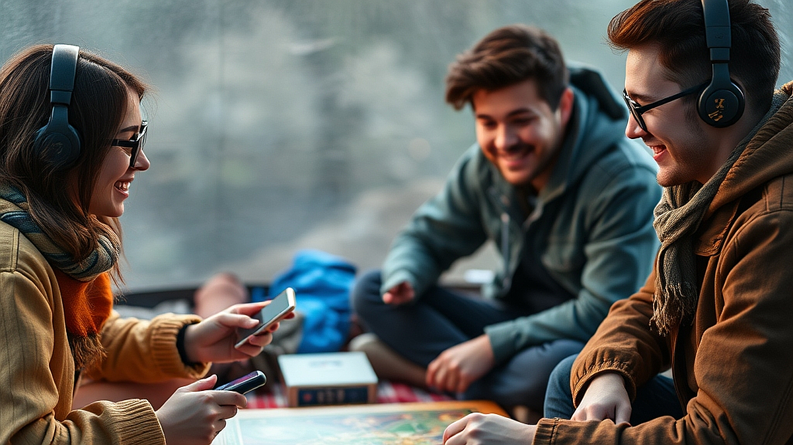

# 디지털 디톡스 캠핑: '아날로그 게임'과 함께하는 주말

디지털 디톡스 캠핑은 단순히 스마트폰을 비행기 모드로 바꾸는 행위에서 끝나지 않습니다. 2026년 하반기, 끊임없는 알림과 피드 속에서 번아웃을 호소하는 3040 세대에게 오프라인 모임은 이제 선택이 아닌 생존 전략이 되었습니다. 스마트폰을 끄는 순간 찾아오는 그 낯선 고요함을 무엇으로 채울 것인가가 이 여정의 성패를 가릅니다. 멍하니 불멍만 하기에는 우리의 뇌가 이미 고도로 자극된 정보 처리에 익숙해져 있기 때문입니다. 이때 가장 효과적인 도구는 바로 아날로그 게임입니다. 복잡한 알고리즘이 설계한 숏폼 콘텐츠 대신, 사람과 사람 사이의 눈맞춤과 규칙이 존재하는 보드게임은 뇌의 전두엽을 건강하게 자극합니다. 이번 글에서는 디지털 환경에서 벗어나 온전한 휴식을 취하고 싶은 분들을 위해, 캠핑장에서 보드게임을 즐기기 위한 구체적인 선택 기준과 실전 가이드를 제안합니다. 단순히 장비를 나열하는 것이 아니라, 어떤 게임이 당신의 캠핑을 '디지털 디톡스'로 완성해줄지 그 판단 기준을 명확히 짚어보겠습니다.

## 1. 캠핑장 보드게임 선택의 핵심 기준: 무게와 내구성

캠핑은 기본적으로 짐과의 싸움입니다. 보드게임을 챙길 때 가장 먼저 고려해야 할 것은 '휴대성'과 '환경 적응력'입니다. 야외 테이블은 실내보다 좁고, 바람이 불거나 습기가 찰 확률이 높습니다. 따라서 무거운 박스형 게임보다는 구성품이 단순하고 튼튼한 게임을 선택해야 합니다.

가장 먼저 따져봐야 할 조건은 '휴대 편의성'입니다. 박스 크기가 A4 용지 절반 이하인지, 구성품이 흩어져도 복구가 가능한지를 확인하세요. 예를 들어, 카드 위주의 게임은 바람에 취약합니다. 이때는 카드 슬리브를 씌우거나, 아예 묵직한 목재 컴포넌트가 포함된 게임을 고르는 것이 좋습니다.

실패 케이스를 예로 들어보겠습니다. 정교한 피규어가 많은 전략 게임을 캠핑장에 가져가면 백이면 백, 작은 부품을 잃어버리거나 습기로 인해 종이 타일이 휘어지는 경험을 하게 됩니다. 이는 휴식을 취하러 간 자리에서 오히려 스트레스를 유발하는 주범이 됩니다.

선택을 위한 실전 체크리스트를 제안합니다.
* 카드 재질이 플라스틱인가? (습기에 강함)
* 구성품이 20개 미만인가? (분실 위험 낮음)
* 룰 설명이 5분 내외로 끝나는가? (집중력 유지)
* 테이블 차지 면적이 A3 용지 이하인가? (좁은 캠핑 테이블에 적합)

위 기준을 만족한다면, 보드게임은 당신의 캠핑을 스마트폰 없이도 지루하지 않게 만드는 최고의 엔터테인먼트가 됩니다. 게임의 난이도는 캠핑장의 여유로운 분위기에 맞춰 전략형보다는 파티형을 선택하는 것이 정서적 휴식에 훨씬 효과적입니다.

## 2. 뇌의 휴식을 위한 게임 운영 전략

디지털 디톡스의 목적은 뇌를 쉬게 하는 것입니다. 그런데 너무 복잡한 룰을 가진 보드게임을 가져가면, 뇌는 다시 '정보 처리 모드'로 전환됩니다. 이는 스마트폰을 보는 것과 다를 바 없는 피로를 유발합니다. 캠핑장의 게임은 '승패'보다 '상호작용'에 방점을 찍어야 합니다.

게임 시간은 인원수와 비례합니다. 3인 기준, 한 판당 20분에서 30분 내외로 끝나는 게임이 가장 좋습니다. 게임 사이사이에 불을 멍하니 바라보거나 대화를 나눌 수 있는 호흡이 필요하기 때문입니다. 

실전 팁을 하나 드리자면, '협력형 게임'을 적극 추천합니다. 승패가 갈리는 경쟁 게임은 사람에 따라 감정 소모를 유발할 수 있습니다. 반면, 모두가 힘을 합쳐 문제를 해결하는 협력형 보드게임은 팀워크를 강화하고 뇌의 보상 체계를 긍정적으로 자극합니다.

여기서 주의할 점은 '숙련도의 차이'입니다. 일행 중에 보드게임을 처음 접하는 사람이 있다면, 룰이 직관적인 게임을 골라야 합니다. 만약 룰북을 읽는 데만 30분이 걸린다면, 이미 당신의 일행은 스마트폰을 다시 꺼내 들고 싶어질 것입니다.

선택 기준을 정리해 드립니다.
* 인원수: 2인이라면 1:1 대결 게임, 3~4인이라면 협력형 파티 게임.
* 난이도: 설명서 없이도 3분 만에 룰을 이해할 수 있는 것.
* 감정 소모: 패배가 개인의 탓으로 돌아가지 않는 구조.

이 조건들을 충족할 때, 보드게임은 단순한 놀이를 넘어 낯선 환경에서 사람 간의 유대감을 쌓는 디지털 디톡스의 핵심 콘텐츠가 됩니다.

## 3. 디지털 디톡스 실패를 방지하는 실전 체크리스트

캠핑장에 도착해 스마트폰을 끄고 보드게임을 꺼냈음에도 다시 스마트폰을 찾게 되는 경우가 있습니다. 이는 대개 준비 부족 때문입니다. 배터리가 방전되거나, 게임 도중 궁금한 점이 생겨 검색을 하려다 자연스럽게 SNS를 확인하게 되는 패턴입니다.

이를 방지하기 위해 다음의 '디지털 차단 루틴'을 권장합니다.

* 루틴 1: 게임 룰은 출발 전날 미리 숙지하고, 필요하면 스마트폰으로 룰 설명 영상을 보고 요약본을 종이에 적어두세요.
* 루틴 2: 스마트폰은 텐트 안 깊숙한 가방 속에 넣고, 캠핑용 랜턴을 충분히 준비하세요. 어두운 밤에 게임을 하려다 스마트폰 플래시를 켜는 순간, 디톡스는 깨집니다.
* 루틴 3: 보드게임과 함께 곁들일 음악을 아날로그 방식으로 준비하세요. 블루투스 스피커 연결을 고민하는 대신, 미리 준비한 LP나 카세트테이프, 혹은 아예 자연의 소리를 즐기는 편이 낫습니다.

실패를 피하는 결정적 팁은 '스마트폰을 꺼야 할 이유'를 만드는 것입니다. 게임 점수 기록지를 종이와 펜으로 준비하세요. 스마트폰 메모장에 기록하는 순간, 다시 디지털의 굴레에 빠지게 됩니다. 아날로그 기록은 그 자체로 캠핑의 소중한 기념품이 됩니다.

만약 예산이 고민이라면, 비싼 보드게임 대신 트럼프 카드 하나만 챙겨도 충분합니다. 트럼프 카드는 수십 가지 게임이 가능하며, 부피도 거의 차지하지 않습니다. 핵심은 도구의 가격이 아니라, 스마트폰이라는 '디지털 창'을 닫고 사람이라는 '현실 창'을 여는 당신의 의지입니다.

결론적으로, 디지털 디톡스 캠핑은 완벽한 장비가 아닌 '방해 요소의 제거'에서 시작됩니다. 보드게임은 그 빈자리를 채워주는 따뜻한 매개체일 뿐입니다. 이번 주말, 스마트폰 전원을 끄고 가장 단순한 규칙의 게임 하나를 가방에 넣어보세요. 그 작은 선택이 당신의 뇌에 진정한 휴식을 선사할 것입니다. 

이제 스마트폰을 내려놓고, 눈앞에 앉은 사람의 표정을 살피며 주사위를 던져보시기 바랍니다. 디지털 세상에서 잠시 떨어져 나만의 속도로 흐르는 시간을 경험하는 것, 그것이 2026년을 살아가는 우리에게 필요한 가장 확실한 재충전입니다. 지금 당장 짐을 챙겨 떠날 준비를 시작하세요. 당신의 주말이 훨씬 더 선명하고 밀도 있게 기억될 것입니다.

## 마치며

디지털 기기의 소음에서 벗어나 오직 사람과 게임에만 집중하는 시간, 이것이 바로 디지털 디톡스 캠핑의 진정한 가치입니다. 거창한 준비물은 필요 없습니다. 트럼프 카드 한 묶음이나 간단한 보드게임 하나면 충분합니다. 스마트폰의 전원을 끄는 순간, 비로소 우리 주변의 풍경과 함께하는 이들의 표정이 더 선명하게 보이기 시작할 것입니다.

이번 주말에는 복잡한 알림 대신 주사위 소리에 귀를 기울여 보는 건 어떨까요? 지금 바로 가방 한구석에 아날로그 게임을 챙겨 자연 속으로 떠나보세요. 디지털의 속도에서 잠시 내려와 나만의 호흡을 되찾는 그 시간이, 일상을 버티게 할 가장 확실하고 따뜻한 재충전이 되어줄 것입니다. 스마트폰은 잠시 잊고, 온전한 현재를 만끽하는 밀도 높은 주말을 경험하시길 바랍니다. 지금 바로 캠핑 준비를 시작해 보세요!
