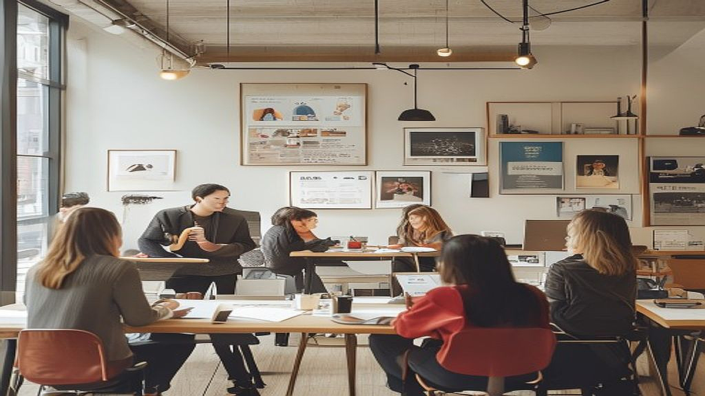

디지털 디톡스를 역이용한 마케팅은 단순히 스마트폰을 끄자는 캠페인이 아니라, 넘쳐나는 정보 과부하 속에서 소비자가 '진짜 감각'을 회복할 수 있는 물리적 시공간을 브랜드가 제공하는 전략입니다. 온라인 광고가 1초마다 수천 개의 선택지를 강요하는 시대, 역설적이게도 가장 강력한 마케팅 메시지는 '잠시 접속을 끊어도 괜찮다'는 허락에서 나옵니다. 오늘 이 글에서는 인스타그램 피드를 내리는 손가락을 멈추고, 브랜드가 어떻게 소비자의 오프라인 경험을 설계해야 실질적인 팬덤을 구축할 수 있는지 실무적인 관점에서 파헤쳐 보겠습니다.

## 1. 경험의 희소성: 왜 지금 '로그오프'인가

디지털 디톡스를 마케팅에 활용한다는 것은 소비자가 일상에서 겪는 '스크린 피로도'를 브랜드가 해결해 주는 파트너가 되는 것입니다. 단순히 오프라인 매장을 여는 것이 아니라, 그곳에 들어서는 순간 스마트폰을 주머니에 넣고 싶게 만드는 환경 설계가 핵심입니다.

**선택 기준:** 
우리 브랜드가 제공하는 경험이 '기록하고 싶은 것'인지, 아니면 '직접 느껴야만 하는 것'인지 구분해야 합니다. 만약 사진 한 장으로 끝나는 공간이라면 그것은 디지털 디톡스가 아니라 디지털 홍보용 공간일 뿐입니다. 진짜 오프라인 경험은 현장의 냄새, 온도, 대화의 질감처럼 데이터로 전송할 수 없는 것들을 다룰 때 완성됩니다.

**실제 사례:** 
어느 서점 브랜드는 매장 내부에 '스마트폰 보관함'을 배치하고, 책을 읽는 동안 휴대폰을 맡기면 할인권을 제공하는 방식을 취했습니다. 여기서 중요한 점은 단순히 보관하는 행위가 아니라, 보관함에 휴대폰을 넣는 순간부터 고객이 느끼는 '심리적 해방감'을 브랜드가 점유했다는 사실입니다.

**실패 케이스:** 
반대로, 공간은 아날로그를 표방하면서 입구부터 SNS 업로드용 이벤트를 강조하는 경우입니다. 고객은 디지털 디톡스를 기대하고 왔다가 다시 카메라를 켜야 하는 상황에 직면하면 피로감을 느낍니다. 이는 브랜드의 진정성을 훼손하고 고객의 이탈을 부추깁니다.

**실전 체크리스트:**
- 우리 매장에 들어온 고객이 휴대폰을 30분 이상 주머니에서 꺼내지 않을 이유가 있는가?
- 오감을 자극하는 요소(음악, 향기, 촉감)가 스크린보다 매력적인가?
- 고객이 이 공간을 떠날 때 '온라인에서 본 것'이 아니라 '내가 경험한 것'을 기억하는가?

## 2. 오프라인 공간 설계: 감각의 우선순위 재배치

디지털 디톡스 전략을 실행할 때 가장 저지르기 쉬운 실수는 '무엇을 보여줄까'에 집중하는 것입니다. 하지만 오프라인 마케팅의 성패는 '무엇을 제거할까'에서 갈립니다. 온라인의 속도감과 대비되는 '느림의 미학'을 공간에 이식해야 합니다.

**실전 실행 절차:**
1. **시각적 노이즈 제거:** 매장 내의 화려한 디스플레이를 줄이고, 고객이 시선을 어디에 둘지 고민하지 않게 만듭니다.
2. **청각적 환경 조성:** 기계적인 소음 대신 자연의 소리나 특정 분위기의 음악을 배치해 뇌의 휴식을 유도합니다.
3. **참여형 과제 부여:** 그냥 앉아 있는 것은 지루합니다. '필사', '향기 찾기', '질문 카드 뽑기' 등 손을 움직여야 하는 작은 과제를 배치하세요.

**선택 기준:** 
이 전략은 고객이 브랜드와 최소 1시간 이상 머물 수 있는 환경(카페, 편집숍, 전시 공간)에서 효과적입니다. 반면, 회전율이 중요한 식당이나 빠른 결제가 필요한 매장에서는 오히려 고객의 불만을 살 수 있습니다.

**실제 사례:** 
한 편집숍은 매장 한편에 '아날로그 기록실'을 운영했습니다. 연필과 종이만 제공하고, 그날의 기분을 적게 합니다. 고객은 휴대폰을 꺼내는 대신 종이에 집중하며 브랜드와 정서적 유대감을 쌓습니다. 이 기록은 나중에 브랜드의 콘텐츠로 활용되기도 합니다.

**실패 케이스:** 
지나치게 강요된 디지털 디톡스입니다. '폰을 내지 않으면 입장 불가'와 같은 강압적인 태도는 고객에게 반감을 줍니다. 디지털 디톡스는 선택의 문제여야 하며, 브랜드는 그 선택을 '매력적인 대안'으로 제시해야 합니다.

## 3. 마케팅 지표의 전환: 공유가 아닌 몰입을 측정하라

기존 마케팅이 '좋아요'와 '공유' 수로 성공을 측정했다면, 오프라인 경험 마케팅은 '체류 시간'과 '재방문 의사'로 지표를 바꿔야 합니다. 온라인에서는 1초의 시선이 중요하지만, 오프라인에서는 1시간의 몰입이 더 가치 있습니다.

**측정 지표:**
- **체류 시간:** 고객이 휴대폰을 내려놓고 브랜드의 경험에 머무른 시간.
- **감각적 피드백:** 고객이 직접 작성한 노트, 대화 내용 등 정성적인 데이터.
- **재방문율:** 디지털 피로를 해소하러 다시 찾아오는 고객의 비율.

**실전 팁:** 
고객에게 설문지를 돌리기보다, 그들이 공간에서 남긴 결과물을 관찰하십시오. 고객이 매장의 어떤 오브제를 가장 오래 만졌는지, 어떤 의자에 앉아 가장 오래 쉬었는지가 곧 마케팅 성과입니다.

**선택 기준:** 
이 방식은 단기 매출 급상승을 목표로 하는 브랜드에는 부적합합니다. 하지만 충성도 높은 커뮤니티를 만들고 싶은 브랜드라면 필수입니다. 100명의 가벼운 팔로워보다 10명의 깊은 몰입자를 만드는 것이 오프라인 마케팅의 본질이기 때문입니다.

**실패 케이스:** 
데이터 집착입니다. 오프라인 경험의 깊이를 측정하겠다고 매 순간 고객을 방해하거나 카메라를 설치하는 것은 본말전도입니다. 데이터는 관찰하되, 고객의 경험을 방해하지 않는 선을 지키는 것이 가장 중요합니다.

## 결론: 감각의 회복이 곧 브랜드의 신뢰입니다

디지털 디톡스를 역이용한 마케팅은 결국 '사람 대 사람'의 관계를 회복하는 일입니다. 소비자는 더 이상 광고를 보길 원하지 않습니다. 그들은 자신이 주인공이 될 수 있는 시공간을 찾고 있습니다. 브랜드가 스크린 너머의 세상에서 고객을 기다려줄 때, 고객은 그곳에서 비로소 브랜드의 진심을 읽습니다. 

오늘 바로 실행해 보십시오. 매장에서 가장 화려한 광고판 하나를 끄고, 고객이 5분간 앉아 쉴 수 있는 의자 하나를 더 배치하는 것부터 시작입니다. 고객이 휴대폰을 내려놓는 순간, 당신의 브랜드는 그들의 일상 속에 깊숙이 침투하기 시작할 것입니다. 지금 바로 고객의 눈이 아닌, 손과 발이 머무는 공간을 점검해 보시기 바랍니다. 그것이 바로 디지털 과부하 시대에 브랜드가 살아남는 가장 확실한 방법입니다.

디지털 과부하 시대, 고객은 스크린 너머의 진정성 있는 경험을 갈망합니다. 디지털 디톡스를 역이용한 마케팅은 단순히 기술을 배제하는 것이 아니라, 고객이 오롯이 자신에게 집중할 수 있는 시공간을 브랜드가 선물하는 과정입니다. 데이터 수집이라는 명목으로 고객의 경험을 해치지 않으면서, 그들이 머물고 싶은 환경을 조성하는 것이 핵심입니다.

이제는 변화가 필요한 시점입니다. 오늘 당장 매장에서 불필요한 광고판 하나를 끄고, 고객이 잠시 휴대폰을 내려놓고 쉴 수 있는 편안한 의자 하나를 배치해 보세요. 거창한 전략보다 고객의 손과 발이 머무는 곳을 배려하는 작은 시도가 브랜드에 대한 깊은 신뢰를 만듭니다.

고객이 디지털 세상에서 벗어나 브랜드와 진심으로 연결되는 순간, 당신의 브랜드는 단순한 소비처를 넘어 그들의 일상 속에 자연스럽게 스며들 것입니다. 오늘부터 고객의 눈이 아닌, 그들이 머무는 '경험의 공간'을 세심하게 점검해보는 건 어떨까요? 그것이 바로 복잡한 디지털 시대에 브랜드가 가장 확실하게 살아남는 생존 전략입니다.
