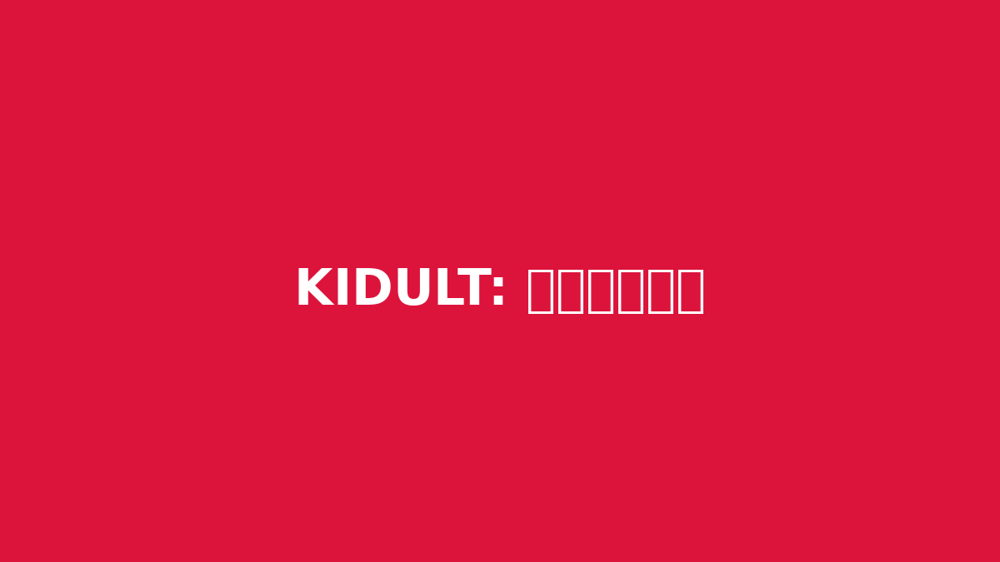

# 20년차 마케터가 털어놓는 '진짜' 디지털 마케팅 이야기 (feat. ROI 350%의 비밀)

**디지털 마케팅**, 정말 파고들수록 어렵고 막막하게 느껴질 때가 많죠? 저도 20년이라는 시간 동안 이 바닥에서 구르면서 수없이 많은 성공과 그보다 더 많은 실패를 맛봤습니다. 화려한 보고서 뒤에 숨겨진 뼈아픈 예산 낭비, 반짝이는 아이디어인 줄 알았지만 처참한 성과로 끝났던 캠페인들. 오늘은 뜬구름 잡는 이론 대신, 제 돈과 시간을 태워가며 직접 깨달은 ‘진짜’ 디지털 마케팅 이야기를 좀 해볼까 합니다. “이론은 알겠는데, 그래서 실제로 뭐가 먹히나요?”라고 묻는 후배들에게 제가 늘 해주는 이야기들이기도 합니다.

이 글은 반짝이는 성공 신화가 아닙니다. 오히려 데이터의 함정에 빠져 허우적거렸던 이야기, 구닥다리 취급받던 채널에서 의외의 성과를 건져 올린 경험, 그리고 앞으로 우리 마케터들이 AI와 어떻게 공존해야 할지에 대한 현실적인 고민을 담았습니다. 아마 여러분이 지금 현업에서 부딪히고 있는 문제들과 크게 다르지 않을 겁니다. 제 경험이 정답은 아니겠지만, 적어도 여러분이 걷는 길에 작은 이정표 하나 정도는 되어줄 수 있을 거라고 믿습니다. 자, 그럼 지금부터 20년차 퍼포먼스 마케터의 솔직한 수다, 한번 시작해볼까요?

## 데이터의 함정: '왜'를 묻지 않으면 ROI는 오르지 않습니다

많은 마케터들이 데이터에 집착합니다. 물론 저도 그렇습니다. 클릭률(CTR), 전환율(CVR), 광고비 대비 수익률(ROAS) 같은 지표 없이는 단 하루도 일할 수 없죠. 하지만 어느 순간부터 우리가 숫자의 노예가 되어가고 있다는 생각을 떨칠 수가 없었습니다. 특히 주니어 시절에 저지른 가장 큰 실수는 바로 ‘보이는 숫자’에만 매몰되었던 것입니다.

몇 년 전, 꽤 큰 예산을 집행하던 한 패션 이커머스 클라이언트와의 일이었습니다. 야심 차게 준비한 페이스북 영상 광고 캠페인이 있었죠. 당시 유행하던 숏폼 콘텐츠 형식으로 제작했고, 타겟팅도 정교하게 설정했습니다. 결과는? 놀라웠습니다. **CTR이 무려 4.5%**를 기록했거든요. 업계 평균을 훌쩍 뛰어넘는 수치에 팀 전체가 환호성을 질렀습니다. 보고서 첫 장에 굵은 글씨로 CTR 4.5%를 박아 넣고 의기양양했죠.

하지만 기쁨은 오래가지 않았습니다. 정작 가장 중요한 **전환율이 0.3%**에 불과했던 겁니다. 사람들은 광고를 보고 미친 듯이 클릭했지만, 아무도 물건을 사지 않았습니다. 광고비는 계속 타들어가는데 매출은 제자리걸음. ROAS는 100%를 겨우 넘기는, 사실상 손해 보는 장사였죠. 그야말로 ‘속 빈 강정’ 같은 캠페인이었습니다.

문제의 원인을 찾기 위해 팀원들과 머리를 싸맸습니다. 광고 소재가 너무 자극적이었나? 타겟팅이 잘못되었나? 온갖 가설을 세우고 A/B 테스트를 반복했지만 결과는 비슷했습니다. 그러다 문득 가장 기본적인 것을 놓치고 있다는 걸 깨달았습니다. 바로 ‘고객의 여정’입니다. 우리는 광고 성과 데이터만 봤지, 고객이 광고를 클릭한 *이후*의 행동 데이터는 제대로 들여다보지 않았던 겁니다.

Google Analytics를 열고 유입 경로를 추적해보니, 답은 명확했습니다. 광고를 클릭한 사용자 대부분이 랜딩 페이지에 도달한 후 5초 이내에 이탈하고 있었습니다. ‘왜?’일까요? 광고는 ‘단 3초 만에 당신을 파티의 주인공으로 만들어 줄 마법의 원피스’라는 감성적인 메시지를 던졌습니다. 하지만 클릭 후 연결된 랜딩 페이지는 수십 개의 상품이 나열된 밋밋한 카테고리 페이지였죠. 고객은 광고에서 느꼈던 설렘과 기대감을 랜딩 페이지에서 이어가지 못하고 길을 잃어버린 겁니다. 광고와 랜딩 페이지 사이의 **‘경험의 단절’**이 발생한 거죠.

해결책은 의외로 간단했습니다. 광고 영상에 등장했던 바로 그 ‘마법의 원피스’ 하나만을 위한 전용 랜딩 페이지를 새로 만들었습니다. 페이지 상단에는 광고 영상을 그대로 넣고, 그 아래에는 모델의 다양한 착용샷, 고객들의 생생한 후기, 스타일링 팁까지 담아 광고의 메시지를 그대로 이어갔습니다. 구매 버튼도 페이지 곳곳에 눈에 띄게 배치했죠.

결과는 극적이었습니다. 광고 CTR은 3.2%로 소폭 하락했습니다. 아마도 충동적인 클릭이 줄었기 때문이겠죠. 하지만 **랜딩 페이지 전환율이 2.8%까지 치솟았습니다.** 최종 ROAS는 350%를 돌파하며 역대 최고 성과를 기록했습니다. 이 경험은 제게 뼈아픈 교훈을 남겼습니다. 데이터는 ‘무슨 일이 일어났는지’를 말해줄 뿐, ‘왜 그런 일이 일어났는지’는 알려주지 않는다는 것을요. 그 ‘왜?’라는 질문을 던지고 고객의 입장에서 여정을 따라가 보는 것, 그것이 바로 죽은 데이터를 살아있는 인사이트로 바꾸는 핵심 열쇠입니다.

## 의외의 복병, 이메일 마케팅과 CRM의 재발견

요즘 마케팅 트렌드를 이야기하면 다들 틱톡, 유튜브 숏츠, 인플루언서 협업 같은 화려한 채널들을 먼저 떠올립니다. 저 역시 새로운 채널을 테스트하고 성과를 내는 것을 즐깁니다. 하지만 20년 동안 변함없이 제 마케팅 전략의 중심을 지켜주는 ‘의외의 복병’이 있습니다. 바로 **이메일 마케팅과 CRM(고객 관계 관리)**입니다.

솔직히 말해볼까요? 저도 한때 이메일 마케팅을 ‘구닥다리’라고 생각했습니다. 스팸 메일함으로 직행하는, 아무도 열어보지 않는 존재라고 치부했죠. 특히 신규 고객 확보에만 혈안이 되어 있던 시절에는 더더욱 그랬습니다. 광고비를 쏟아부어 새로운 고객을 데려오는 데만 집중했지, 이미 우리를 알고 있는 고객들과 관계를 맺는 것에는 소홀했습니다.

이 생각이 180도 바뀐 계기는 한 B2B SaaS(서비스형 소프트웨어) 클라이언트 프로젝트 덕분이었습니다. 이 회사는 리드(잠재고객) 1명을 확보하는 데 드는 비용, 즉 CPL(Cost Per Lead)이 10만 원에 육박할 정도로 광고비 부담이 컸습니다. 그런데 어렵게 확보한 리드의 상당수가 실제 계약으로 이어지지 않고 중간에 이탈하는 것이 가장 큰 문제였죠. 영업팀에서는 “마케팅팀이 데려온 리드는 질이 떨어진다”고 불평했고, 마케팅팀은 “비싼 돈 주고 데려왔는데 영업을 제대로 못 한다”며 서로를 탓하는 악순환이 반복됐습니다.

저는 이 문제의 해결책을 ‘밖’이 아닌 ‘안’에서 찾아야 한다고 생각했습니다. 수년간 쌓여왔지만 아무도 거들떠보지 않던 수만 개의 잠재고객 DB에 주목한 겁니다. 이 ‘잠자는 고객’들을 깨우기 위해 CRM을 기반으로 한 이메일 자동화 시나리오를 설계했습니다. 거창한 시스템이 아니었습니다. HubSpot의 무료 툴과 Mailchimp 같은 기본적인 서비스로도 충분히 시작할 수 있는 수준이었죠.

가장 먼저 한 일은 **고객 세분화(Segmentation)**였습니다. 모든 고객에게 똑같은 메시지를 보내는 건 스팸일 뿐이니까요. 저희는 고객이 처음 우리 서비스를 알게 된 경로에 따라 그룹을 나눴습니다.
*   **그룹 A:** ‘가격 정책’ 페이지를 조회했지만 이탈한 고객
*   **그룹 B:** ‘성공 사례 웨비나’에 신청했지만 참여하지 않은 고객
*   **그룹 C:** ‘무료 백서’를 다운로드한 고객

그리고 각 그룹에 맞는 맞춤형 이메일을 자동으로 발송하도록 설정했습니다. 가격 페이지를 본 고객에게는 ‘경쟁사 대비 우리 서비스의 ROI 분석 자료’와 함께 ‘1:1 맞춤 견적 상담’을 제안했습니다. 웨비나 불참 고객에게는 ‘웨비나 녹화본과 발표 자료’를 보내주며 아쉬움을 달랬죠. 백서를 다운로드한 고객에게는 그와 관련된 심화 콘텐츠나 실제 활용 사례를 담은 블로그 포스트를 추천했습니다.

핵심은 ‘지금 당장 사세요!’라고 외치지 않는 것이었습니다. 대신 고객의 궁금증을 풀어주고, 유용한 정보를 제공하며 꾸준히 관계를 이어가는 데 집중했습니다. 결과는 놀라웠습니다. 3개월 동안 이 자동화 이메일 캠페인을 통해 **휴면 상태였던 리드의 12%가 다시 활성화**되었습니다. 이메일을 통해 다시 유입된 고객들의 **최종 계약 전환율은 신규 광고 유입 고객보다 2.5배나 높았습니다.** 광고비 한 푼 안 들이고 이미 확보한 DB만으로 엄청난 성과를 거둔 겁니다. 이메일 오픈율은 평균 25%, 클릭률은 3%를 기록했는데, 이는 단순 전체 발송 광고 메일과는 비교할 수 없는 수치였습니다. 이 프로젝트 이후, 이메일과 CRM은 제게 ‘가장 ROI 높은 마케팅 채널’이 되었습니다. 신규 고객을 1명 데려오는 비용보다 기존 고객 1명을 유지하는 비용이 훨씬 저렴하다는 마케팅의 오랜 격언을 온몸으로 체감한 순간이었죠.

## 2025년, AI는 마케터의 '뇌'가 될 것입니다

최근 몇 년간 마케팅 업계를 가장 뜨겁게 달군 키워드는 단연 ‘AI’일 겁니다. 저 역시 ChatGPT로 광고 카피 아이디어를 얻고, Midjourney로 시안 이미지를 만들며 AI의 편리함을 매일같이 느끼고 있습니다. 하지만 솔직히 말하면, 이건 AI 활용의 아주 초기 단계에 불과합니다. 진짜 게임은 이제부터 시작입니다. 2025년 이후의 마케팅에서 AI는 단순히 글을 써주고 그림을 그려주는 ‘손발’이 아니라, 복잡한 데이터를 분석하고 전략적 의사결정을 돕는 마케터의 ‘두뇌’ 역할을 하게 될 겁니다.

제가 AI의 잠재력을 확신하게 된 것은 한 대형 온라인 쇼핑몰의 개인화 마케팅 프로젝트를 진행하면서부터입니다. 이 쇼핑몰은 수백만 명의 회원과 수십만 개의 상품(SKU)을 보유하고 있었습니다. 가장 큰 고민은 ‘어떻게 이 많은 고객에게 각자 다른 맞춤형 메시지를 전달할 것인가?’였습니다. 기존 방식으로는 고객을 기껏해야 ‘20대 여성’, ‘30대 남성’ 정도로만 구분해서 모두에게 똑같은 ‘신상품 출시!’ 이메일을 보내는 게 전부였죠.

우리는 이 문제를 해결하기 위해 AI 기반의 CDP(Customer Data Platform)를 도입했습니다. CDP는 웹사이트, 앱, 광고 등 여러 채널에 흩어져 있는 고객 데이터를 하나로 모아주는 허브 같은 역할을 합니다. 여기에 AI 엔진을 결합하니 마법 같은 일이 벌어졌습니다.

AI는 단순히 고객의 나이나 성별 같은 인구통계학적 정보만 보는 것이 아니었습니다. 고객 한 명 한 명의 **행동 데이터를 실시간으로 분석**했습니다.
*   A 고객이 최근 ‘캠핑 의자’를  детально 봤고, ‘등산화’를 장바구니에 담았다가 삭제한 이력
*   B 고객이 주로 화요일 밤 10시에 앱에 접속해서 ‘유기농 간식’을 구매하는 패턴
*   C 고객이 특정 브랜드의 신상품이 나올 때마다 이메일 클릭률이 높았던 과거 기록

AI는 이 모든 데이터를 종합해 ‘A 고객은 다음 주말에 캠핑을 갈 확률이 높으니, 관련 용품을 추천해주면 구매 확률이 80% 이상이다’ 와 같은 **구매 확률을 예측**하기 시작했습니다.

이 예측을 바탕으로 우리는 **초개인화(Hyper-personalization)** 마케팅을 실행했습니다. 모든 고객이 쇼핑몰에 접속하면 첫 화면이 각기 다르게 보입니다. A 고객에게는 캠핑 용품 기획전이, B 고객에게는 유기농 간식 신제품이 가장 먼저 노출되는 식이죠. 이메일 역시 마찬가지입니다. ‘이번 주 신상품’이라는 제목 대신 ‘[고객이름]님, 지난번에 보셨던 그 캠핑 의자와 어울리는 신상 랜턴이 입고되었어요!’ 와 같은 1:1 맞춤 메시지를 보냈습니다.

결과는 상상 이상이었습니다. 초개인화 마케팅 도입 후 **객단가(AOV, Average Order Value)가 25% 상승**했고, **전체 구매 전환율은 18%나 증가**했습니다. 고객들은 더 이상 광고에 피로감을 느끼지 않았습니다. 오히려 ‘내 마음을 어떻게 이렇게 잘 알지?’라며 긍정적인 반응을 보였죠.

물론 모든 회사가 지금 당장 값비싼 CDP와 AI 솔루션을 도입할 수는 없습니다. 하지만 중요한 것은 AI를 활용하는 ‘관점’의 변화입니다. AI를 단순히 반복 업무를 줄여주는 도구로만 생각해서는 안 됩니다. 내 고객 데이터를 어떻게 더 잘 모으고, 어떻게 분석해서, 고객 한 명 한 명에게 더 나은 경험을 제공할 수 있을까? 이 질문을 끊임없이 던지는 마케터만이 다가오는 AI 시대에서 살아남을 수 있을 겁니다. 지금 당장 할 수 있는 작은 시작은, 구글 애널리틱스 4(GA4)의 예측 잠재고객 기능을 활용해보는 것입니다. 작은 데이터라도 AI를 통해 분석하고 예측하는 경험을 쌓는 것이 중요합니다.

## 이제 당신의 차례입니다

지금까지 20년 동안 현장에서 구르며 깨달은 저의 경험담을 솔직하게 풀어보았습니다. 데이터를 맹신하다 길을 잃었던 이야기, 낡았다고 생각했던 채널에서 기회를 찾은 경험, 그리고 AI와 함께 열어갈 마케팅의 미래까지. 어떠셨나요? 조금이나마 공감이 되셨을까요?

돌이켜보면, 디지털 마케팅의 채널과 기술은 정말 눈이 돌아갈 정도로 빠르게 변해왔습니다. 하지만 그 모든 변화의 중심에는 단 하나의 변하지 않는 본질이 있었습니다. 바로 **‘고객에 대한 깊은 이해’**입니다. 데이터의 숫자에 매몰되지 않고 그 너머의 고객을 보고, 전체 발송 메일이 아닌 한 사람을 위한 편지를 쓰며, AI 기술을 통해 고객에게 한 걸음 더 다가가려는 노력. 이것이 바로 지난 20년간 저를 버티게 해준 힘이었습니다.

이 글을 읽고 계신 여러분도 아마 각자의 자리에서 치열하게 고민하고 계실 겁니다. 이 글이 여러분의 고민에 작은 힌트가 되었기를 바랍니다. 거창한 변화가 아니어도 좋습니다. 이번 주, 여러분이 관리하는 캠페인 데이터에서 ‘왜?’라는 질문을 딱 한 번만 더 던져보세요. 혹은 오랫동안 잠자고 있던 고객 리스트에 진심을 담은 안부 메일 한 통을 보내보는 건 어떨까요? 그 작은 시도 하나가 여러분의 마케팅에 놀라운 변화를 가져다줄지도 모릅니다. 당신의 도전을 진심으로 응원합니다.

## 마치며

결국 디지털 마케팅의 화려한 기술과 복잡한 데이터의 홍수 속에서도 우리가 결코 놓치지 말아야 할 본질은 단 하나, 바로 ‘사람’을 향하는 진심 어린 마음입니다. 수많은 클릭과 노출 수치 너머에 있는 한 명의 고객을 상상하고, 그들의 진짜 필요와 욕구를 파악하려는 노력이야말로 모든 성공적인 마케팅의 출발점입니다. 기술은 그 마음을 더 효과적으로 전달하기 위한 강력한 수단일 뿐, 결코 그 자체가 목적이 될 수는 없습니다.

매일 쏟아지는 새로운 트렌드와 기술이라는 거대한 파도 앞에서 주눅 들 필요 없습니다. 오히려 그 변화의 파도를 타고 고객에게 더 유연하고 빠르게 다가가는 똑똑한 서퍼가 되어보는 것은 어떨까요? 본문에서 제안 드렸던 것처럼, 이번 주에 당장 실행할 수 있는 아주 작은 행동 하나부터 시작해 보세요. 데이터를 향해 ‘왜?’라는 질문을 던지고 고객에게 진심을 담은 메일 한 통을 보내는 그 작은 날갯짓이 예상치 못한 긍정적인 나비효과를 만들어낼 수 있습니다.

정답이 없는 마케팅의 세계에서 때로는 외롭고 막막하게 느껴질 때도 있을 것입니다. 하지만 꼭 기억하세요. 여러분의 곁에는 같은 고민을 하는 수많은 동료 마케터들이 있다는 사실을요. 이 글이 그 여정에서 잠시나마 여러분의 든든한 동료가 되었기를 바랍니다. 기술의 주인이 되어 고객의 마음을 얻는 진짜 마케터로 성장해나갈 여러분의 빛나는 여정을 진심으로 응원하며, 오늘의 글을 마칩니다.