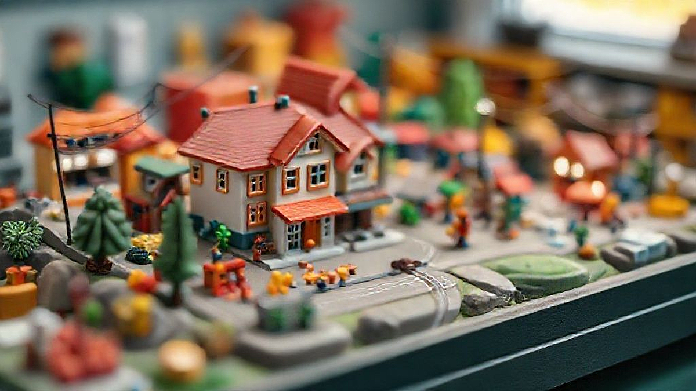

# 내 피규어에 생명을! 40대 아재의 디오라마 입문기 (feat. 텅장주의)

**디오라마**는 단순한 피규어 배경 그 이상입니다. 제겐 어릴 적 동네 문방구 쇼윈도 너머로 넋을 잃고 바라보던, 그 로망의 완성이자 제 소중한 수집품들에게 영혼을 불어넣는 마법 같은 작업이죠. 안녕하세요, 80년대 만화영화를 보며 자랐고, 이제는 제 용돈으로 그때 그 시절의 로망을 하나씩 채워가는 40대 키덜트 수집가입니다. 책장 한편을 가득 채운 피규어와 레고들을 보고 있으면 흐뭇하지만, 가끔 이런 생각이 들곤 했습니다. '얘들아, 너희들 이야기 속에서는 정말 멋졌는데, 여기선 그냥 가만히 서 있기만 하는구나.' 바로 그 아쉬움을 채워주는 것이 디오라마의 세계였습니다.

처음에는 저도 막막했습니다. 인터넷에 떠도는 '금손'들의 작품을 보면 '저건 특별한 사람들만 하는 거야'라며 지레 겁을 먹었죠. 하지만 몇 번의 시행착오를 겪고 나니 알겠더군요. 디오라마는 엄청난 재능이 필요한 예술이라기보다는, 내 추억에 대한 애정과 약간의 끈기만 있다면 누구나 도전할 수 있는 멋진 취미라는 것을요. 마치 어릴 적 찰흙으로 무언가를 만들던 그 설렘과 비슷합니다. 오늘은 저처럼 피규어 장식장에 활기를 불어넣고 싶은 분들을 위해, 제 텅장과 맞바꾼 실전 경험담을 바탕으로 디오라마의 세계에 첫발을 내딛는 법을 알려드리려고 합니다. 겁먹지 마세요, 생각보다 훨씬 재미있으니까요!

## 디오라마, 어디서부터 시작해야 할까? (초보자를 위한 A to Z)

모든 일에는 순서가 있는 법이죠. 디오라마 제작 역시 무작정 재료부터 사 모으기 시작하면 십중팔구 먼지만 쌓이게 됩니다. 제 첫 실패가 바로 그거였거든요. '일단 멋있어 보이는 건 다 사자!'는 마음으로 이름도 모를 재료들을 샀다가, 결국 이도 저도 아닌 결과물만 만들고 창고행이 되었죠. 그래서 가장 중요한 첫 단계는 바로 **'컨셉 정하기'**입니다.

### ### 컨셉: 어떤 이야기를 담을 것인가?

당신의 피규어에게 어떤 무대를 선물하고 싶으신가요? 이게 가장 중요합니다. 예를 들어, <드래곤볼>의 손오공 피규어가 있다면, 나메크성이 폭발하기 직전 프리저와 대치하던 그 황량한 대지를 만들고 싶을 수 있죠. 아니면 <스타워즈>의 스톰트루퍼들을 위해 타투인의 사막이나 데스스타의 복도를 재현할 수도 있고요.

*   **영화/애니메이션 속 명장면 재현:** 가장 클래식하고 동기부여가 확실한 방법입니다. 참고할 자료가 많아서 초보자가 접근하기 좋습니다.
*   **특정 테마 연출:** '폐허가 된 도시의 골목', '신비로운 숲속', '미래적인 사이버펑크 거리'처럼 구체적인 장면이 아니더라도 특정 분위기를 연출하는 것도 좋은 방법입니다. 이런 범용적인 테마는 나중에 다른 피규어를 올려놓아도 잘 어울린다는 장점이 있죠.

컨셉을 정했다면, 다음은 **'스케일 맞추기'**입니다. 이건 정말, 정말 중요해서 별표 다섯 개를 쳐도 모자랍니다. 피규어는 보통 1/12, 1/10, 1/8, 1/6 등 고유의 스케일(축소 비율)을 가지고 있습니다. 6인치(약 15cm) 피규어는 보통 1/12 스케일, 핫토이즈 같은 12인치(약 30cm) 피규어는 1/6 스케일이죠. 디오라마의 모든 소품과 구조물은 이 피규어의 스케일에 맞춰야 어색하지 않습니다. 제가 예전에 1/6 스케일 아이언맨 옆에 1/12 스케일 자동차 모형을 뒀다가 거인국에 온 아이언맨을 만든 뼈아픈 경험이 있습니다. 꼭! 가지고 계신 피규어의 스케일을 확인하고 시작하세요.

## '있어 보이는' 디오라마를 위한 재료와 도구 (feat. 가성비템 추천)

자, 이제 컨셉도 정했고 스케일도 확인했다면 실전에 뛰어들 차례입니다. "장비병"이 도질 수 있는 가장 위험한 구간이기도 하죠. 물론 전문가용 고급 도구와 재료를 쓰면 좋겠지만, 처음부터 그럴 필요는 전혀 없습니다. 우리 주변에서 쉽게 구할 수 있는 재료들로도 충분히 근사한 결과물을 만들 수 있거든요.

### ### 기본 중의 기본, 필수 도구

*   **커터 칼 & 아트 나이프:** 말이 필요 없는 필수품입니다. 특히 펜처럼 생긴 아트 나이프는 정교한 작업에 필수적입니다. 칼날은 생각보다 금방 무뎌지니 여분을 넉넉히 준비해두세요.
*   **커팅 매트:** 여러분의 소중한 책상을 보호하고, 칼날의 수명도 늘려줍니다. A3 사이즈 정도면 웬만한 작업은 다 가능합니다.
*   **쇠자:** 플라스틱 자는 칼질 한 번에 흠집이 나고 정확한 재단이 어렵습니다. 반드시 30cm 쇠자를 구비하세요.
*   **접착제:** 목공용 풀, 순간접착제, 글루건 이 세 가지는 '접착제 삼대장'입니다.
    *   **목공용 풀:** 마르면서 투명해지고, 지형 표현을 위해 흙이나 모래를 섞어 쓰기 좋습니다. 건조 시간이 긴 것이 단점.
    *   **순간접착제:** 빠르고 강력하게 붙지만, 스티로폼 종류를 녹일 수 있으니 주의해야 합니다. 환기는 필수!
    *   **글루건:** 부피가 있는 부품을 빠르게 고정할 때 최고입니다. 거미줄처럼 늘어나는 건 좀 정리해줘야 합니다.

### ### 디오라마의 뼈대를 만드는 핵심 재료

핵심은 바로 **'아이소핑크'** 또는 **'스티로폼'**입니다. 건축용 단열재로 쓰이는 이 분홍색 폼은 디오라마의 신의 선물 같은 존재입니다. 가볍고, 자르기 쉽고, 조각하기도 편해서 암석, 벽, 지형 등 거의 모든 구조물의 기본 뼈대로 활용됩니다. 다이소에서 파는 스티로폼 블록도 간단한 작업에는 괜찮습니다.

여기에 질감을 더해주는 **'모델링 페이스트'**나 **'지점토'**가 있으면 좋습니다. 아이소핑크로 깎아낸 암석 표면에 얇게 펴 바르면 진짜 돌 같은 거친 질감을 표현할 수 있죠. 저는 가끔 다이소에서 파는 '벽 보수용 퍼티'를 쓰기도 하는데, 가성비가 아주 훌륭합니다.

마지막으로 디테일을 살려줄 **'자연물'**을 활용해보세요. 공원에서 주운 잔가지들은 쓰러진 나무가 되고, 작은 돌멩이들은 바위가 됩니다. 화분 가게에서 파는 말린 이끼(스칸디아모스)는 덤불이나 풀 표현에 아주 효과적입니다. 이런 자연물이야말로 돈 거의 안 들이고 리얼함을 극대화하는 최고의 '가성비템'입니다.

## 2025년 디오라마 트렌드와 리세일 가치까지 생각하는 똑똑한 수집

디오라마도 시대에 따라 유행이 있습니다. 예전에는 단순히 사실적인 재현에 중점을 뒀다면, 요즘은 좀 더 창의적이고 기술적인 요소들이 결합되는 추세입니다. 이왕 만드는 거, 최신 트렌드를 살짝 곁들이면 만족도가 두 배가 되겠죠?

### ### 트렌드 1: LED 조명의 적극적인 활용

요즘 디오라마의 '화룡점정'은 단연 **LED 조명**입니다. 어두운 골목길을 비추는 가로등, 폭발 장면의 섬광, 건물의 창문에서 새어 나오는 불빛 등 LED 하나만 추가해도 디오라마의 분위기가 180도 달라집니다. 예전에는 전선 연결이나 납땜 같은 어려운 작업이 필요했지만, 요즘은 건전지나 USB로 작동하는 완제품 LED 키트가 정말 잘 나옵니다. 특히 1/12 스케일 피규어에 맞는 미니어처 가로등이나 신호등 같은 제품들은 그 자체로도 훌륭한 소품이 됩니다.

*   **실전 팁:** 배선 계획은 반드시 구조물을 만들기 *전에* 세워야 합니다. 저도 한번은 다 만들어 놓고 선을 숨기려고 벽을 부쉈던 아픈 기억이 있습니다. 전선이 지나갈 길을 미리 파놓거나, 구조물 뒤편으로 깔끔하게 정리하는 센스가 필요합니다.

### ### 트렌드 2: 3D 프린터, 상상을 현실로

3D 프린터의 대중화는 디오라마 시장에 혁명을 가져왔습니다. 이제는 상상만 하던 소품들을 직접 만들어낼 수 있는 시대가 온 거죠. 영화에 잠깐 등장했던 특이한 모양의 의자, 주인공만 쓰던 독특한 무기 거치대, 복잡한 기계 장치 등 기존에는 구하기 어려웠던 소품들을 3D 모델링 파일만 있으면 얼마든지 출력할 수 있습니다.

물론 3D 프린터가 없어도 괜찮습니다. '싱기버스(Thingiverse)' 같은 사이트에서 원하는 모델링 파일(STL)을 찾아 3D 프린팅 대행 서비스에 맡기면 되니까요. 비용은 좀 들지만, 세상에 단 하나뿐인 나만의 디오라마를 만드는 데 이보다 더 확실한 방법은 없습니다.

### ### 리세일 가치: 취미를 넘어선 투자?

조금 현실적인 이야기를 해볼까요? 우리가 수집하는 피규어는 시간이 지나면 가치가 오르는 경우가 많죠. 잘 만든 디오라마는 이 피규어의 가치를 더욱 높여주는 역할을 합니다. 단순히 피규어만 단품으로 판매하는 것보다, 그 피규어의 스토리를 담은 디오라마와 함께 세트로 판매할 때 훨씬 높은 가격을 받을 수 있습니다. 디오라마는 단순한 배경이 아니라, 그 자체로 하나의 작품으로 인정받기 때문입니다.

*   **가치를 높이는 팁:** 특정 장면에 너무 얽매이기보다는, 여러 캐릭터에 두루 어울리는 범용적인 배경(예: 도시 폐허, 숲, 돌산)을 만들면 활용도가 높아져 나중에 중고 거래 시에도 더 좋은 반응을 얻을 수 있습니다.

## 결론: 당신의 장식장, 이제 무대가 될 시간입니다

지금까지 저의 경험을 바탕으로 디오라마의 세계에 대해 이야기해 보았습니다. 처음에는 모든 것이 낯설고 어렵게 느껴질 수 있습니다. 하지만 기억하세요. 가장 중요한 것은 '완벽함'이 아니라 '완성'이라는 것을요. 조금 삐뚤빼뚤하고 어설퍼도 괜찮습니다. 내 손으로 직접 내 소중한 피규어의 세계를 만들어냈다는 그 성취감은 무엇과도 바꿀 수 없는 즐거움을 줍니다.

어릴 적, 로봇 장난감 하나를 가지고 온 방 안을 누비며 상상의 나래를 펼쳤던 그때의 설렘을 기억하시나요? 디오라마는 바로 그 시절의 즐거움을 어른의 방식으로 다시 한번 느끼게 해주는 멋진 취미입니다. 여러분의 장식장 위에서 조용히 먼지만 쌓여가는 피규어들은 자신만의 이야기를 펼칠 무대를 간절히 기다리고 있을지도 모릅니다. 이번 주말, 작은 베이스 하나부터 시작해 보는 건 어떨까요? 여러분은 어떤 캐릭터를 위해, 어떤 멋진 세상을 만들어주고 싶으신가요? 댓글로 여러분의 첫 디오라마 계획을 공유해주세요

오늘 제 이야기가 디오라마라는 멋진 세계로 첫발을 내딛는 데 작은 용기가 되었기를 바랍니다. 기억하세요, 가장 중요한 것은 '완벽한 결과물'이 아닌, 내 손으로 직접 무언가를 '만들어가는 과정' 그 자체의 즐거움입니다. 서툰 첫 작품일수록 훗날 더 소중한 추억으로 남을 거예요.

망설여진다면, 아주 작은 소품 하나를 칠해보거나, 간단한 베이스를 꾸미는 것부터 시작해보세요. 작은 시도 하나하나가 모여 여러분만의 근사한 세계를 완성할 테니까요. 여러분이 만들어갈 이야기들이 벌써부터 기대됩니다. 댓글을 통해 여러분의 첫 디오라마 도전기나 궁금한 점들을 공유해주세요. 서로의 경험을 나누며 함께 성장해나가는 즐거움도 클 거예요. 그럼, 여러분의 손끝에서 피어날 멋진 세상을 응원하며 다음 이야기로 다시 찾아뵙겠습니다.