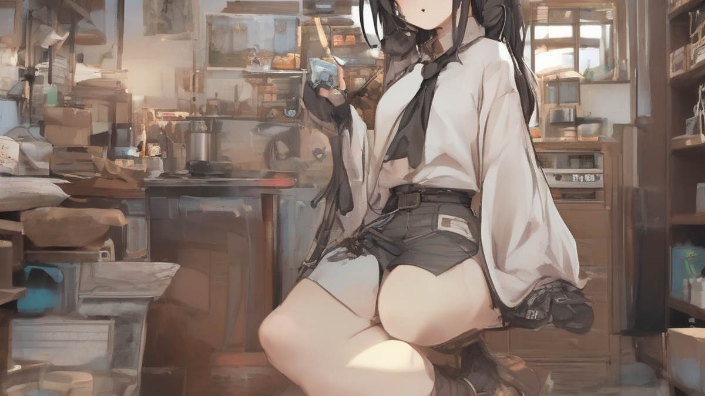

# 단종 레고 세트 투자 가치 분석: 돈 되는 희귀 레고 구매 가이드

어릴 적 추억이 방울방울 떠오르는 레고! 40대가 되니 그 시절 향수가 더 짙어지는 거 있죠. 저도 어릴 때 용돈 모아 샀던 레고들을 아직까지 소중하게 간직하고 있답니다. 특히 단종된 레고 세트는 시간이 지날수록 희소성이 높아져서 쏠쏠한 투자 가치까지 있다는 사실, 알고 계셨나요? 오늘은 저처럼 레고를 사랑하는 키덜트 분들을 위해, 2025년 최신 트렌드를 반영한 단종 레고 투자 가이드, 속 시원하게 풀어드릴게요! "아, 이거 진짜 갖고 싶었는데!" 했던 레고가 있다면, 지금부터 집중!

## 단종 레고, 왜 투자 가치가 높을까?

단종 레고의 매력은 뭐니 뭐니 해도 *희소성*이죠. 레고는 일정 기간 동안만 생산하고 단종시키는 경우가 많아요. 시간이 흐를수록 구하기 어려워지니, 자연스럽게 가격이 오르는 건 당연한 이치! 특히 인기 영화나 드라마, 캐릭터와 콜라보한 레고는 팬덤의 힘까지 더해져서 가격 상승폭이 어마어마하답니다.

저도 한때 '밀레니엄 팔콘' 레고를 놓쳤던 아픈 기억이 있어요. 당시에는 가격이 부담스러워서 망설였는데, 지금은 몇 배나 올라서 엄두도 못 내고 있답니다. ㅠㅠ 그때 샀더라면... 하는 후회가 밀려오죠. 흑흑.

단종 레고 투자는 단순히 돈을 불리는 것 이상의 의미도 있어요. 어릴 적 추억을 되살리고, 레고 커뮤니티에서 같은 취미를 가진 사람들과 소통하는 즐거움까지 누릴 수 있다는 점! 마치 타임머신을 타고 어린 시절로 돌아간 듯한 기분이랄까요?

## 어떤 레고에 투자해야 할까? 2025년 투자 트렌드 분석

자, 그럼 이제 본격적으로 '돈 되는' 레고를 찾아볼까요? 무턱대고 아무 레고나 샀다가는 낭패를 볼 수 있으니, 꼼꼼하게 따져봐야 합니다. 2025년 현재, 제가 주목하고 있는 투자 트렌드는 다음과 같아요.

*   **영화 & 드라마 콜라보 레고:** '해리포터', '스타워즈', '반지의 제왕' 등 탄탄한 팬덤을 가진 영화나 드라마 시리즈와 콜라보한 레고는 꾸준한 인기를 누리고 있습니다. 특히 최근에 새로운 시리즈가 나오거나, 리메이크되는 경우에는 가격이 폭등하는 경우도 많으니 눈여겨보세요.
*   **모듈러 건물 레고:** 레고 모듈러 시리즈는 정교한 디자인과 디테일 덕분에 성인 레고 팬들에게 특히 인기가 많습니다. 매년 새로운 모듈러 건물이 출시되지만, 단종된 모듈러는 희소성이 높아져서 프리미엄이 붙는 경우가 많죠. 특히 '그린 그로서', '카페 코너' 같은 초기 모듈러는 부르는 게 값일 정도!
*   **아이코닉 자동차 레고:** '폭스바겐 비틀', '미니 쿠퍼', '포르쉐 911' 등 클래식 자동차를 레고로 재현한 시리즈도 꾸준히 사랑받고 있습니다. 자동차 마니아층까지 흡수하면서 더욱 인기가 높아지고 있어요.
*   **한정판 & 프로모션 레고:** 레고에서 특정 기간 동안만 판매하거나, 특정 조건(레고 스토어 방문, 일정 금액 이상 구매 등)을 충족해야 받을 수 있는 한정판 레고는 희소성이 매우 높습니다. 특히 레고랜드나 레고 하우스에서만 판매하는 레고는 구하기가 매우 어렵기 때문에, 가격이 천정부지로 치솟는 경우가 많죠.

### 투자 전에 꼭 확인해야 할 3가지

레고 투자는 '묻지마 투자'가 절대 아닙니다! 다음 3가지 사항은 반드시 확인해야 실패를 줄일 수 있어요.

1.  **제품 상태:** 레고 박스의 상태는 가격에 큰 영향을 미칩니다. 박스가 훼손되지 않고, 미개봉 상태인 제품이 가장 높은 가격에 거래됩니다. 박스에 약간의 흠집이 있더라도, 내용물에 이상이 없다면 어느 정도 가격 방어가 가능하지만, 박스가 심하게 훼손된 경우에는 가격이 크게 떨어질 수 있습니다.
2.  **부품 누락 여부:** 레고는 부품 수가 많은 만큼, 부품 누락 여부가 중요합니다. 미개봉 제품이 아니라면, 반드시 부품 목록을 확인하고 누락된 부품이 없는지 꼼꼼하게 확인해야 합니다. 누락된 부품은 브릭링크(Bricklink) 같은 사이트에서 개별적으로 구매할 수 있지만, 시간과 비용이 추가로 발생할 수 있다는 점을 고려해야 합니다.
3.  **리세일 가치:** 모든 단종 레고가 가격이 오르는 것은 아닙니다. 특정 레고는 인기가 없어서 가격이 오히려 떨어지는 경우도 있습니다. 투자하기 전에 해당 레고의 리세일 가치를 꼼꼼하게 조사해야 합니다. 브릭픽커(Brickpicker) 같은 사이트에서 과거 판매 데이터를 확인하거나, 레고 커뮤니티에서 다른 사람들의 의견을 참고하는 것이 좋습니다.

## 나의 투자 경험담: 성공과 실패 사이

저도 레고 투자를 하면서 다양한 경험을 했답니다. 성공적인 투자도 있었지만, 뼈아픈 실패도 있었죠.

가장 성공적인 투자는 '타지마할' 레고였어요. 단종되기 전에 미리 구매해두었는데, 몇 년 사이에 가격이 2배 이상 올랐답니다. 그때 '역시 레고는 배신하지 않는다!'라는 확신을 얻었죠.

반면에 '심슨 하우스' 레고는 뼈아픈 실패 사례입니다. 출시 당시에는 인기가 많았지만, 단종된 후에도 가격이 크게 오르지 않았어요. 오히려 시간이 지날수록 가격이 조금씩 떨어지는 추세랍니다. ㅠㅠ 아마 심슨 시리즈의 인기가 예전 같지 않아서 그런 것 같아요.

이런 경험을 통해 저는 레고 투자는 단순히 '레고'를 사는 것이 아니라, *'미래의 가치'*를 사는 것이라는 것을 깨달았습니다. 어떤 레고가 앞으로 인기를 끌고, 희소성이 높아질지를 예측하는 능력이 중요하다는 것을 알게 되었죠.

## 2025년, 눈여겨볼 만한 단종 예상 레고

2025년에는 어떤 레고가 단종될까요? 아직 공식적으로 발표된 내용은 없지만, 레고 커뮤니티에서는 다음과 같은 레고들이 단종될 가능성이 높다고 예상하고 있습니다.

*   **레고 아이디어:** 레고 팬들이 직접 디자인한 작품을 레고 아이디어 플랫폼에 제출하고, 1만 표 이상을 받으면 레고에서 제품화를 검토하는 시리즈입니다. 레고 아이디어 제품은 보통 1~2년 정도 판매하고 단종되는 경우가 많기 때문에, 최근에 출시된 레고 아이디어 제품은 단종 가능성이 높습니다. 예를 들어, '반 고흐 - 별이 빛나는 밤' 레고는 많은 인기를 얻었지만, 출시된 지 2년이 넘었기 때문에 단종될 가능성이 높다고 예상됩니다.
*   **레고 테크닉:** 레고 테크닉은 복잡한 기계 장치를 레고로 구현한 시리즈입니다. 레고 테크닉 제품은 부품 수가 많고, 조립 난이도가 높기 때문에 성인 레고 팬들에게 인기가 많습니다. 하지만 레고 테크닉 제품은 가격이 비싸고, 공간을 많이 차지하기 때문에 구매를 망설이는 사람들도 많습니다. 따라서 레고 테크닉 제품은 판매량이 저조한 경우, 단종되는 경우가 많습니다.
*   **레고 시티:** 레고 시티는 도시를 테마로 한 레고 시리즈입니다. 레고 시티는 소방서, 경찰서, 병원 등 다양한 건물을 레고로 만들 수 있어서 아이들에게 인기가 많습니다. 하지만 레고 시티 제품은 매년 새로운 모델이 출시되기 때문에, 기존 모델은 단종되는 경우가 많습니다.

**팁:** 단종 예상 레고를 미리 구매해두면, 단종 후에 가격이 오르는 것을 기대할 수 있습니다. 하지만 단종 예상 레고가 실제로 단종되지 않거나, 단종되더라도 가격이 오르지 않을 수도 있다는 점을 고려해야 합니다.

## 결론: 레고, 추억과 투자를 동시에!

자, 오늘 단종 레고 투자 가이드 어떠셨나요? 레고는 단순한 장난감을 넘어, 어릴 적 추억을 되살려주는 소중한 존재이자, 쏠쏠한 투자 수단이 될 수 있다는 사실!

하지만 레고 투자는 신중하게 접근해야 합니다. 꼼꼼한 정보 수집과 분석은 필수! 그리고 무엇보다 중요한 건, 레고를 사랑하는 마음입니다. 좋아하는 레고를 수집하고, 조립하는 과정 자체가 행복이라면, 투자 결과가 좋지 않더라도 후회는 없을 거예요.

2025년, 여러분도 저와 함께 레고 투자의 세계에 발을 들여보는 건 어떠세요? 지금 바로 레고 스토어나 온라인 쇼핑몰을 방문해서, 여러분의 마음을 사로잡는 레고를 찾아보세요! 혹시 아나요? 그 레고가 미래에 엄청난 가치를 지니게 될지도!

**지금 바로 레고 커뮤니티에 가입하고, 단종 예상 레고 정보를 공유해보세요!**
