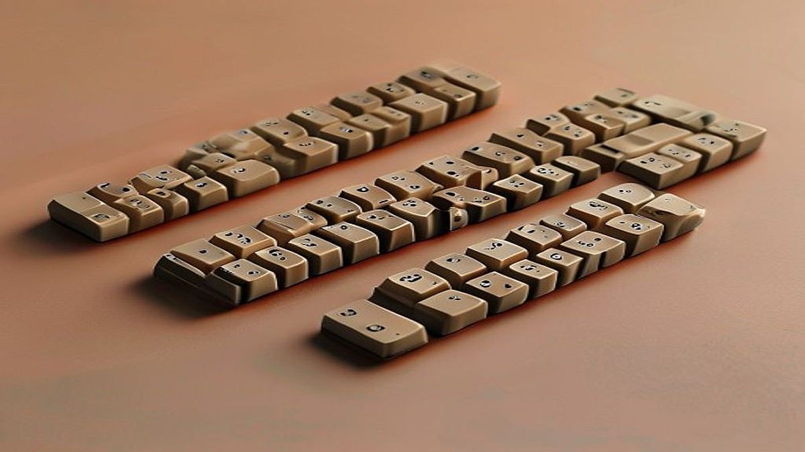

3D 프린팅으로 직접 만드는 나만의 커스텀 키캡은 단순히 기성품을 구매하는 단계를 넘어, 데스크테리어의 완성도를 본인의 손으로 직접 제어하고 싶어 하는 2040 세대에게 가장 매력적인 DIY 영역으로 자리 잡았습니다. 매일 손끝으로 마주하는 키보드가 대량 생산된 공산품이라는 점에 지루함을 느끼기 시작했다면, 이제는 나만의 서사나 개성을 담은 오브제를 올릴 시간입니다. 왜 지금 사람들이 이 취향에 열광할까요? 단순히 예뻐서가 아닙니다. 정형화된 일상 속에서 내가 직접 설계하고 출력한 결과물이 물리적인 형태를 갖추어 내 책상 위에 놓인다는 사실, 그 '통제권'이 주는 쾌감이 크기 때문입니다. 예전에는 수십만 원을 호가하는 커스텀 키보드 공제에 참여하거나 비싼 장비를 갖춰야만 가능했던 영역이, 이제는 가정용 보급형 프린터의 정밀도가 높아지고 무료 모델링 툴이 보편화되면서 문턱이 획기적으로 낮아졌습니다. 남들과 똑같은 장비를 쓰는 것에 질렸다면, 지금이 바로 나만의 키캡 제작에 뛰어들 최적의 시기입니다. 이 글에서는 입문자가 겪을 시행착오를 줄이고, 당장 책상 위를 변화시킬 수 있는 실질적인 가이드라인을 제시합니다.

## 3D 프린팅 키캡 입문을 위한 현실적인 판단 기준

처음 시작할 때 가장 많이 하는 실수는 무작정 고가의 장비를 구매하거나 복잡한 모델링부터 배우려 하는 것입니다. 본인의 주거 환경과 예산, 그리고 인내심을 먼저 점검해야 합니다. 3D 프린팅 키캡은 크게 FDM(필라멘트 압출 방식)과 SLA(레진 광경화 방식)로 나뉩니다. 결론부터 말하면, 키캡처럼 세밀하고 매끄러운 표면이 필요한 작업에는 SLA 방식이 필수입니다. FDM 방식은 적층 결이 눈에 띄게 남아 키캡 표면을 가공하는 데 엄청난 시간과 노력이 듭니다.

선택 기준을 명확히 합시다. 만약 작업 공간이 1평 남짓한 방이고, 환기 설비를 완벽하게 갖출 수 없다면 SLA 방식은 과감히 포기하거나 제작 대행 서비스를 이용하는 것이 정신 건강에 이롭습니다. 레진 특유의 화학적 냄새와 세척 과정에서 발생하는 폐기물 처리는 생각보다 번거롭습니다. 반면, 이미 취미로 피규어를 출력하거나 환기가 잘 되는 베란다, 혹은 전용 작업실이 있다면 SLA 프린터는 최고의 선택입니다.

실패 사례는 대부분 모델링의 공차를 무시하고 출력할 때 발생합니다. 키보드 스위치 축(스템)은 매우 정밀한 규격으로 제작됩니다. 모델링 파일의 스템 구멍이 스위치보다 0.1밀리미터만 작아도 키캡은 끼워지지 않고, 0.1밀리미터만 커도 헐거워서 빠집니다. 처음부터 직접 모델링하기보다는, 이미 검증된 '키캡 스템 규격' 오픈 소스를 다운로드하여 그 위에 본인의 디자인을 덧붙이는 방식을 권장합니다. 처음부터 모든 것을 창조하려 하지 마세요. 검증된 베이스 파일 위에 나만의 아트워크를 올리는 것이 입문자의 성공 확률을 높이는 가장 빠른 길입니다.

## 실전 체크리스트: 디자인부터 출력까지의 단계별 점검

본격적으로 제작에 들어가기 전, 다음 체크리스트를 확인하세요. 이 과정은 시간 낭비를 최소화하기 위한 필수 관문입니다.

첫째, 모델링 프로그램의 선택입니다. 복잡한 3D 툴 대신 팅커캐드(Tinkercad)나 퓨전 360(Fusion 360)의 무료 버전을 활용하세요. 팅커캐드는 브라우저 기반이라 설치가 필요 없고, 직관적인 블록 쌓기 방식으로 키캡의 기본 형태를 잡기에 최적입니다. 

둘째, 스템 규격 테스트입니다. 전체 디자인을 출력하기 전에, 키캡의 스템 부분만 5밀리미터 크기로 잘라서 테스트 출력을 먼저 진행하세요. 이것이 맞지 않으면 전체를 출력해도 100퍼센트 실패입니다. 

셋째, 출력 방향 설정입니다. 키캡의 윗면이 바닥을 향하게 두면 표면은 매끄럽지만, 내부에 서포트가 많이 생겨 제거가 어렵습니다. 반대로 윗면을 위로 두면 서포트는 줄지만 표면에 적층 결이 남습니다. 보통은 45도 각도로 기울여 출력하는 것이 가장 균형 잡힌 결과를 줍니다.

실무적인 팁을 하나 드리자면, 출력 후 후가공 시간을 무시하지 마세요. 레진 프린터로 출력했더라도 세척과 경화, 그리고 샌딩 작업까지 거쳐야 비로소 키보드에 올릴 만한 퀄리티가 나옵니다. 400방, 800방, 1200방 사포를 순서대로 사용하여 표면을 다듬는 과정은 필수입니다. 이를 건너뛰면 아무리 디자인이 훌륭해도 플라스틱 덩어리처럼 보일 뿐입니다. 인내심이 부족하다면 이 과정에서 취미를 포기하게 됩니다. 하지만 이 사포질이야말로 나만의 장비에 애착을 갖게 되는 가장 중요한 의식입니다.

## 데스크테리어족을 위한 장기적 유지 전략과 커뮤니티 활용

키캡 제작은 단순히 하나를 만드는 것으로 끝나지 않습니다. 나만의 스타일을 찾고, 그 스타일을 지속적으로 업데이트하는 과정입니다. 초반에는 캐릭터 키캡이나 화려한 색감에 집중하지만, 시간이 지나면 결국 본인의 키보드 테마와 조화를 이루는 '톤앤매너'를 고민하게 됩니다. 이때 가장 중요한 것은 커뮤니티의 활용입니다. 국내외 기계식 키보드 커뮤니티나 3D 모델링 공유 플랫폼에는 이미 수만 명의 선구자들이 고민한 흔적이 남아 있습니다.

실수하기 쉬운 부분은 '지나친 욕심'입니다. 한 번에 너무 복잡한 디테일을 넣으려 하지 마세요. 3D 프린터의 해상도 한계를 고려하지 않은 미세한 문양은 출력 시 뭉개지기 쉽습니다. 오히려 단순한 기하학적 형태나, 본인만의 이니셜, 혹은 좋아하는 색상의 레진을 활용한 투톤 컬러 조합이 훨씬 고급스럽습니다. 

유지비 측면에서 레진은 소모품입니다. 레진 가격뿐만 아니라 세척용 알코올, 니트릴 장갑, 마스크 등의 소모품 비용을 매달 예산에 포함해야 합니다. 만약 한 달에 5개 이상의 키캡을 만들 계획이라면, 초기 장비 투자비 외에도 월 3~5만 원 정도의 유지비가 발생한다는 점을 고려하세요. 

마지막으로, 본인만의 디자인을 공유해보세요. 커뮤니티에 올린 결과물에 대한 반응은 다음 작업을 위한 가장 큰 동기부여가 됩니다. 피드백을 통해 스템의 공차를 수정하고, 색감을 조절하는 과정이 반복될 때 비로소 남들과는 다른, 나만의 데스크테리어가 완성됩니다.

키캡 제작은 단순히 장비를 만드는 과정이 아니라, 자신의 취향을 물리적인 형태로 구체화하는 창작의 과정입니다. 처음에는 스위치에 딱 맞는 키캡 하나를 뽑아내는 것에서 시작해, 점차 본인의 책상 컨셉에 맞는 개성 있는 오브제를 채워나가 보세요. 고가의 장비를 들이기 전에 무료 모델링 툴과 출력 대행 서비스를 먼저 경험해보는 것도 좋은 방법입니다. 3D 프린팅의 세계는 생각보다 훨씬 넓고, 당신의 손끝에서 시작될 변화는 이미 준비되어 있습니다. 오늘 당장 팅커캐드를 켜고 가장 기본적인 키캡 템플릿부터 불러와 보시기 바랍니다. 그 작은 시작이 당신의 책상 위 풍경을 완전히 바꾸어 놓을 것입니다.

## 마치며

3D 프린팅을 활용한 커스텀 키캡 제작은 단순히 도구를 만드는 일을 넘어, 자신의 취향을 물리적인 형태로 구현하는 매력적인 창작 활동입니다. 처음에는 스템의 공차를 맞추거나 색상을 조절하는 과정이 다소 어렵게 느껴질 수 있지만, 반복되는 피드백과 수정을 통해 완성도를 높여가는 과정 자체가 큰 즐거움이 될 것입니다. 고가의 장비가 없더라도 무료 모델링 툴과 출력 대행 서비스를 통해 충분히 첫걸음을 뗄 수 있으니 부담 갖지 말고 도전해 보세요.

이제 여러분의 차례입니다. 오늘 바로 팅커캐드와 같은 툴을 열어 기본적인 키캡 템플릿을 불러와 보세요. 작은 시작이 모여 여러분의 책상 위를 세상에 단 하나뿐인 공간으로 탈바꿈시켜 줄 것입니다. 직접 만든 키캡으로 완성하는 나만의 데스크테리어, 지금 바로 시작해보는 건 어떨까요? 여러분의 멋진 결과물을 커뮤니티에서 만날 수 있기를 기대하겠습니다.
