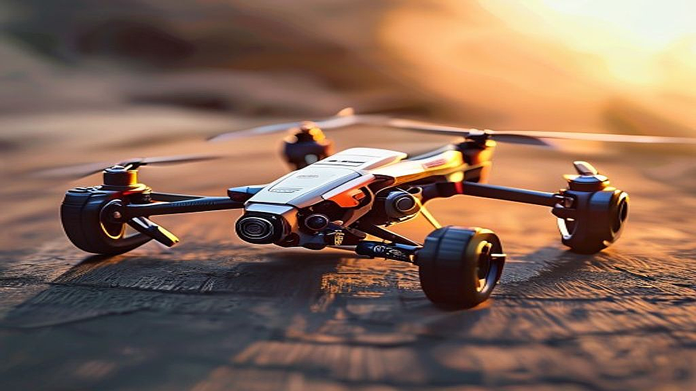

드론 레이싱 입문, 2026년형 초보자용 기체 선택 기준을 고민하는 당신은 아마도 주말마다 뻔한 실내 액티비티에 지쳐 새로운 자극을 찾는 30대 중반의 직장인일 가능성이 높습니다. 화면 속에서 1인칭 시점(FPV)으로 좁은 게이트를 통과하는 드론의 속도감에 매료되었지만, 막상 시작하려니 복잡한 법규와 수많은 부품 사이에서 길을 잃기 십상이죠. 2026년 현재, 드론 기술은 비약적으로 발전해 예전처럼 납땜 인두를 들고 밤을 새우지 않아도 입문이 가능해졌습니다. 하지만 기술이 쉬워졌다고 해서 아무 기체나 덜컥 구매하면, 첫 비행 후 수리비로 기체 값을 다시 지출하는 뼈아픈 경험을 하게 됩니다.

이 글은 촬영용 드론이 아니라 오직 '속도'와 '조종의 쾌감'을 즐기는 FPV 드론 레이싱에 집중합니다. 단순히 기체를 추천하는 것이 아니라, 당신의 예산과 거주 환경에서 가장 빠르게 실력을 키울 수 있는 선택법을 제시합니다. 비행 금지 구역을 확인하는 앱 설치부터 첫 추락 시 대처법까지, 시행착오를 줄이는 실전 가이드를 통해 당신의 취미 생활이 단순한 장비 수집으로 끝나지 않도록 돕겠습니다.

## 첫 기체 선택의 핵심 기준: 내구성과 수리 편의성

초보자가 가장 먼저 범하는 실수는 '멋진 디자인'이나 '최고 속도'에 현혹되는 것입니다. 드론 레이싱에서 기체는 소모품입니다. 아무리 조종 연습을 많이 해도 초기에는 반드시 벽이나 나무에 부딪히며 추락합니다. 이때 프레임이 깨지거나 모터가 휘어지면 수리가 불가능해져 취미 자체가 중단되기도 합니다.

입문자에게 가장 적합한 기체는 2.5인치에서 3인치 사이의 '시네우프' 혹은 '입문용 프리스틸' 기체입니다. 이 크기의 기체는 실내 연습장이나 넓은 공원에서 다루기에 가장 적당하며, 부품의 호환성이 넓습니다. 제가 겪은 실패 사례를 말씀드리자면, 처음 입문할 때 멋만 보고 5인치 레이싱 기체를 구매했다가, 실외 비행 금지 구역을 피하려다 보니 정작 연습할 공간을 찾지 못해 기체를 방치했던 기억이 있습니다. 5인치급은 속도는 빠르지만, 그만큼 사고 시 파괴력이 크고 입문자가 제어하기엔 너무 민감합니다.

따라서 기체를 고를 때 반드시 확인해야 할 체크리스트는 다음과 같습니다.
1. 프레임의 두께가 최소 3mm 이상인가? (충격 흡수용)
2. 모터를 보호하는 가드가 포함되어 있는가? (실내 연습 필수)
3. 부품을 국내 오픈마켓이나 전문몰에서 즉시 구할 수 있는가? (해외 직구는 수리 기간이 2주 이상 소요되어 흐름이 끊김)

선택 기준을 명확히 하세요. '집 근처 공원에서 가볍게 비행할 것인가' 아니면 '실내 연습장을 정기적으로 방문할 것인가'에 따라 기체의 무게와 배터리 용량이 달라집니다. 특히 2026년형 모델들은 디지털 영상 송신 시스템이 보편화되었으므로, 아날로그 방식보다는 디지털 방식을 선택하는 것이 화면 노이즈 스트레스를 줄여 초반 학습 속도를 2배 이상 높여줍니다.

## 비행 전 반드시 갖춰야 할 실전 체크리스트

기체 구매보다 선행되어야 할 것은 법규 준수와 안전 장비 확보입니다. 한국에서 250g 이상의 드론은 기체 신고가 필수이며, 비행 금지 구역은 'Ready to Fly' 앱 등을 통해 매번 확인해야 합니다. 하지만 초보자들은 흔히 '내 마당이니까 괜찮겠지' 혹은 '사람 없는 공원이니까'라는 안일한 생각으로 시작합니다.

실제 비행 시 겪는 가장 큰 난관은 기체 조종이 아니라 '조종기 세팅'과 '고글 설정'입니다. 처음에는 시뮬레이터로 최소 20시간을 연습해야 합니다. 컴퓨터에 조종기를 연결하고 가상 공간에서 게이트를 통과하는 연습을 하지 않고 바로 실전 비행에 나서는 것은, 운전면허 없이 고속도로에 진입하는 것과 같습니다.

실수하기 쉬운 부분은 배터리 관리입니다. 드론 레이싱에 쓰이는 리튬 폴리머(LiPo) 배터리는 관리가 까다롭습니다. 완충 상태로 며칠을 방치하면 배터리가 부풀어 오르는 '스웰링' 현상이 발생하며, 이는 화재 위험으로 이어집니다. 배터리 보관함(방염 가방)은 선택이 아닌 필수입니다. 

**실전 체크리스트:**
- 조종기 스틱 모드 확인 (모드 2가 가장 보편적입니다)
- 시뮬레이터 프로그램 설치 및 최소 20시간 주행 기록 달성
- 비행 금지 구역 확인 앱 설치 및 내 주변 허가 구역 파악
- 리튬 폴리머 배터리 보관을 위한 방염 가방 구매

이 과정을 건너뛰고 바로 비행에 나설 경우, 첫 비행 5분 만에 기체를 잃어버리거나(Lost), 배터리 과방전으로 기체를 폐기하는 상황을 맞이하게 됩니다. 처음에는 기체 세팅보다 시뮬레이터 연습 시간이 더 길어야 정상입니다.

## 커뮤니티 활용과 유지비 현실 파악

드론 레이싱은 혼자 하기엔 외롭고 정보 습득이 느린 취미입니다. 카페나 오픈 채팅방 같은 커뮤니티에서 정보를 얻어야 합니다. 하지만 여기서 주의할 점은, 커뮤니티의 고수들이 추천하는 '최상급 기체'를 초보자가 따라 사면 안 된다는 것입니다. 그들은 이미 수백 번의 추락을 겪으며 기체를 직접 조립하고 수리할 수 있는 능력을 갖춘 사람들입니다.

유지비 또한 현실적으로 계산해야 합니다. 기체 가격이 40~60만 원대라고 해서 그게 끝이 아닙니다. 배터리 4~5개, 충전기, 예비 프레임, 프로펠러 소모품 등을 고려하면 초기 비용은 100만 원 내외를 잡아야 합니다. 만약 이 금액이 부담스럽다면 중고 기체보다는 입문용 시뮬레이터 패키지부터 시작하세요. 시뮬레이터만으로도 FPV의 쾌감 70%는 충분히 느낄 수 있습니다.

실패 케이스 중 하나는, 저렴한 완구용 드론으로 시작했다가 FPV 레이싱 기체의 조종감과 너무 달라 중도 포기하는 경우입니다. 완구용 드론은 센서가 많아 스스로 수평을 잡지만, 레이싱 드론은 '아크로 모드'를 통해 온전히 조종사가 기체를 제어해야 합니다. 처음부터 시뮬레이터에서 아크로 모드를 연습하는 것이 나중에 기체 적응력을 높이는 유일한 길입니다.

결론적으로, 드론 레이싱은 장비빨이 아닌 '숙련도빨'입니다. 2026년 현재, 기술의 발전으로 진입 장벽은 낮아졌지만, 여전히 조종사의 인내심을 요구하는 취미입니다. 매주 주말마다 30분씩이라도 시뮬레이터에 앉아 손가락 근육을 기억시키는 훈련을 지속하세요. 기체는 그 이후에 사도 늦지 않습니다. 지금 바로 시뮬레이터 프로그램을 다운로드하고 조종기를 연결하는 것부터 시작해 보시기 바랍니다. 그것이 가장 경제적이고 확실한 레이서로 가는 첫걸음입니다.

## 마치며

드론 레이싱은 화려한 장비보다 조종사의 숙련도가 무엇보다 중요한 스포츠입니다. 2026년 현재 기술의 발전으로 입문은 쉬워졌지만, 완구용 드론의 자동 수평 제어에 익숙해지기보다 시뮬레이터를 통해 '아크로 모드'를 연습하는 것이 실력을 쌓는 가장 빠르고 확실한 길입니다. 기체 구매를 서두르기보다는 먼저 조종기 컨트롤에 익숙해지는 인내심을 가져보세요.

매주 30분씩 꾸준히 시뮬레이터와 함께하며 손가락 근육에 비행 감각을 새겨보시길 바랍니다. 지금 바로 조종기를 연결하고 가상 하늘을 비행하는 것부터 시작해 보세요. 그 작은 첫걸음이 여러분을 진정한 FPV 레이서로 이끌어줄 것입니다. 드론 레이싱의 세계에 오신 것을 진심으로 환영하며, 여러분의 안전하고 즐거운 비행을 응원합니다! 조만간 경기장에서 멋진 비행을 선보일 날을 기대하겠습니다.
