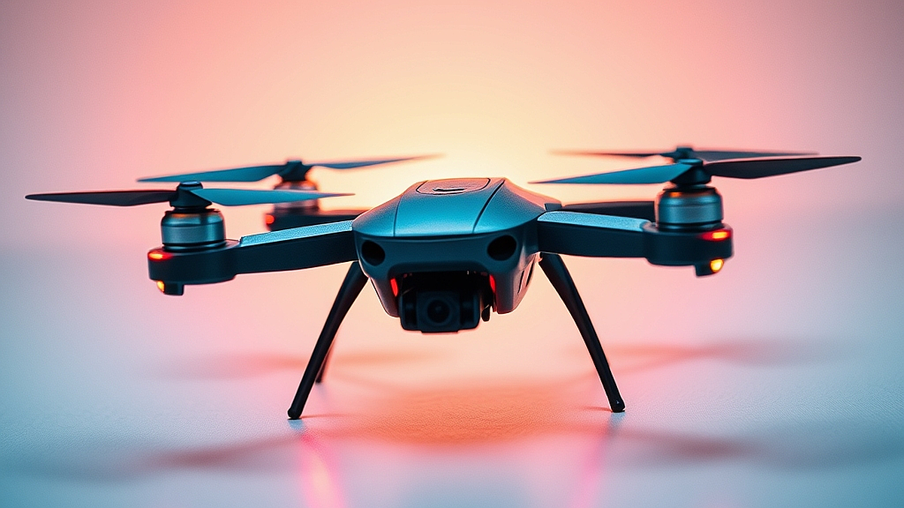

# 드론 레이싱, 2026년에는 누구나 즐기는 익스트림 스포츠로

드론 레이싱은 단순히 하늘을 나는 기체를 조종하는 취미를 넘어, 1인칭 시점(FPV)의 몰입감을 통해 현실의 물리 법칙을 압도하는 속도감을 즐기는 익스트림 스포츠입니다. 20대 후반부터 40대까지, 일상의 반복에 지쳐 무언가 강렬한 도파민을 찾던 이들에게 이 취미가 매력적인 이유는 명확합니다. 퇴근 후 매일 똑같은 화면만 보던 눈에, 고글을 쓰고 기체와 동기화되어 시속 100km가 넘는 속도로 장애물을 통과하는 경험은 대체 불가능한 자극이기 때문입니다. 과거에는 부품 수급이 어렵고 정비 난도가 높아 진입 장벽이 높았지만, 2026년을 바라보는 지금은 규제 완화와 대중적인 기체 라인업의 확대로 누구나 마음만 먹으면 시작할 수 있는 환경이 조성되었습니다. 하지만 무작정 고가의 레이싱 드론부터 구매하는 것은 시행착오의 지름길입니다. 이 글에서는 입문자가 어떤 기준으로 장비를 선택하고, 초반의 좌절을 어떻게 실력으로 치환할 수 있는지, 그 구체적인 로드맵을 제시합니다.

## 조종기부터 시작하는 정석, 왜 시뮬레이터인가

많은 이들이 드론 레이싱에 입문할 때 가장 먼저 저지르는 실수는 곧장 기체를 구매해 야외로 나가는 일입니다. 하지만 레이싱 드론은 헬기처럼 제자리에 머물지 않습니다. 스로틀을 올리는 순간 기체는 반응하고, 숙련되지 않은 손길은 즉각적인 추락과 부품 파손으로 이어집니다. 제가 권하는 첫 번째 단계는 기체가 아닌 조종기(Controller)를 먼저 구매하고 컴퓨터 시뮬레이터를 활용하는 방식입니다.

시뮬레이터는 실제 레이싱 드론의 물리 엔진을 그대로 구현합니다. 키보드가 아닌 실제 조종기를 PC에 연결해 연습하면 손가락의 감각(Muscle Memory)을 익히는 데 약 20시간에서 30시간 정도가 소요됩니다. 이 과정은 지루할 수 있지만, 실제 기체 5대를 박살 내며 얻을 수 있는 경험치를 단돈 몇만 원의 소프트웨어 비용으로 해결하는 셈입니다. 

* 선택 기준: 조종기는 향후 실제 기체와도 호환되는 프로토콜을 지원하는지 확인해야 합니다. ELRS(ExpressLRS) 방식의 조종기를 선택하면 추후 기체 선택의 폭이 넓어집니다. 
* 실패 케이스: 유튜브 영상만 보고 무턱대고 고가형 기체를 먼저 구매했다가, 첫 비행 10초 만에 기체를 분실하거나 수리 불능 상태로 만드는 경우입니다. 
* 실전 팁: 시뮬레이터에서 최소 50바퀴 이상을 추락 없이 완주할 수 있을 때 실제 기체를 구매하는 것을 원칙으로 삼으세요. 이는 비용을 아끼는 가장 확실한 방법입니다. 

## 첫 기체 선택의 기준, 폼팩터와 내구성

시뮬레이터에서 감을 익혔다면 이제 입문용 기체를 고를 차례입니다. 여기서 핵심은 '수리 가능성'과 '크기'입니다. 입문자에게는 3인치 이하의 소형 기체(Cinewhoop 또는 Toothpick 스타일)를 추천합니다. 3인치 기체는 실내외 어디서든 비행이 가능하며, 기체 무게가 가벼워 추락 시 충격이 적어 파손 위험이 낮습니다.

기체를 고를 때 가장 먼저 살펴봐야 할 지표는 '프레임의 재질'과 '부품의 표준화'입니다. 카본 프레임은 가볍고 단단하지만 입문자에게는 수리가 번거로울 수 있습니다. 반면, 플라스틱 가드가 장착된 기체는 실내 연습 시 벽에 부딪혀도 기체와 주변 환경을 보호할 수 있어 초보자에게 적합합니다. 

* 구체 예시: 2.5인치 혹은 3인치급의 BNF(Bind and Fly) 드론이 입문용으로 적합합니다. 이는 조종기와 페어링만 하면 바로 비행이 가능한 상태로 판매되는 기체를 말합니다.
* 실패 케이스: 너무 큰 5인치 레이싱 드론을 첫 기체로 선택하는 것입니다. 출력은 강력하지만, 그만큼 제어하기 어렵고 추락 시 기체 전체가 박살 나 수리비가 기체 가격만큼 나오는 경우가 많습니다.
* 체크 포인트: 부품을 쉽게 구할 수 있는 브랜드인지 확인하세요. 특정 제조사의 전용 부품만 써야 하는 기체는 수급이 막히면 기체 자체가 고철이 됩니다. 호환성이 높은 오픈소스 기반의 비행 제어기(FC)를 사용하는지 확인하는 것이 중요합니다.

## 커뮤니티와 실전 대회, 성장의 필수 조건

드론 레이싱은 혼자 즐기는 취미가 아닙니다. 기체 세팅, 펌웨어 업데이트, 송신기와 수신기 바인딩 등 입문자가 스스로 해결하기 어려운 기술적 난관이 수시로 발생하기 때문입니다. 온라인 커뮤니티나 오프라인 모임에 참여하는 것은 단순히 정보를 얻는 것을 넘어, 자신의 기체 세팅을 점검받는 가장 빠른 방법입니다.

오프라인 모임은 보통 주말 아침 공원이나 실내 연습장에서 이루어집니다. 처음에는 고수들의 비행을 뒤에서 지켜보는 것만으로도 큰 도움이 됩니다. 그들이 어떤 경로로 비행하는지, 추락 후 기체를 어떻게 수리하는지 옆에서 보면 며칠을 고민할 문제도 금방 해결됩니다. 2026년 현재, 국내 드론 커뮤니티는 예전보다 훨씬 개방적이며 입문자를 위한 멘토링 프로그램도 활성화되어 있습니다.

* 실전 체크리스트:
  1. 기체 세팅 확인: 조종기 스틱과 기체 반응이 일치하는가?
  2. 안전장치(Failsafe) 설정: 신호가 끊겼을 때 기체가 자동으로 시동을 끄도록 설정했는가?
  3. 배터리 관리: 리튬 폴리머 배터리는 완충 상태로 보관하지 않고 전압을 관리하고 있는가?
* 실패 케이스: 커뮤니티에 질문하기를 두려워하여 혼자서 펌웨어를 수정하다가 기체를 벽돌(먹통) 상태로 만드는 경우입니다. 
* 선택 기준: 활동하는 커뮤니티가 최신 기술 동향(예: 디지털 영상 송신 시스템)을 공유하는지 확인하세요. 아날로그 방식에서 디지털 방식으로 넘어가는 추세이므로, 이 흐름을 읽는 곳이 좋습니다.

## 결론: 기술적 성취와 익스트림의 결합

드론 레이싱은 단순한 장난감 조종이 아닙니다. 비행 물리학, 전자 회로, 실시간 영상 송신 기술이 집약된 종합적인 취미입니다. 처음에는 시뮬레이터에서 손가락을 단련하고, 그다음에는 3인치 기체로 실전 감각을 익히며, 커뮤니티를 통해 기술적 한계를 돌파하는 과정은 성인에게 필요한 적절한 성취감을 제공합니다. 

지금 당장 시작하고 싶다면, 오늘 저녁 조종기 하나를 장만하고 시뮬레이터 소프트웨어를 설치하는 것부터 시작하세요. 2026년에는 여러분도 경기장에서 고글을 쓰고 속도를 즐기는 레이서가 되어 있을 것입니다. 드론 레이싱은 실패를 반복하며 조금씩 더 빨리, 더 정확하게 비행 궤적을 그리게 되는 과정 그 자체입니다. 무작정 비싼 장비를 구매하기보다, 지금 자신의 수준에 맞는 작은 기체와 함께 꾸준히 연습하는 것이 이 취미를 오래도록 즐기는 유일한 길임을 잊지 마세요. 이제 여러분의 비행을 시작할 시간입니다.

드론 레이싱은 단순히 빠른 비행을 즐기는 것을 넘어, 비행 물리학과 정밀한 제어 기술이 결합된 고도의 종합 예술입니다. 시뮬레이터로 기초를 다지고 작은 기체부터 차근차근 실력을 쌓아가는 과정은 성인에게 더할 나위 없는 성취감을 선사합니다. 처음부터 고가의 장비를 욕심내기보다, 꾸준한 연습과 커뮤니티와의 교류를 통해 자신의 비행 궤적을 완성해 나가는 즐거움을 느껴보세요.

지금 바로 조종기를 손에 쥐고 시뮬레이터 소프트웨어를 설치하는 것부터 시작해 보는 건 어떨까요? 실패를 두려워하지 않고 조금씩 더 빠르고 정확하게 비행하다 보면, 2026년에는 여러분도 경기장에서 고글을 쓰고 당당히 레이싱을 즐기는 주인공이 되어 있을 것입니다. 드론 레이싱이라는 새로운 세계를 향해, 이제 여러분만의 첫 번째 비행을 시작할 시간입니다. 지금 바로 하늘을 향한 도전을 시작해 보세요!
