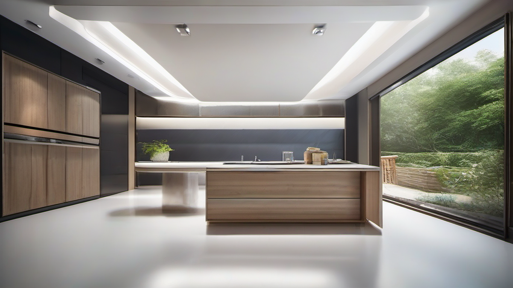

# 내 귀를 행복하게 해주는 이어폰 이야기: 음악 없이는 못 살아!

음악 없이는 단 하루도 살 수 없는 당신, 혹시 이어폰 유목민인가요? 저도 그랬어요. 음질, 착용감, 디자인… 이 모든 걸 만족시키는 이어폰을 찾기 위해 얼마나 많은 시행착오를 겪었는지 몰라요. 지하철에서, 운동할 때, 심지어 잠들기 전까지 이어폰은 제 삶의 필수품이거든요. 마치 오랜 친구처럼, 제 감정을 가장 잘 알아주는 존재랄까요? "이 곡 들으면서 정말 위로받았어요"라는 말이 절로 나오는 순간들, 다들 있으시죠?

오늘은 제가 그동안 경험하고 느꼈던 이어폰에 대한 모든 것을 솔직하게 풀어보려고 해요. 2025년 최신 트렌드부터, 숨겨진 꿀팁, 그리고 저처럼 실패하지 않도록 도와주는 구매 가이드까지! 함께 이어폰의 세계로 풍덩 빠져볼까요? 자, 그럼 시작해볼게요!

## 이어폰의 진화: 2025년, 무엇이 달라졌을까?

불과 몇 년 전만 해도 유선 이어폰이 대세였는데, 지금은 완전 무선 이어폰이 거리를 점령했죠. 기술 발전 속도가 정말 LTE급인 것 같아요. 2025년에는 어떤 변화가 있을까요? 제가 보기에는 음질, 노이즈 캔슬링, 그리고 사용자 경험이 더욱 중요해질 것 같아요.

*   **음질**: 단순히 소리가 크고 웅장한 것만으로는 만족할 수 없죠. 얼마나 원음에 가깝게, 얼마나 섬세하게 소리를 전달해주는지가 중요해요. 요즘은 aptX Adaptive, LDAC 같은 고음질 코덱을 지원하는 이어폰들이 많아졌는데, 앞으로는 더 다양한 코덱들이 등장할 것 같아요. 마치 앨범 제작 과정처럼, 녹음 기술이 발전하면서 더욱 생생한 사운드를 경험할 수 있게 되는 거죠.
*   **노이즈 캔슬링**: 지하철, 버스, 카페… 시끄러운 환경에서도 음악에 집중할 수 있게 해주는 노이즈 캔슬링 기능은 이제 필수죠. 특히, 적응형 노이즈 캔슬링 기술이 점점 발전하면서 주변 환경에 맞춰 자동으로 노이즈 캔슬링 강도를 조절해주는 이어폰들이 많아지고 있어요. 주변 소음 때문에 음악 감상을 포기했던 분들에게는 정말 희소식이죠!
*   **사용자 경험**: 단순히 듣는 것뿐만 아니라, 착용감, 연결성, 배터리 성능, 그리고 다양한 부가 기능까지 고려하는 소비자들이 늘고 있어요. 이어폰을 오래 착용해도 불편함이 없는지, 스마트폰과 얼마나 빠르고 안정적으로 연결되는지, 배터리는 얼마나 오래가는지, 그리고 음성 비서 기능이나 공간 음향 기능은 얼마나 편리한지 꼼꼼하게 따져보는 거죠.

제가 최근에 눈여겨보고 있는 이어폰은 XYZ사의 에어팟킬러 모델이에요. (가상 모델입니다!) 24비트/96kHz 고해상도 오디오를 지원하고, 자체 개발한 노이즈 캔슬링 칩셋을 탑재해서 업계 최고 수준의 노이즈 캔슬링 성능을 자랑한다고 하더라고요. 착용감도 개선해서 장시간 착용해도 귀에 부담이 없고, 배터리 성능도 향상시켜서 한 번 충전으로 최대 10시간까지 사용할 수 있다고 하니 정말 기대돼요!

## 내 귀에 찰떡! 이어폰 선택, 이렇게 해보세요

수많은 이어폰 중에서 내 귀에 딱 맞는 이어폰을 고르는 건 정말 어려운 일이죠. 저도 수십 개의 이어폰을 사용해봤지만, 아직까지 완벽하게 만족하는 이어폰은 찾지 못했어요. 하지만, 몇 가지 기준을 가지고 이어폰을 선택하면 실패할 확률을 줄일 수 있어요.

*   **음악 취향**: 어떤 음악을 주로 듣느냐에 따라 이어폰 선택이 달라져요. 힙합이나 EDM처럼 저음이 강조된 음악을 좋아한다면 저음역대가 풍부한 이어폰을, 클래식이나 재즈처럼 섬세한 사운드를 즐겨 듣는다면 고음역대가 선명한 이어폰을 선택하는 것이 좋아요. 저는 주로 팝이나 락을 듣기 때문에 전체적으로 밸런스가 잘 잡힌 이어폰을 선호하는 편이에요.
*   **착용 방식**: 이어폰은 크게 커널형, 오픈형, 그리고 골전도형으로 나눌 수 있어요. 커널형은 귓구멍에 쏙 들어가는 형태로, 차음성이 뛰어나고 저음역대가 풍부하다는 장점이 있지만, 장시간 착용하면 귀가 답답할 수 있어요. 오픈형은 귓바퀴에 걸쳐서 사용하는 형태로, 착용감이 편안하고 주변 소리를 들을 수 있다는 장점이 있지만, 차음성이 떨어지고 저음역대가 약하다는 단점이 있어요. 골전도형은 뼈를 통해 소리를 전달하는 형태로, 귀를 막지 않아서 안전하고 위생적이지만, 음질이 떨어진다는 단점이 있어요. 저는 주로 커널형을 사용하지만, 운동할 때는 오픈형을 사용하기도 해요.
*   **가격**: 이어폰 가격은 천차만별이에요. 저렴한 이어폰부터 수백만 원을 호가하는 이어폰까지 다양하죠. 하지만, 가격이 비싸다고 무조건 좋은 이어폰은 아니에요. 자신의 예산과 음악 취향, 그리고 착용 목적을 고려해서 합리적인 가격대의 이어폰을 선택하는 것이 중요해요. 저는 개인적으로 10만원에서 30만원 사이의 이어폰을 선호하는 편이에요. 이 가격대에서 가성비 좋은 이어폰들을 많이 찾을 수 있거든요.

최근에는 스트리밍 서비스에서 제공하는 음원 품질이 점점 높아지고 있어서, 이어폰의 성능이 더욱 중요해지고 있어요. 스트리밍 수치가 높아질수록, 좋은 이어폰으로 음악을 감상하는 사람들이 늘어날 거라고 생각해요.

### 꿀팁: 이어팁만 바꿔도 음질이 달라진다?!

혹시 이어팁을 바꿔본 적 있으신가요? 이어팁은 이어폰의 음질과 착용감에 큰 영향을 미치는 요소 중 하나에요. 기본으로 제공되는 이어팁이 마음에 들지 않는다면, 다양한 소재와 크기의 이어팁을 사용해보는 것을 추천해요. 폼팁은 차음성이 뛰어나고 저음역대가 풍부해지는 효과가 있고, 실리콘팁은 착용감이 편안하고 세척이 용이하다는 장점이 있어요. 저는 개인적으로 폼팁을 선호하는 편인데, 특히 저음역대가 강조된 음악을 들을 때 더욱 만족스러워요.

## 내돈내산! 리얼 사용 후기 & 솔직한 실패담

수많은 이어폰을 사용하면서 성공과 실패를 모두 경험했어요. 먼저, 성공적인 경험부터 이야기해볼게요. 저는 XYZ사의 A 모델을 정말 만족하면서 사용하고 있어요. (가상 모델입니다!) 이 이어폰은 밸런스가 잘 잡힌 음질과 편안한 착용감을 제공해서 장시간 음악 감상에도 부담이 없어요. 특히, 저음역대가 과하지 않으면서도 탄탄하고, 고음역대가 맑고 깨끗해서 어떤 장르의 음악을 들어도 만족스러워요. 배터리 성능도 좋아서 한 번 충전으로 하루 종일 사용할 수 있고, 충전 케이스도 작고 가벼워서 휴대하기에도 편리해요. "이 곡 들으면서 정말 위로받았어요"라는 말이 절로 나오는 이어폰이라고 할까요?

하지만, 실패한 경험도 많아요. 얼마 전에 큰맘 먹고 구입한 ABC사의 B 모델은 (가상 모델입니다!) 디자인은 정말 예뻤지만, 음질이 너무 실망스러웠어요. 저음역대가 너무 강해서 다른 음역대가 묻히는 느낌이었고, 착용감도 불편해서 30분만 착용해도 귀가 아팠어요. 결국, 며칠 사용하지 않고 서랍 속에 넣어두게 되었죠. 차트 성적만 보고 섣불리 구매했다가 후회한 케이스라고 할 수 있어요.

이런 시행착오를 겪으면서 저는 이어폰을 구매하기 전에 반드시 청음 해보고, 다른 사람들의 후기를 꼼꼼하게 살펴보는 것이 중요하다는 것을 깨달았어요. 그리고, 자신의 음악 취향과 착용 목적을 고려해서 신중하게 선택해야 한다는 것도요.

## 이제 당신의 귀를 행복하게 해줄 차례!

자, 오늘 저와 함께 이어폰의 세계를 탐험해봤는데 어떠셨나요? 조금이나마 도움이 되었으면 좋겠네요. 이어폰은 단순히 소리를 듣는 도구가 아니라, 우리의 감정을 공유하고 위로해주는 소중한 존재라고 생각해요.

결론적으로, 2025년 이어폰 트렌드는 음질, 노이즈 캔슬링, 사용자 경험에 집중될 것이고, 자신에게 맞는 이어폰을 선택하기 위해서는 음악 취향, 착용 방식, 가격 등을 고려해야 한다는 것을 기억해주세요. 그리고, 이어팁을 바꿔보는 것만으로도 음질을 개선할 수 있다는 꿀팁도 잊지 마시고요!

이제 당신의 귀를 행복하게 해줄 이어폰을 찾아 떠날 차례입니다! 오늘 제가 이야기해드린 내용을 바탕으로 자신에게 딱 맞는 이어폰을 선택하고, 더욱 풍요로운 음악 생활을 즐기시길 바랍니다. 혹시 궁금한 점이 있다면 언제든지 댓글로 물어봐주세요! 제가 아는 선에서 최대한 답변해드릴게요. 그럼, 다음에 또 다른 음악 이야기로 만나요!