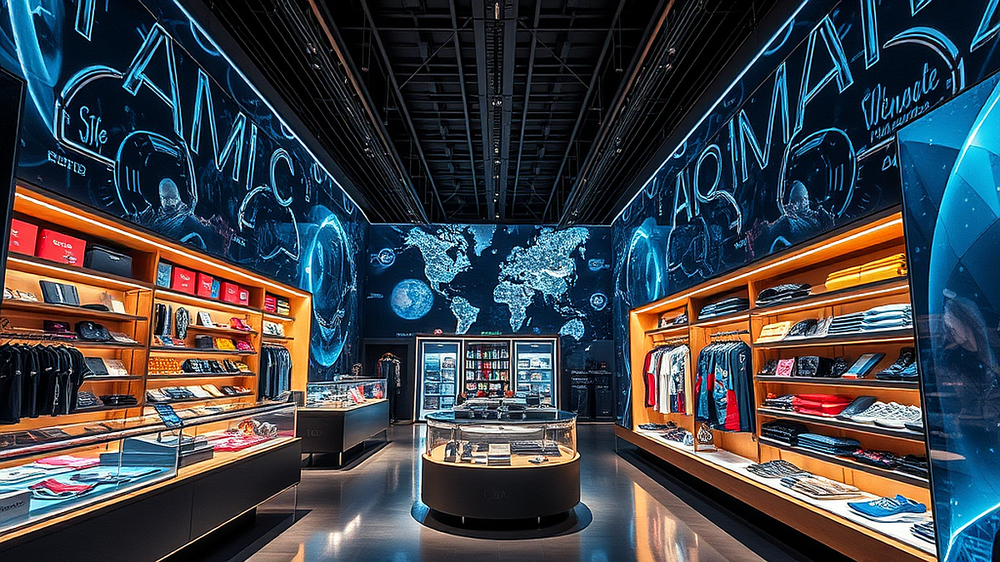

# 팝업스토어의 종말? 2026년형 체험형 매장이 추구하는 '초개인화' 전략

팝업스토어의 종말이라는 말이 들려오는 이유는 명확합니다. 인스타그램에 올릴 사진 한 장을 위해 1시간씩 줄을 서던 '인증샷 중심'의 시대가 저물고 있기 때문입니다. 이제 소비자는 단순히 브랜드를 구경하는 것을 넘어, 자신의 취향이 실시간으로 반영되는 '초개인화'된 경험을 요구합니다. 2026년형 체험형 매장은 더 이상 일방적인 브랜드 메시지 전달 장소가 아닙니다. 고객이 매장에 들어서는 순간부터 데이터가 수집되고, 그 결과값이 매장의 조명, 향, 그리고 추천 제품에 즉각적으로 투영되는 '반응형 공간'으로 진화하고 있습니다. 마케팅 실무자 입장에서 팝업스토어의 피로도를 낮추고 실질적인 구매 전환을 끌어내려면, 이제는 거대한 조형물보다 고객의 개인 데이터를 어떻게 현장에서 동기화할 것인가를 고민해야 합니다. 단순히 사람이 많이 모이는 것이 성공의 지표가 되던 시절은 끝났습니다. 지금부터는 매장을 방문한 고객이 자신의 취향을 얼마나 '발견'했는지가 마케팅 성패를 가르는 핵심 기준이 됩니다.

## 1. 공간의 반응성: 고객 데이터와 공간의 실시간 동기화

2026년의 체험형 매장은 고객이 매장에 진입하는 순간, 예약 정보나 사전 설문 데이터를 바탕으로 공간의 환경을 최적화합니다. 예를 들어, 특정 뷰티 브랜드가 팝업을 연다면 고객의 피부 타입이나 선호 향기 정보를 키오스크나 앱을 통해 읽어 들입니다. 이후 매장 내 조명 색감이나 비치된 시향지의 순서가 해당 고객에게 최적화된 동선으로 자동 세팅되는 방식입니다.

실제 성공 사례로 특정 의류 브랜드는 고객의 체형 데이터를 사전에 입력받아 매장 내 스마트 미러가 해당 고객에게 어울리는 스타일을 즉각적으로 큐레이션 하는 방식을 도입했습니다. 이는 단순히 옷을 나열하는 방식보다 체류 시간 대비 구매 전환율을 30% 이상 높이는 결과를 낳았습니다. 반면, 실패하는 케이스는 기술을 위한 기술을 도입하는 경우입니다. 고객의 데이터가 매장 경험과 직접 연결되지 않고, 단순히 '신기한 체험'으로 끝나는 인터랙티브 아트는 고객에게 피로감만 줍니다.

선택 기준은 명확합니다. 고객이 자신의 정보를 제공했을 때, 즉각적으로 '나만을 위한 결과물'을 얻을 수 있는가? 그렇지 않다면 그 기술은 매장에서 즉시 제거해야 합니다. 실무자라면 매장 기획 단계에서 '고객 데이터가 매장의 물리적 환경을 어떻게 변화시키는가'를 최우선으로 설계해야 합니다.

## 2. 실전 체크리스트: 팝업스토어 성과 측정의 새로운 지표

팝업스토어의 성과를 측정할 때 흔히 방문객 수나 SNS 언급량에 집중하지만, 이는 본질적인 마케팅 효과와 거리가 멉니다. 진짜 성과는 '개인화된 경험이 구매로 이어지는 비율'입니다. 이를 위해 실무자가 매일 확인해야 할 체크리스트를 제안합니다.

첫째, 고객의 동선 내에서 '선택'이 일어나는 지점이 몇 군데인가? 고객이 매장을 돌며 자신의 취향을 선택(제품 테스트, 설문, 선호도 투표 등)하는 구간이 3곳 이상 배치되어야 합니다. 둘째, 수집된 취향 데이터가 실제 상담이나 추천 상품으로 이어지는가? 데이터는 수집 자체가 목적이 아니라, 고객의 고민을 해결하는 도구여야 합니다. 셋째, 퇴장 시 고객이 얻어가는 '개인화된 결과물'이 있는가? 이것은 디지털 영수증일 수도 있고, 나만의 취향이 반영된 샘플 키트일 수도 있습니다.

실수하기 쉬운 부분은 지나치게 긴 대기 시간입니다. 대기가 길어지면 고객의 기대치는 올라가지만, 실제 경험이 그에 미치지 못할 때 브랜드 이미지는 급격히 하락합니다. 따라서 예약제 시스템을 적극 도입하여 매장 내 밀도를 관리하고, 대기하는 동안에도 앱을 통해 사전 취향 분석을 진행하여 입구에서부터 경험이 시작되도록 설계해야 합니다.

## 3. 초개인화 마케팅의 선택과 집중: 누구에게, 왜 필요한가?

초개인화 전략은 모든 브랜드에 적합하지 않습니다. 이 전략은 고객의 데이터가 풍부하거나, 브랜드의 카테고리가 개인의 취향과 밀접하게 연관된 경우(뷰티, 패션, 라이프스타일, 식품)에 최적입니다. 반면, 제품의 기능이 단순하고 대량 생산이 핵심인 저가형 공산품 브랜드라면 화려한 초개인화 기술보다는 접근성과 가격 경쟁력을 강조하는 것이 훨씬 효율적입니다.

처음 시작할 때의 기준은 '데이터의 가치'입니다. 고객이 자신의 정보를 기꺼이 내어줄 만큼 매력적인 보상을 제공할 수 있는가? 만약 보상이 단순한 스티커나 사은품이라면 고객은 데이터 제공을 귀찮게 여길 것입니다. 대신 '내 피부에 딱 맞는 솔루션 제안'이나 '나만의 취향 분석 보고서'처럼 고객의 자아를 만족시키는 결과물을 주어야 합니다.

실패를 피하는 방법은 간단합니다. 모든 고객을 만족시키려 하지 마세요. 타겟 고객층을 좁게 설정하고, 그들이 매장에서 어떤 데이터를 남기고 싶어 하는지를 관찰하십시오. 예를 들어, 20대 타겟이라면 'MBTI 기반의 취향 매칭'이 효과적일 수 있고, 40대 타겟이라면 '건강 데이터 기반의 맞춤형 추천'이 더 효과적일 수 있습니다. 기술은 그저 도구일 뿐입니다. 가장 중요한 것은 고객이 매장을 나갈 때 '나라는 사람을 제대로 이해받았다'는 느낌을 받는 것입니다.

## 결론: 팝업스토어는 이제 '취향의 실험실'이다

팝업스토어는 더 이상 브랜드가 일방적으로 제품을 진열하는 쇼룸이 아닙니다. 2026년형 매장은 고객의 데이터를 바탕으로 끊임없이 변화하는 '취향의 실험실'이어야 합니다. 방문객이 자신의 취향을 입력하고, 브랜드가 이를 실시간으로 반영하여 맞춤형 경험을 제공하는 순환 구조를 만드십시오. 

성공적인 팝업을 위해 다음 세 가지를 기억하십시오. 첫째, 기술은 고객 경험의 개인화를 돕는 수단으로만 사용하십시오. 둘째, 방문객의 데이터를 수집하는 즉시 그 자리에서 개인화된 가치를 돌려주십시오. 셋째, 방문객 수라는 허수보다 '취향 데이터를 기반으로 한 상담 전환율'을 핵심 성과 지표로 삼으십시오. 팝업스토어 피로도는 고객이 자신의 취향을 무시당한다고 느낄 때 발생합니다. 이제는 고객이 매장의 주인이 되어 자신의 취향을 증명하고, 브랜드는 그 증명의 과정을 돕는 조력자가 될 때 비로소 지속 가능한 마케팅이 완성됩니다. 지금 바로 기획 중인 매장에 고객이 직접 선택할 수 있는 '취향 포인트'가 몇 개 있는지 점검해 보시기 바랍니다.

결론적으로 2026년의 팝업스토어는 단순히 물건을 보여주는 공간을 넘어, 고객의 취향을 실시간으로 반영하는 '초개인화된 실험실'로 진화해야 합니다. 방문객을 수치로만 보지 않고, 데이터를 통해 그들의 취향을 존중하고 증명해 주는 브랜드만이 치열한 시장에서 살아남을 수 있습니다. 기술은 도구일 뿐, 핵심은 고객이 매장에서 자신의 가치를 발견하게 만드는 '쌍방향 소통'에 있습니다.

이제 여러분의 기획을 다시 한번 점검해 볼 시간입니다. 단순한 화려함을 걷어내고, 고객이 자신의 취향을 선택하고 경험할 수 있는 장치를 몇 개나 마련하셨나요? 지금 바로 여러분의 팝업스토어에 고객의 목소리가 담길 구체적인 '취향 포인트'를 설계해 보세요. 고객이 주인공이 되는 순간, 브랜드의 지속 가능한 미래도 시작됩니다. 여러분의 성공적인 프로젝트를 진심으로 응원하겠습니다!
