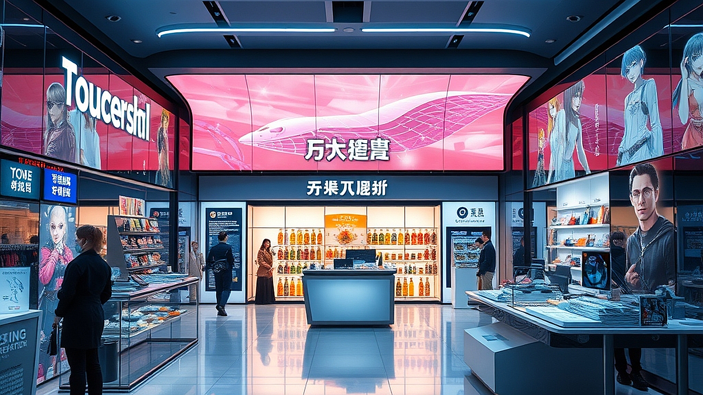

팝업스토어의 종말이라는 말이 들려올 정도로, 이제 단순히 예쁜 포토존과 한정판 굿즈를 내세우는 방식은 더 이상 고객의 발길을 붙잡지 못합니다. 2026년의 브랜드 마케팅은 이제 팝업스토어라는 '공간의 형식'을 넘어, 고객의 일상 속에 자연스럽게 스며드는 '라이프스타일 제안형' 경험으로 진화하고 있습니다. 마케팅 담당자로서 현장을 지켜보면, 고객들은 이제 브랜드의 로고가 박힌 전시물이 아니라, 내일 당장 나의 삶을 조금 더 근사하게 만들어줄 구체적인 '태도'를 소비하고 싶어 합니다. 

이 글을 읽는 당신이 마케터라면, 매번 기획안을 올릴 때마다 '이번엔 또 어떤 차별화된 경험을 줄 것인가'라는 숙제에 지쳐 있을 것입니다. 고객의 입장에서는 이미 넘쳐나는 팝업스토어 사이에서 피로감을 느끼며, SNS 인증샷을 위한 소비가 아닌 진짜 가치를 지닌 경험을 구분하기 시작했습니다. 오늘 다룰 내용은 브랜드가 어떻게 팝업스토어라는 일시적인 이벤트의 틀을 깨고, 고객의 생활 패턴에 파고드는 지속 가능한 경험을 설계할 수 있는지에 대한 실무적인 가이드입니다. 단순히 사례를 나열하는 것이 아니라, 어떤 경우에 이 방식을 채택해야 하는지, 그리고 실패를 줄이기 위해 무엇을 점검해야 하는지 구체적인 기준을 제시하겠습니다.

## 1. 공간의 목적을 '전시'에서 '루틴'으로 전환하기

많은 브랜드가 팝업스토어를 단기적인 홍보 수단으로만 접근합니다. 하지만 2026년의 마케팅은 브랜드가 고객의 루틴을 설계하는 제안자가 될 때 비로소 힘을 얻습니다. 예를 들어, 커피 브랜드가 단순히 원두를 진열하는 팝업을 여는 대신, '나의 아침 15분을 바꾸는 홈카페 세팅'이라는 주제로 가구 브랜드와 협업하여 실제 주거 공간처럼 꾸민 사례가 있습니다. 여기서 중요한 점은 고객이 그 공간에서 단순히 제품을 구경하는 것이 아니라, 자신의 집에 돌아가서도 따라 할 수 있는 구체적인 가이드를 얻어간다는 사실입니다.

실패하는 케이스는 명확합니다. 브랜드의 제품을 강조하기 위해 고객의 동선을 억지로 짜 맞추는 경우입니다. 인스타그램에 올리기 좋은 화려한 조명과 구조물은 방문객을 모을 수는 있지만, 그들이 브랜드를 기억하게 만들지는 못합니다. 고객은 예쁜 배경이 아니라 '내 삶에 이 제품이 들어왔을 때의 풍경'을 보고 싶어 합니다.

선택 기준은 다음과 같습니다. 만약 당신의 브랜드가 고객의 구매 주기보다 '사용 경험'이 더 중요하다면, 전시형 팝업이 아닌 루틴 제안형 팝업을 선택해야 합니다. 예를 들어, 고관여 제품인 가전이나 기능성 의류라면 고객이 직접 제품을 활용해 특정 행동을 수행하게 만드는 과정이 필수적입니다. 반면, 단순히 신제품 출시를 알리는 것이 목적이라면 비용 대비 효율이 낮은 시도일 수 있습니다. 

## 2. 실전 체크리스트: 고객의 피로도를 낮추는 경험 설계

팝업스토어를 기획할 때 가장 흔히 저지르는 실수는 '너무 많은 정보'를 전달하려는 것입니다. 좁은 공간에 제품의 역사, 철학, 기능, 이벤트 참여 방법까지 다 넣으려다 보면 고객은 정보를 소화하지 못하고 퇴장합니다. 2026년의 성공적인 팝업은 고객이 그 공간을 떠날 때 '하나의 명확한 정보'만 기억하게 만듭니다.

이를 위해 스스로 검증해야 할 실전 체크리스트를 제안합니다. 첫째, 고객이 공간에 머무는 시간은 15분을 넘기지 않는가? 둘째, 사진을 찍는 것 외에 반드시 수행해야 할 '행동'이 하나 포함되어 있는가? 셋째, 퇴장 시 고객에게 제공되는 가이드가 실제 생활에서 3일 이상 지속 가능한 내용인가? 이 세 가지 질문에 '아니오'가 하나라도 있다면 기획을 수정해야 합니다. 

실수하기 쉬운 부분은 '경험의 강요'입니다. 마케터는 고객이 우리 브랜드의 모든 것을 체험하길 바라지만, 고객은 본인의 속도대로 움직이고 싶어 합니다. 따라서 동선은 강제적인 일방통행보다는, 고객이 자유롭게 선택하며 머물 수 있는 '느슨한 연결'로 설계해야 합니다. 가격대가 높은 브랜드일수록 고객에게 충분한 사색의 시간과 여유로운 공간을 제공하는 것이 브랜드 가치를 올리는 핵심 전략이 됩니다.

## 3. 마케팅 성과 측정과 실험적 접근

팝업스토어의 성과를 단순히 방문객 수나 SNS 언급량으로만 측정하는 시대는 지났습니다. 이러한 지표는 휘발성이 강해 브랜드의 자산으로 남지 않습니다. 대신, 팝업스토어 이후 고객의 행동 변화를 추적하는 실험을 병행해야 합니다. 예를 들어, 팝업스토어에서 경험한 라이프스타일 제안을 온라인 자사몰의 콘텐츠와 연결하여, 실제 구매 전환율이나 재구매율이 어떻게 변하는지 지표를 설정하십시오.

실패했을 때 점검해야 할 순서는 다음과 같습니다. 첫째, 방문객의 체류 시간이 짧다면 동선보다 콘텐츠의 밀도를 의심하십시오. 둘째, 방문객은 많지만 브랜드에 대한 인지도가 낮다면, 체험 요소가 너무 놀이 위주로 치우치지 않았는지 확인하십시오. 셋째, 매출로 이어지지 않는다면 제품의 가치를 고객의 언어로 설명했는지 점검해야 합니다.

실험 방법으로는 'A/B 테스트형 팝업'을 추천합니다. 공간의 한쪽은 기능 중심의 전시를, 다른 한쪽은 라이프스타일 제안 중심의 체험을 배치하여 고객이 어디에서 더 오래 머물고 어떤 질문을 더 많이 던지는지 관찰하는 것입니다. 이는 적은 예산으로도 고객의 취향을 파악할 수 있는 가장 확실한 방법입니다. 팝업스토어는 이제 브랜드가 자신의 진심을 고객의 일상에 투영하는 '실험실'이 되어야 합니다.

결론적으로, 팝업스토어의 종말은 곧 '형식의 종말'을 의미할 뿐입니다. 고객은 여전히 브랜드와 깊이 연결되기를 원하며, 자신의 취향을 대변해 줄 브랜드를 찾고 있습니다. 브랜드가 공간을 단순히 제품 홍보의 장으로 쓰지 않고, 고객이 자신의 삶을 더 나은 방향으로 바꾸는 법을 배우는 장소로 인식하게 만들 때 비로소 팝업스토어는 생명력을 얻습니다.

지금 바로 기획 중인 팝업스토어의 도면을 펼쳐놓고 확인해 보십시오. 고객이 그 공간을 나간 뒤, 그들의 일상 속에서 우리 브랜드의 제품을 떠올릴 만한 '구체적인 행동'이 하나라도 포함되어 있습니까? 만약 없다면, 오늘 당장 그 행동을 설계하는 것부터 시작하십시오. 화려한 장식은 며칠이면 잊히지만, 고객의 루틴 속에 자리 잡은 브랜드는 오랫동안 곁에 남습니다. 이제는 눈길을 끄는 마케팅에서 마음을 움직이는 라이프스타일 제안으로 전환해야 할 때입니다.

## 마치며

팝업스토어의 시대가 저물어간다는 우려 속에서도, 브랜드가 나아가야 할 길은 명확합니다. 이제 팝업스토어는 단순히 화려한 볼거리를 제공하는 공간을 넘어, 고객의 일상에 깊이 스며드는 '라이프스타일의 실험실'이 되어야 합니다. 브랜드가 고객의 삶에 구체적인 가치를 더할 때, 비로소 형식적인 팝업은 강력한 팬덤을 만드는 기점이 될 것입니다.

지금 준비 중인 공간을 다시 한번 살펴보세요. 고객이 문을 열고 나가는 순간, 그들의 일상 속에서 우리 브랜드의 제품을 떠올리게 할 '작은 루틴'이 설계되어 있나요? 화려한 장식보다 중요한 것은 고객의 삶을 변화시키는 진정성 있는 제안입니다. 

단순한 홍보를 넘어 고객의 마음속에 오래 머무는 브랜드가 되고 싶다면, 오늘 당장 그들의 일상을 바꿀 구체적인 행동 하나를 기획해 보시기 바랍니다. 팝업스토어의 새로운 미래는 바로 그 작은 디테일에서 시작됩니다. 여러분의 브랜드가 고객의 일상에 어떤 특별한 기록을 남길지, 지금 바로 그 설계를 시작해 보세요!
