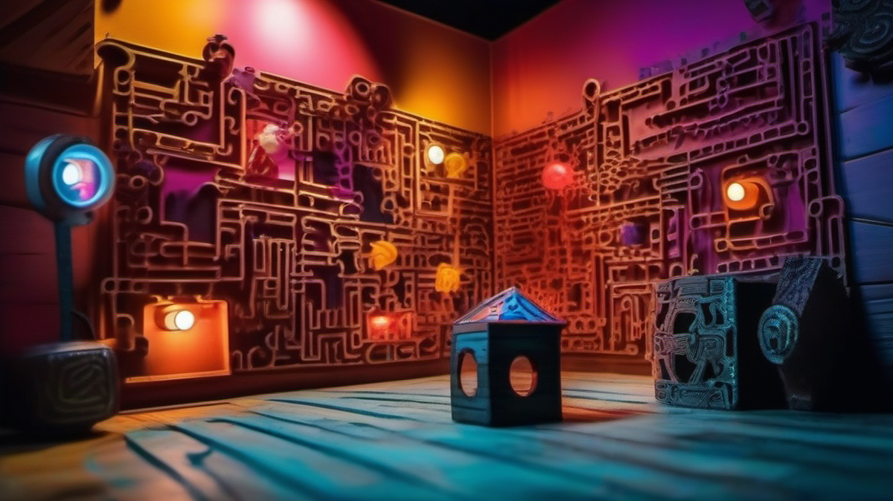

# 방탈출, 어른이 된 우리를 위한 최고의 보물찾기 모험!

아, 방탈출! 이거 정말 어릴 적 상상력을 자극하던 보물찾기 게임의 어른 버전 아니겠어요? 저는 40대 키덜트 수집가로서, 어린 시절 동네 뒷산이나 집안 구석구석을 탐험하며 숨겨진 보물을 찾아내던 그 짜릿함을 잊지 못해요. 그때는 낡은 동전이나 예쁜 돌멩이 하나에도 세상을 다 얻은 듯 기뻐했죠. 지금은 피규어와 레고를 모으면서 그 시절의 설렘을 다시금 느끼고 있는데, 방탈출은 그 설렘을 온몸으로 경험하게 해주는 몇 안 되는 활동 중 하나예요. 꽉 막힌 일상 속에서 잠시나마 주인공이 되어 미지의 공간을 탐험하고, 머리를 맞대어 난관을 헤쳐나가는 과정은, 마치 어릴 적 만화 속 주인공이 된 듯한 착각마저 불러일으킵니다.

솔직히 처음 방탈출이 유행하기 시작했을 때는 "뭐, 그냥 갇혀서 문제 푸는 건가?" 하고 시큰둥했어요. 하지만 몇 년 전 친구들과 호기심에 한 번 발을 들여놓은 후로는, 완전히 다른 세상이 펼쳐졌습니다. 그 후로 저는 주말이면 어떤 테마를 공략할지 찾아보고, 친구들과 머리를 맞대며 새로운 추억을 만들어가는 방탈출 마니아가 되었죠. 단순히 문제를 푸는 것을 넘어, 탄탄한 스토리와 기발한 장치, 그리고 함께하는 사람들과의 *끈끈한 유대감*까지 얻을 수 있으니, 이만한 취미가 또 있을까 싶어요. 특히 저처럼 어릴 적 향수를 소중히 여기는 키덜트들에게 방탈출은 단순한 놀이가 아니라, 잊고 지냈던 동심을 깨우고 새로운 에너지를 불어넣어 주는 마법 같은 경험이 될 겁니다. 자, 그럼 저와 함께 방탈출의 세계로 깊이 빠져들어 볼까요? 왜 우리 '어른이'들이 이토록 방탈출에 열광하는지, 그리고 어떻게 하면 더욱 알차게 즐길 수 있는지 지금부터 제 경험담과 함께 솔직하게 풀어보겠습니다.

## 방탈출, 단순한 놀이 그 이상! 왜 우리 '키덜트'들이 열광할까?

제가 처음 방탈출을 접한 건 한 5년 전쯤이었던 것 같아요. 당시에는 레고 모듈러 시리즈에 한창 빠져서 주말마다 조립에 여념이 없었죠. 그러다 친구가 "야, 너 퍼즐 좋아하니까 이거 한 번 해봐라" 하고 끌고 간 곳이 바로 방탈출 카페였습니다. 그때 처음으로 해본 테마가 좀비 바이러스가 퍼진 도시에서 백신을 찾아 탈출하는 내용이었는데, 아, 이거 진짜… *심장이 쫄깃쫄깃*하더라고요! 처음에는 어색해서 어리바리하다가도, 점점 단서들이 연결되고 장치들이 작동하는 걸 보면서 저도 모르게 몰입하게 됐어요.

저는 어릴 적부터 '명탐정 코난'이나 '소년탐정 김전일' 같은 추리 만화를 정말 좋아했어요. 한정판 피규어가 나오면 밤을 새워 줄을 서서라도 손에 넣어야 직성이 풀렸던 것처럼, 만화 속 주인공들이 사건의 실마리를 찾아내고 범인을 밝혀내는 과정에 엄청난 희열을 느꼈죠. 방탈출은 바로 그 어린 시절의 로망을 현실에서 직접 체험하게 해주는 겁니다. 좁은 공간 안에 갇혀서 주어진 단서들을 조합하고, 미션을 해결해 나가는 과정은 마치 제가 직접 추리 소설의 주인공이 된 것 같은 기분을 안겨줘요.

특히 방탈출의 가장 큰 매력은 바로 **'몰입감'**이라고 생각합니다. 잘 만들어진 테마는 시작부터 끝까지 하나의 거대한 스토리 안에 우리를 가두고, 그 안에서 각자의 역할을 부여하죠. 어떤 테마는 마법사가 되어 사라진 유물을 찾아야 하고, 어떤 테마는 악당에게 납치된 친구를 구해야 합니다. 이런 설정들이 저에게는 어릴 적 가지고 놀던 액션 피규어에 생명을 불어넣어 상상의 나래를 펼치던 시간과 오버랩돼요. 그저 장난감 상자 안의 플라스틱 조각일 뿐인데, 저는 그 피규어 하나하나에 스토리를 부여하고 전투를 벌이며 몇 시간이고 놀 수 있었거든요. 방탈출은 그 상상의 세계를 훨씬 더 생생하고 입체적으로 경험하게 해주는 거죠.

그리고 또 하나, 방탈출은 **'성취감'**을 선물합니다. 60분이라는 제한된 시간 안에 모든 문제를 풀고 탈출에 성공했을 때의 그 희열이란! 마치 어렵게 구한 한정판 피규어를 박스에서 꺼내 진열장에 세워두고 뿌듯하게 바라보는 기분과 비슷해요. 물론 실패할 때도 많습니다. 지난번에는 공포 테마에 도전했다가 너무 무서워서 한 발짝도 못 움직이고 시간을 다 보낸 적도 있어요. (아, 그때 생각하면 아직도 등골이 오싹하네요.) 하지만 실패도 경험이죠. 다음에 더 잘할 수 있는 자양분이 되고요. 중요한 건 그 과정에서 친구들과 함께 머리를 맞대고 고민하며 만들어가는 추억입니다. 서로 힌트를 주고받고, 기발한 아이디어를 내면서 "야, 너 진짜 천재 아니냐?" 같은 칭찬을 주고받는 순간들, 그게 바로 방탈출이 주는 진정한 가치라고 생각해요.

저에게 방탈출은 단순히 시간을 때우는 오락이 아니라, 잊고 지냈던 어린 시절의 모험심과 상상력을 일깨우고, 소중한 사람들과 특별한 추억을 만들 수 있는 소중한 경험입니다. 피규어나 레고를 수집하는 것도 결국은 저에게 기쁨과 만족감을 주기 때문인데, 방탈출도 이와 다르지 않아요. 오히려 직접 몸을 움직이고 머리를 쓰는 활동이니, 훨씬 더 역동적인 만족감을 준달까요? 아직 방탈출의 매력을 제대로 느껴보지 못했다면, 지금 바로 도전해보세요. 분명 후회하지 않으실 겁니다!

## 2025년 방탈출 트렌드, 뭘 알고 가야 재미가 두 배?

방탈출도 시대의 흐름에 따라 계속 진화하고 있어요. 제가 처음 방탈출을 시작했을 때만 해도 자물쇠 위주의 아날로그적인 테마가 많았는데, 요즘은 정말 상상 이상의 기술과 아이디어가 접목된 테마들이 쏟아져 나오고 있습니다. 2025년, 앞으로 방탈출 시장은 또 어떤 방향으로 나아갈지, 그리고 우리가 어떤 트렌드를 알아두면 더욱 풍성한 경험을 할 수 있을지 저의 시선으로 한 번 짚어볼게요.

### 스토리가 곧 몰입감! '시네마틱 테마'의 약진

예전에는 "어떤 문제 풀어야 탈출하지?" 가 주된 관심사였다면, 요즘은 **"이 테마 스토리가 얼마나 탄탄해?"**가 가장 중요한 선택 기준이 되고 있어요. 단순히 문제를 풀기 위한 장치들이 나열되는 것을 넘어, 마치 한 편의 영화나 소설을 보는 듯한 기승전결이 뚜렷한 스토리를 가진 테마들이 큰 인기를 얻고 있습니다. 이걸 저는 '시네마틱 테마'라고 부르고 싶어요.

이런 테마들은 시작부터 엔딩까지 스토리에 따라 자연스럽게 공간이 전환되고, 단순히 힌트를 조합하는 것을 넘어 이야기의 흐름을 이해해야만 풀리는 문제들이 많아요. 저는 어릴 적부터 스토리가 탄탄한 만화책이나 애니메이션에 열광했어요. 주인공이 어떤 고난을 겪고 어떻게 성장하는지, 악당은 왜 그런 행동을 하는지 스토리에 몰입하면서 희로애락을 느꼈죠. 방탈출에서 이런 시네마틱 테마를 만나면, 마치 제가 직접 그 이야기 속의 주인공이 된 것 같은 기분을 느낄 수 있습니다. 엔딩 크레딧이 올라가듯 마지막 공간에서 스토리가 마무리될 때의 그 전율은, 정말 어떤 피규어를 새로 얻었을 때보다 짜릿해요. 앞으로는 이런 스토리텔링이 더욱 정교해지고 다양해질 것으로 예상됩니다.

### 자물쇠는 이제 그만! '장치형 테마'와 '체험형 콘텐츠'의 확장

최근 몇 년간 가장 두드러진 트렌드 중 하나는 바로 **'장치형 테마'**의 확대입니다. 예전에는 자물쇠를 풀고 또 자물쇠를 푸는 방식이 대부분이었다면, 요즘은 센서, 모션 인식, 음성 인식, 그리고 복잡한 기계 장치들을 활용한 테마들이 대세예요. 특정 행동을 하거나, 소리를 내거나, 퍼즐을 맞추면 숨겨진 문이 열리거나 장치가 작동하는 식이죠.

저는 어릴 적에 조립식 로봇이나 프라모델을 만들면서 부품들이 하나하나 맞춰지고, 결국 하나의 완성된 형태를 이룰 때의 희열을 정말 좋아했어요. 방탈출의 장치형 테마는 그런 기계적인 작동의 재미를 극대화해줍니다. 뻑뻑한 자물쇠를 여는 것보다, 제가 어떤 행동을 했을 때 눈앞에서 벽이 움직이거나 숨겨진 공간이 나타나는 경험은 훨씬 더 직관적이고 다이내믹한 즐거움을 선사해요. 게다가 단순히 손으로 만지는 것을 넘어, 몸을 움직여야 하는 **'체험형 콘텐츠'**의 비중도 커지고 있습니다. 미션을 수행하기 위해 좁은 통로를 기어가거나, 높은 곳에 매달려야 하는 등 마치 어릴 적 놀이터에서 뛰어놀던 것처럼 몸을 쓰는 테마들이 늘어나고 있죠. 이런 테마들은 단순한 두뇌 플레이를 넘어 전신을 활용하는 재미를 줍니다.

### 공포를 넘어선 '심리 스릴러'와 '대규모 테마'의 등장

공포 테마는 언제나 인기가 많았지만, 요즘은 단순히 '깜짝 놀래키는' 것을 넘어 **'심리 스릴러'** 장르로 진화하고 있습니다. 음산한 분위기와 함께 예측 불가능한 상황들, 그리고 플레이어의 심리를 교묘하게 자극하는 연출들이 더해져 훨씬 더 깊은 공포와 긴장감을 선사하죠. 저도 공포물을 썩 즐기는 편은 아니지만, 잘 만들어진 심리 스릴러 테마는 마치 한 편의 공포 영화를 직접 체험하는 듯한 기분이라 잊을 수 없는 경험이 됩니다. 물론, 끝나고 나면 다리가 후들거리고 며칠 밤 꿈에 나올 때도 있지만요!

또 하나 주목할 만한 점은 **'대규모 테마'**의 등장입니다. 이제 방탈출은 좁은 방 안에 갇히는 것을 넘어, 여러 개의 방으로 구성된 거대한 공간을 탐험하거나, 심지어는 야외 공간을 활용하는 테마까지 등장하고 있어요. 특정 건물의 여러 층을 사용하거나, 실제 거리나 공원을 배경으로 하는 야외 방탈출은 기존의 실내 방탈출과는 또 다른 스케일의 재미를 선사합니다. 마치 어릴 적 소꿉놀이에서 동네 전체를 무대 삼아 놀았던 것처럼, 훨씬 더 넓은 공간에서 자유롭게 미션을 수행하는 거죠. 이런 대규모 테마는 더 많은 인원이 함께 즐길 수 있어 친구나 가족 단위로 방문하기에도 좋습니다.

이런 트렌드들을 미리 알고 가면, 자신의 취향에 맞는 테마를 선택하는 데 큰 도움이 될 거예요. 저처럼 스토리에 몰입하는 걸 좋아한다면 시네마틱 테마를, 손맛과 몸 쓰는 재미를 원한다면 장치형/체험형 테마를, 그리고 간담이 서늘한 경험을 원한다면 심리 스릴러 테마를 찾아보는 거죠. 2025년에도 방탈출은 우리에게 끊임없이 새로운 재미와 놀라움을 선사할 겁니다!

## 똑똑하게 즐기는 방탈출! 돈 아깝지 않게 뽕 뽑는 꿀팁 대방출

방탈출, 한 번 할 때마다 적지 않은 비용이 들잖아요? 보통 1인당 2만원 후반에서 3만원 초반 정도이니, 4명이 가면 10만원이 훌쩍 넘어가죠. 저처럼 아끼는 피규어 하나 살 때도 가격 대비 만족도를 꼼꼼히 따지는 사람에게는 이 비용이 절대 가볍지 않습니다. 그래서 저는 방탈출을 할 때도 '가성비'와 '가심비'를 모두 잡기 위해 나름의 노하우를 가지고 있어요. 어떻게 하면 돈 아깝지 않게, 최고의 만족을 얻으며 방탈출을 즐길 수 있는지 제 경험을 바탕으로 꿀팁들을 공유해 드릴게요!

### 테마 선택, 실패를 줄이는 첫걸음

가장 중요한 건 역시 **'테마 선택'**입니다. 첫 단추를 잘 꿰어야 끝까지 즐거울 수 있잖아요?

*   **난이도 조절은 필수!**
    *   **초보자라면:** 처음부터 너무 어려운 테마에 도전하면 좌절감만 느낄 수 있어요. 별 3개 이하의 테마나, '입문용', '초심자 추천'이라고 표시된 테마부터 시작하는 게 좋습니다. 쉬운 테마에서 성공의 맛을 봐야 다음에도 도전할 의욕이 생기거든요.
    *   **숙련자라면:** 이제 어느 정도 감을 잡았다면, 조금 더 어려운 테마에 도전해 보세요. 하지만 너무 높은 난이도의 테마는 자칫 '문제방'이 될 수도 있으니, 후기를 꼼꼼히 읽어보고 선택하는 게 중요합니다.
*   **후기는 무조건 꼼꼼하게!**
    *   방탈출 커뮤니티나 블로그 후기를 찾아보는 건 필수 중의 필수입니다. 여기서 흔히 '꽃길'과 '흙길'이라는 표현을 쓰는데, '꽃길'은 만족도가 높은 테마, '흙길'은 실망스러운 테마를 뜻해요.
    *   단, 후기를 볼 때는 **'스포일러'에 주의**해야 합니다. 문제 풀이 방식이나 특정 장치에 대한 구체적인 언급은 피하고, 주로 **스토리의 개연성, 장치의 참신함, 인테리어의 퀄리티, 공포도** 같은 전반적인 분위기와 완성도에 대한 평가 위주로 보세요.
    *   특히 저처럼 스토리에 몰입하는 걸 좋아하는 사람이라면, "스토리가 탄탄하다", "엔딩이 감동적이다" 같은 평이 있는 테마를 우선적으로 찾아봅니다.
*   **인원수, 우리 팀에 딱 맞게!**
    *   대부분의 방탈출 테마는 2~6인 플레이를 권장합니다. 테마마다 최적의 인원수가 있어요.
    *   **2인:** 숙련자 커플이나 친구들에게 추천해요. 소수 정예로 집중해서 문제를 풀 수 있지만, 막히면 헤맬 확률이 높죠.
    *   **3~4인:** 가장 이상적인 인원수라고 생각합니다. 역할 분담도 쉽고, 아이디어를 주고받으며 시너지를 내기 좋아요. 제가 주로 친구들과 가는 인원수이기도 합니다.
    *   **5인 이상:** 초보자가 많거나, 테마 자체가 넓고 활동성이 요구되는 경우에 좋습니다. 하지만 너무 많으면 오히려 동선이 꼬이고, 한두 명이 소외될 수도 있으니 주의해야 해요.

### 게임 플레이 중 기억해야 할 것들

막상 게임에 들어가면 시간이 순식간에 지나갑니다. 이 짧은 60분을 최대한 알차게 보내려면 몇 가지 팁을 알아두면 좋아요.

*   **관찰력은 생명!**
    *   방 안의 모든 것이 단서가 될 수 있습니다. 벽에 걸린 그림, 책꽂이의 책, 심지어 바닥의 먼지 하나까지도요. "이게 왜 여기 있지?" 하는 의문을 가져보세요. 저도 예전에 그냥 소품인 줄 알았던 낡은 인형이 결정적인 단서였던 적이 있어요.
    *   특히 자물쇠 주변이나 장치 주변을 꼼꼼히 살펴보는 습관을 들이세요.
*   **소통은 기본 중의 기본!**
    *   팀원들과 끊임없이 대화하세요. "내가 이런 걸 찾았어!", "이건 이렇게 해석해야 할 것 같아!", "여기 이런 글씨가 있어!" 하고 서로 발견한 것들을 공유해야 합니다.
    *   혼자 끙끙 앓지 마세요. 막히는 문제가 있다면 다른 팀원에게 도움을 요청하고, 아이디어를 모으는 게 훨씬 효율적입니다. 마치 레고 조립할 때 설명서 보면서 친구랑 같이 부품 찾는 것처럼요.
*   **힌트는 아끼지 마세요!**
    *   많은 분들이 힌트를 쓰는 것에 대해 아까워하거나 자존심 상해하는 경우가 있는데, 절대 그럴 필요 없습니다! 힌트는 탈출을 위한 도구예요.
    *   보통 3~5개 정도의 힌트를 제공하는데, 10분 이상 한 문제에 막혀 있다면 과감하게 힌트를 쓰는 게 현명합니다. 시간이 곧 돈이잖아요! 힌트를 써서 다음 문제로 넘어가는 것이 훨씬 더 많은 경험을 할 수 있는 길입니다.
    *   힌트 사용 방식은 매장마다 다르니, 시작 전에 꼭 확인해두세요. (무전기, 태블릿, 인터폰 등)
*   **메모는 선택이 아닌 필수!**
    *   복잡한 숫자 조합이나 그림 퍼즐, 여러 개의 단서를 조합해야 하는 문제들은 반드시 메모지에 기록하세요.
    *   메모는 나중에 다시 확인하거나, 다른 팀원과 공유할 때 매우 유용합니다. 어설프게 머릿속으로만 기억하려다가는 중요한 단서를 놓치기 십상이에요.

### 가격 대비 최고의 만족을 위한 전략

이제 마지막으로, 어떻게 하면 저렴하게, 하지만 최고의 만족을 얻으며 방탈출을 즐길 수 있는지 알려드릴게요. 저처럼 한 푼이라도 아껴서 다른 피규어를 더 사야 하는 사람에게는 아주 중요한 부분이죠!

*   **할인 정보는 미리미리 체크!**
    *   **조조할인/심야할인:** 주말 이른 시간이나 늦은 시간에는 할인 혜택을 제공하는 곳이 많아요. 특히 조조 할인은 보통 1인당 5천원 정도 저렴하니, 4명이면 2만원을 아낄 수 있습니다. 이 돈이면 맛있는 커피 한 잔씩 마실 수 있죠!
    *   **연방할인:** 같은 매장에서 여러 테마를 연속으로 플레이할 경우 할인을 해주는 경우가 많습니다. 하루 날 잡고 방탈출 데이를 즐길 계획이라면 꼭 확인하세요.
    *   **생일할인/기념일할인:** 생일자에게는 특별 할인을 제공하는 매장도 있으니, 혹시 팀원 중에 생일이 가까운 사람이 있다면 잊지 말고 활용하세요.
    *   **제휴 할인:** 통신사 할인(SKT, KT, LG U+)이나 카드사 할인(국민카드, 신한카드 등)을 제공하는 매장도 있으니, 방문 전에 꼭 홈페이지나 전화로 확인해 보세요.
    *   **SNS 이벤트:** 인스타그램 팔로우, 후기 작성 이벤트 등으로 할인이나 서비스(음료 등)를 제공하는 곳도 많으니, 방문 전에 매장 SNS를 확인하는 습관을 들이면 좋습니다.
*   **프랜차이즈별 멤버십 혜택 활용하기**
    *   인기 있는 프랜차이즈 방탈출 카페들은 자체적인 멤버십 제도를 운영하는 경우가 많아요. 방문 횟수에 따라 할인 혜택을 주거나, 특정 테마를 먼저 예약할 수 있는 기회를 주기도 합니다.
    *   자주 가는 프랜차이즈가 있다면, 멤버십에 가입해서 혜택을 꼼꼼히 챙기는 것이 장기적으로 볼 때 이득입니다. 마치 단골 피규어샵에서 쿠폰 모으는 것과 비슷하죠!
*   **가장 중요한 건 '경험의 가치'!**
    *   결국 방탈출은 돈을 주고 '경험'을 사는 겁니다. 비록 한 번 플레이하면 끝나는 일회성 경험이지만, 그 안에서 얻는 몰입감, 성취감, 그리고 친구들과의 소중한 추억은 돈으로 환산할 수 없는 가치를 지녀요.
    *   마치 제가 힘들게 모은 레고 한정판을 보면서 느끼는 만족감처럼, 방탈출 테마 하나하나가 저에게는 특별한 기억으로 남습니다. "아, 그땐 진짜 저거 못 풀어서 난리 났었지!" 하면서 웃을 수 있는 추억은 그 어떤 피규어보다 소중하니까요. 그러니 아깝다는 생각보다는, 이 돈으로 얼마나 특별한 경험을 할 수 있을까를 고민하고, 그 경험을 최대한 만끽하는 데 집중하는 것이 중요합니다.

## 마치며: 방탈출, 우리 삶의 작은 판타지!

자, 지금까지 저의 방탈출 예찬론과 함께 2025년 트렌드, 그리고 실용적인 꿀팁들까지 탈탈 털어보았습니다. 40대가 되어도 여전히 어릴 적 가지고 놀던 장난감에 설레고, 새로운 모험에 가슴 뛰는 저 같은 키덜트들에게 방탈출은 정말 최고의 선물 같아요. 팍팍한 현실 속에서 잠시나마 동심으로 돌아가, 미지의 세계에서 주인공이 되어 문제를 해결하는 그 과정은 우리 삶에 작은 판타지를 불어넣어 줍니다.

방탈출은 단순히 머리를 쓰는 게임을 넘어, 함께하는 사람들과의 소통과 협력을 통해 더욱 빛을 발하는 활동입니다. 혼자서는 절대 풀 수 없는 문제들을 친구들과 머리를 맞대고, 서로의 아이디어를 존중하며 함께 헤쳐나갈 때의 그 유대감은 정말 특별하죠. 마치 어릴 적 친구들과 함께 비밀 기지를 만들고, 숨겨진 보물을 찾아 나서던 그 시절의 우정이 다시금 피어나는 기분이에요.

혹시 아직 방탈출의 매력을 제대로 느껴보지 못했다면, 이번 주말에 용기를 내어 도전해보세요. 처음에는 낯설고 어렵게 느껴질 수도 있지만, 일단 한 번 발을 들이면 그 매력에 푹 빠져버릴 겁니다. 테마를 선택할 때는 오늘 제가 알려드린 팁들을 참고해서 자신의 취향에 맞는 '꽃길' 테마를 찾아보시고, 게임 중에는 과감하게 힌트를 활용하며 팀원들과 즐겁게 소통하는 것을 잊지 마세요.

탈출에 성공하든 실패하든, 중요한 건 그 과정에서 얻게 되는 경험과 추억입니다. 저처럼 방탈출을 통해 새로운 활력을 얻고, 잊고 지냈던 동심을 다시금 발견하는 소중한 시간이 되기를 바랍니다. 여러분이 가장 인상 깊었던 방탈출 테마나, 자신만의 꿀팁이 있다면 댓글로 공유해 주세요! 저도 참고해서 다음 방탈출에 도전해 보겠습니다. 우리 모두, 삶의 작은 판타지를 놓치지 말고 즐겁게 살아봐요!