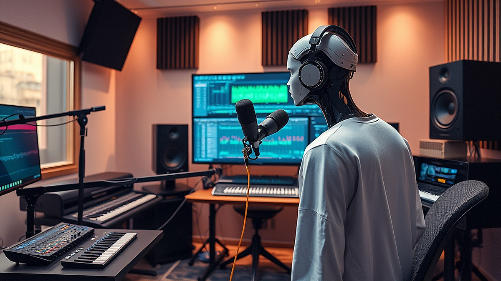

# 침실 프로듀싱의 진화: 2026년형 AI 보컬 변환 도구로 나만의 커버곡 만들기

침실 프로듀싱의 진화는 이제 전문 스튜디오의 문턱을 완전히 낮춰버렸습니다. 2026년형 AI 보컬 변환 도구를 활용하면, 방음 시설 하나 없는 좁은 자취방에서도 프로 엔지니어가 며칠을 매달려야 할 법한 고퀄리티 커버곡을 단 몇 시간 만에 완성할 수 있습니다. 과거에는 고가의 마이크와 프리앰프, 그리고 수년의 믹싱 기술이 필수였지만, 이제는 내 목소리를 녹음한 뒤 AI 모델을 입히는 방식이 대세가 되었습니다. 음악적 재능은 있지만 전문 장비가 없어 고민하던 이들에게 지금 이 기술은 가장 현실적인 돌파구입니다. 오늘 이 글에서는 거창한 이론 대신, 당장 오늘 밤 당신의 노트북으로 실행할 수 있는 실무 가이드를 공유하겠습니다. 다만, 이 기술은 마법이 아닙니다. 원본 소스의 상태가 나쁘면 결과물도 형편없다는 사실을 먼저 인지해야 합니다. 저음역대가 벙벙거리거나 주변 소음이 섞인 녹음본은 아무리 좋은 AI 모델을 써도 인공적인 노이즈만 키울 뿐입니다. 시작 전, 당신의 마이크가 최소한 스마트폰 번들 이어폰보다는 나은지, 그리고 조용한 환경을 확보했는지부터 점검하십시오.

## 첫 번째 단계: AI 보컬 변환을 위한 최적의 소스 녹음법

AI 보컬 변환의 핵심은 '깨끗한 드라이 소스'입니다. 많은 입문자가 스마트폰 기본 녹음 앱으로 대충 녹음한 뒤 변환이 왜 어색한지 의문을 갖습니다. AI는 당신의 목소리 파형을 분석해 새로운 음색으로 덧씌우는 구조인데, 이때 배경에 TV 소리나 에어컨 바람 소리가 섞여 있으면 AI는 그 소음까지 음악의 일부로 인식해 왜곡된 금속성 소리를 만들어냅니다.

실전 체크리스트를 확인해 보십시오. 첫째, 마이크와 입 사이의 거리는 주먹 하나 반 정도를 유지하세요. 둘째, 팝 필터가 없다면 얇은 천이나 스타킹을 마이크 앞에 덧대어 파열음(ㅍ, ㅌ, ㅂ 발음)을 걸러내야 합니다. 셋째, 녹음 시에는 반드시 이어폰을 끼고 반주를 들으세요. 스피커로 반주를 틀어놓고 녹음하면 마이크가 반주 소리까지 함께 수집하게 되며, 이는 나중에 보컬 추출을 불가능하게 만드는 주범입니다.

실패 사례를 하나 들자면, 제 지인은 옷장 안에서 이불을 뒤집어쓰고 녹음하는 방식을 고집했습니다. 물론 흡음은 잘 되었지만, 너무 과한 흡음으로 인해 목소리의 고음역대가 완전히 죽어버렸고, 결과적으로 AI 변환 후 목소리가 답답하게 들리는 결과가 나왔습니다. 선택 기준은 명확합니다. '최대한 건조한(Dry) 소리'를 얻는 것이지, '최대한 소음을 차단하는 것'이 아닙니다. 자연스러운 잔향은 나중에 소프트웨어로 얼마든지 추가할 수 있으니, 녹음 단계에서는 무조건 소리를 말려버린다는 생각으로 진행하십시오.

## 두 번째 단계: 변환 도구 선택과 하드웨어 사양 체크

현재 시장에는 웹 기반의 클라우드 서비스와 로컬 설치형 프로그램이 혼재해 있습니다. 웹 기반 서비스는 별도의 고사양 PC가 필요 없다는 장점이 있지만, 긴 곡을 작업할 때마다 비용을 결제해야 한다는 단점이 있습니다. 반면 로컬 설치형은 초기 구축 비용이 들지만, 한 번 세팅하면 추가 비용 없이 무제한으로 작업이 가능합니다.

당신의 상황이 '예산이 한정된 대학생'이라면 무료 오픈소스 로컬 툴을 추천합니다. 하지만 '빠른 작업 속도가 중요한 프리랜서'라면 월 구독료를 내더라도 서버 성능이 좋은 클라우드 서비스를 선택하는 것이 정신 건강에 좋습니다. 하드웨어 사양을 점검할 때는 그래픽카드의 VRAM 용량을 확인하십시오. AI 연산은 CPU보다 GPU의 의존도가 압도적으로 높습니다. 최소 8GB 이상의 VRAM을 갖춘 그래픽카드가 없다면, 로컬 작업 시 곡 하나를 변환하는 데 30분 이상이 소요될 수 있습니다.

실수하기 쉬운 부분은 '모델 학습'에 대한 욕심입니다. 특정 가수의 목소리를 완벽하게 복제하겠다며 수백 개의 샘플을 학습시키려 하지 마십시오. 오히려 잘 정제된 5분 미만의 고음질 데이터셋 하나가 1시간짜리 저음질 데이터셋보다 훨씬 깨끗한 결과물을 냅니다. 선택 기준은 '범용성'입니다. 특정 곡에만 최적화된 모델보다는, 다양한 장르를 소화할 수 있도록 중음역대가 탄탄하게 학습된 범용 모델을 먼저 적용해 보십시오.

## 세 번째 단계: 믹싱과 마스터링으로 생명력 불어넣기

AI로 변환된 보컬은 대개 너무 정갈해서 기계적인 느낌을 줍니다. 이를 해결하는 방법은 '레이어링'입니다. 변환된 보컬 트랙 아래에 아주 작은 볼륨으로 당신의 원본 보컬을 10~15% 정도 섞어보십시오. 이렇게 하면 AI가 놓친 미세한 호흡과 감정선이 살아나며 훨씬 인간적인 소리가 납니다.

또한, AI 보컬은 고음역대가 지나치게 강조되는 경향이 있습니다. EQ(이퀄라이저)를 통해 5kHz 이상의 대역을 아주 살짝 깎아주기만 해도 귀가 피로하지 않은 편안한 소리가 됩니다. 여기에 약간의 리버브와 딜레이를 추가하면, 침실에서 만든 소리가 마치 전문 스튜디오에서 녹음한 듯한 공간감을 갖게 됩니다. 

실패 케이스로 가장 흔한 것은 '과도한 보정'입니다. 오토튠을 과하게 걸어 목소리가 로봇처럼 들리는 것을 넘어, AI 변환 후 다시 튠을 걸어 음정이 꼬이는 경우가 많습니다. 반드시 '변환 전'에 음정을 완벽하게 맞추고, '변환 후'에는 가급적 튠을 자제하십시오. 그래야 AI가 고유의 음색을 유지한 채 자연스럽게 노래합니다. 

## 실전 체크리스트 및 요약

오늘 당장 시작하기 위해 아래 세 가지만 기억하십시오. 첫째, 녹음 시 불필요한 소음 제거를 위해 마이크와 입의 거리를 일정하게 유지했는가? 둘째, 작업 환경에 맞는 로컬 툴 혹은 클라우드 툴을 선택했는가? 셋째, 변환된 보컬에 원본 소스를 살짝 섞어 인간미를 더했는가? 이 세 가지만 지켜도 당신의 커버곡은 아마추어의 습작 수준을 넘어설 것입니다.

기술은 도구일 뿐입니다. 가장 중요한 것은 변환된 목소리 뒤에 숨겨진 당신의 음악적 해석입니다. AI가 당신의 목소리를 대신 빌려 노래할 수는 있지만, 그 곡에 담긴 감정의 밀도까지 만들어내지는 못합니다. 오늘 저녁, 당신이 가장 좋아하는 곡의 가사를 다시 읽어보고, 그 감정을 AI 도구에 실어보십시오. 침실 프로듀싱의 진화는 당신이 기술을 얼마나 잘 다루느냐가 아니라, 그 기술을 통해 어떤 이야기를 전달하느냐에 달려 있습니다. 지금 바로 당신의 목소리를 녹음하는 것부터 시작해 보시기 바랍니다.

## 마치며

이제 AI 보컬 변환 기술은 누구나 자신의 침실에서 스튜디오급 사운드를 구현할 수 있는 시대를 열었습니다. 기술적인 정교함도 중요하지만, 결국 청중의 마음을 움직이는 것은 AI라는 도구를 통해 투영된 여러분만의 고유한 음악적 감수성과 해석이라는 점을 잊지 마세요. 

오늘 알려드린 체크리스트를 바탕으로, 지금 바로 마이크 앞에 앉아보시는 건 어떨까요? 완벽한 결과물을 만들어야 한다는 부담감은 잠시 내려놓고, 평소 즐겨 부르던 노래에 새로운 목소리를 입히는 즐거움을 먼저 경험해 보시길 바랍니다. 작은 시도가 쌓여 여러분만의 독창적인 음악 세계가 완성될 것입니다.

여러분의 첫 커버곡은 어떤 곡이 될지 정말 궁금하네요. 작업하시다가 궁금한 점이 있다면 언제든 댓글로 공유해 주세요. 기술이 주는 편리함을 마음껏 누리며, 오늘 저녁 여러분만의 멋진 목소리를 세상에 들려주세요! 여러분의 음악 여정을 진심으로 응원합니다.
