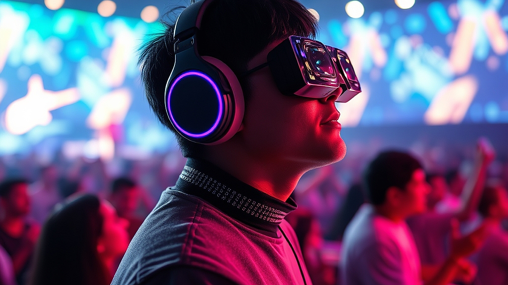

# 페스티벌의 진화: 2026년, 음악보다 '경험'이 중요한 이유

뮤직페스티벌은 이제 단순히 좋아하는 가수의 라이브를 듣기 위해 모이는 장소가 아닙니다. 2026년의 페스티벌 현장은 음악이라는 콘텐츠를 매개로 한 거대한 복합 문화 체험 공간으로 변모했습니다. 티켓 가격이 수십만 원을 호가하는 상황에서, 단순히 라인업만 보고 예매 버튼을 눌렀다가는 현장에서 뙤약볕 아래 줄만 서다 끝나는 낭패를 보기 십상입니다. 이제 관객은 '음악을 들으러 가는 사람'이 아니라 '브랜드와 공간이 설계한 서사를 소비하러 가는 사람'이 되었습니다. 주최 측은 F&B 팝업스토어, 굿즈 커스터마이징, 브랜드 부스 체험 등 음악 외적인 요소에 더 많은 공을 들입니다. 결국 관객이 치러야 할 비싼 티켓값은 음악 공연권뿐만 아니라, 그 공간에서 누릴 수 있는 편의성과 콘텐츠 이용권에 대한 대가인 셈입니다. 우리가 페스티벌을 선택할 때 무대 배치도보다 먼저 살펴봐야 할 것이 '나의 성향에 맞는 경험의 밀도'인 이유가 여기에 있습니다. 오늘 글에서는 페스티벌의 가격이 아깝지 않도록, 내 취향과 체력에 맞는 축제를 고르는 현실적인 기준과 실전 전략을 정리해 드립니다.

## 음악 취향보다 중요한 것은 '체류 환경'의 설계

페스티벌의 티켓값은 공연의 퀄리티와 비례하지만, 만족도는 체류 환경에서 결정됩니다. 라인업이 아무리 화려해도 이동 동선이 꼬여 있거나 쉴 곳이 부족한 페스티벌은 실패한 경험으로 남습니다. 내가 지불한 비용이 아깝지 않으려면, 공연을 보는 시간보다 공연 사이에 머무는 시간을 어떻게 보낼지부터 계획해야 합니다.

실패하는 케이스는 명확합니다. 가장 보고 싶은 가수의 공연 시간만 확인하고, 그 외의 시간에는 아무런 계획 없이 인파 속에 방치되는 경우입니다. 이럴 경우 극심한 피로감 때문에 정작 메인 공연을 즐길 체력이 남지 않습니다. 반면, 성공적인 관람객은 페스티벌 홈페이지의 맵(Map)을 먼저 확인합니다. 식음료 구역이 무대와 얼마나 가까운지, 그늘막이나 의자가 배치된 휴식 공간이 충분한지, 화장실 이동 동선이 꼬이지 않는지 확인하는 것이죠.

선택을 위한 실전 기준은 '나의 에너지 소모 지수'입니다. 평소 체력이 약하거나 인파 속에서 쉽게 지친다면, 무대 수가 적고 휴식 공간이 확보된 중소형 페스티벌이 적합합니다. 반대로 모든 무대를 옮겨 다니며 에너지를 쏟고 싶다면, 대형 페스티벌의 '패스트 트랙'이나 '라운지 입장권'이 포함된 티켓을 구매하는 것이 비용 대비 만족도를 높이는 길입니다. 

*   실전 체크리스트:
    *   공연 시작 전 최소 30분은 휴식 공간에 머물 수 있는 동선인가?
    *   F&B 구역이 메인 무대와 너무 멀어 식사 때마다 공연을 포기해야 하는 구조인가?
    *   브랜드 부스 체험이 대기 시간 30분을 넘기지 않을 정도로 충분한 인원을 수용하는가?

## F&B와 굿즈, 단순한 부대시설이 아닌 '필수 콘텐츠'

요즘 페스티벌에서 F&B는 단순한 배를 채우는 수단이 아닙니다. 유명 맛집과의 협업, 페스티벌 한정 메뉴는 그날 하루를 기억하게 하는 핵심 콘텐츠입니다. 2026년의 페스티벌 마케팅은 특정 브랜드가 공간 전체의 톤앤매너를 결정짓는 식으로 진화했습니다. 특정 음료 브랜드가 운영하는 라운지에서만 제공되는 휴식 서비스나, 아티스트와 협업한 굿즈를 구매하기 위해 줄을 서는 과정 자체가 하나의 놀이 문화가 되었습니다.

여기서 주의할 점은 '보여주기식 콘텐츠'에 매몰되지 않는 것입니다. 브랜드 부스에서 제공하는 경품이나 굿즈가 내 취향과 상관없다면, 그것은 시간 낭비일 뿐입니다. 예를 들어, 야외 활동이 많은 페스티벌에서 무거운 기념품을 주는 부스는 오히려 짐이 됩니다. 

선택 기준은 '나의 페스티벌 루틴'에 부합하는가입니다. 만약 당신이 굿즈를 모으는 것을 즐긴다면, 현장 사전 예약이 가능한 페스티벌을 선택하세요. 반대로 음악 감상에만 집중하고 싶다면, 브랜드 체험 부스가 적고 음악 사운드 시스템에 투자한 페스티벌을 찾는 것이 현명합니다. 실패하는 사례는 현장에 도착해서야 부스 줄을 보고 호기심에 합류했다가 정작 보고 싶었던 밴드의 공연을 놓치는 경우입니다. 

*   선택을 위한 기준:
    *   관심 있는 브랜드가 참여하는가? (그렇다면 해당 부스 오픈 시간을 미리 확인)
    *   굿즈가 실용적인가? (페스티벌 현장에서 바로 사용할 수 있는 아이템인지 확인)
    *   결제 시스템이 간편한가? (모바일 결제나 전용 팔찌 시스템이 있는지 확인)

## 공연 마케팅의 함정, '라인업'에 속지 않는 법

페스티벌의 라인업은 가장 강력한 마케팅 도구입니다. 하지만 헤드라이너 한 명을 보기 위해 8시간을 기다리는 것은 가성비 측면에서 최악의 선택입니다. 페스티벌의 가치는 그날의 '분위기'와 '사운드 퀄리티'에서 옵니다. 2026년 현재, 페스티벌을 선택할 때 가장 먼저 고려해야 할 것은 아티스트의 이름값이 아니라, 해당 페스티벌이 매년 유지해온 '장르적 일관성'입니다.

매년 출연진이 180도 바뀌는 페스티벌은 브랜딩이 불안정할 가능성이 큽니다. 반대로 특정 장르나 특정 감성을 고집하는 페스티벌은 관객층이 겹치기 때문에 현장의 분위기가 훨씬 안정적입니다. 이는 곧 공연 만족도로 이어집니다. 

실패하는 케이스는 인스타그램의 화려한 홍보 영상만 보고 티켓을 예매하는 것입니다. 영상 속의 모습과 실제 현장의 사운드 시스템은 다를 수 있습니다. 확인이 가능하다면, 이전 회차의 관객 후기 중 '음향'과 '진행'에 대한 불만이 없는지 찾아보세요. 사운드가 뭉개지는 페스티벌은 아무리 유명한 가수가 와도 감동을 줄 수 없습니다.

*   실전 판단 기준:
    *   이전 회차의 음향 사고나 진행 미숙에 대한 후기가 있는가?
    *   내가 좋아하는 아티스트 외에 최소 3팀 이상의 다른 아티스트를 알고 있는가? (절반 이상 모른다면 티켓값의 효용이 낮아집니다)
    *   공연 타임테이블이 유기적으로 연결되어 있는가? (장르가 너무 널뛰면 분위기가 깨질 수 있습니다)

## 결론: 당신의 페스티벌을 완성하는 것은 '주도권'

페스티벌은 주최 측이 짜놓은 판 위에서 노는 것이지만, 그 판을 얼마나 영리하게 활용할지는 관객의 몫입니다. 비싼 티켓값이 아깝지 않으려면 음악에만 매몰되지 말고, 현장의 F&B, 브랜드 체험, 그리고 나만의 휴식 루틴을 입체적으로 설계해야 합니다. 

결국 좋은 페스티벌은 '내가 통제할 수 있는 경험'을 제공하는 곳입니다. 오늘 당장 페스티벌을 예매하기 전, 홈페이지의 맵과 타임테이블, 그리고 부스 정보를 꼼꼼히 대조해 보세요. 내가 보고 싶은 무대 사이의 빈 시간을 무엇으로 채울지 구체적으로 계획이 서지 않는다면, 그 페스티벌은 당신에게 즐거움보다는 피로를 줄 가능성이 높습니다. 

음악은 페스티벌의 심장이지만, 그 심장을 뛰게 하는 것은 관객인 당신의 능동적인 선택입니다. 올해 가을, 당신의 취향과 체력에 맞는 축제를 선택하여 음악 이상의 경험을 직접 설계해 보시길 바랍니다. 준비된 관객만이 페스티벌의 진정한 주인공이 될 수 있습니다.

결국 2026년의 페스티벌은 단순히 음악을 듣는 자리를 넘어, 나만의 취향과 경험을 능동적으로 디자인하는 '플레이그라운드'가 될 것입니다. 라인업에만 의존하던 과거의 관람 방식에서 벗어나, 현장의 모든 요소를 영리하게 활용할 때 비로소 진정한 즐거움을 만끽할 수 있습니다. 

이제 여러분의 차례입니다. 다가오는 축제 시즌, 단순히 티켓을 구매하는 것에 그치지 말고 홈페이지의 맵과 타임테이블을 미리 꼼꼼히 살펴보세요. 좋아하는 아티스트의 공연 사이, 어떤 브랜드 부스에서 시간을 보낼지 혹은 어디서 편안한 휴식을 취할지 미리 설계해 보는 것만으로도 페스티벌의 질은 완전히 달라질 것입니다. 

음악은 페스티벌의 심장이지만, 그 심장을 뛰게 하는 주인공은 바로 준비된 관객인 여러분입니다. 올가을, 여러분의 취향과 체력에 딱 맞는 완벽한 페스티벌 루틴을 직접 설계해 보세요. 단순히 음악을 듣고 오는 것을 넘어, 오직 나만이 경험할 수 있는 특별한 추억을 만들어 보시길 응원합니다. 지금 바로, 여러분만의 축제를 계획해 보세요!
