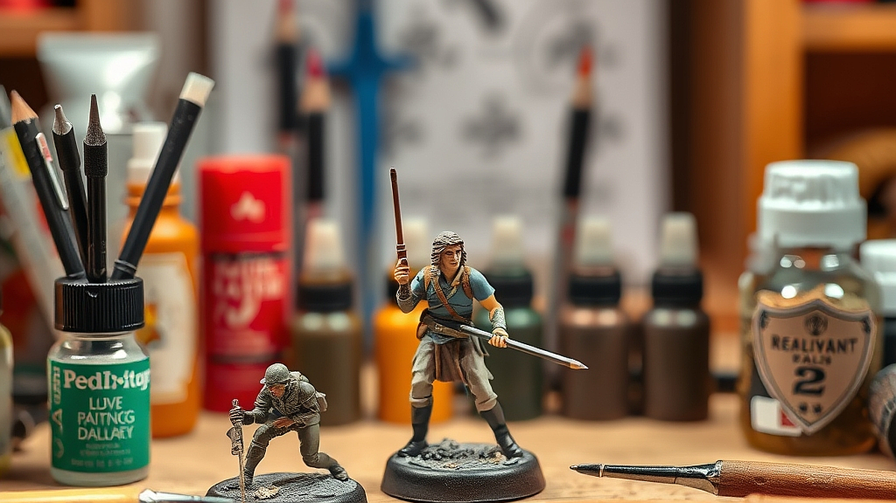

피규어 도색, 똥손도 가능한 2026년형 입문 툴 가이드를 찾고 계신가요? 30대 중반, 퇴근 후 좁은 책상 위에서 나만의 캐릭터를 완성하고 싶지만, 콤프레셔 소음과 신너 냄새 때문에 시작조차 못 했던 분들이라면 지금이 적기입니다. 예전에는 도색을 하려면 환기 시설이 완비된 작업실을 빌리거나, 거실을 점령할 만큼 큰 장비를 들여야 했습니다. 하지만 2026년 현재, 개인의 작업 환경은 극도로 간소화되었습니다.

이제는 고가의 에어브러시 시스템 없이도, 손떨림을 보정해주는 정밀 펜슬형 도구와 냄새 없는 수성 마커, 그리고 건조 시간을 획기적으로 줄여주는 소형 UV 큐어링 박스만 있으면 충분합니다. 거창한 예술 작품을 만드는 것이 아니라, 내가 좋아하는 캐릭터의 눈매를 다듬거나 밋밋한 무기 파츠에 금속 질감을 입히는 '부분 도색'부터 시작하는 것이 핵심입니다. 이 글에서는 똥손이라는 자책을 멈추고, 최소한의 비용과 공간으로 나만의 피규어를 업그레이드할 수 있는 실전 가이드를 제시합니다. 완벽함보다는 '어제보다 나은 결과물'에 집중하는 지금의 취미 트렌드를 따라, 여러분의 책상 위를 작은 공방으로 바꿔보겠습니다.

## 1. 공간과 비용을 줄이는 시작점: 무선 충전식 도구의 활용

과거의 도색 입문이 '장비병'으로 이어졌던 이유는 유선 콤프레셔와 에어브러시 세트 때문이었습니다. 하지만 요즘은 펜슬 타입의 무선 무선 도색 툴이 대세입니다. 이는 좁은 원룸이나 거실 한구석에서도 충분히 사용 가능하며, 전원 선에서 자유롭다는 것이 가장 큰 장점입니다. 

선택 기준은 명확합니다. 분사 압력이 너무 강하면 초보자는 피규어 표면을 망치기 일쑤입니다. 따라서 압력 조절이 3단계 이상 가능하고, 노즐 구경이 0.3mm 이하인 모델을 고르세요. 구경이 작을수록 세밀한 포인트 도색이 유리합니다.

*   **실전 예시:** 10cm 크기의 애니메이션 피규어 얼굴에 홍조를 넣거나, 칼날 파츠에 그라데이션을 줄 때 무선 펜슬형 툴을 사용합니다. 
*   **실패 케이스:** 처음부터 전체 도색을 하겠다며 저가형 붓 세트만 잔뜩 구매하는 경우입니다. 붓 도색은 난이도가 높고 붓 자국이 남기 쉬워 금방 흥미를 잃게 됩니다.
*   **선택 기준:** 1회 충전 시 최소 40분 이상 연속 사용이 가능한지, 그리고 부품 세척 시 별도의 공구 없이 노즐 분해가 가능한지를 확인하세요. 이 두 가지만 충족해도 90%의 입문자가 겪는 장비 스트레스를 피할 수 있습니다.

## 2. 핵심 기준: 마커와 에나멜, 무엇을 선택할 것인가

도료 선택에서 고민하는 이유는 '독성'과 '난이도' 때문입니다. 2026년 현재는 냄새가 거의 나지 않는 수성 아크릴 마커와 에나멜 워싱액의 조합이 가장 효율적입니다. 

마커는 붓질의 번거로움을 없애줍니다. 특히 금속 질감을 내는 크롬 마커는 똥손이라도 한 번만 슥 그으면 전문가 수준의 광택을 낼 수 있습니다. 반면, 피규어의 틈새에 그림자를 넣는 '먹선 작업'에는 에나멜 워싱액이 필수입니다. 

### 실전 체크리스트: 도색 전 반드시 확인해야 할 3가지
1. **표면 세척:** 피규어 표면에 묻은 미세한 유분기를 주방 세제로 가볍게 닦아내고 완전히 말렸는가? (이것만 해도 도료의 밀착력이 2배 이상 올라갑니다.)
2. **서페이서 생략 여부:** 완전 도색이 아니라 부분 도색이라면, 서페이서(밑색) 작업 없이 바로 도료를 올려도 되는지 테스트 파츠에 확인했는가?
3. **마감재 준비:** 도색 후 변색을 막기 위한 UV 차단 무광 마감재 스프레이가 준비되었는가?

실패를 줄이는 방법은 '한 번에 끝내려 하지 않는 것'입니다. 얇게 세 번 덧바르는 것이 한 번에 두껍게 칠하는 것보다 훨씬 결과물이 깔끔합니다. 만약 실수했다면, 즉시 전용 신너를 면봉에 묻혀 닦아내면 됩니다. 신너는 플라스틱을 녹이지 않는 '에나멜 전용'인지 반드시 확인해야 합니다.

## 3. 커뮤니티와 도구의 결합: 2026년형 취미 소비 방식

지금의 키덜트 문화는 '완성품을 전시하는 것'에서 '나만의 디테일을 추가하는 것'으로 이동했습니다. 단순히 비싼 피규어를 사는 것을 넘어, 내가 직접 도색한 파츠를 SNS에 공유하고 피드백을 받는 과정 자체가 취미의 일부가 되었습니다.

이때 중요한 것은 커뮤니티의 활용입니다. 카페나 오픈 채팅방에서 '도색 질문'을 할 때는 반드시 자신이 사용한 도료의 브랜드와 피규어 재질(PVC인지 ABS인지)을 밝히세요. 그래야 정확한 조언을 얻을 수 있습니다. 

*   **실전 예시:** 특정 캐릭터의 눈동자 도색이 어렵다면, 무리하게 붓을 쓰지 말고 '습식 데칼'을 활용해 보세요. 요즘은 3D 프린터로 출력한 커스텀 데칼을 온라인에서 쉽게 구할 수 있어, 똥손도 완벽한 눈매를 가질 수 있습니다.
*   **실패 케이스:** 유명인의 작업 방식만을 따라 하려다 자신의 작업 환경과 맞지 않는 고가의 도료를 대량 구매하는 경우입니다. 도료는 휘발성이 강하므로 적은 양을 자주 사는 것이 경제적입니다.
*   **선택 기준:** 내 작업 공간에 환풍기가 없다면 반드시 '수성 도료' 위주로 구성하세요. 유성 도료는 건강에 치명적이며, 냄새 때문에 가족이나 동거인의 반대에 부딪히기 쉽습니다.

## 결론: 당신의 책상을 작은 공방으로 만드는 법

피규어 도색은 더 이상 전문가의 영역이 아닙니다. 지금 이 글을 읽고 나서 해야 할 일은 복잡한 장비를 검색하는 것이 아니라, 집에 있는 가장 저렴한 피규어 하나를 꺼내어 '부분 도색'을 시도해보는 것입니다. 

핵심은 세 가지입니다. 첫째, 환기가 필요 없는 수성 도료와 마커를 활용할 것. 둘째, 0.3mm 노즐의 무선 펜슬 툴로 시작의 문턱을 낮출 것. 셋째, 완벽을 기하기보다 '먹선 넣기'나 '질감 표현' 같은 작은 디테일 하나에 만족할 것. 

도색은 결과물보다 그 과정에서 얻는 몰입감이 더 큰 취미입니다. 실패를 두려워하지 마세요. 도색은 언제든 지우고 다시 시작할 수 있는 유연한 작업입니다. 지금 바로 온라인 몰에서 기본 마커 세트 하나를 장바구니에 담아보세요. 여러분의 책상 위, 그 작은 공간에서 새로운 세계가 시작될 것입니다. 오늘 저녁, 작은 붓질 하나로 당신의 피규어에 생명력을 불어넣어 보시길 바랍니다.

## 결론: 당신의 책상을 작은 공방으로 만드는 법

피규어 도색은 더 이상 전문가만의 전유물이 아닙니다. 핵심은 거창한 장비가 아니라 시작의 문턱을 낮추는 것입니다. 냄새 없는 수성 도료와 간편한 마커, 그리고 다루기 쉬운 무선 펜슬 툴만 있다면 누구나 충분히 즐길 수 있습니다. 처음부터 완벽을 쫓기보다 먹선 넣기나 작은 질감 표현부터 가볍게 시작해보세요. 결과물에 대한 부담을 내려놓고 몰입의 즐거움을 느끼는 것, 그것이 도색의 진짜 매력입니다.

혹시 망치면 어쩌나 고민되시나요? 걱정 마세요. 도색은 언제든 지우고 다시 시작할 수 있는 유연한 취미입니다. 지금 바로 온라인 몰에서 기본 마커 세트 하나를 장바구니에 담아보는 건 어떨까요? 여러분의 책상 위, 그 작은 공간에서 새로운 세계가 펼쳐질 것입니다. 오늘 저녁, 가벼운 마음으로 붓을 들어 당신만의 피규어에 생명력을 불어넣어 보세요. 당신의 첫 번째 작품을 응원합니다!
