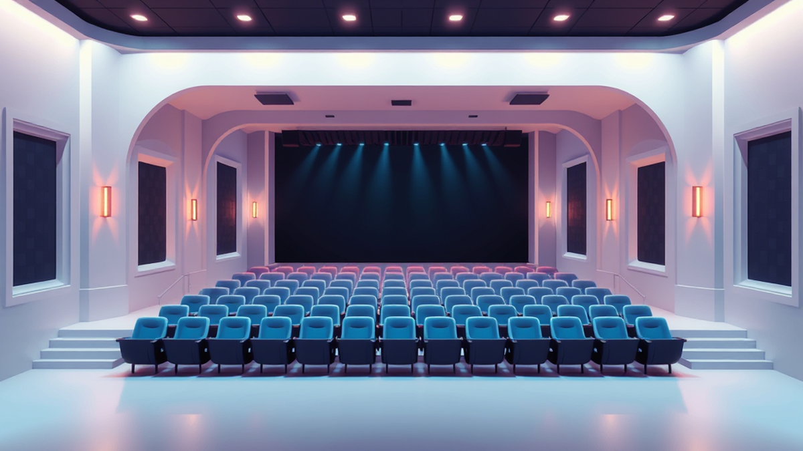

안녕하세요, 여러분! 40대 키덜트 수집가, 쭌입니다. 제 방 한쪽 벽면을 빼곡히 채운 피규어들과 레고 박스들을 볼 때마다 흐뭇한 미소를 짓곤 하는데요, 어릴 적 TV 만화에서 보던 로봇을 실제로 조립하고, 게임 속 캐릭터를 손에 쥐는 그 짜릿함은 정말이지 말로 다 할 수 없죠. 그렇게 저만의 작은 세계를 모으고 가꾸는 재미에 푹 빠져 살던 제가 최근에는 새로운 '수집'의 매력에 눈을 떴으니, 바로 **뮤지컬 관람**입니다. 처음에는 단순히 호기심에 한두 번 보러 갔다가, 무대 위 배우들의 열정과 생생한 라이브 음악, 그리고 화려한 퍼포먼스에 완전히 매료되어 버렸지 뭐예요? 마치 어릴 적 동네 극장에서 처음으로 <스타워즈>를 봤을 때의 그 충격과 감동이 되살아나는 기분이었달까요. 손때 묻은 피규어들이 저에게 추억을 선물한다면, 뮤지컬은 매번 새로운 감동과 경험을 '수집'하게 해주는 보물 같은 존재가 되었답니다.

하지만 막상 첫 뮤지컬 관람을 앞두고는 어디서부터 시작해야 할지 막막한 분들이 많으실 거예요. 저도 그랬거든요. 좋은 자리에서 보고 싶은데 어떤 자리가 좋은 건지, 예매는 언제 해야 하는지, 할인 팁은 없는지 등등 궁금한 게 한두 가지가 아니었죠. 마치 처음으로 한정판 피규어를 구하려고 정보의 바다를 헤매던 그때처럼 말이죠! 그래서 오늘은 저처럼 뮤지컬의 매력에 푹 빠지고 싶은 여러분을 위해, 제가 그동안 발품 팔며 얻은 **뮤지컬 예매 팁과 좌석 추천 가이드**를 아낌없이 풀어놓으려고 합니다. 2025년 최신 트렌드까지 싹 다 정리해 드릴 테니, 이 글만 잘 따라오시면 여러분의 첫 뮤지컬 관람, 분명 성공적으로 즐기실 수 있을 겁니다. 자, 그럼 저와 함께 뮤지컬 세계로 떠나볼까요?

## 첫 뮤지컬, 이거 하나만 기억해! 예매 성공의 첫걸음

뮤지컬 예매, 얼핏 보면 복잡해 보이지만 몇 가지 핵심만 알면 생각보다 쉽습니다. 제가 처음으로 한정판 레고 세트를 구하려고 할 때, 판매처별로 가격 비교하고, 발매일 알림 설정하고, 커뮤니티에서 정보 얻고 했던 것처럼, 뮤지컬도 비슷해요. 미리미리 준비하고 정보를 모으는 게 중요하죠.

가장 먼저 중요한 건 **예매 시기**입니다. 대부분의 대극장 뮤지컬은 보통 공연 시작 2~3개월 전에 1차 티켓 오픈을 합니다. 이때가 바로 '조기 예매 할인'을 노릴 수 있는 황금 같은 기회죠. 보통 10~20% 정도 할인이 되는데, 이게 무시할 수 없는 금액이에요. 저는 예전에 정말 보고 싶었던 작품이 있었는데, "에이, 나중에 예매하지 뭐" 하고 미루다가 조기 예매 할인을 놓쳐서 땅을 치고 후회한 적이 있습니다. 마치 한정판 피규어 선주문 기간을 놓쳐서 웃돈 주고 사야 했던 그때처럼요! 그러니 보고 싶은 작품이 있다면, 공연 스케줄이 뜨는 순간부터 예의주시하는 게 좋습니다. 2025년에는 특히 인기 작품의 경우 티켓 오픈과 동시에 매진되는 경우가 많으니, 달력에 미리 알림을 설정해 두는 센스! 잊지 마세요.

다음은 **어디서 예매할지**입니다. 국내 주요 예매처로는 **인터파크 티켓, 티켓링크, 멜론티켓, 예스24 티켓** 등이 있습니다. 각 예매처마다 보유하고 있는 좌석 블록이 다를 수 있고, 특정 카드사 제휴 할인이나 이벤트가 다를 수 있으니, 여러 곳을 비교해 보는 것이 좋아요. 저는 주로 인터파크를 이용하지만, 가끔 다른 예매처에서만 단독으로 진행하는 할인이나 좋은 좌석이 풀리는 경우도 있어서 꼭 여러 군데를 훑어봅니다. 요즘은 **공연 제작사 자체 예매 사이트**에서도 예매를 받는 경우가 늘고 있는데, 이곳에서만 제공하는 특별한 혜택(예: MD 증정, 캐스팅 보드 증정 등)이 있을 수 있으니 이것도 체크해 보세요.

그리고 **할인 혜택**은 절대 놓치지 말아야 할 부분입니다. 조기 예매 할인 외에도 **재관람 할인** (이전 공연 티켓 소지자), **학생 할인**, **복지 할인**, **문화누리 카드 할인**, **제휴 카드 할인** 등 정말 다양해요. 특히 2025년에는 MZ세대를 겨냥한 **'청년 할인'**이나 특정 요일/시간대 한정 **'타임 세일'** 같은 파격적인 할인도 늘어나는 추세이니, 예매 전에 꼭 꼼꼼히 확인해 보세요. 저는 한때 재관람 할인을 받으려고 이전 티켓을 모아두는 '티켓 컬렉터'가 되기도 했답니다. 이것도 일종의 수집의 재미랄까요? 혹시 예매에 실패했더라도 실망하지 마세요! 공연 임박해서 **'취소표'**가 풀리는 경우가 꽤 많습니다. 예매처마다 '취소표 알림' 기능을 제공하는 곳도 있고, 공연 당일 현장 판매분이나 대기표를 노려볼 수도 있으니, 마지막까지 희망을 놓지 마세요. 2025년에는 스마트폰 앱을 통한 실시간 취소표 알림 서비스가 더욱 고도화될 예정이니, 적극 활용해 보시길 바랍니다.

## 내 취향은 어디? 좌석별 장단점 심층 분석

뮤지컬 좌석을 고르는 건 마치 피규어를 어떤 각도에서 전시할지 결정하는 것과 비슷해요. 어떤 각도에서 보느냐에 따라 작품의 느낌이 확 달라지거든요. 비싼 돈 주고 갔는데 시야가 가리거나 기대 이하면 속상하잖아요? 그래서 제가 직접 경험하며 얻은 좌석별 꿀팁을 대방출합니다!

가장 먼저, 무대와 가장 가까운 **OP석(오케스트라 피트석)이나 1열**은 배우들의 표정 연기, 땀방울, 그리고 생생한 에너지를 오롯이 느낄 수 있는 최고의 자리입니다. 특히 배우 덕질을 하는 분들이라면 이만한 자리가 없죠. 저도 좋아하는 배우가 출연하는 공연을 볼 때는 무리해서라도 OP석을 노리곤 했습니다. 배우와 눈이 마주치는 순간, 마치 제가 그들의 이야기에 직접 참여하는 듯한 착각에 빠지기도 하죠. 하지만 단점도 명확합니다. 무대가 너무 가까워서 목이 아플 수 있고, 때로는 무대 바닥이나 일부 소품이 시야를 가릴 수 있다는 점, 그리고 가격이 가장 비싸다는 점을 고려해야 합니다.

다음으로 가장 많은 사람들이 선호하는 **중앙 블록 5~10열**은 일명 '황금 좌석'이라고 불립니다. 이 구역은 무대 전체를 한눈에 조망할 수 있으면서도 배우들의 디테일한 연기까지 놓치지 않을 수 있는 최적의 위치예요. 음향도 가장 균형 잡히게 들리는 편이라 작품의 몰입도를 최고조로 끌어올릴 수 있습니다. 저도 첫 뮤지컬 관람 때는 무조건 이 자리를 추천해요. 작품 전체의 흐름과 앙상블의 군무, 그리고 무대 연출의 웅장함을 제대로 느낄 수 있거든요. 다만, 인기가 많은 만큼 티켓 오픈과 동시에 빠르게 매진되는 경향이 있으니, 예매 전쟁에서 승리해야 하는 부담이 있습니다.

예산에 맞춰 합리적인 선택을 하고 싶다면 **사이드 블록 앞쪽이나 2층 1열**도 좋은 대안이 될 수 있습니다. 사이드 블록은 중앙 블록보다 가격이 저렴하면서도 무대 측면의 디테일을 볼 수 있는 매력이 있어요. 물론 약간의 시야 제한이 있을 수 있지만, 2025년 최신 극장들은 이런 단점을 보완하기 위해 설계 단계부터 신경을 많이 쓰고 있습니다. 2층 1열은 무대 전체를 한눈에 내려다볼 수 있어서 군무나 대규모 연출이 돋보이는 작품에 특히 좋습니다. 마치 드론으로 촬영한 영상처럼 전체적인 그림을 감상할 수 있죠. 저도 가끔은 웅장한 무대 연출을 온전히 느끼고 싶을 때 2층 1열을 선택하곤 합니다.

마지막으로 **3층이나 가장자리 좌석**은 비교적 저렴한 가격으로 뮤지컬을 즐길 수 있는 가성비 좋은 선택입니다. 물론 배우들의 표정 연기나 섬세한 디테일을 놓칠 수도 있지만, 작품의 분위기와 넘버(뮤지컬 곡)를 감상하기에는 전혀 부족함이 없습니다. 오히려 부담 없이 뮤지컬을 경험해 보고 싶은 첫 관람객에게는 좋은 선택이 될 수 있어요. 요즘은 **온라인 3D 좌석뷰**를 제공하는 예매처가 많으니, 예매 전에 꼭 활용해서 실제 시야를 가늠해 보는 것을 추천합니다. 그리고 유튜브나 블로그에 올라온 **'좌석별 후기 영상'**들도 참고하면 큰 도움이 될 거예요. 극장마다 구조가 다르니 (예: 샤롯데씨어터는 웅장한 느낌, 블루스퀘어는 개방적인 느낌), 관람하려는 극장의 특징을 미리 파악하는 것도 좋은 팁입니다.

## 알면 쓸모 있는 뮤지컬 관람 실전 팁 & 에티켓

뮤지컬 관람은 단순히 앉아서 보는 것을 넘어, 공연장 안팎에서 지켜야 할 몇 가지 약속들이 있습니다. 마치 제가 소중한 피규어를 전시할 때 먼지 안 쌓이게 관리하고, 만질 때 조심하는 것처럼요. 이런 에티켓을 지키는 것은 다른 관객들과 배우들에 대한 존중이자, 우리 모두가 공연을 더 즐겁게 관람하기 위한 필수 요소입니다.

공연장에 가기 전, 몇 가지 **준비물**을 챙기면 더욱 만족스러운 관람이 될 거예요. 가장 중요한 것은 바로 **오페라글라스(망원경)**입니다. 특히 2층이나 뒷좌석에서 관람할 예정이라면 필수템이라고 할 수 있죠. 배우들의 섬세한 표정 연기나 의상 디테일을 놓치지 않고 볼 수 있게 해줍니다. 요즘은 대형 극장 로비에서 대여해 주기도 하지만, 미리 준비해 가는 것이 좋습니다. 물통이나 간식은 공연장 안으로 반입이 안 되는 경우가 많으니, 로비나 외부에서 미리 해결하고 입장하세요. 그리고 겉옷이나 큰 가방은 물품보관소를 이용하는 것이 좋습니다. 좁은 좌석에서 짐 때문에 불편하면 공연에 집중하기 어렵거든요.

공연장에는 **최소 30분 전에는 도착**하는 것이 좋습니다. 티켓 수령하고, 물품 보관하고, 화장실도 다녀오고, MD(머천다이즈) 부스도 구경하려면 시간이 꽤 걸려요. 저는 항상 공연 시작 1시간 전쯤 도착해서 프로그램북을 사서 미리 읽어보곤 합니다. 작품의 배경이나 등장인물 설명을 읽으면 몰입도가 훨씬 높아지더라고요. 또, 공연 시작 후에는 입장이 제한될 수 있으니 늦지 않도록 주의해야 합니다. 한번은 제가 너무 여유 부리다가 공연 시작 직전에 도착했는데, 하마터면 못 들어갈 뻔한 아찔한 경험도 있었죠. 그때의 식은땀은 아직도 잊히지 않네요.

가장 중요한 **관람 에티켓**은 바로 **휴대폰 사용 금지**입니다. 공연 중에는 휴대폰 전원을 끄거나 비행기 모드로 전환해야 합니다. 작은 불빛 하나도 다른 관객들에게는 큰 방해가 될 수 있고, 배우들에게도 시선이 분산되어 집중력을 흐트러뜨릴 수 있어요. 사진 촬영이나 동영상 녹화는 커튼콜 때만 허용되는 경우가 많으니, 공연 전에 안내 멘트를 잘 듣고 지시에 따라야 합니다. 저는 한 번은 너무 감동해서 저도 모르게 폰을 들 뻔한 적도 있었죠. 다행히 이성을 붙잡았지만요! 옆 사람과의 대화도 삼가고, 박수는 적절한 타이밍에 아낌없이 보내는 것이 좋습니다. 특히 감동적인 넘버가 끝나거나 배우들의 열연이 빛나는 순간에는 우레와 같은 박수를 보내주세요. 공연의 마지막, 배우들이 인사를 할 때는 **기립 박수**로 감동을 표현하는 것도 멋진 에티켓입니다.

공연 관람 후에는 **MD(머천다이즈)** 부스를 그냥 지나치기 어렵죠. 프로그램북, OST 앨범, 엽서, 키링 등 다양한 굿즈들이 여러분의 지갑을 유혹할 겁니다. 저도 좋아하는 작품의 프로그램북이나 OST는 꼭 구매해서 집에 소장하곤 합니다. 이것도 일종의 수집의 재미이자, 공연의 감동을 오랫동안 간직하는 방법이랄까요? 2025년에는 모바일 티켓 활용이 더욱 보편화될 예정이고, 공연장 내 QR코드 안내 시스템을 통해 주변 맛집이나 카페 정보를 손쉽게 얻을 수 있을 거예요. 공연 전후로 맛있는 식사나 차 한잔으로 여유를 즐기며 뮤지컬의 여운을 만끽하는 것도 좋은 추억이 될 겁니다.

자, 이제 여러분의 첫 뮤지컬 관람을 위한 모든 준비가 끝났습니다. 예매 팁부터 좌석 추천, 그리고 실전 에티켓까지, 제가 그동안 발품 팔며 얻은 모든 노하우를 아낌없이 풀어놓았으니, 이 가이드만 잘 숙지한다면 여러분의 첫 뮤지컬 경험은 분명 환상적일 거예요. 어릴 적 꿈꾸던 로봇을 실제로 손에 쥐었을 때의 감동처럼, 뮤지컬은 여러분에게 잊지 못할 생생한 감동과 추억을 선물할 겁니다.

뮤지컬은 단순히 눈으로 보고 귀로 듣는 것을 넘어, 온몸으로 느끼는 살아있는 예술입니다. 배우들의 열정적인 연기와 노래, 화려한 무대 연출, 그리고 관객들의 숨결이 어우러져 만들어내는 그 특별한 공기는 스크린이나 스피커로는 절대 경험할 수 없는 마법 같은 순간이죠. 그러니 더 이상 망설이지 마세요! 지금 바로 보고 싶은 작품을 찾아 예매하고, 여러분의 인생 첫 뮤지컬을 멋지게 즐겨보시길 바랍니다. 분명, 여러분의 삶에 새로운 활력과 영감을 불어넣어 줄 거예요. 여러분의 성공적인 첫 뮤지컬 관람을 응원합니다!