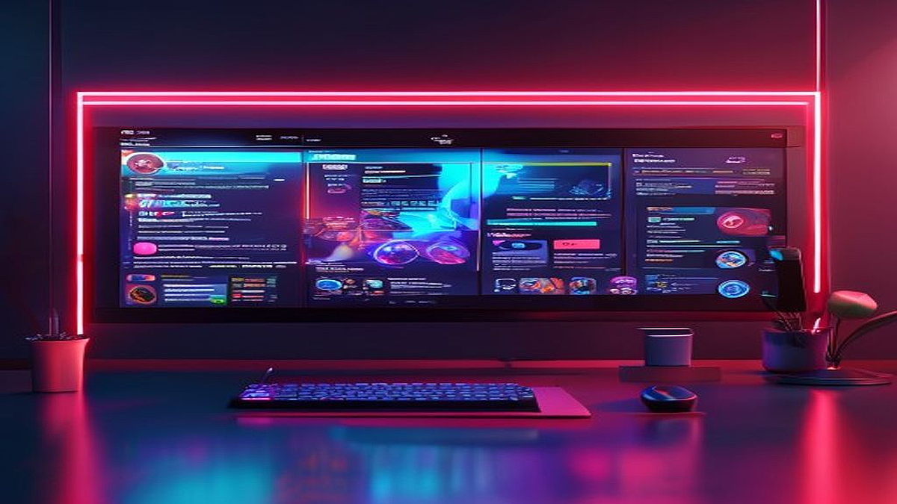

게이머들의 일상을 설레게 만드는 **게임뉴스** 중에서도 최근 가장 뜨거운 화두는 단연 오프라인 팝업스토어와 콜라보레이션 카페 소식입니다. 저 역시 얼마 전 좋아하는 게임의 한정 굿즈를 구하기 위해 새벽부터 줄을 섰던 기억이 나는데, 차가운 아침 공기를 가르며 기다리는 그 시간은 설렘과 고통이 공존하는 묘한 경험이었어요. 최근 들어 서브컬처 게임들이 단순한 업데이트를 넘어 현실 세계로 나와 팬들과 만나는 접점을 늘리고 있습니다. 젠레스 존 제로, 블루 아카이브, 원신 같은 인기 IP들이 서울 도심 곳곳에서 팝업스토어를 열 때마다 수천 명의 인파가 몰리는 현상을 보며, 이제 게임은 화면 속 데이터가 아니라 하나의 문화적 실체로 자리 잡았음을 실감합니다.

하지만 이런 열기 속에서 우리는 종종 냉정함을 잃기도 합니다. '한정판'이라는 단어가 주는 압박감에 휩쓸려 계획에 없던 지출을 하거나, 막상 구매한 굿즈를 집에 가져와서 어디에 둬야 할지 몰라 상자째 방치하는 경우도 허다하죠. 저 또한 초보 시절에는 눈에 보이는 모든 굿즈를 장바구니에 담았다가 월말 카드 고지서를 보고 머리를 감싸 쥐었던 뼈아픈 실책을 범하곤 했습니다. 이번 글에서는 제가 수많은 팝업스토어를 다니며 체득한 노하우를 바탕으로, 어떻게 하면 과열된 소비를 경계하면서도 현명하게 덕질을 즐길 수 있는지 그 구체적인 판단 기준과 전략을 공유해 보려고 합니다.

## 게임 굿즈 팝업스토어, 왜 우리는 오픈런의 늪에 빠질까

최근 게임사들이 공을 들이는 오프라인 행사는 단순한 판매처 이상의 의미를 지닙니다. 현장에서만 느낄 수 있는 특유의 분위기, 게임 속 세계관을 그대로 옮겨놓은 듯한 인테리어, 그리고 같은 게임을 즐기는 사람들과의 동질감은 온라인 쇼핑으로는 절대 채울 수 없는 만족감을 주거든요. 하지만 여기서 주의해야 할 점은 마케팅의 심리학입니다. '현장 한정', '일일 수량 제한'이라는 키워드는 우리의 전두엽을 마비시키고 수집욕을 자극합니다. 제가 처음으로 대규모 게임 행사에 참여했을 때, 제 앞에 있던 사람이 마지막 수량을 가져가는 것을 보고 느꼈던 그 박탈감은 이루 말할 수 없었습니다. 그 감정에 휩쓸려 다음 날에는 필요하지도 않은 다른 굿즈를 보상 심리로 잔뜩 샀던 기억이 나네요.

이런 실수를 반복하지 않으려면 우선 해당 행사의 굿즈가 '선행 판매'인지 '현장 한정'인지를 명확히 구분해야 합니다. 많은 경우 팝업스토어에서 파는 물건들은 나중에 공식 온라인 샵에서도 판매될 가능성이 높습니다. 단지 남들보다 조금 더 빨리 갖고 싶다는 욕심 때문에 몇 시간의 대기 시간과 웃돈을 감수할 가치가 있는지 스스로에게 물어봐야 합니다. 실제로 제가 작년에 방문했던 모 게임의 팝업스토어 굿즈 중 80퍼센트 이상이 세 달 뒤 온라인에서 상시 판매로 전환되는 것을 보며, 당시의 열기가 얼마나 일시적이었는지 깨달았습니다. 물론 현장에서만 주는 특전 카드나 입장권 같은 수집 요소는 예외일 수 있겠지만, 일반적인 아크릴 스탠드나 키링은 조금 더 여유를 가져도 좋습니다.

또한 팝업스토어 방문 전에는 반드시 SNS나 커뮤니티를 통해 실시간 재고 상황을 확인하는 습관을 들여야 합니다. 요즘은 공식 계정에서 시간대별로 품절 리스트를 올려주는 경우가 많습니다. 제가 겪었던 가장 큰 실패담 중 하나는, 왕복 4시간 거리의 행사장에 도착하자마자 목표로 했던 피규어가 품절되었다는 소식을 들었을 때였습니다. 미리 확인만 했어도 그 귀중한 주말 시간을 허비하지 않았을 텐데 말이죠. 여러분은 부디 방문 전날 밤과 당일 아침, 공식 채널의 공지사항을 꼼꼼히 살피는 수고를 아끼지 마시길 바랍니다.

## 실패 없는 굿즈 쇼핑을 위한 실전 체크리스트

무작정 현장에 가서 예쁘다고 집어 들다 보면 예산은 금방 바닥납니다. 저는 이제 행사장 입구에 서면 스스로에게 세 가지 질문을 던지는 체크리스트를 머릿속으로 돌립니다. 이 기준만 잘 지켜도 나중에 당근마켓이나 중고나라에 '미개봉 신품'으로 내놓는 일을 절반 이상 줄일 수 있습니다. 굿즈는 사는 순간보다 집에 가져와서 배치했을 때의 만족감이 더 중요하기 때문입니다.

### 합리적 소비를 위한 3단계 판단 기준

첫째, **공간의 제약**을 고려하십시오. 아크릴 스탠드는 작고 예쁘지만, 10개가 넘어가기 시작하면 먼지 관리와 전시 공간 확보가 큰 짐이 됩니다. 저는 이제 아크릴 스탠드를 살 때 반드시 '이 캐릭터가 내 인생 캐릭터인가?'를 자문합니다. 둘째, **실용성**입니다. 장식용 굿즈보다는 장패드, 머그컵, 티셔츠처럼 일상에서 직접 사용할 수 있는 물건들이 의외로 만족도가 훨씬 높습니다. 제가 2년 전 구매한 게임 로고가 박힌 후드티는 지금도 집 근처 산책할 때 애용하는 아이템입니다. 셋째, **희소성의 실체**를 파악하는 것입니다. 단순히 로고만 박힌 양산형 굿즈인지, 아니면 유명 일러스트레이터가 이번 행사를 위해 새로 그린 아트워크가 포함된 것인지 확인하세요.

*   **방문 전 필수 체크리스트**
    *   행사 예약 방식 확인 (네이버 예약, 현장 대기 키오스크 등)
    *   1인당 구매 제한 수량 파악 (리셀러 방지 정책 확인)
    *   결제 수단 확인 (가끔 특정 카드사 할인이나 현금 결제 불가 매장이 있음)
    *   굿즈 보관용 대형 쇼핑백이나 백팩 준비 (현장 봉투는 유료이거나 약할 수 있음)
    *   보조 배터리 지참 (대기 시간이 길어지면 스마트폰 배터리는 생명줄입니다)

이 리스트 중에서 특히 강조하고 싶은 것은 '예약 방식'입니다. 요즘은 무조건 일찍 간다고 장땡이 아닙니다. 사전 예약제인 경우 예약권이 없으면 입장조차 불가능하거든요. 저는 한 번 예약 시간을 착각해서 입구에서 발길을 돌려야 했던 적이 있는데, 그 허탈함은 정말 이루 말할 수 없었습니다. 반대로 현장 대기 시스템이라면 오픈 2시간 전에는 도착해야 안정권이라는 것이 제 경험상의 데이터입니다.

## 지갑을 지키는 선구안, 이런 굿즈는 한 번 더 고민하세요

모든 굿즈가 다 소장 가치가 있는 것은 아닙니다. 특히 게임 뉴스를 보고 흥분해서 달려갔을 때 우리를 유혹하는 함정 카드 같은 물건들이 있죠. 제가 가장 추천하지 않는 부류는 '랜덤 굿즈'입니다. 소위 가챠라고 불리는 이 랜덤 방식은 게임 안에서만으로도 충분히 고통스럽지 않나요? 현실에서까지 랜덤의 고통을 겪을 필요는 없습니다. 원하는 캐릭터가 나올 확률은 생각보다 낮고, 결국 중복된 아이템을 처리하느라 커뮤니티를 전전하며 교환 대상을 찾는 수고를 해야 합니다. 그 시간에 차라리 조금 더 비싸더라도 확정적으로 구매할 수 있는 단품을 선택하는 것이 정신 건강에 이롭습니다.

또한, 너무 저렴한 가격의 봉제 인형도 주의 깊게 살펴봐야 합니다. 사진으로는 귀여워 보이지만 막상 실물을 보면 마감이 엉망이거나 형태가 찌그러진 경우가 종종 있습니다. 저는 예전에 한 행사장에서 싼 맛에 인형을 샀다가, 집에 와서 보니 눈 위치가 비대칭인 것을 발견하고 속상해했던 적이 있습니다. 인형류는 반드시 현장에서 직접 눈으로 보고, 가능하다면 가장 예쁘게 생긴 개체를 골라오는 세심함이 필요합니다.

반면, **설정집이나 아트북**은 강력하게 추천하는 품목입니다. 게임의 제작 비화나 초기 디자인 시안이 담긴 책들은 시간이 지날수록 그 가치가 빛납니다. 나중에 게임 서비스가 종료되더라도 그 게임과 함께했던 추억을 가장 풍부하게 되새길 수 있는 매개체가 되어주거든요. 제가 10년 전 즐겼던 게임의 아트북을 가끔 꺼내 볼 때마다 느껴지는 뭉클함은 아크릴 스탠드가 줄 수 있는 것과는 차원이 다릅니다.

## 구매 그 이후, 굿즈의 가치를 유지하는 보관법

정성스럽게 골라온 굿즈들을 어떻게 관리하느냐에 따라 덕질의 질이 달라집니다. 많은 입문자가 간과하는 사실 중 하나가 바로 '자외선'입니다. 창가 근처에 굿즈를 전시해두면 태양광에 의해 색이 바래는 현상이 발생합니다. 제가 아끼던 한정판 포스터가 반년 만에 누렇게 변색된 것을 보고 얼마나 가슴이 아팠는지 모릅니다. 굿즈 전시 공간은 반드시 직사광선이 닿지 않는 곳으로 정하고, 가능하다면 UV 차단 기능이 있는 장식장을 사용하는 것이 좋습니다.

또한, 패키지 상자를 버리지 않는 것도 중요한 팁입니다. 나중에 이사를 가거나 혹시라도 마음이 변해 다른 팬에게 양도하게 될 때, 정품 상자의 유무는 제품의 보호 측면에서나 가치 산정 측면에서 큰 차이를 만듭니다. 저는 작은 굿즈들의 상자는 접어서 보관하고, 부피가 큰 피규어 상자는 침대 밑이나 창고 깊숙한 곳에 차곡차곡 쌓아둡니다. 처음에는 짐처럼 느껴질 수 있지만, 나중에 그 가치를 증명해 줄 든든한 보험이 됩니다.

마지막으로, 굿즈는 '감상용'과 '사용용'을 철저히 분리하는 지혜가 필요합니다. 정말 아끼는 스티커나 키링이라면 두 개를 사서 하나는 보관하고 하나는 쓰는 것이 정석이지만, 예산이 부족하다면 과감하게 '전시'에만 집중하세요. 어설프게 사용했다가 때가 타거나 망가지면 볼 때마다 마음이 아프기 때문입니다. 실용적인 굿즈를 샀다면 아끼지 말고 팍팍 써서 그 가치를 뽑아내고, 예술적인 가치가 높은 굿즈는 최상의 상태로 보존하는 이분법적 접근이 필요합니다.

## 게임과 함께하는 삶을 더욱 풍요롭게 만드는 법

결국 우리가 **게임뉴스**를 확인하고 팝업스토어로 달려가는 근본적인 이유는 그 게임을 사랑하기 때문입니다. 굿즈는 그 사랑의 증표일 뿐, 목적 자체가 되어서는 안 됩니다. 간혹 굿즈 수집에 너무 몰입한 나머지 정작 게임을 즐길 시간조차 없거나, 과도한 지출로 인해 생활에 지장을 받는 분들을 보면 안타까운 마음이 듭니다. 저 역시 한때는 '풀 세트'를 모아야 한다는 강박에 시달렸지만, 지금은 제가 정말 애정을 느끼는 캐릭터의 상징적인 아이템 하나만 있어도 충분히 행복하다는 것을 깨달았습니다.

이번 주말에도 어딘가에서는 새로운 게임 행사가 열리고 수많은 팬이 줄을 서고 있을 것입니다. 만약 여러분이 그 대열에 합류할 계획이라면, 제가 말씀드린 체크리스트를 한 번만 더 떠올려 보세요. "이것이 나의 일상을 즐겁게 해줄 물건인가?" 아니면 "단순히 남들이 사니까 따라 사는 것인가?" 이 질문에 명확히 답할 수 있다면 여러분의 덕질은 실패하지 않을 것입니다.

굿즈를 구매하는 행위는 게임 속 캐릭터에게 보내는 일종의 응원 메시지와 같습니다. 개발사 입장에서도 굿즈 판매 수익은 더 좋은 콘텐츠를 만드는 원동력이 되죠. 그러니 죄책감을 느끼기보다는, 스스로 정한 예산 범위 내에서 최대한의 즐거움을 누리시길 바랍니다. 지금 책상 위에 놓인 작은 피규어 하나가 지친 업무 시간 중에 잠깐의 미소를 선사한다면, 그것만으로도 그 굿즈는 제 역할을 다한 셈이니까요. 여러분의 건강하고 즐거운 게임 라이프를 진심으로 응원하며, 저는 또 새로운 소식과 유익한 팁으로 찾아오겠습니다. 오늘 하루도 여러분이 사랑하는 게임 속 세상에서 행복한 모험 하시길 바랍니다.

## 마치며

지금까지 게임 굿즈를 구매할 때 우리가 가져야 할 건강한 마음가짐과 현명한 소비를 위한 체크리스트를 상세히 살펴보았습니다. 굿즈는 단순히 책상을 채우는 물건을 넘어, 우리가 사랑하는 게임 세계관과의 정서적 연결고리이자 지친 일상에 활력을 불어넣어 주는 작은 안식처와 같습니다. 무분별하게 유행을 쫓기보다는 나만의 확고한 기준을 세우고, 스스로 정한 예산 범위 내에서 확실한 행복을 찾는 것이야말로 진정한 '성공한 덕후'로 거듭나는 핵심 비결이라는 점을 다시 한번 강조하고 싶습니다.

이제 여러분의 소중한 경험을 공유해 주실 차례입니다. 오늘 본문에서 다룬 내용 중 가장 깊이 공감되었던 조언은 무엇이었나요? 혹은 현재 장바구니에 담아두고 결제 버튼 앞에서 설레는 고민을 하고 있는 '인생 굿즈'가 있다면 댓글을 통해 자유롭게 이야기해 주세요! 여러분의 소소한 구매 후기나 팁 하나가 다른 동료 게이머들에게는 큰 영감과 도움이 될 수 있습니다.

여러분이 게임을 통해 느끼는 순수한 열정과 애정이 건강한 소비문화로 이어져, 일상의 더 큰 기쁨이 되기를 진심으로 응원합니다. 저는 앞으로도 여러분의 즐거운 게임 라이프에 실질적인 보탬이 될 수 있는 흥미진진한 소식과 유익한 팁들을 가득 준비해서 돌아오겠습니다. 오늘 하루도 여러분이 꿈꾸는 게임 속 환상적인 모험처럼 매 순간이 즐거움으로 가득 차길 바랍니다. 끝까지 읽어주셔서 감사합니다!