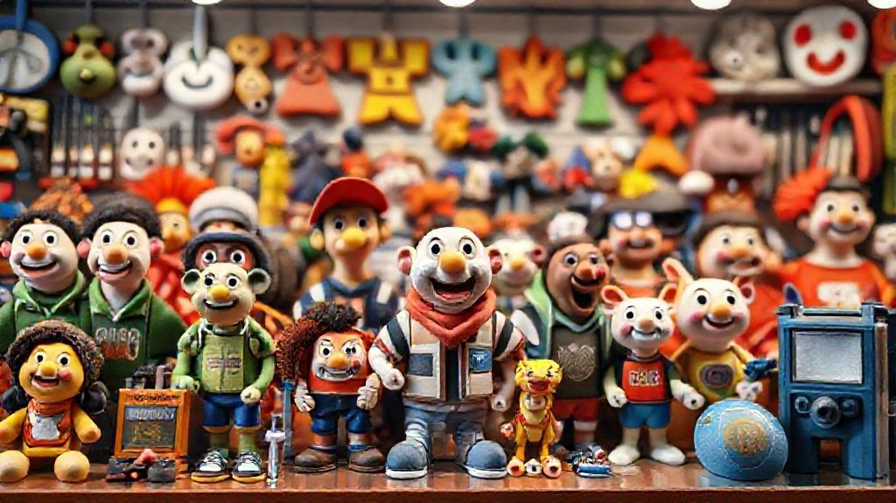

# 40대 아재의 굿즈 수집 가이드: '덕질'과 '재테크' 사이, 그 아슬아슬한 줄타기

요즘 제 삶의 낙 중 하나는 바로 **굿즈**를 구경하고, 가끔은 큰맘 먹고 지르는 거예요. "아니, 그 나이 먹고 아직도 장난감 사 모으냐"는 핀잔을 들을 때도 있지만, 어쩌겠어요. 이게 제 행복인걸요. 책장 한편을 가득 채운 피규어들과 아직 조립하지 못한 레고 박스들을 보고 있으면, 어린 시절로 돌아간 듯 마음이 푸근해집니다. 아마 저와 비슷한 세대의 분들이라면 공감하실 거예요. 국민학교(네, 저 초등학교 아니고 국민학교 세대입니다) 시절, 학교 앞 문방점에 진열된 로봇 장난감을 보며 침만 꿀꺽 삼키던 그 기억. 어머니 손에 이끌려 마지못해 발걸음을 옮기면서도 눈은 절대 장난감에서 떼지 못했던 그 아련함 말이죠.

이제는 내 돈으로, 내 마음대로 그때의 아쉬움을 달랠 수 있는 어른이 되었습니다. 하지만 막상 수집의 세계에 발을 들여보니 이게 또 보통 일이 아니더라고요. 단순히 '좋아하니까 산다'는 마음만으로는 부족했어요. 한정판의 유혹, 치솟는 리셀가, 그리고 한정된 공간이라는 현실적인 문제까지. 오늘은 저처럼 추억과 낭만을 좇아 굿즈의 세계에 입문한, 혹은 입문을 고민하는 분들을 위해 지난 몇 년간의 경험을 탈탈 털어 이야기해볼까 합니다. 단순한 소비를 넘어, 즐거운 취미이자 똑똑한 수집 생활을 위한 저만의 소소한 팁들을 나눠볼게요.

## 첫사랑 같은 굿즈: 추억을 소환하는 레트로 아이템

제 수집의 시작은 단연 '추억'이었습니다. 8090년대생이라면 누구나 가슴속에 품고 있는 '드래곤볼'이나 '슬램덩크' 같은 작품들 말이에요. 얼마 전 극장판으로 다시 불을 지폈던 슬램덩크의 인기는 정말 대단했죠. 저도 극장에서 몇 번이나 봤는지 모릅니다. 영화를 보고 나오는데, 어릴 적 그 감정이 되살아나면서 참을 수가 없더라고요. 결국 인터넷을 뒤져서 십수 년 전에 나온 슬램덩크 피규어 풀세트를 덜컥 구매하고 말았습니다. 아내의 등짝 스매싱은 피할 수 없었지만, 거실 장식장에 나란히 서 있는 북산고 5인방을 볼 때마다 입가에 미소가 번지는 걸 어떡하겠어요.

이런 레트로 굿즈 수집의 가장 큰 매력은 역시 '이야기'가 있다는 점입니다. 단순히 예쁜 조형물을 사는 게 아니라, 제 유년기의 한 조각을 다시 사 오는 느낌이랄까요. 특히 레고는 그런 감성을 자극하는 대표적인 아이템이죠. 저는 어릴 때 '해적선' 시리즈를 정말 갖고 싶었어요. 돛이 달린 커다란 배와 대포, 보물상자까지. 하지만 당시 저희 집 형편에 레고는 너무 비싼 장난감이었습니다. 그 한이 남아서인지, 몇 년 전 단종된 '캐리비안의 해적 블랙펄' 모델을 중고로 구했을 때 정말 세상을 다 가진 기분이었습니다.

**레트로 굿즈 수집, 시작은 어떻게?**

*   **보물찾기 장소:** 이런 옛날 굿즈들은 어디서 구할 수 있을까요? 발품을 파는 재미를 느끼고 싶다면 **서울 동묘 구제시장**이나 **남부터미널 국제전자센터** 같은 곳을 추천합니다. 먼지 쌓인 상자 속에서 예상치 못한 보물을 발견하는 재미가 쏠쏠해요. 온라인으로는 **중고나라**나 **번개장터**가 가장 활발하고, 해외로 눈을 돌리면 **이베이(eBay)**가 거의 모든 것을 찾을 수 있는 거대한 보물창고입니다.
*   **상태 확인은 필수:** 오래된 제품일수록 상태가 천차만별입니다. 특히 피규어는 직사광선에 오래 노출되면 색이 바래는 '황변' 현상이 생기기 쉬워요. 레고는 부품 누락이 없는지, 스티커 상태는 괜찮은지 꼼꼼히 확인해야 합니다. 가능하다면 *박스까지 온전히 있는 제품(소위 '박풀')*이 가치가 높지만, 그만큼 가격도 비싸지니 전시 목적이라면 박스 없는 제품을 저렴하게 구하는 것도 방법입니다.
*   **가품(짝퉁)을 조심하세요!:** 저도 한번은 사진만 보고 샀다가 조악한 품질의 중국산 가품을 받고 땅을 친 적이 있습니다. 너무 저렴하다 싶으면 일단 의심부터 하세요. 정품은 보통 발바닥이나 받침대에 공식 라이선스 표기(예: ©B.S./T.A. - 버드 스튜디오/슈에이샤, 토에이 애니메이션)가 각인되어 있으니, 판매자에게 해당 부분의 사진을 꼭 요청하는 것이 좋습니다.

## 요즘 애들은 이런 거 모은다며? 2025년 굿즈 트렌드 엿보기

추억 팔이만 하다 보면 어느새 '라떼는 말이야'를 외치는 꼰대 아재가 되기 십상이죠. 수집의 재미 중 하나는 현재의 흐름을 따라가는 것이기도 합니다. 요즘 굿즈 시장은 정말이지 상상 이상으로 다채롭고 빠르게 변하고 있어요. 제가 주목하는 2025년 굿즈 트렌드는 크게 세 가지입니다.

첫째, **웹툰 IP의 폭발적인 성장**입니다. 예전에는 일본 만화나 미국 코믹스 캐릭터가 굿즈 시장의 주류였다면, 이제는 '나 혼자만 레벨업', '전지적 독자 시점' 같은 국산 웹툰 IP의 파워가 막강합니다. 웹툰의 인기가 높아지면서 주인공들을 형상화한 고품질 스태츄나 아크릴 스탠드, 설정집 같은 굿즈들이 쏟아져 나오고 있어요. 얼마 전 '나 혼자만 레벨업'의 성진우 스태츄 예약 판매가 시작되었을 때, 가격이 100만 원이 훌쩍 넘는데도 순식간에 품절되는 걸 보고 정말 놀랐습니다. 이제 K-웹툰은 전 세계적인 팬덤을 거느린 하나의 거대한 문화가 된 거죠.

둘째, **'작가주의' 인디 굿즈의 부상**입니다. 대형 프랜차이즈가 아니더라도, 자신만의 독창적인 캐릭터와 세계관을 가진 개인 작가들의 굿즈가 큰 인기를 끌고 있습니다. **서울일러스트레이션페어** 같은 행사에 가보면 그 열기를 직접 느낄 수 있어요. 수많은 부스에서 작가들이 직접 디자인한 스티커, 키링, 인형, 엽서 등을 판매하는데, 기성품에서는 느낄 수 없는 독특한 감성과 희소성이 매력적입니다. 저도 최근에 한 작가님의 고양이 캐릭터 키링을 몇 개 샀는데, 볼 때마다 기분이 좋아져서 자동차 키에 달고 다닙니다. 이런 굿즈는 작가를 직접 후원한다는 의미도 있어서 더 뿌듯하더라고요.

마지막으로, **경계를 허무는 콜라보레이션(협업)**입니다. 이제 굿즈는 더 이상 장난감 가게에만 머무르지 않습니다. 게임 캐릭터가 유명 패션 브랜드와 협업해 옷이나 신발을 출시하고, 애니메이션 캐릭터가 그려진 한정판 체크카드가 나오기도 합니다. 최근에는 *원신*과 *피자헛*의 콜라보가 엄청난 화제였죠. 이런 콜라보 굿즈는 특정 기간에만 구할 수 있는 '한정판'인 경우가 많아서 수집가들의 경쟁이 특히 치열합니다. '한정판'이라는 세 글자의 유혹은 정말 참기 힘들죠. 저도 예전에 게임 캐릭터 그려진 운동화를 사려고 새벽부터 줄을 섰던 기억이 나네요. 결국 못 샀지만요. 이런 아이템들은 시간이 지나면 리셀가가 몇 배씩 뛰기도 해서, 소위 '덕테크(덕질+재테크)'의 대상이 되기도 합니다.

## 이왕 살 거면 똑똑하게! 실패 확률 줄이는 굿즈 구매 & 관리 꿀팁

자, 이제 마음에 드는 굿즈를 발견했다면? '지름신'이 강림하기 전에 잠시 멈춰서 몇 가지만 더 확인해봅시다. 충동구매는 텅 빈 지갑과 후회만 남길 뿐이니까요. 수년간의 수업료를 내며 터득한 저만의 구매 및 관리 노하우를 공개합니다.

### 구매 전 체크리스트: 세 번 보고 한 번 사자

1.  **정품 라이선스 확인은 기본 중의 기본:** 앞서 레트로 굿즈에서도 언급했지만, 이건 아무리 강조해도 지나치지 않습니다. 특히 피규어의 경우, 정품은 공식 라이선스를 받았다는 증표로 박스에 스티커가 붙어있습니다. 예를 들어, 드래곤볼 피규어는 '토에이 애니메이션'의 금색 또는 은색 고양이 스티커가, 원피스는 금색 고양이 스티커가 붙어있죠. 이 스티커의 유무가 정품과 가품을 구별하는 가장 확실한 방법 중 하나입니다.

2.  **가격 비교는 국룰, 배송비와 관세도 잊지 말자:** 똑같은 제품이라도 파는 곳마다 가격이 다릅니다. 국내 샵, 해외 직구 사이트, 개인 중고 거래 등 최소 세 군데 이상은 비교해보는 습관을 들이는 게 좋습니다. 특히 일본 피규어는 **아미아미(AmiAmi)**나 **하비서치(HobbySearch)** 같은 현지 사이트에서 직접 구매(직구)하는 게 저렴할 때가 많아요. 하지만 여기서 함정이 있습니다. 바로 *배송비와 관세*죠. 제품 가격이 미화 150달러를 넘어가면 관세와 부가세가 붙는데, 이게 생각보다 큽니다. "어, 직구가 더 싸네?" 하고 덜컥 결제했다가 나중에 세금 폭탄을 맞고 후회할 수 있으니, 예상 세금까지 꼭 계산해보고 최종 결정을 내려야 합니다.

3.  **선구자들의 지혜를 빌리자:** 먼저 구매한 사람들의 리뷰만큼 확실한 정보는 없습니다. 피규어 관련 커뮤니티(예: **루리웹 피규어 갤러리**, **네이버 카페 '피규어'**)에 가보면 특정 제품의 도색 퀄리티, 파손 이슈, 실제 크기감 등 생생한 후기들이 많습니다. 공식 홍보 사진은 완벽해 보이지만, 실제 양산품은 마감이 아쉬운 경우가 종종 있거든요. 몇 분만 투자해서 검색해보면 수십만 원의 손해를 막을 수 있습니다.

### 보관이 반이다: 내 소중한 굿즈, 10년 뒤에도 새것처럼

비싼 돈 주고 산 굿즈, 제대로 관리하지 못하면 가치가 떨어지는 건 물론 마음도 아프죠. 굿즈 종류별 관리법은 조금씩 다릅니다.

*   **피규어 & 스태츄:** 가장 큰 적은 **먼지**와 **직사광선**입니다. 먼지는 정전기 브러시나 부드러운 화장용 브러시로 살살 털어주고, 직사광선은 플라스틱을 변색시키고 약하게 만드니 반드시 피해야 합니다. 가장 좋은 방법은 아크릴이나 유리로 된 **장식장**에 보관하는 거예요. 국민 장식장으로 불리는 **이케아의 데톨프(DETOLF)**는 가성비가 좋아서 많은 분들이 애용하죠.
*   **레고:** 조립한 레고는 피규어와 마찬가지로 먼지와 햇빛을 피해야 합니다. 특히 흰색 브릭은 햇빛에 오래 노출되면 누렇게 변색되니 주의해야 해요. 미조립 박스 상태로 보관할 때는 습기를 조심해야 합니다. 박스가 눅눅해지면 가치가 크게 떨어지거든요. 제습제를 넣어두거나 통풍이 잘 되는 곳에 보관하는 것이 좋습니다.
*   **카드, 포스터 등 지류 굿즈:** 종이는 구겨지거나 젖으면 끝장이죠. 카드는 **탑로더(Toploader)**라는 플라스틱 케이스에 넣어 보관하고, 여러 장을 모을 때는 전용 바인더를 사용하는 것이 안전합니다. 포스터는 돌돌 말아두기보다는 **UV 차단 기능이 있는 액자**에 넣어 전시하는 것이 변색도 막고 보기에도 좋습니다.

## 내일을 위한 오늘의 즐거움, 굿즈 수집

돌이켜보면, 제가 굿즈를 수집하는 이유는 단순히 물건을 소유하고 싶어서만은 아닌 것 같습니다. 치열하게 살아가는 현실 속에서, 책장 한편에 놓인 작은 피규어 하나가 제게는 어린 시절의 순수했던 마음을 떠올리게 하는 타임머신이자, 지친 하루를 위로해주는 작은 쉼터가 되어주거든요. 물론 가끔은 희귀한 아이템의 가격이 오르는 것을 보며 흐뭇한 미소를 짓는, 속물적인 즐거움도 무시할 순 없지만요.

수집은 과거의 추억을 현재로 가져와 미래의 즐거움으로 만드는 과정이라고 생각합니다. 레트로 굿즈를 통해 잊고 있던 유년의 나를 만나고, 최신 트렌드의 굿즈를 탐색하며 세상의 변화를 느끼고, 또 그렇게 모은 하나하나의 수집품을 소중히 관리하며 내일의 또 다른 이야기를 준비하는 거죠. 이 글을 읽는 여러분도 아마 저마다의 가슴속에 품고 있는 '최애' 캐릭터나 작품이 있을 겁니다.

혹시 망설이고 있다면, 오늘 한번 용기를 내어보세요. 거창한 시작이 아니어도 좋습니다. 책상 위에 올려둘 작은 피규어 하나, 다이어리에 붙일 예쁜 스티커 한 장이라도 괜찮습니다. 여러분의 일상에 작은 행복과 추억을 더해줄 소중한 보물이 되어줄 테니까요. 여러분은 어떤 굿즈와 함께 추억을 쌓고 계신가요? 댓글로 여러분의 '최애' 굿즈 이야기를 들려주세요! 저도 여러분의 이야기를 들으며 또 새로운 위시리스트를 채워 넣을 준비를 해야겠습니다.

## 마치며

결국 굿즈를 모은다는 것은 단순한 소비를 넘어, 저마다의 소중한 추억과 이야기를 쌓아가는 여정이라 할 수 있습니다. 잊고 있던 어린 시절의 한 조각, 열광했던 작품의 감동, 그리고 현재의 나에게 주는 작은 위로까지, 굿즈는 그 이상의 의미를 지닙니다. 이 작은 물건들이 모여 우리의 공간을 채우고, 팍팍한 일상 속에서 미소 짓게 하는 소중한 활력소가 되어주니까요.

여러분의 책상 위, 혹은 마음속에 자리한 '최애' 굿즈는 무엇인가요? 거창하지 않아도 좋습니다. 그 작은 물건에 담긴 여러분의 소중한 사연을 들려주세요. 댓글 창을 통해 서로의 '덕심'을 공유하며 우리의 일상이 얼마나 더 풍요로워질 수 있는지 함께 확인해보는 건 어떨까요? 여러분의 이야기가 저에게는 또 다른 즐거움과 영감이 될 것입니다. 망설이지 말고, 여러분의 소중한 보물 이야기를 공유해주세요